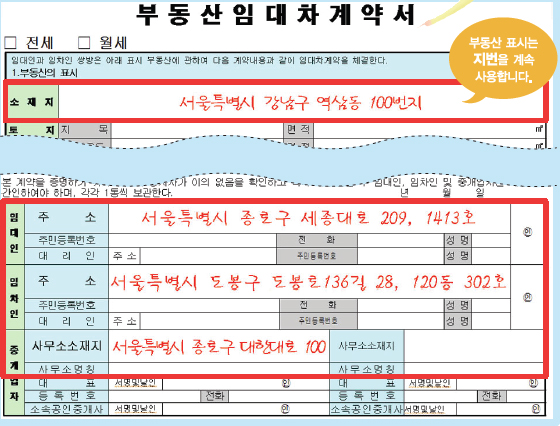
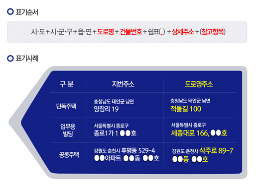
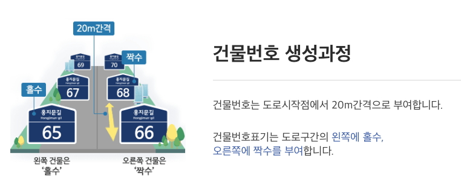
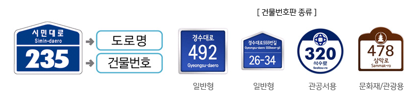
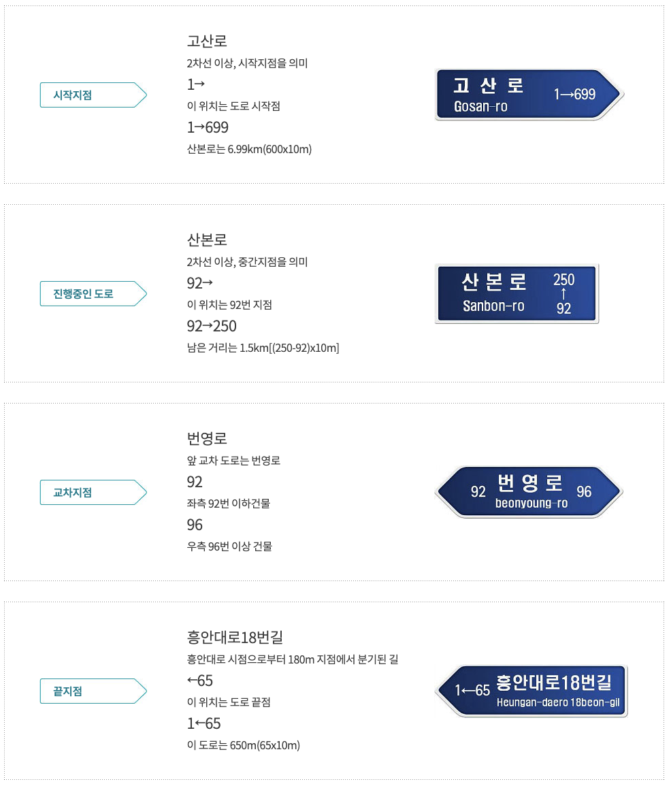

# 1.2 한국의 주소

## 지번주소와 도로명주소

우리나라는 도로명주소와 지번주소를 함께 사용하고 있다. 도로명주소가 2014년부터 전면시행되었지만, 지번주소가 도로명주소를 대체하거나, 지번주소가 사라진 것은 아니다.

지번주소는 땅(地)의 번호,  도로명주소는 건물의 번호를 말한다. 하나의 땅에 건물은 하나 또는 그 이상이 될 수 있다. 예를 들어,  하나의 땅에 네 개의 건물이 있다면, 지번주소는 한 개이지만 도로명주소는 네 개가 될 수 있다 (물론 네 개 건물에 하나의 도로명주소를 사용할 수 있다). 반면, 건물이 없는 땅은 지번주소가 있지만, 도로명주소는 부여할 수 없다. 

 구분 | 지번         | 도로명주소      
 --- | ---------- | ---------- 
 대상 | 토지         | 건물         
 용도 | 토지번호(토지관리) | 건물번호(위치안내) 
 구성 | 동, 리 + 지번  | 도로명+건물번호   

일반적으로 도로명주소는 주거하는 건물, 창고나 사업장으로 건물에 부여하고,건물이 없는 땅의 위치는 지번을 사용한다. 부동산 매매를 예로 들면, 부동산 소재지는 지번주소를 쓰고 계약을 체결하는 매수·매도자나 임대·임차인, 부동산 중개인의 주소는 도로명주소를 사용하고 있다. 

<figure class="flex flex-col items-center justify-center" align="center">
    
    <figcaption style="text-align: center;">부동산임대차계약서 상에 도로명주소와 지번주소 사용예시(출처:[머니투데이](https://orgthumb.mt.co.kr/06/2014/01/2014011715184397424_1.jpg)</figcaption>
</figure>

 

도로명주소는 시·군·구, 읍·면까지 지번주소와 동일하지만, 지번주소의 '동·리 + 번지'는 '도로명 + 건물번호'로 대신한다.

<figure class="flex flex-col items-center justify-center" align="center">
    
    <figcaption style="text-align: center;">도로명주소의 표기 예시(출처:[대한민국 정책브리핑](https://www.korea.kr/newsWeb/resources/attaches/2014.01/03/344.jpg)</figcaption>
</figure>

## 도로명주소의 이해

### 도로명

도로명은 도로명 주소를 부여하기 위해 하나의 도로구간마다 부여한 이름이다. 

* 대로(daero) : 폭이 40m를 초과하거나 왕복 8차선이 넘는 구간.
* 로(ro) : 대로보다 좁고 길보다 넓은 구간으로 폭이 12~40미터 사이 또는 왕복 2차선 이상 8차선 이하 구간.
* 길(gil) : 폭이 12m 미만이거나 2차로 미만인 구간.

### 도로구간

도로구간은 도로명을 부여하기 위해 설정하는 도로의 시작지점과 끝지점을 연결한 가상의 연속된 구간을 말한다. 도로구간은 하나의 도로명이 부여되는 도로를 단위로 하는 시작지점과 연결성을 나타내는 선형, 끝지점을 의미하기도 한다. 

### 기초번호

기초간격은 도로구간에 행정안전부장관이 정하는 바에 따라 나눈 간격, 기초번호는 기초간격마다 부여한 번호를 말한다. 기초번호는 도로구간을 일정한 간격으로 나누고, 시작지점으로부터 왼쪽은 홀수번호, 오른쪽은 짝수번호를 부여한다.  

<figure class="flex flex-col items-center justify-center" align="center">
    
    <figcaption style="text-align: center;">건물번호의 부여 규칙(출처:[주소정보누리집](https://www.juso.go.kr/openIndexPage.do)</figcaption>
</figure>

### 건물번호

건물 번호는 본번과 부번으로 구성된다. 본번은 출입구가 향하는 도로의 기초번호를 부여하고, 부번은 기초번호 구역에 다수의 건물이 밀집한 경우, 개별 건물마다 부속 번호를 부여한다.

본번만 존재하는 경우는 '흑석로 84'와 같이 도로명에서 본번만 띄어 표시하고, 부번은 'XX로 1-2'와 같이 '-'  기호로 연결하여 기입한다.

건물번호의 부여원칙은 두 가지 예외가 있다.

> **예외 1: 한 건물에 여러 개의 건물번호가 부여될 수 있다.**

예를 들어, 코엑스는 건물이 하나지만, 다수의 출입구를 갖고 있으며, 각 층마다도 출입구가 존재한다. 

> **예외 2: 다수의 건물에 하나의 건물번호가 부여될 수 있다.**

### 상세주소
상세주소는 도로명 주소의 건물번호 뒤에 표기하는 동·층·호를 말한다.
상세주소의 부여 대상 건물은 원룸이나 다가구 주택, 단독주택 중 2가구 이상 거주하는 주택, 일반 상가, 업무용 빌딩 등, 세대가 각각의 출입구를 가지며 분리되어 있으며 둘 이상의 세대주를 가질 수 있는 임대 건물을 포함한다.

### 참고항목

참고항목은 법정동과 공동주택 명칭이다. 참고항목은 주소의 맨 마지막 요소 뒤에 띄어쓰기 없이 소괄호를 이용하여 기입한다. 기입순서는 법정동, 공동주택 명칭 순서이고 해당사항이 없는 경우 둘 중 한 항목만 기입하거나 기입하지 않을 수 있다. 

### 건물번호판

건물번호판은 도로명과 건물번호를 표기한다. 표준형 이외에도 자율형설치가 가능합니다.

<figure class="flex flex-col items-center justify-center" align="center">
    
    <figcaption style="text-align: center;">건물번호판의 예시와 유형(출처:[안양시청](https://www.anyang.go.kr/site/main/images/contents/cts474_img3.jpg)</figcaption>
</figure>

### 도로명판

도로명판은 도로명, 기초번호, 방향표시를 표기한다. 도로명판은 글자수, 종류에 따라 크기가 달라지며 설치위치에 따라 한쪽방향용, 앞쪽방향용, 양방향용으로 구분한다.

<figure class="flex flex-col items-center justify-center" align="center">
    
    <figcaption style="text-align: center;">도로명판의 예시와 유형(출처:[군포시청](https://www.gunpo.go.kr/www/contents.do?key=4449)</figcaption>
</figure>

## 영상으로 보는 도로명주소

<iframe width="560" height="315" src="https://www.youtube.com/embed/Ws9WlWWUn3E?si=DuAjkOsOizPe0gqn" title="YouTube video player" frameborder="0" allow="accelerometer; autoplay; clipboard-write; encrypted-media; gyroscope; picture-in-picture; web-share" referrerpolicy="strict-origin-when-cross-origin" allowfullscreen></iframe>