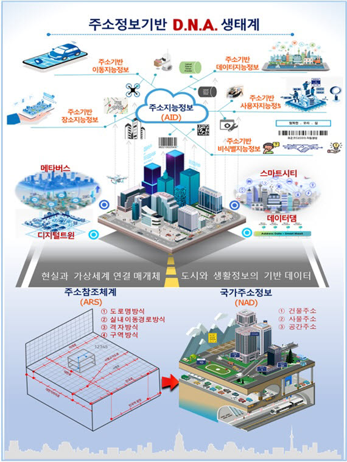
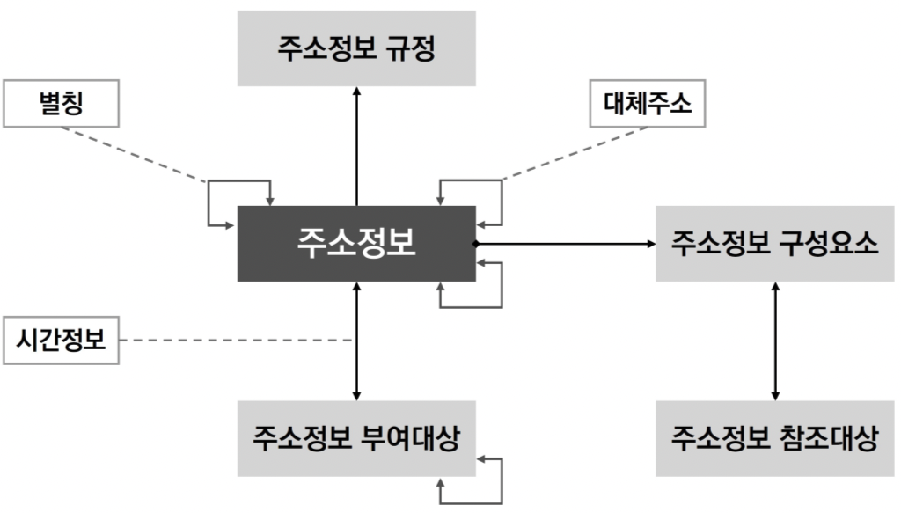

# 1.3 주소정보의 이해

## 주소 정책
행정안전부는 제1차 주소정보 활용 기본계획에서 ‘주소로 안전한 나라, 주소로 편리한 나라, 주소가 자원인 나라’라는 비전을 발표하고, 주소정보 기반의 D.N.A 생태계를 구축하여 주소정보산업의 창출을 추진하고 있다. 주소정보 인프라의 확충과 산업 창출을 위해 주요 추진과제는 1) 사람과 로봇 모두에게 인식되는 촘촘한 국가주소정보 확충, 2) 사람과 지역 모두에서 고른 국가주소정보 분포, 3)  미래 새로운 산업군으로 주소정보 산업 창출 지원, 4) 최상위 데이터로서 디지털 대전환 촉진으로 구분되어 있다. 

<figure class="flex flex-col items-center justify-center" align="center">
    
    <figcaption style="text-align: center;"></figcaption>
</figure>

 

## 주소 정보
전통적으로 주소는 개인·회사의 거주 또는 소재지로 이해되었고, 민법상의 주소는 생활의 근거되는 곳, 즉 생활관계의 중심적 장소라는 의미와 맥락이 유사하다. 반면 주소정보는 주소정보는 건물을 넘어 사물의 위치 식별이 가능하도록 구성되어 있고, 사람과 로봇, 현실과 가상세계를 연결하는 매개체 역할을 할 수 있는 기능을 갖고 있다. 여기서 주소정보는 식별과 위치 파악을 목적으로 객체를 명확하게 확인할 수 있게 하는 구조화된 정보를 의미한다. 

주소정보는 주소를 구성하는 개별 요소를 조합하는 기준인 주소참조체계, 객체를 명확하게 식별할 수 있도록 구조화된 국가주소정보, 주소정보를 중심으로 다른 정보를 융·복합하여 구축한 주소지능정보로 구성된다. 주소참조체계(Address Reference System)는 주소를 부여하는 방식으로 건물, 사물, 공간에 주소를 부여하는 기준이다. 주소참조체계를 기준으로 생성된 건물, 사물, 공간 주소는 국가주소정보(National Address Data)에 포함된다. 건물주소는 도로명, 건물번호, 상세주소 (상세주소가 있는 경우만 해당한다)로 표기하는 주소, 사물주소는 도로명과 기초번호를 활용하여 건물등에 해당하지 않는 시설물의 위치를 특정하는 정보, 공간주소는 공간에 부여된 도로명주소 (기초간격, 국가지점번호격자)를 말한다. 마지막으로 주소지능정보는 이동지능정보(자율주행기기와 모빌리티의 이동경로를 주소의 구성요소로 연결), 장소지능정보(공공장소나 다른 곳에서 사용되는 별칭을 연결), 데이터지능정보(공공데이터를 주소정보를 기반으로 통합하거나 연계), 비식별지능정보(주소정보를 기반으로 한 비식별주소정보), 사용자지능정보(사용자가 원하는 사물에 주소를 부여)로 구분된다.

 

## 주소정보 개념모델

주소정보 개념모델은 ‘주소정보 규정’을 근거로 ‘주소정보 부여대상’에 대한 ‘주소정보 구성요소’를 이용하여 ‘주소정보’를 관리하기 위한 개념 모델이다. 

주소정보 개념모델의 핵심개념은 주소정보, 주소정보 규정, 주소정보 부여대상, 주소정보 구성요소, 주소정보 참조대상, 대체주소, 별칭, 시간정보로 구성되어 있다. 주소정보 규정은 주소정보를 부여하기 위해 주소참조체계의 적용과 주소 정보를 관리하는데 필요한 사항을 규정한 법령, 규칙, 표준을 뜻한다. 주소정보 참조체계는 문자로 표현하는 주소정보를 기술하기 위해 하나 이상의 주소정보 구성요소를 조합하는 기준으로 도로명방식, 실내 이동경로 방식, 격자방식, 기타방식으로 구분된다(주소정보기본도 작성·관리 규정 제4조). 도로명방식은 도로구간의 도로명과 기초간격의 기초번호를 이용하여 이와 인접한 주소정보를 부여하는 방식, 실내 이동경로방식은 실내 이동경로의 이동 간격과 부여된 번호를 이용하여 이와 인접한 주소정보를 부여하는 방식, 격자방식은 국가지점번호격자를 이용하여 국가지점번호를 부여하는 방식, 기타방식은 행정구역, 국가기초구역 등 구역과 관련된 주소정보를 작성하는 방식이다. 

주소정보 참조대상은 주소정보를 부여하는데 기준이 되는 객체, 주소정보 부여대상은 주소정보가 부여되는 대상 객체를 의미한다. 대체주소는 도로명주소가 부여된 건물등의 별도의 출입구 또는 사물주소가 부여된 시설물의 별도의 기준점에 부여된 주소정보를 뜻한다. 별칭은 참조체계에 따라 작성된 주소정보의 구성요소가 아니라 상호, 건물명, 시설물명 등 해당 객체를 부를 때 사용되는 여러 명칭을 말한다. 시간정보는 주소정보 부여대상과 주소정보가 가지는 생애주기 정보와 해당 객체의 사용 시간을 나타낸다.

<figure class="flex flex-col items-center justify-center" align="center">
    
    <figcaption style="text-align: center;"></figcaption>
</figure>

 
