# 2. 주소정보 누리집

 

#### 작성자: 송채은

## 주소정보 누리집

주소정보 누리집(www.juso.go.kr)은 주소정보를 검색하고 주소 관련 서비스를 제공하는 홈페이지입니다. 주소정보 누리집은 행정안전부의 [주소정보 제공에 관한 규정](https://www.law.go.kr/LSW/admRulLsInfoP.do?admRulSeq=2100000222420)에 따라 주소정보를 제공합니다.

<figure class="flex flex-col items-center justify-center">
    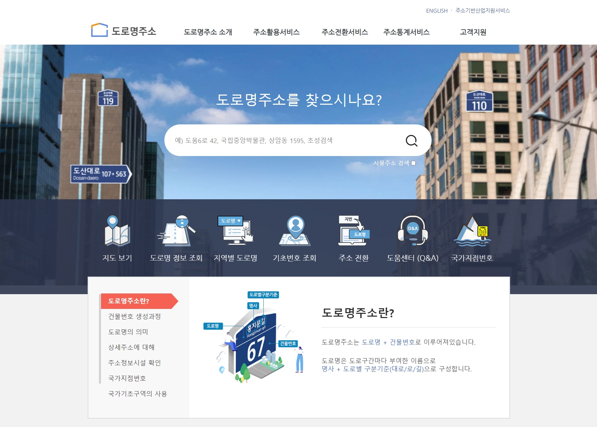
    <figcaption style="text-align: center;"></figcaption>
</figure>

 

[주소정보 전산체계 운영규정 제 10조](<https://www.law.go.kr/행정규칙/주소정보전산체계운영규정/(196,20210609)/제10조>)에 따라 주소정보 누리집은 다음과 같은 주소정보를 제공합니다.

**1. 도로명과 도로명주소(지번) 검색(지도 안내)**

첫 화면의 검색창에서 주소, 도로명, 사물주소, 건물명 등을 통해 주소정보를 검색할 수 있습니다.

 
<figure class="flex flex-col items-center justify-center">
    <figcaption style="text-align: center;">주소 검색 화면</figcaption>
    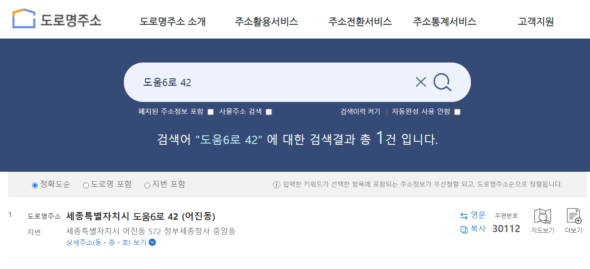
</figure>
 

검색 결과는 `지도보기`로 확인할 수 있습니다.

<figure class="flex flex-col items-center justify-center">
    <figcaption style="text-align: center;">지도보기 화면</figcaption>
    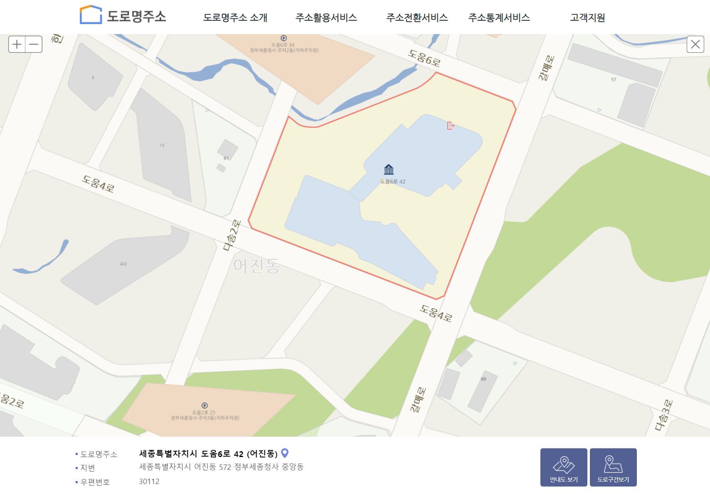
</figure>
 

**2. 지번의 도로명주소 전환 지원**

네이게이션바의 `주소전환서비스`는 지번을 도로명주소로 전환하는 서비스입니다. 50건 이하, 3000건 이하, 100만건 이하의 데이터를 구분해 이용할 수 있습니다.

 
<figure class="flex flex-col items-center justify-center">
    <figcaption style="text-align: center;"></figcaption>
    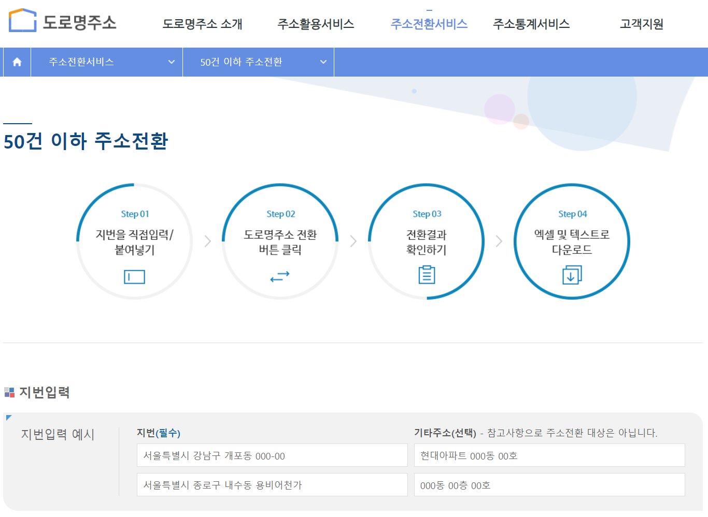
</figure>
 

50건을 초과하는 주소전환은 정해진 양식(TXT, XLSX)으로 업로드하여 이용할 수 있습니다. 3000건을 초과하는 경우, 실시간 전환이 불가능하므로 개별적으로 신청하여 이용할 수 있습니다.

 
<figure class="flex flex-col items-center justify-center">
    <figcaption style="text-align: center;"></figcaption>
    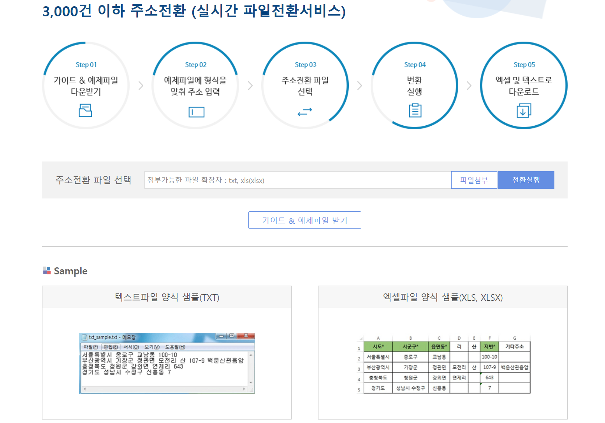
</figure>
 

**3. 도로명주소 통계 제공**

도로명주소와 관련된 통계 정보는 `주소통계서비스`에서 제공합니다. 주소통계정보, 우리 집 주소는?, 도로명주소 인포그래픽을 제공해 도로명주소의 현황을 소개합니다.

주소통계정보는 도로명, 도로명주소, 상세주소, 기초구역, 주소정보 이용추이의 통계를 제공합니다. 각 통계는 지역별 현황을 시각화하여 제공합니다.

<figure class="flex flex-col items-center justify-center">
    <figcaption style="text-align: center;"></figcaption>
    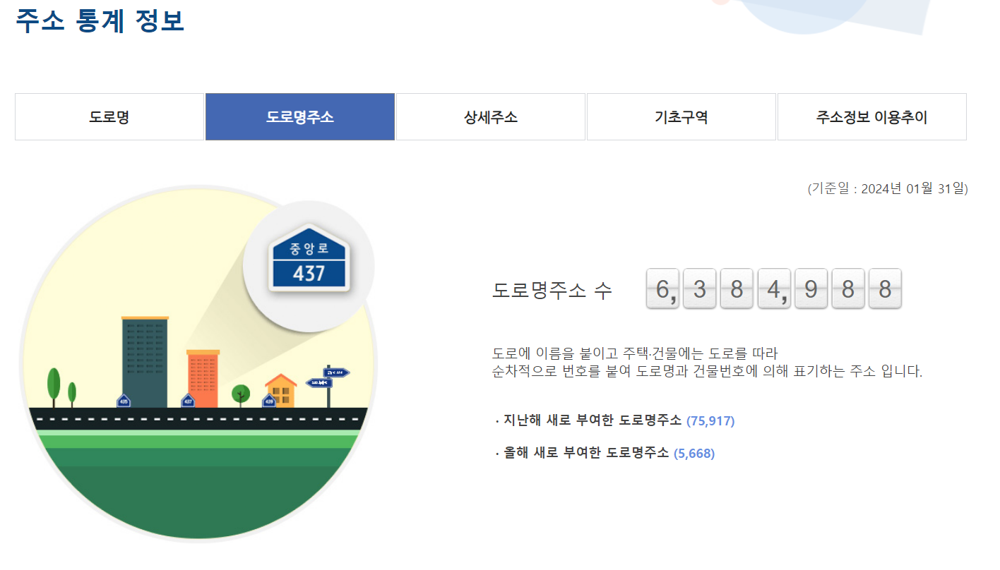
</figure>
 

우리 집 주소는? 서비스는 도로명주소, 영문주소, 건물명, 관할주민센터, 우편번호 정보를 검색할 수 있고, 도로명의 부여사유와 같은 상세한 정보를 제공합니다.
 

<figure class="flex flex-col items-center justify-center">
    <figcaption style="text-align: center;"></figcaption>
    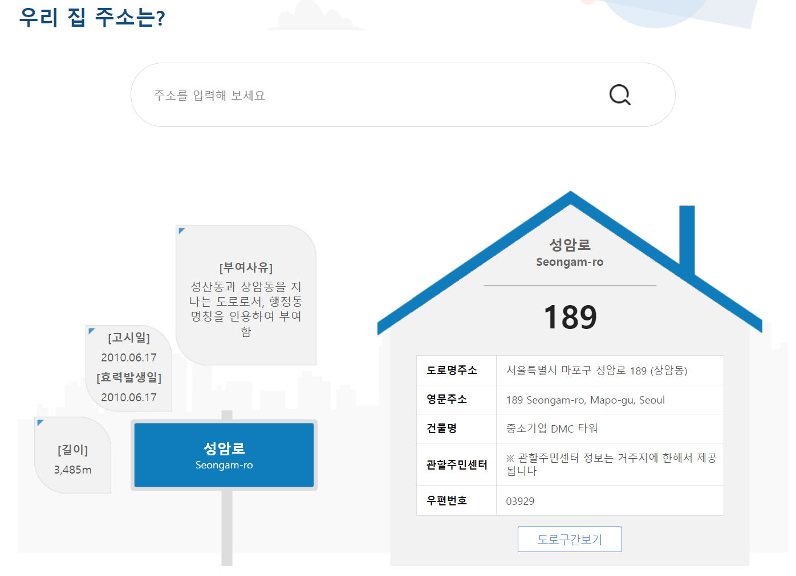
</figure>
 

도로명주소 인포그래픽은 도로명주소의 현황을 알려주는 인포그래픽입니다. 도로명주소의 부여 현황, 순 우리말 도로명, 우리나라 3면 끝의 도로에 대한 정보를 제공합니다.
 

<figure class="flex flex-col items-center justify-center">
    <figcaption style="text-align: center;"></figcaption>
    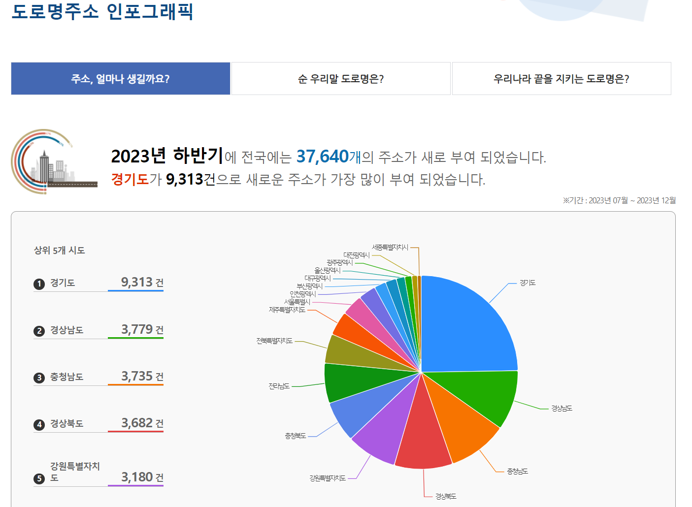
</figure>
 

**4. 도로명주소 안내도와 홍보 자료 제공**

주소정보 누리집은 국민의 주소정보 이해와 활용을 돕기위해 도로명주소 안내도와 홍보 자료를 제공합니다. 메인화면의 도로명주소, 건물번호, 도로명, 상세주소 등 각 용어를 설명하는 안내화면이 존재하고, 별도의 자료는 네이게이션바의 `도로명주소 소개 > 도로명주소란?`에서 확인할 수 있습니다.

[도로명주소 소개 Guide book](https://www.juso.go.kr/CommonPageLink.do?link=/street/GuideBook)은 총 9개의 챕터를 구성하여 도로명주소를 이해하도록 설명하는 자료입니다.

- Chapter 1: 도로명주소란?
- Chapter 2: 주소표기방법
- Chapter 3: 주소부여방법
- Chapter 4: 주소보는방법
- Chapter 5: 영문표기방법
- Chapter 6: 상세주소란?
- Chapter 7: 입체주소란?
- Chapter 8: 사물주소
- Chapter 9: 국가지점번호

 
<figure class="flex flex-col items-center justify-center">
    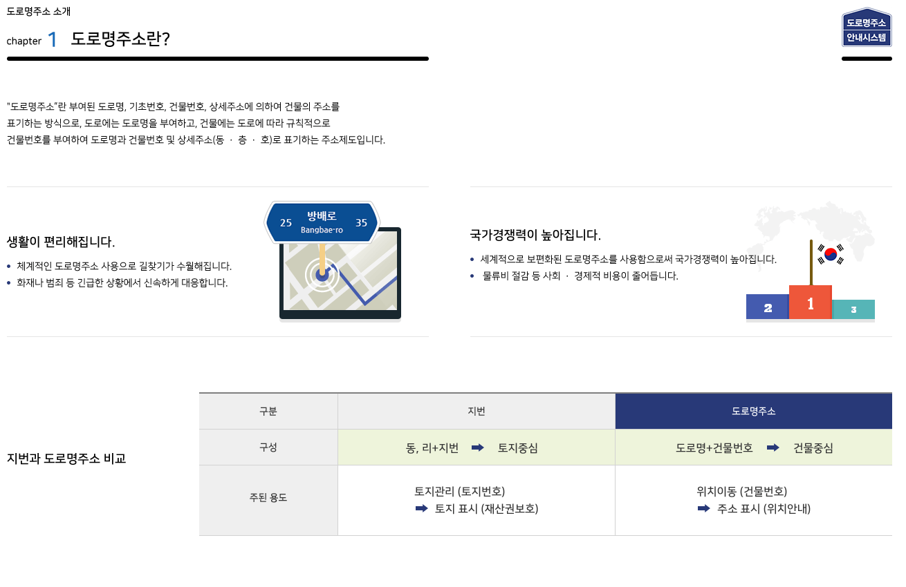
    <figcaption style="text-align: center;">Chapter 1:도로명주소란?</figcaption>
</figure>
 

**5. 주소정책 안내와 불편신고 접수**

주소와 관련하여 건물명 변경, 주소 검색 오류, 주소 검색 등 고객지원을 위한 서비스를 제공합니다.
이용자는 등록되지 않은 도로명주소를 신청하거나 잘못된 주소의 수정 요청을 위해 문의내역을 접수할 수 있습니다.
 

<figure class="flex flex-col items-center justify-center">
    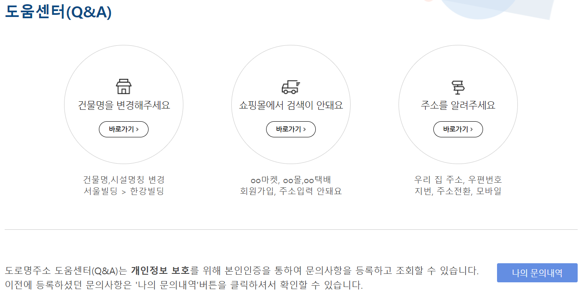
    <figcaption style="text-align: center;"></figcaption>
</figure>
 

## 주소기반 산업지원 서비스

행정안전부는 주소정보의 사용과 관련된 산업분야의 활성화를 위해 주소기반 산업지원 서비스를 지원합니다. 지원의 일환으로 주소정보를 데이터로 제공하고, 주소정보를 활용한 API를 제공합니다.  
주소정보 누리집 오른쪽 상단의 [주소기반 산업지원 서비스](https://business.juso.go.kr/addrlink/main.do?cPath=99JM)를 클릭하면 주소활용지원정책, 주소정보제공, 기술제공, 문의게시판을 사용할 수 있습니다.

 
<figure class="flex flex-col items-center justify-center">
    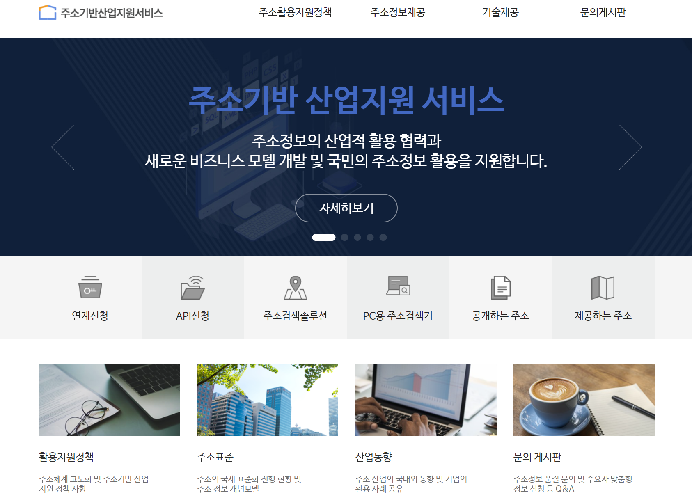
    <figcaption style="text-align: center;"></figcaption>
</figure>
 

주소기반 산업지원 서비스는 이용자가 직접 데이터를 다루고 활용할 수 있도록 파일데이터와 API를 제공합니다.
파일데이터는 **공개하는 주소**와 **제공하는 주소**를 제공합니다.

- 공개하는 주소: 공개하는 주소정보로써, 도형정보 또는 좌표를 제외한 자료
- 제공하는 주소: 제공하는 주소정보로써, 도형정보 또는 좌표를 포함한 자료

공개하는 주소와 제공하는 주소의 데이터를 활용하기 위해 다음 챕터에서 구체적인 데이터 구성을 살펴보겠습니다.

파일데이터 외에 주소정보를 시스템에서 제공받기 위해 API를 사용할 수 있습니다. API를 활용하는 방법은 [5장 주소 데이터 API를 활용한 주소 검색 웹 서버 구축](/contents/chapter-5/chapter-5-1)에서 다룹니다.

## 참고문헌

- [도로명주소법](https://www.law.go.kr/%EB%B2%95%EB%A0%B9/%EB%8F%84%EB%A1%9C%EB%AA%85%EC%A3%BC%EC%86%8C%EB%B2%95)
- [도로명주소법 시행령](https://www.law.go.kr/%EB%B2%95%EB%A0%B9/%EB%8F%84%EB%A1%9C%EB%AA%85%EC%A3%BC%EC%86%8C%EB%B2%95%EC%8B%9C%ED%96%89%EB%A0%B9)
- [도로명주소법 시행규칙](https://www.law.go.kr/%EB%B2%95%EB%A0%B9/%EB%8F%84%EB%A1%9C%EB%AA%85%EC%A3%BC%EC%86%8C%EB%B2%95%EC%8B%9C%ED%96%89%EA%B7%9C%EC%B9%99)
- [주소정보 제공에 관한 규정](https://www.law.go.kr/LSW/admRulLsInfoP.do?admRulSeq=2100000222420#AJAX)
- [주소정보 전산체계 운영규정](https://www.law.go.kr/admRulLsInfoP.do?admRulSeq=2100000174765)
