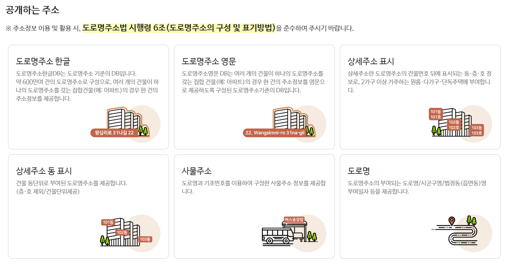
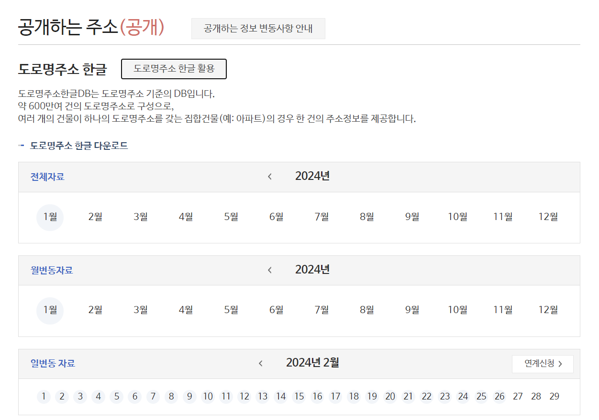

# 2. 공개하는 주소

<br>

#### 작성자: 송채은

## 공개하는 주소

주소정보 제공의 [공개하는 주소](https://business.juso.go.kr/addrlink/adresInfoProvd/guidance/othbcAdresInfo.do)는 도형정보 또는 좌표를 제외한 자료로 구성되어 있습니다. 이용자는 로그인 절차없이 누구나 이용할 수 있습니다.

<figure class="flex flex-col items-center justify-center">
    
    <figcaption style="text-align: center;"></figcaption>
</figure>

공개하는 주소는 6종으로 구성되어 있고, 주소정보 활용 시 도로명주소법 시행령 6조에 따른 구성과 표기방법을 준수해야합니다.

- 도로명주소 한글
- 도로명주소 영문
- 상세주소 표시
- 상세주소 동 표시
- 사물주소
- 도로명

<details>
<summary>도로명주소법 시행령 제6조(도로명주소의 구성 및 표기 방법)</summary>

```:no-line-numbers
제6조(도로명주소의 구성 및 표기 방법) ① 도로명주소는 다음 각 호의 사항을 같은 호의 순서에 따라 구성 및 표기한다.
  1. 특별시ㆍ광역시ㆍ특별자치시ㆍ도 및 특별자치도(이하 “시ㆍ도”라 한다)의 이름
  2. 시(「제주특별자치도 설치 및 국제자유도시 조성을 위한 특별법」 제10조제2항에 따른 행정시를 포함한다. 이하 제7호가목 및 나목에서 같다)ㆍ군ㆍ구의 이름
  3. 행정구(자치구가 아닌 구를 말한다)ㆍ읍ㆍ면의 이름
  4. 도로명
  5. 건물번호
  6. 상세주소(상세주소가 있는 경우에만 표기한다)
  7. 참고항목: 도로명주소의 끝부분에 괄호를 하고 그 괄호 안에 다음 각 목의 구분에 따른 사항을 표기할 수 있다.
    가. 특별시ㆍ광역시ㆍ특별자치시 및 시의 동(洞) 지역에 있는 건물등으로서 공동주택이 아닌 건물등: 법정동(法定洞)의 이름
    나. 특별시ㆍ광역시ㆍ특별자치시 및 시의 동 지역에 있는 공동주택: 법정동의 이름과 건축물대장에 적혀 있는 공동주택의 이름. 이 경우 법정동의 이름과 공동주택의 이름 사이에는 쉼표를 넣어 표기한다.
    다. 읍ㆍ면 지역에 있는 공동주택: 건축물대장에 적혀 있는 공동주택의 이름
  ② 제1항에도 불구하고 행정구역이 결정되지 않은 지역의 도로명주소 표기방법은 다음 각 호에서 정하는 바에 따른다.
  1. 시ㆍ도가 결정되지 않은 경우에는 다음 각 목의 사항을 같은 목의 순서에 따라 표기할 것
    가. 법 제29조제1항에 따른 중앙주소정보위원회(이하 “중앙주소정보위원회”라 한다)의 심의를 거쳐 행정안전부장관이 정하여 고시하는 사업지역의 명칭
    나. 제1항제4호부터 제6호까지의 규정에 따른 사항
  2. 시ㆍ군ㆍ구가 결정되지 않은 경우에는 다음 각 목의 사항을 같은 목의 순서에 따라 표기할 것
    가. 제1항제1호의 사항
    나. 법 제29조제1항에 따른 시ㆍ도주소정보위원회(이하 “시ㆍ도주소정보위원회”라 한다)의 심의를 거쳐 특별시장, 광역시장 또는 도지사가 정하여 고시하는 사업지역의 명칭
    다. 제1항제4호부터 제6호까지의 규정에 따른 사항
```

</details>

각 데이터는 전체자료, 월변동자료, 일변동자료로 구분되어 있고, 목적에 따라 이용할 수 있습니다. 일변동자료를 지속적으로 업데이트해야하는 경우, 연계신청을 통해 API 또는 관련 프로그램을 통해 제공받을 수 있습니다.

<figure class="flex flex-col items-center justify-center">
    
    <figcaption style="text-align: center;"></figcaption>
</figure>

공개하는 주소의 데이터는 대부분 아래 예시와 같이 TXT 파일이며, 구분자는 `|`, 인코딩은 `CP949`로 제공합니다.

```도로명주소 한글
36110101200000200181100000|3611010100|세종특별자치시||반곡동||0|47|1|361102000002|한누리대로|0|1811|0|3611055600|반곡동|30145||20181204|0|||수루배마을5단지 상가동|
36110101200000200182000000|3611010100|세종특별자치시||반곡동||0|862|0|361102000002|한누리대로|0|1820|0|3611055600|반곡동|30146||20191202|0|||왕관빌딩|
36110101200000200182100000|3611010100|세종특별자치시||반곡동||0|46|1|361102000002|한누리대로|0|1821|0|3611055600|반곡동|30145||20181204|0|||수루배마을5단지 상가동|
36110101200000200182400000|3611010100|세종특별자치시||반곡동||0|49|13|361102000002|한누리대로|0|1824|0|3611055600|반곡동|30146||20191209|0||||
36110101200000200182800000|3611010100|세종특별자치시||반곡동||0|45|14|361102000002|한누리대로|0|1828|0|3611055600|반곡동|30146||20190716|0|||시드니블루|
```

<br>
데이터 내에서 컬럼명이 제공되지 않으므로, 데이터를 분석하기 전에 데이터의 구조를 파악해야합니다.

### 도로명주소 한글

도로명주소 한글DB는 도로명주소 기준의 DB고, 각 컬럼을 조합하여 약 600만여건의 도로명주소를 구성할 수 있습니다. 여러 개의 건물이 하나의 도로명주소를 갖는 경우(집합건물, 아파트) 한 건의 주소정보를 제공합니다.

2개의 데이터로 구성되어 있으며, 전체분과 관련지번으로 구분됩니다. 다운로드시 압축파일(zip)로 제공하고, 시도별로 구분되어 있습니다.

<table>
  <colgroup>
    <col style="width: 100px;"> <!-- 구분 -->
    <col style="width: 220px;"> <!-- 파일명 -->
    <col style="width: 250px;"> <!-- 설명 -->
  </colgroup>

  <tr>
    <th>구분</th>
    <th>파일명</th>
    <th>설명</th>
  </tr>
  <tr>
    <td rowspan="2">전체분</td>
    <td>rnaddrkor_지역명.txt</td>
    <td>도로명주소 한글</td>
  </tr>
  <tr>
    <td>jibun_rnaddrkor_지역명.txt </td>
    <td>도로명주소 관련지번</td>
  </tr>
  <tr>
    <td rowspan="2">변동분</td>
    <td>naddrkor_mod.txt</td>
    <td>도로명주소 한글 (변동분)</td>
  </tr>
  <tr>
    <td>jibun_rnaddrkor_mod.txt</td>
    <td>도로명주소 관련지번 (변동분)</td>
  </tr>
  <tr>
    <td rowspan="2">일변동</td>
    <td>AlterD.JUSUKR.YYYYMMDD.TH_SGCO_RNADR_MST.txt</td>
    <td>도로명주소 한글 (dailyjusukrdata)</td>
  </tr>
  <tr>
    <td>AlterD.JUSUKR.YYYYMMDD.TH_SGCO_RNADR_LNBR.txt</td>
    <td>도로명주소 관련지번 (dailyjusukrdata)</td>
  </tr>
</table>
