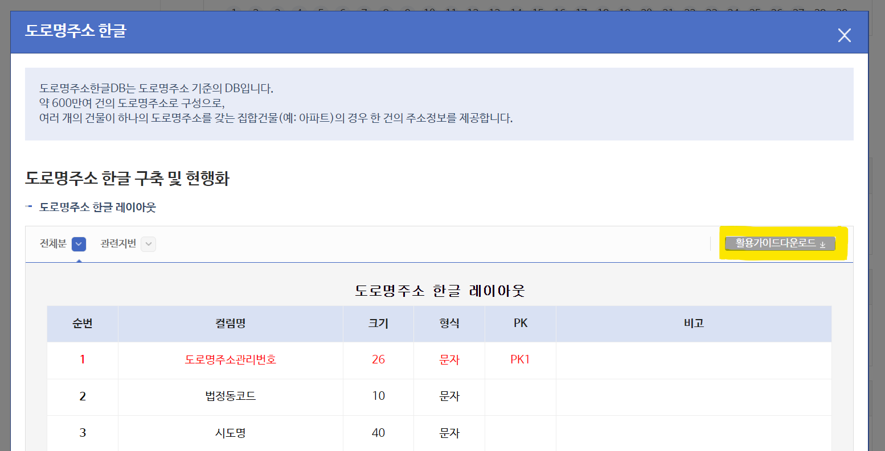
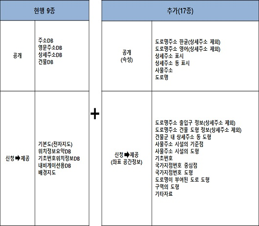

# 2. 공개하는 주소

<br>

#### 작성자: 송채은

## 공개하는 주소

주소정보 제공의 [공개하는 주소](https://business.juso.go.kr/addrlink/adresInfoProvd/guidance/othbcAdresInfo.do)는 도형정보 또는 좌표를 제외한 자료로 구성되어 있습니다. 이용자는 로그인 절차없이 누구나 이용할 수 있습니다.

<figure class="flex flex-col items-center justify-center">
    
    <figcaption style="text-align: center;"></figcaption>
</figure>

공개하는 주소는 6종으로 구성되어 있고, 주소정보 활용 시 도로명주소법 시행령 6조에 따른 구성과 표기방법을 준수해야합니다.

- 도로명주소 한글
- 도로명주소 영문
- 상세주소 표시
- 상세주소 동 표시
- 사물주소
- 도로명

::: details 도로명주소법 시행령 제6조(도로명주소의 구성 및 표기 방법)

```:no-line-numbers
제6조(도로명주소의 구성 및 표기 방법) ① 도로명주소는 다음 각 호의 사항을 같은 호의 순서에 따라 구성 및 표기한다.
  1. 특별시ㆍ광역시ㆍ특별자치시ㆍ도 및 특별자치도(이하 “시ㆍ도”라 한다)의 이름
  2. 시(「제주특별자치도 설치 및 국제자유도시 조성을 위한 특별법」 제10조제2항에 따른 행정시를 포함한다. 이하 제7호가목 및 나목에서 같다)ㆍ군ㆍ구의 이름
  3. 행정구(자치구가 아닌 구를 말한다)ㆍ읍ㆍ면의 이름
  4. 도로명
  5. 건물번호
  6. 상세주소(상세주소가 있는 경우에만 표기한다)
  7. 참고항목: 도로명주소의 끝부분에 괄호를 하고 그 괄호 안에 다음 각 목의 구분에 따른 사항을 표기할 수 있다.
    가. 특별시ㆍ광역시ㆍ특별자치시 및 시의 동(洞) 지역에 있는 건물등으로서 공동주택이 아닌 건물등: 법정동(法定洞)의 이름
    나. 특별시ㆍ광역시ㆍ특별자치시 및 시의 동 지역에 있는 공동주택: 법정동의 이름과 건축물대장에 적혀 있는 공동주택의 이름. 이 경우 법정동의 이름과 공동주택의 이름 사이에는 쉼표를 넣어 표기한다.
    다. 읍ㆍ면 지역에 있는 공동주택: 건축물대장에 적혀 있는 공동주택의 이름
  ② 제1항에도 불구하고 행정구역이 결정되지 않은 지역의 도로명주소 표기방법은 다음 각 호에서 정하는 바에 따른다.
  1. 시ㆍ도가 결정되지 않은 경우에는 다음 각 목의 사항을 같은 목의 순서에 따라 표기할 것
    가. 법 제29조제1항에 따른 중앙주소정보위원회(이하 “중앙주소정보위원회”라 한다)의 심의를 거쳐 행정안전부장관이 정하여 고시하는 사업지역의 명칭
    나. 제1항제4호부터 제6호까지의 규정에 따른 사항
  2. 시ㆍ군ㆍ구가 결정되지 않은 경우에는 다음 각 목의 사항을 같은 목의 순서에 따라 표기할 것
    가. 제1항제1호의 사항
    나. 법 제29조제1항에 따른 시ㆍ도주소정보위원회(이하 “시ㆍ도주소정보위원회”라 한다)의 심의를 거쳐 특별시장, 광역시장 또는 도지사가 정하여 고시하는 사업지역의 명칭
    다. 제1항제4호부터 제6호까지의 규정에 따른 사항
```

:::

각 데이터는 전체자료, 월변동자료, 일변동자료로 구분되어 있고, 목적에 따라 이용할 수 있습니다. 일변동자료를 지속적으로 업데이트해야하는 경우, 연계신청을 통해 API 또는 관련 프로그램을 통해 제공받을 수 있습니다.

<figure class="flex flex-col items-center justify-center">
    
    <figcaption style="text-align: center;"></figcaption>
</figure>

공개하는 주소의 데이터는 대부분 TXT 파일이며, 구분자는 `|`, 인코딩은 `CP949`로 제공합니다.  
데이터 내에서 컬럼명이 제공되지 않으므로, 데이터를 분석하기 전에 데이터의 구조를 파악해야합니다. 각 데이터의 레이아웃은 '공개하는 주소'의 팝업창에서 확인할 수 있고, 상세한 활용가이드는 '활용가이드다운로드' 버튼을 통해 PDF로 제공하고 있습니다.

<br>
<figure class="flex flex-col items-center justify-center">
    
    <figcaption style="text-align: center;"></figcaption>
</figure>
<br>

## 도로명주소 한글

도로명주소 한글 데이터는 각 컬럼을 조합하여 약 600만여건의 도로명주소를 구성할 수 있습니다. 여러 개의 건물이 하나의 도로명주소를 갖는 경우(집합건물, 아파트) 한 건의 주소정보를 제공합니다.

2개의 데이터로 구성되어 있으며, 전체분과 관련지번으로 구분됩니다. 다운로드시 압축파일(zip)로 제공하고, 전체분은 시도별로 구분되어 있습니다.

<table>
  <colgroup>
    <col style="width: 150px;"> <!-- 구분 -->
    <col style="width: 220px;"> <!-- 파일명 -->
    <col style="width: 250px;"> <!-- 설명 -->
  </colgroup>

  <tr>
    <th>구분</th>
    <th>파일명</th>
    <th>설명</th>
  </tr>
  <tr>
    <td rowspan="2">전체분</td>
    <td>rnaddrkor_지역명.txt</td>
    <td>도로명주소</td>
  </tr>
  <tr>
    <td>jibun_rnaddrkor_지역명.txt </td>
    <td>관련지번</td>
  </tr>
  <tr>
    <td rowspan="2">월변동</td>
    <td>naddrkor_mod.txt</td>
    <td>도로명주소 월변동</td>
  </tr>
  <tr>
    <td>jibun_rnaddrkor_mod.txt</td>
    <td>관련지번 월변동</td>
  </tr>
  <tr>
    <td rowspan="2">일변동</td>
    <td>AlterD.JUSUKR.YYYYMMDD.TH_SGCO_RNADR_MST.txt</td>
    <td>도로명주소 일변동</td>
  </tr>
  <tr>
    <td>AlterD.JUSUKR.YYYYMMDD.TH_SGCO_RNADR_LNBR.txt</td>
    <td>관련지번 일변동</td>
  </tr>
</table>

**도로명주소 한글**은 조합된 주소를 제공하지 않고, 각 컬럼을 조합하여 주소를 구성해야합니다. ORACLE 기준의 SQL 쿼리를 제공하고 있으며, 이를 참고하여 주소DB를 구성할 수 있습니다. 본 문서는 범용적인 사용을 위해 [6장 파이썬과 MySQL로 구축하는 주소 데이터베이스](/contents/chapter-6/chapter-6-1.md)에서 MySQL로 구축하는 방법을 제공합니다.

- 도로명주소 한글 (전체분) 예시

```
36110101200000200181100000|3611010100|세종특별자치시||반곡동||0|47|1|361102000002|한누리대로|0|1811|0|3611055600|반곡동|30145||20181204|0|||수루배마을5단지 상가동|
36110101200000200182000000|3611010100|세종특별자치시||반곡동||0|862|0|361102000002|한누리대로|0|1820|0|3611055600|반곡동|30146||20191202|0|||왕관빌딩|
36110101200000200182100000|3611010100|세종특별자치시||반곡동||0|46|1|361102000002|한누리대로|0|1821|0|3611055600|반곡동|30145||20181204|0|||수루배마을5단지 상가동|
36110101200000200182400000|3611010100|세종특별자치시||반곡동||0|49|13|361102000002|한누리대로|0|1824|0|3611055600|반곡동|30146||20191209|0||||
36110101200000200182800000|3611010100|세종특별자치시||반곡동||0|45|14|361102000002|한누리대로|0|1828|0|3611055600|반곡동|30146||20190716|0|||시드니블루|
```

::: details 도로명주소 한글 레이아웃

| 순번 | 컬럼명                 | 크기 | 형식 | PK  | 비고                        |
| ---- | ---------------------- | ---- | ---- | --- | --------------------------- |
| 1    | 도로명주소관리번호     | 26   | 문자 | PK1 |                             |
| 2    | 법정동코드             | 10   | 문자 |     |                             |
| 3    | 시도명                 | 40   | 문자 |     |                             |
| 4    | 시군구명               | 40   | 문자 |     |                             |
| 5    | 법정읍면동명           | 40   | 문자 |     |                             |
| 6    | 법정리명               | 40   | 문자 |     |                             |
| 7    | 산여부                 | 1    | 문자 |     | 0:대지, 1:산                |
| 8    | 지번본번(번지)         | 4    | 숫자 |     |                             |
| 9    | 지번부번(호)           | 4    | 숫자 |     |                             |
| 10   | 도로명코드             | 12   | 문자 | PK2 | 시군구코드(5)+도로명번호(7) |
| 11   | 도로명                 | 80   | 문자 |     |                             |
| 12   | 지하여부               | 1    | 문자 | PK3 | 0:지상, 1:지하, 2:공중      |
| 13   | 건물본번               | 5    | 숫자 | PK4 |                             |
| 14   | 건물부번               | 5    | 숫자 | PK5 |                             |
| 15   | 행정동코드             | 60   | 문자 |     | 참고용                      |
| 16   | 행정동명               | 60   | 문자 |     | 참고용                      |
| 17   | 기초구역번호(우편번호) | 5    | 문자 |     |                             |
| 18   | 이전도로명주소         | 400  | 문자 |     |                             |
| 19   | 효력발생일             | 8    | 문자 |     |                             |
| 20   | 공동주택구분           | 1    | 문자 |     |                             |
| 21   | 이동사유코드           | 2    | 문자 |     | 31:신규, 34:수정, 63:폐지   |
| 22   | 건축물대장건물명       | 400  | 문자 |     |                             |
| 23   | 시군구용건물명         | 400  | 문자 |     |                             |
| 24   | 비고                   | 200  | 문자 |     |                             |

:::

**관련지번**은 도로명주소와 N:M 관계로, 도로명주소에 여러 개의 지번이 포함될 수 있습니다.  
예를 들어 '서울특별시 동작구 흑석로 84 (흑석동)'은 건물군 단위로 주소가 부여되어, 부지가 크기 때문에 '흑석로 84'에 '흑석동' 지번이 여러 개 포함될 수 있습니다.

<figure class="flex flex-col items-center justify-center">
    
    <figcaption style="text-align: center;">관련지번 예시</figcaption>
</figure>

- 도로명주소 관련지번 (전체분) 예시

```
36110107200000200019400000|3611010700|세종특별자치시||나성동||0|776|0|361102000002|0|194|0|
36110110200000200040200000|3611011000|세종특별자치시||어진동||0|591|0|361102000002|0|402|0|
36110110200000200040200000|3611011000|세종특별자치시||어진동||0|573|0|361102000002|0|402|0|
36110110200000200040200000|3611011000|세종특별자치시||어진동||0|585|0|361102000002|0|402|0|
36110110200000200040200000|3611011000|세종특별자치시||어진동||0|583|0|361102000002|0|402|0|
```

::: details 도로명주소 관련지번 레이아웃

| 순번 | 컬럼명             | 크기 | 형식 | PK  | 비고                        |
| ---- | ------------------ | ---- | ---- | --- | --------------------------- |
| 1    | 도로명주소관리번호 | 26   | 문자 | PK1 |                             |
| 2    | 법정동코드         | 10   | 문자 | PK2 |                             |
| 3    | 시도명             | 40   | 문자 |     |                             |
| 4    | 시군구명           | 40   | 문자 |     |                             |
| 5    | 법정읍면동명       | 40   | 문자 |     |                             |
| 6    | 법정리명           | 40   | 문자 |     |                             |
| 7    | 산여부             | 1    | 문자 | PK3 | 0:대지, 1:산                |
| 8    | 지번본번(번지)     | 4    | 숫자 | PK4 |                             |
| 9    | 지번부번(호)       | 4    | 숫자 | PK5 |                             |
| 10   | 도로명코드         | 12   | 문자 |     | 시군구코드(5)+도로명번호(7) |
| 11   | 지하여부           | 1    | 문자 |     | 0:지상, 1:지하, 2:공중      |
| 12   | 건물본번           | 5    | 숫자 |     |                             |
| 13   | 건물부번           | 5    | 숫자 |     |                             |
| 14   | 이동사유코드       | 2    | 문자 |     | 31:신규, 34:변동, 63:폐지   |

:::

## 도로명주소 영문

도로명주소 영문 표기를 위해 제공하는 데이터입니다. 도로명주소 한글과 다르게 행정동코드, 행정동명 정보가 생략되어있고, 관련지번 데이터를 제공하지 않습니다.

<table>
  <colgroup>
    <col style="width: 150px;"> <!-- 구분 -->
    <col style="width: 220px;"> <!-- 파일명 -->
  </colgroup>

  <tr>
    <th>구분</th>
    <th>파일명</th>
  </tr>
  <tr>
    <td >전체분</td>
    <td>rneng_지역명.txt</td>
  </tr>
  <tr>
    <td >월변동</td>
    <td>rneng_mod.txt</td>
  </tr>
    <tr>
    <td >일변동</td>
    <td>AlterD.JUSUEN.YYYYMMDD.TH_SGCO_ENADR_MST.txt</td>
  </tr>
</table>

- 도로명주소 영문 (전체분) 예시

```
36110101200000200181100000|3611010100|Sejong-si||Bangok-dong||361102000002|Hannuri-daero|0|1811|0|30145|0|47|1|20181204|
36110101200000200182000000|3611010100|Sejong-si||Bangok-dong||361102000002|Hannuri-daero|0|1820|0|30146|0|862|0|20191202|
36110101200000200182100000|3611010100|Sejong-si||Bangok-dong||361102000002|Hannuri-daero|0|1821|0|30145|0|46|1|20181204|
36110101200000200182400000|3611010100|Sejong-si||Bangok-dong||361102000002|Hannuri-daero|0|1824|0|30146|0|49|13|20191209|
36110101200000200182800000|3611010100|Sejong-si||Bangok-dong||361102000002|Hannuri-daero|0|1828|0|30146|0|45|14|20190716|
```

::: details 도로명주소 영문 레이아웃

| 순번 | 컬럼명                 | 크기 | 형식 | PK  | 비고                      |
| ---- | ---------------------- | ---- | ---- | --- | ------------------------- |
| 1    | 도로명주소관리번호     | 26   | 문자 | PK1 |                           |
| 2    | 법정동코드             | 10   | 문자 |     |                           |
| 3    | 영문시도명             | 40   | 문자 |     |                           |
| 4    | 영문시군구명           | 40   | 문자 |     |                           |
| 5    | 영문읍면동명           | 40   | 문자 |     |                           |
| 6    | 영문리명               | 40   | 문자 |     |                           |
| 7    | 도로명코드             | 12   | 문자 | PK2 |                           |
| 8    | 영문도로명             | 80   | 문자 |     |                           |
| 9    | 지하여부               | 1    | 문자 | PK3 | 0:지상, 1:지하, 2:공중    |
| 10   | 건물본번               | 5    | 숫자 | PK4 |                           |
| 11   | 건물부번               | 5    | 숫자 | PK5 |                           |
| 12   | 기초구역번호(우편번호) | 5    | 문자 |     |                           |
| 13   | 산여부                 | 1    | 문자 |     | 0:대지, 1:산              |
| 14   | 지번본번(번지)         | 4    | 숫자 |     |                           |
| 15   | 지번부번(호)           | 4    | 숫자 |     |                           |
| 16   | 효력발생일             | 8    | 문자 |     |                           |
| 17   | 이동사유코드           | 2    | 문자 |     | 31:신규, 34:수정, 63:폐지 |

:::

## 상세주소 표시

상세주소는 도로명주소의 건물번호 뒤에 표시되는 동·층·호 정보로, 2가구 이상 거주하는 원룸·다가구·단독주택에 부여합니다.

해당 데이터는 동,층,호의 구분을 위해 동일련번호, 층일련번호, 호일련번호, 호접미사일련번호를 통해 관리합니다. 이 때, 호접미사는 호에서 상세구분을 하는 경우(예: 101호 A, 101호 B)에 사용합니다.

<table>
  <colgroup>
    <col style="width: 150px;"> <!-- 구분 -->
    <col style="width: 220px;"> <!-- 파일명 -->
    <col style="width: 250px;"> <!-- 설명 -->
  </colgroup>

  <tr>
    <th>구분</th>
    <th>파일명</th>
    <th>설명</th>
  </tr>
  <tr>
    <td rowspan="2">전체분</td>
    <td>rnspbd_adrdc_지역명.txt</td>
    <td>시군구용 전체분</td>
  </tr>
  <tr>
    <td>rnspbt_adrdc_mod.txt </td>
    <td>건축물대장 전체분</td>
  </tr>
  <tr>
    <td rowspan="2">월변동</td>
    <td>rnspbd_adrdc_mod.txt</td>
    <td>시군구용 월변동</td>
  </tr>
  <tr>
    <td>rnspbt_adrdc_mod.txt</td>
    <td>건축물대장 월변동</td>
  </tr>
  <tr>
    <td rowspan="2">일변동</td>
    <td>AlterD.JUSUDC.YYYYMMDD.TH_RNSPBD_ADRDC.txt</td>
    <td>시군구용 일변동</td>
  </tr>
  <tr>
    <td>AlterD.JUSUDC.YYYYMMDD.TH_RNSPBT_ADRDC.txt</td>
    <td>건축물대장 일변동</td>
  </tr>
</table>

상세주소 데이터는 **시군구용 상세주소**와 **건축물대장 상세주소**로 구분되어 있습니다.  
데이터 레이아웃은 같지만, 건물명의 기준에 따라 동,층,호의 정보가 변경되므로 2개의 데이터를 별도로 제공합니다. 예를 들어, 건축물대장 상세주소는 동,층,호 정보가 없지만, 시군구용 상세주소는 이용자의 요청에 따라 변경될 수 있으므로 동,층,호 정보가 추가될 수 있습니다.

- 시군구용 상세주소 (전체분) 예시

```
11110|6171|19635|94176|0|.||101||0|1111010100101300002031300|1111010100|111103100012|0|99|4|11110101310001200009900004|
11110|6171|19635|94177|0|.||102||0|1111010100101300002031300|1111010100|111103100012|0|99|4|11110101310001200009900004|
11110|6171|19635|94178|0|.||103||0|1111010100101300002031300|1111010100|111103100012|0|99|4|11110101310001200009900004|
11110|6171|19636|94179|0|.||201||0|1111010100101300002031300|1111010100|111103100012|0|99|4|11110101310001200009900004|
11110|6171|19636|94180|0|.||202||0|1111010100101300002031300|1111010100|111103100012|0|99|4|11110101310001200009900004|
```

- 건축물대장 상세주소 (전체분) 예시

```
11110|2390|10950|44259|0||1|101||0|1111010100101080014031432|1111010100|111103100012|0|96|0|11110101310001200009600000|
11110|2390|10951|44260|0||2|201||0|1111010100101080014031432|1111010100|111103100012|0|96|0|11110101310001200009600000|
11110|2390|10951|44261|0||2|202||0|1111010100101080014031432|1111010100|111103100012|0|96|0|11110101310001200009600000|
11110|2390|10952|44262|0||3|301||0|1111010100101080014031432|1111010100|111103100012|0|96|0|11110101310001200009600000|
11110|2390|10952|44263|0||3|302||0|1111010100101080014031432|1111010100|111103100012|0|96|0|11110101310001200009600000|
```

::: details 상세주소 표시 레이아웃

| 순번 | 컬럼명             | 크기 | 형식 | PK  | 비고                             |
| ---- | ------------------ | ---- | ---- | --- | -------------------------------- |
| 1    | 시군구코드         | 5    | 문자 | PK1 |                                  |
| 2    | 동일련번호         |      | 숫자 | PK2 |                                  |
| 3    | 층일련번호         |      | 숫자 | PK3 | PK (없을 경우 0)                 |
| 4    | 호일련번호         |      | 숫자 | PK4 | PK (없을 경우 0)                 |
| 5    | 호접미사일련번호   |      | 숫자 | PK5 | PK (없을 경우 0)                 |
| 6    | 동명칭             | 50   | 문자 |     |                                  |
| 7    | 층명칭             | 50   | 문자 |     |                                  |
| 8    | 호명칭             | 50   | 문자 |     |                                  |
| 9    | 호접미사명칭       | 10   | 문자 |     | 호 상세구분 (예)101호 A, 101호 B |
| 10   | 지하구분           | 1    | 문자 |     | 0:일반, 1:지하                   |
| 11   | 건물관리번호       | 25   | 문자 |     | 건물 연계Key                     |
| 12   | 법정동코드         | 10   | 문자 |     | 도로명주소 연계Key1              |
| 13   | 도로명코드         | 12   | 문자 |     | 도로명주소 연계Key2              |
| 14   | 지하여부           | 1    | 문자 |     | 도로명주소 연계Key3              |
| 15   | 건물본번           | 5    | 숫자 |     | 도로명주소 연계Key4              |
| 16   | 건물부번           | 5    | 숫자 |     | 도로명주소 연계Key5              |
| 17   | 도로명주소관리번호 | 26   | 문자 |     | 도로명관리 연계Key               |
| 18   | 이동사유코드       | 2    | 문자 |     | 31:신규, 34:수정, 63:폐지        |

:::

## 상세주소 동 표시

도로명주소는 건물군 또는 건물에 부여됩니다. 만약, 건물군에 여러 개의 건물이 포함되어 있을 경우, 상세주소 동 표시 데이터를 사용해 건물 동단위로 부여된 도로명주소를 확인할 수 있습니다. 층과 호는 제외하고 건물단위로 제공하므로 '상세주소 표시' 데이터와 다르게 층,호 정보가 없습니다.

<table>
  <colgroup>
    <col style="width: 150px;"> <!-- 구분 -->
    <col style="width: 220px;"> <!-- 파일명 -->
  </colgroup>

  <tr>
    <th>구분</th>
    <th>파일명</th>
  </tr>
  <tr>
    <td >전체분</td>
    <td>rnspbd_dong_지역명.txt</td>
  </tr>
  <tr>
    <td >월변동</td>
    <td>rnspbd_dong_mod.txt</td>
  </tr>
    <tr>
    <td >일변동</td>
    <td>AlterD.JUSUDG.YYYYMMDD.TH_RNSPBD_DONG.txt</td>
  </tr>
</table>

도로명주소관리번호와 건물관리번호를 PK로 사용하여 도로명주소와 연계할 수 있습니다. 이 때, 상세건물명은 건물군 내 건물을 구분하기 위해 사용합니다. 아래 예시의 경우, '우남이채롬'이 건축물대장 건물명이고, '101동', '102동', '103동'이 상세건물명입니다.

- 상세주소 동 표시 (전체분) 예시

```
2611010100||||261103006001|0|11|6|26110101300600100001100006|2611010100100080016003459|
2611010100||||261103006001|0|12|0|26110101300600100001200000|2611010100100160033004877|
2611010100|우남이채롬|101동|우남이채롬|261103006001|0|13|0|26110101300600100001300000|2611010100100050000003342|
2611010100|우남이채롬|102동|우남이채롬|261103006001|0|13|0|26110101300600100001300000|2611010100100050000003343|
2611010100|우남이채롬|103동|우남이채롬|261103006001|0|13|0|26110101300600100001300000|2611010100100050000003344|
```

::: details 상세주소 동 표시 레이아웃

| 순번 | 한글컬럼명         | 크기 | 형식 | PK  | 비고                      |
| ---- | ------------------ | ---- | ---- | --- | ------------------------- |
| 1    | 법정동코드         | 10   | 문자 |     |                           |
| 2    | 건축물대장건물명   | 40   | 문자 |     |                           |
| 3    | 상세건물명         | 100  | 문자 |     |                           |
| 4    | 시군구용건물명     | 40   | 문자 |     |                           |
| 5    | 도로명코드         | 12   | 문자 |     |                           |
| 6    | 지하여부           | 1    | 문자 |     |                           |
| 7    | 건물본번           | 5    | 숫자 |     |                           |
| 8    | 건물부번           | 5    | 숫자 |     |                           |
| 9    | 도로명주소관리번호 | 26   | 문자 | PK1 |                           |
| 10   | 건물관리번호       | 25   | 문자 | PK2 |                           |
| 11   | 이동사유코드       | 2    | 문자 |     | 31:신규, 34:변동, 63:폐지 |

:::

## 사물주소

사물주소는 도로명과 기초번호를 사용하여 시설물에 부여한 주소입니다. 총 15종의 시설물에 부여한 주소데이터를 제공합니다. (단, 육교승강기는 승강기, 출입구, 육교로 구분하여 제공합니다.)

<table>
  <tr>
    <th>구분</th>
    <th>파일명</th>
  </tr>
  <tr>
    <td>전체분</td>
    <td>Total.JUSUAN.YYYYMMDD.TI_SPOT_영문약어.txt</td>
  </tr>
  <tr>
    <td>월변동</td>
    <td>AlterM.JUSUAN.YYYYMMDD.TI_SPOT_영문약어.txt</td>
  </tr>
</table>

- 사물주소 데이터의 영문약어

| 주소 데이터    | 설명                      | 마스터 데이터 | 설명                        |
| -------------- | ------------------------- | ------------- | --------------------------- |
| AOTELVTR       | 육교승강기 – 승강기       |               |                             |
| AOTENT         | 육교승강기 - 출입구       |               |                             |
| AOTOVRPS       | 육교승강기 - 육교         |               |                             |
| RIVERPK_ADRES  | 둔치주차장 주소           | RIVERPK_M     | 둔치주차장 마스터           |
| EQOUT_ADRES    | 지진옥외대피장소 주소     | EQOUT_M       | 지진옥외대피장소 마스터     |
| TAXIST_ADRES   | 택시승강장 주소           | TAXIST_M      | 택시승강장 마스터           |
| BUSST_ADRES    | 버스정류장 주소           | BUSST_M       | 버스정류장 마스터           |
| SLEEPRA_ADRES  | 졸음쉼터 주소             | SLEEPRA_M     | 졸음쉼터 마스터             |
| EQWAV_ADRES    | 지진해일긴급대피장소 주소 | EQWAV_M       | 지진해일긴급대피장소 마스터 |
| SCPARK_ADRES   | 소공원 주소               | SCPARK_M      | 소공원 마스터               |
| CHPARK_ADRES   | 어린이공원 주소           | CHPARK_M      | 어린이공원 마스터           |
| EMERWAT_ADRES  | 비상급수시설 주소         | EMERWAT_M     | 비상급수시설 마스터         |
| LIFESAV_ADRES  | 인명구조함 주소           | LIFESAV_M     | 인명구조함 마스터           |
| DRONEDP_ADRES  | 드론배달점 주소           | DRONEDP_M     | 드론배달점 마스터           |
| BTCHRSTN_ADRES | 전기차충전소 주소         | BTCHRSTN_M    | 전기차충전소 마스터         |
| CURBPK_ADRES   | 노상주차장 주소           | CURBPK_M      | 노상주차장 마스터           |
| OFFSTPK_ADRES  | 노외주차장 주소           | OFFSTPK_M     | 노외주차장 마스터           |

사물주소는 '주소'와 '마스터'로 구분됩니다. '주소'는 사물주소의 행정구역, 도로명, 주소본번, 주소부번, 대표주소여부 등 주소와 관련된 데이터를 제공하고, '마스터'는 시설물의 유형에 따른 상세한 정보를 제공합니다.

예를 들어, 버스정류장의 경우 '주소'에는 버스정류장의 사물주소를 제공하고, '마스터'에는 버스정류장의 상세한 정보(예:중앙차로 여부)를 제공합니다.

- 사물주소 버스정류장 (전체분) 예시

```
OBJ030000000001538|197529|25131|11215|서울특별시|광진구|구의동|3104001|강변역로| |97|0|1121510300|Y||
OBJ030000000001417|198145|25010|11215|서울특별시|광진구|구의동|4112003|강변역로4길| |107|0|1121510300|Y||
OBJ030000000130871|110307|154593|11215|서울특별시|광진구|구의동|3104003|구의강변로| |95|0|1121510300|Y||
OBJ030000000001586|89466|25179|11215|서울특별시|광진구|구의동|3104004|구의로| |69|0|1121510300|Y||
OBJ030000000001558|90961|25151|11215|서울특별시|광진구|구의동|3104010|자양로| |155|0|1121510300|Y||
```

::: details 사물주소 버스정류장 레이아웃

| 순번 | 컬럼명           | 크기 | 형식 | PK  | 비고                   |
| ---- | ---------------- | ---- | ---- | --- | ---------------------- |
| 1    | 사물관리번호     | 18   | 문자 | PK1 |                        |
| 2    | 사물주소일련번호 | 18   | 문자 | PK2 |                        |
| 3    | 점공간일련번호   | 22   | 숫자 |     |                        |
| 4    | 시군구코드       | 5    | 문자 |     |                        |
| 5    | 시도명           | 40   | 문자 |     |                        |
| 6    | 시군구명         | 40   | 문자 |     |                        |
| 7    | 읍면동명         | 40   | 문자 |     |                        |
| 8    | 도로명코드       | 7    | 문자 |     |                        |
| 9    | 도로명           | 80   | 문자 |     |                        |
| 10   | 지하여부         | 1    | 문자 |     | 0:지상, 1(지하)        |
| 11   | 주소본번         | 5    | 숫자 |     |                        |
| 12   | 주소부번         | 4    | 숫자 |     |                        |
| 13   | 행정구역코드     | 10   | 문자 |     |                        |
| 14   | 대표주소여부     | 1    | 문자 |     |                        |
| 15   | 변경일자         | 8    | 문자 |     |                        |
| 16   | 변경사유코드     | 1    | 문자 |     | 1:신규, 2:변경, 3:삭제 |

:::

- 사물주소 버스정류장 마스터 (전체분) 예시

```
OBJ030000000001538|테크노마트C|Techno Mart C|11215|서울특별시|광진구|||
OBJ030000000001609|용마사거리|Yongma Sageori|11215|서울특별시|광진구|||
OBJ030000000130873|광장동현대아파트앞|Gwangjang-dong  Hyundai Apt front|11215|서울특별시|광진구|N||
OBJ030000000130871|현대아파트앞|Hyundai Apt front|11215|서울특별시|광진구|N||
OBJ030000000130876|워커힐입구|Walkerhill Entrance|11215|서울특별시|광진구|N||
```

::: details 사물주소 버스정류장 마스터 레이아웃

| 순번 | 컬럼명        | 한글컬럼명   | 크기(byte) | PK  | 비고                   |
| ---- | ------------- | ------------ | ---------- | --- | ---------------------- |
| 1    | OBJ_MNG_NO    | 사물관리번호 | 18         | PK  |                        |
| 2    | OBJ_NM        | 사물명       | 120        |     |                        |
| 3    | OBJ_ENG_NM    | 사물영문명   | 60         |     |                        |
| 4    | SIG_CD        | 시군구코드   | 5          |     |                        |
| 5    | CTP_KOR_NM    | 시도명       | 40         |     |                        |
| 6    | SIG_KOR_NM    | 시군구명     | 40         |     |                        |
| 7    | CENTER_ROAD_Y | 중앙차로여부 | 1          |     | Y/N                    |
| 8    | MVMN_DE       | 변경일자     | 8          |     |                        |
| 9    | JOB_SE_CD     | 변경사유코드 | 1          |     | 1:신규, 2:변경, 3:삭제 |

:::

마스터의 상세한 레이아웃은 시설물 유형마다 다르므로, [사물주소활용가이드 PDF](https://business.juso.go.kr/addrlink/download.do?reqType=jusuan_ex&fileName=%EC%82%AC%EB%AC%BC%EC%A3%BC%EC%86%8C%ED%99%9C%EC%9A%A9%EA%B0%80%EC%9D%B4%EB%93%9C.pdf&realFileName=jusuan_exDBGuide.pdf&regYmd=2023)를 참고하시기 바랍니다.

## 도로명

도로명주소에 부여되는 도로명과 해당 도로명이 지나는 읍면동, 도로구간의 기점과 종점을 제공합니다.  
도로명은 지역별로 구분되지 않고 하나의 데이터로 제공됩니다.

<table>
  <colgroup>
    <col style="width: 150px;"> <!-- 구분 -->
    <col style="width: 220px;"> <!-- 파일명 -->
  </colgroup>

  <tr>
    <th>구분</th>
    <th>파일명</th>
  </tr>
  <tr>
    <td >전체분</td>
    <td>TN_SPRD_RDNM.txt</td>
  </tr>
  <tr>
    <td >월변동</td>
    <td>TH_SPRD_RDNM_MOD.txt</td>
  </tr>
    <tr>
    <td >일변동</td>
    <td>AlterD.JUSUZR.YYYYMMDD.TI_SPRD_RDNM.txt</td>
  </tr>
</table>

도로명은 시군구코드와 도로명번호를 PK로 사용합니다. **도로명번호 7자리는 지자체마다 관리하는 코드로, 고유하지 않습니다.** 따라서, 시군구코드와 도로명번호를 조합한 코드(도로명코드)를 통해 도로명을 식별합니다. 하지만, 데이터에 따라 도로명번호(7자리)와 도로명코드(12자리)의 용어가 혼용되므로 자릿수에 주의하시기 바랍니다.

도로명 데이터에서 사용하는 읍면동일련번호는 하나의 도로가 지나는 읍면동을 구분하기 위해 임의로 부여한 일련번호입니다. 도로명 데이터에서만 사용되며 읍면동코드와 다른 의미입니다.

- 도로명 (전체분) 예시

```
48250|4805185|00|김해대로2325번길|Gimhae-daero 2325beon-gil|경상남도|김해시|2|||0|김해대로의 시작지점부터 약 23250m(기초번호 2325번) 지점에서 왼쪽으로 분기되는 길|||Gyeongsangnam-do|Gimhae-si||1|46|20091008|
48250|4805187|01|김해대로2371번길|Gimhae-daero 2371beon-gil|경상남도|김해시|1|103|부원동|0|김해대로의 시작지점부터 약 23710m(기초번호 2371번) 지점에서 왼쪽으로 분기되는 길|||Gyeongsangnam-do|Gimhae-si|Buwon-dong|1|30|20091008|
48250|4805188|01|김해대로2385번길|Gimhae-daero 2385beon-gil|경상남도|김해시|1|103|부원동|0|김해대로의 시작지점부터 약 23850m(기초번호 2385번) 지점에서 왼쪽으로 분기되는 길|||Gyeongsangnam-do|Gimhae-si|Buwon-dong|1|48|20091008|
48250|4805189|00|김해대로2415번길|Gimhae-daero 2415beon-gil|경상남도|김해시|2|||0|김해대로의 시작지점부터 약 24150m(기초번호 2415번) 지점에서 왼쪽으로 분기되는 길|||Gyeongsangnam-do|Gimhae-si||1|16|20091008|
48250|4805190|00|김해대로2431번길|Gimhae-daero 2431beon-gil|경상남도|김해시|2|||0|김해대로의 시작지점부터 약 24310m(기초번호 2431번) 지점에서 왼쪽으로 분기되는 길|||Gyeongsangnam-do|Gimhae-si||1|34|20091008|
```

::: details 도로명 레이아웃

| 순번 | 컬럼명                       | 크기 | 형식 | PK  | 비고                                                                                       |
| ---- | ---------------------------- | ---- | ---- | --- | ------------------------------------------------------------------------------------------ |
| 1    | 시군구코드                   | 5    | 문자 | PK1 | 도로명코드 : 시군구코드(5) + 도로명번호(7)                                                 |
| 2    | 도로명번호                   | 7    | 문자 | PK1 | 도로명코드 : 시군구코드(5) + 도로명번호(7)                                                 |
| 3    | 읍면동일련번호               | 2    | 문자 | PK2 |                                                                                            |
| 4    | 도로명                       | 80   | 문자 |     |                                                                                            |
| 5    | 영문도로명                   | 80   | 문자 |     |                                                                                            |
| 6    | 시도명                       | 40   | 문자 |     |                                                                                            |
| 7    | 시군구명                     | 40   | 문자 |     |                                                                                            |
| 8    | 읍면동구분                   | 1    | 문자 |     | 0: 읍면, 1:동, 2:미부여                                                                    |
| 9    | 읍면동코드                   | 3    | 문자 |     | 법정동기준읍면동코드                                                                       |
| 10   | 읍면동명                     | 40   | 문자 |     |                                                                                            |
| 11   | 사용여부                     | 1    | 문자 |     | 0: 사용, 1: 미사용                                                                         |
| 12   | 부여사유                     | 254  | 문자 |     |                                                                                            |
| 13   | 변경이력사유                 | 1    | 문자 |     | 0: 도로명변경, 1: 도로명폐지, 2: 시도시군구변경, 3: 읍면동변경, 4: 영문도로명변경, 9: 기타 |
| 14   | 변경이력정보                 | 14   | 문자 |     | 도로명코드(12)+ 읍면동일련번호(2)                                                          |
| 15   | 영문시도명                   | 40   | 문자 |     |                                                                                            |
| 16   | 영문시군구명                 | 40   | 문자 |     |                                                                                            |
| 17   | 영문읍면동명                 | 40   | 문자 |     |                                                                                            |
| 18   | 도로구간의 시작지점 기초번호 | 10   | 문자 |     |                                                                                            |
| 19   | 도로구간 끝지점 기초번호     | 10   | 문자 |     |                                                                                            |
| 20   | 효력발생일                   | 8    | 문자 |     | 효력발생일자(YYYYMMDD)                                                                     |
| 21   | 말소일자                     | 8    | 문자 |     | 말소일자(YYYYMMDD)                                                                         |

:::

## 공개하는 정보 변동사항

현재의 공개하는 주소는 2022년 6월 9일 이후 기존 9종에서 17종으로 세분화하여 제공하고 있습니다.

:::info 공개하는 정보 변동사항
주소정보 사용자 의견을 반영하여 기존 제공하던 9종 자료는 폐지하지 않고 제공 유지  
 ※ 공개 및 제공하는 주소정보를 사용목적에 따라 9종에서 17종으로 세분화하여 추가 제공(‘22.6.9부터)  
 ※ “건물DB”를 “도로명주소 한글(상세주소 제외)”과 “상세주소 동 표시”정보로 분리  
 ※ “내비게이션용DB”는 주소정보목록의 “도로명주소 출입구 정보(상세주소 제외)”와 “건물군 내 상세주소 동 도형”으로 분리  
 ※ 도로명주소 전자지도 “건물”정보는 주소정보목록의 “도로명주소 건물 도형 정보(상세주소 제외)”와 “건물군 내 상세주소 동 도형”정보로 분리

:::

<figure class="flex flex-col items-center justify-center">
    
</figure>

이전의 데이터 중 일부 DB는 공개하는 주소와 함께 제공됩니다.

| DB명             | 설명                                                                                                                                                                                                                                                                                                        |
| ---------------- | ----------------------------------------------------------------------------------------------------------------------------------------------------------------------------------------------------------------------------------------------------------------------------------------------------------- |
| 건물DB           | 도로명주소를 구성하는 기본 단위인 건물정보와 해당 건물이 위치한 토지(지번)정보로 구성된 DB입니다. 하나의 도로명주소가 부여된 단지형 아파트의 경우에도 상세 동별 정보가 모두 제공되므로, 건물 단위의 주소 활용에 용이합니다.                                                                                 |
| 주소DB           | 주소DB는 여러 개의 건물이 하나의 도로명주소를 갖는 집합 건물(예: 아파트)의 경우 한 건의 주소정보를 제공하도록 구성된 주소 단위의 DB입니다. 600만여 건의 주소와 800만여 건의 지번정보를 바탕으로 사용자의 필요에 따라 선택적으로 활용할 수 있도록 도로명코드 / 주소 / 지번 / 부가정보로 분리·구성하였습니다. |
| 사서함주소DB     | 사서함주소DB는 인터넷 우체국(www.epost.kr)에 정기적으로 게시되는 사서함DB를 가공하여 제공합니다.                                                                                                                                                                                                            |
| 영문도로명주소DB | 주소DB와 관련지번을 결합한 단일 파일로 구성하여 1개월 주기로 제공합니다. (주소검색화면 구성 시 건물명은 사용자가 입력하도록 구성하시기 바랍니다.)                                                                                                                                                           |
| 상세주소DB       | 주소정보와 건물단위로 매칭가능한 상세주소정보를 제공합니다. 상세주소란 도로명주소의 건물번호 뒤에 표시되는 동·층·호 정보로, 2가구 이상 거주하는 원룸·다가구·단독주택에 부여합니다.                                                                                                                          |
| 사물주소DB       | 안전 사고 발생 시 신속 대응 지원 및 내비게이션 등에 안내체계 마련을 위해 도로명과 기초번호를 이용하여 구성한 사물주소정보를 제공합니다. 사물주소란, 주소부여가 어려운 곳에 도로명과 기초번호를 이용하여 사물에 부여한 주소를 말합니다.                                                                      |

본 문서는 현행 DB를 기준으로 작성하고 있으며, 이전 DB와 현행 DB를 연계하는 것을 원한다면 데이터를 재구성해야 합니다.
