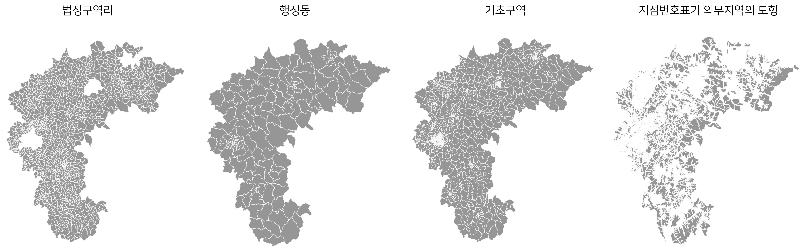

# 2.4 제공하는 주소

<br>

#### 작성자: 송채은

## 제공하는 주소

[제공하는 주소](https://business.juso.go.kr/addrlink/adresInfoProvd/guidance/provdAdresInfo.do)는 도형정보 또는 좌표를 포함한 자료로 구성되어 있습니다. 총 11종의 데이터로 구성되어 있으며, 데이터 목록은 아래와 같습니다.
개별 데이터는 하나로 구성되어 있는 경우도 있지만, 관련 데이터와 함께 제공되는 경우도 있습니다. 예를 들어, 도로명주소 건물 도형 데이터는 출입구, 연결선 등의 정보를 포함하고 있습니다.

| 데이터명                   | 포함된 데이터                                                                                             |
| -------------------------- | --------------------------------------------------------------------------------------------------------- |
| 도로명주소 출입구 정보     | 출입구 정보                                                                                               |
| 도로명주소 건물 도형       | 건물도형 정보, 출입구, 연결선                                                                             |
| 건물군 내 상세주소 동 도형 | 건물군 내 상세주소 정보, 출입구                                                                           |
| 사물주소 시설 기준점       | 사물 마스터, 사물 주소, 드론배달점 마스터                                                                 |
| 사물주소 시설 도형         | 사물 구역(면), 사물 진출입로(연결선), 사물 출입구(점), 사물위치점, 육교승강기, 육교 출입구, 육교          |
| 기초번호                   | 기초번호 정보                                                                                             |
| 국가지점번호 중심점        | 국가지점번호 중심점 정보                                                                                  |
| 도로명이 부여된 도로 도형  | 도로구간, 실폭도로, 기초구간                                                                              |
| 구역의 도형                | 법정구역, 기초구역, 지점번호표기 의무지역의 도형                                                          |
| 기타자료                   | 공원, 하천/호수, 철도선로, 철도역사, 지하철선로, 지하철역사, 지하철출입구, 교량, 고가도로, 터널, 지하차도 |

제공하는 주소는 공간데이터(SHP) 또는 좌표데이터(TXT)로 제공됩니다. 이번 장에서 공간데이터는 시각화를 통해 데이터를 설명하고, 좌표데이터는 예시를 통해 데이터를 설명합니다. 각 데이터의 세부 내용은 제공하는 주소의 데이터 레이아웃과 활용가이드문서를 참고하시기 바랍니다.

## 도로명주소 출입구 정보

도로명주소관리번호를 기준으로 출입구 정보를 제공합니다. 집합건물의 경우 출입구는 주소기준의 주(보조)출입구를 제공하며, 건물단위 제공은 하지 않습니다.

출입구는 좌표정보를 포함한 `TXT` 파일로 제공됩니다.

| 파일명                    | 파일유형 | 설명              |
| ------------------------- | -------- | ----------------- |
| RNENTDATA.YYMM.시군구코드 | TXT      | 도로명주소 출입구 |

```
36110101200000200181100000|3611010100|세종특별자치시||반곡동||361102000002|한누리대로|0|1811|0|30145|20181204||32169|RM|01|983296.172464|1833330.968984
36110101200000200182000000|3611010100|세종특별자치시||반곡동||361102000002|한누리대로|0|1820|0|30146|20191202||33697|RM|01|983232.494373|1833387.143468
36110101200000200182100000|3611010100|세종특별자치시||반곡동||361102000002|한누리대로|0|1821|0|30145|20181204||32168|RM|01|983203.451598|1833323.334451
36110101200000200182400000|3611010100|세종특별자치시||반곡동||361102000002|한누리대로|0|1824|0|30146|20191209||33717|RM|01|983174.566|1833381.958742
36110101200000200182800000|3611010100|세종특별자치시||반곡동||361102000002|한누리대로|0|1828|0|30146|20190716||33179|RM|01|983139.279683|1833377.471817
```

::: details 도로명주소 출입구 전체분 레이아웃

| 순번 | 컬럼명        | 한글컬럼명             | 크기 | 형식 | PK  | 비고                      |
| ---- | ------------- | ---------------------- | ---- | ---- | --- | ------------------------- |
| 1    | ADR_MNG_NO    | 도로명주소관리번호     | 26   | 문자 | PK1 |                           |
| 2    | ADM_CD        | 법정동코드             | 10   | 문자 |     |                           |
| 3    | CTP_KOR_NM    | 시도명                 | 40   | 문자 |     |                           |
| 4    | SIG_KOR_NM    | 시군구명               | 40   | 문자 |     |                           |
| 5    | EMD_KOR_NM    | 읍면동명               | 40   | 문자 |     |                           |
| 6    | LI_KOR_NM     | 리명                   | 40   | 문자 |     |                           |
| 7    | ROAD_NEW_CD   | 도로명코드             | 12   | 문자 | PK2 |                           |
| 8    | RN_NM         | 도로명                 | 80   | 문자 |     |                           |
| 9    | BULD_SE_CD    | 지하여부               | 1    | 문자 | PK3 |                           |
| 10   | BULD_MNNM     | 건물본번               | 5    | 숫자 | PK4 |                           |
| 11   | BULD_SLNO     | 건물부번               | 5    | 숫자 | PK5 |                           |
| 12   | BSI_ZON_NO    | 기초구역번호(우편번호) | 5    | 문자 |     |                           |
| 13   | EFFECT_DE     | 효력발생일             | 8    | 문자 |     |                           |
| 14   | CHG_RES_CD    | 이동사유코드           | 2    | 문자 |     | 31:신규, 34:수정, 63:폐지 |
| 15   | ENT_MAN_NO    | 출입구일련번호         | 10   | 숫자 |     |                           |
| 16   | ENTRC_SE      | 출입구구분             | 2    | 문자 |     | RM:주출입구               |
| 17   | ENTRC_TY      | 출입구유형             | 2    | 문자 |     | 01:공용, 02:차량용        |
| 18   | ENTRC_POINT_X | 출입구좌표X            | 17   | 문자 |     |                           |
| 19   | ENTRC_POINT_Y | 출입구좌표Y            | 17   | 문자 |     |                           |

:::

## 도로명주소 건물 도형

도로명주소 건물 도형은 건물의 폴리곤, 출입구 좌표, 연결선 라인 정보를 제공합니다. 이때, 집합건물의 경우 건물군 단위의 도형정보를 제공하며, 건물단위의 도형정보는 제공하지 않습니다. 모든 데이터는 `SHP` 파일로 제공됩니다. 데이터는 시도별로 제공됩니다.

| 파일명                                             | 파일유형      | 설명                 |
| -------------------------------------------------- | ------------- | -------------------- |
| Total.JUSURB.YYYYMMDD.TL_SGCO_RNADR_MST.시군구코드 | SHP, SHX, DBF | 도로명주소 건물 도형 |
| Total.JUSURB.YYYYMMDD.TL_SPBD_ENTRC.시군구코드     | SHP, SHX, DBF | 출입구               |
| Total.JUSURB.YYYYMMDD.TL_SPOT_CNTC.시군구코드      | SHP, SHX, DBF | 연결선               |

<figure class="flex flex-col items-center justify-center">
    <figcaption style="text-align: center;"></figcaption>
    
</figure>

위 그림은 서울특별시의 일부 지역을 시각화한 결과입니다. 가장 옅은 회색으로 표시된 도형은 건물도형 정보이고, 회색 점은 건물 또는 건물군의 출입구 좌표입니다. 빨간색은 연결선입니다. 연결선은 주소 부여대상과 참조대상 간을 서로 연결하는 선형을 말합니다. 즉, 그림에서 주소가 부여된 건물의 출입구와 도로의 기초간격을 연결하는 선형을 말합니다.

## 건물군 내 상세주소 동 도형

집합건물(예: 아파트) 내 동이 부여된 도로명주소의 도형정보를 제공합니다.
동 도형은 Polygon 정보이므로, `SHP` 파일로 제공됩니다. 데이터는 시도별로 제공됩니다.

| 파일명                                              | 파일유형      | 설명                       |
| --------------------------------------------------- | ------------- | -------------------------- |
| Total.JUSUED.YYYYMMDD.TL_SGCO_RNADR_DONG.시군구코드 | SHP, SHX, DBF | 건물군 내 상세주소 동 도형 |
| Total.JUSUED.YYYYMMDD.TL_SPBD_ENTRC_DONG.시군구코드 | SHP, SHX, DBF | 출입구                     |

<figure class="flex flex-col items-center justify-center">
    <figcaption style="text-align: center;"></figcaption>
    
</figure>

위 그림은 서울특별시의 일부 지역을 시각화한 결과입니다. 회색은 도로명주소의 건물도형 정보로, 건물군 단위의 도형만 제공합니다. 반면, 갈색으로 표시된 도형은 건물군 내 상세주소 동 도형입니다. 건물 도형에서 표현되지 않는 동 단위의 도형정보를 제공합니다. 또한, 빨간색 점은 건물군 내 상세주소 동의 출입구 좌표입니다.

## 사물주소 시설 기준점

사물주소 15종의 시설물의 기준점을 제공합니다. 기준점은 도로명과 기초번호를 이용하여 구성한 데이터로, `TXT` 파일로 제공됩니다.  
주소의 위치를 나타내는 주소 데이터는 X,Y 좌표를 포함하고 있습니다. 반면, 마스터 데이터는 좌표를 포함하지 않습니다. 데이터는 시설물 유형별로 제공됩니다.

| 파일명                                        | 파일유형 | 설명                     |
| --------------------------------------------- | -------- | ------------------------ |
| Total.JUSUAY.YYYYMMDD.TI*SPOT*영문약어\_ADRES | TXT      | 사물주소의 기준점        |
| Total.JUSUAY.YYYYMMDD.TI*SPOT*영문약어\_M     | TXT      | 사물주소 시설물의 마스터 |

- 영문 약어

| 주소 데이터    | 설명                      | 마스터 데이터 | 설명                        |
| -------------- | ------------------------- | ------------- | --------------------------- |
| RIVERPK_ADRES  | 둔치주차장 주소           | RIVERPK_M     | 둔치주차장 마스터           |
| EQOUT_ADRES    | 지진옥외대피장소 주소     | EQOUT_M       | 지진옥외대피장소 마스터     |
| TAXIST_ADRES   | 택시승강장 주소           | TAXIST_M      | 택시승강장 마스터           |
| BUSST_ADRES    | 버스정류장 주소           | BUSST_M       | 버스정류장 마스터           |
| SLEEPRA_ADRES  | 졸음쉼터 주소             | SLEEPRA_M     | 졸음쉼터 마스터             |
| EQWAV_ADRES    | 지진해일긴급대피장소 주소 | EQWAV_M       | 지진해일긴급대피장소 마스터 |
| SCPARK_ADRES   | 소공원 주소               | SCPARK_M      | 소공원 마스터               |
| CHPARK_ADRES   | 어린이공원 주소           | CHPARK_M      | 어린이공원 마스터           |
| EMERWAT_ADRES  | 비상급수시설 주소         | EMERWAT_M     | 비상급수시설 마스터         |
| LIFESAV_ADRES  | 인명구조함 주소           | LIFESAV_M     | 인명구조함 마스터           |
| DRONEDP_ADRES  | 드론배달점 주소           | DRONEDP_M     | 드론배달점 마스터           |
| BTCHRSTN_ADRES | 전기차충전소 주소         | BTCHRSTN_M    | 전기차충전소 마스터         |
| CURBPK_ADRES   | 노상주차장 주소           | CURBPK_M      | 노상주차장 마스터           |
| OFFSTPK_ADRES  | 노외주차장 주소           | OFFSTPK_M     | 노외주차장 마스터           |

### 사물 주소

주소의 기준점의 좌표를 제공합니다.

- 버스정류장 주소 예시

```
OBJ030000000000314|32454|23907|11110|서울특별시|종로구|가회동|3100004|북촌로| |52|0|1111014600|Y|954540.9381|1953674.6581||
OBJ030000000000325|31640|23918|11110|서울특별시|종로구|가회동|3100004|북촌로| |80|0|1111014600|Y|954548.6654|1953958.3486||
OBJ030000000000200|40823|23793|11110|서울특별시|종로구|가회동|3100004|북촌로| |81|0|1111014600|Y|954534.1412|1953988.9723||
OBJ030000000000214|40455|23807|11110|서울특별시|종로구|가회동|3100004|북촌로| |35|0|1111014600|Y|954520.7414|1953529.0175||
OBJ030000000000201|40808|23794|11110|서울특별시|종로구|가회동|3100004|북촌로| |65|0|1111014600|Y|954529.0761|1953834.5797||
```

::: details 사물주소 전체분 레이아웃
| 순번 | 컬럼명 | 한글컬럼명 | 크기 | 형식 | PK | 비고 |
|------|--------------|------------------|----|------|----|---------------------------|
| 1 | OBJ_MNG_NO | 사물관리번호 | 18 | 문자 | PK1| |
| 2 | ADRES_NO | 사물주소일련번호 | 18 | 문자 | PK1| |
| 3 | PNT_SP_NO | 점공간일련번호 | 22 | 숫자 | | |
| 4 | SIG_CD | 시군구코드 | 5 | 문자 | | |
| 5 | CTP_KOR_NM | 시도명 | 40 | 문자 | | |
| 6 | SIG_KOR_NM | 시군구명 | 40 | 문자 | | |
| 7 | EMD_KOR_NM | 읍면동명 | 40 | 문자 | | |
| 8 | RN_CD | 도로명코드 | 7 | 문자 | | |
| 9 | RN | 도로명 | 80 | 문자 | | |
| 10 | UND_YN | 지하여부 | 1 | 문자 | | 0:지상, 1:지하 |
| 11 | ADRES_MNNM | 주소본번 | 5 | 숫자 | | |
| 12 | ADRES_SLNO | 주소부번 | 4 | 숫자 | | |
| 13 | ADM_CD | 행정구역코드 | 10 | 문자 | | |
| 14 | REPRSNT_YN | 대표주소여부 | 1 | 문자 | | |
| 15 | XCNTS | X좌표 | 14,5 | 숫자| | |
| 16 | YDNTS | Y좌표 | 14,5 | 숫자| | |
| 17 | MVMN_DE | 변경일자 | 8 | 문자 | | |
| 18 | JOB_SE_CD | 변경사유코드 | 1 | 문자 | | 1:신규, 2:변경, 3:삭제 |

:::

### 사물 마스터

시설물 유형별 상세한 정보를 제공합니다.

- 버스정류장 마스터 예시

```
OBJ030000000001594|세종대학교||11215|서울특별시|광진구|N||
OBJ030000000001354|어린이대공원후문아차산역|Children's grand park back gate, Achasan station|11215|서울특별시|광진구|Y||
OBJ030000000001388|면곡시장앞|Myeongok market front|11215|서울특별시|광진구|N||
OBJ030000000001574|광장중학교앞|Gwangjang middle school front|11215|서울특별시|광진구|N||
OBJ030000000001503|중곡4동경로당입구앞|Junggok 4(sa)-dong senior citizen center front|11215|서울특별시|광진구|N||
```

::: details 버스정류장 마스터 전체분 레이아웃
| 순번 | 컬럼명 | 한글컬럼명 | 형식 | PK | 비고 |
|------|--------------|----------------|------|----|---------------------------|
| 1 | OBJ_MNG_NO | 사물관리번호 | 18 | 문자 | PK |
| 2 | OBJ_NM | 사물명 | 120 | 문자 | |
| 3 | OBJ_ENG_NM | 사물영문명 | 60 | 문자 | |
| 4 | SIG_CD | 시군구코드 | 25 | 문자 | |
| 5 | CTP_KOR_NM | 시도명 | 80 | 문자 | |
| 6 | SIG_KOR_NM | 시군구명 | 80 | 문자 | |
| 7 | CENTER_ROAD_Y| 중앙차로여부 | 1 | 문자 | Y/N |
| 8 | MVMN_DE | 변경일자 | 8 | 문자 | |
| 9 | JOB_SE_CD | 변경사유코드 | 1 | 문자 | 1:신규, 2:변경, 3:삭제 |

:::

## 사물주소 시설 도형

도로명과 기초번호를 이용하여 구성한 사물주소정보의 도형정보를 제공합니다. 사물주소는 도형정보를 포함한 `SHP` 파일로 제공됩니다. 데이터는 시설물 유형별로 제공됩니다.

시설물 유형에 따라 점, 선, 면의 종류가 다르게 제공됩니다. 또한, 2024년 1월 기준으로 버스정류장과 택시승강장의 도형정보는 제공되지 않습니다.

| 파일명                   | 도형유형        | 설명                 |
| ------------------------ | --------------- | -------------------- |
| AOTELVTR                 | Point           | 육교승강기           |
| AOTENT                   | Point           | 육교 출입구          |
| AOTOVRPS                 | Line            | 육교                 |
| CHPARK_POINT/AREA        | Point/Area      | 어린이공원           |
| DRONEDP_AREA             | Area            | 드론배달점           |
| EMERWAT_LINE             | Line            | 비상급수시설         |
| EQOUT_POINT/LINE/AREA    | Point/Line/Area | 지진옥외대피장소     |
| EQWAV_POINT/LINE/AREA    | Point/Line/Area | 지진해일긴급대피장소 |
| LIFESAV_LINE             | Line            | 인명구조함           |
| RIVERPK_POINT/LINE/AREA  | Point/Line/Area | 둔치주차장           |
| SCPARK_POINT/AREA        | Point/Area      | 소공원               |
| SLEEPRA_POINT/LINE/AREA  | Point/Line/Area | 졸음쉼터             |
| BTCHRSTN_POINT/LINE/AREA | Point/Line/Area | 전기차충전소         |
| CURBPK_POINT/LINE/AREA   | Point/Line/Area | 노상주차장           |
| OFFSTPK_POINT/LINE/AREA  | Point/Line/Area | 노외주차장           |

<figure class="flex flex-col items-center justify-center">
    <figcaption style="text-align: center;"></figcaption>
    
</figure>

위 그림은 서울특별시의 지진옥외대피장소 예시입니다. 지진옥외대피장소는 점, 선, 면을 모두 제공합니다. 주황색 면은 지진옥외대피장소의 면, 갈색 점은 지진옥외대피장소의 출입구, 빨간색 선은 출입구와 면을 연결하는 연결선입니다.

## 기초번호

기초번호는 도로구간을 일정한 기초간격으로 나누어 부여한 번호입니다. 기초번호 데이터는 도로명주소의 기초번호를 기준으로 도로구간의 중심점 좌표정보를 제공합니다. 기초번호는 `TXT` 파일로 제공됩니다. 모든 지역의 기초번호를 하나의 파일로 제공합니다.

```
29110|46336|83|18|3611|광주광역시|동구|29110123|월남동|4277057|녹동길|월남동 222-4|월남동 222-13|126.9358161598|35.1054404612|NaN|NaN|20091126
29110|46334|83|13|3611|광주광역시|동구|29110123|월남동|4277057|녹동길|월남동 222-4|월남동 222-13|126.9353819476|35.1054988463|NaN|NaN|20091126
29110|46238|11|0|3603|광주광역시|동구|29110118|서석동|4861193|조선대2길|서석동 1009|서석동 256|126.9268873222|35.1411989675|NaN|NaN|20211221
29110|46273|82|0|3603|광주광역시|동구|29110118|서석동|4861193|조선대2길|서석동 1009|서석동 256|126.9298277113|35.1373810246|NaN|NaN|20211221
29110|46328|83|2|3611|광주광역시|동구|29110123|월남동|4277057|녹동길|월남동 222-4|월남동 222-13|126.9340891935|35.1055851656|NaN|NaN|20091126
```

::: details 기초번호 전체분 레이아웃
| 순번 | 컬럼명 | 크기 | 형식 | PK | 비고 |
|------|---------------|-----|------|----|--------------|
| 1 | 시군구코드 | 5 | 문자 | PK | |
| 2 | 기초구간일련번호 | 10 | 숫자 | PK | |
| 3 | 기초번호본번 | 5 | 숫자 | PK | |
| 4 | 기초번호부번 | 5 | 숫자 | PK | |
| 5 | 도로구간일련번호 | 12 | 숫자 | | |
| 6 | 시도명 | 40 | 문자 | | |
| 7 | 시군구명 | 40 | 문자 | | |
| 8 | 읍면동코드 | 8 | 문자 | | |
| 9 | 읍면동명 | 40 | 문자 | | |
| 10 | 도로명코드 | 7 | 문자 | | |
| 11 | 도로명 | 80 | 문자 | | |
| 12 | 도로구간시점 | 80 | 문자 | | |
| 13 | 도로구간종점 | 80 | 문자 | | |
| 14 | 중심점좌표\_X | 14 | 문자 | | |
| 15 | 중심점좌표\_Y | 14 | 문자 | | |
| 16 | 이동사유코드 | 1 | 문자 | | C:신규, U:수정, D:삭제 |
| 17 | 변경일시 | 8 | 문자 | | |
| 18 | 효력발생일 | 8 | 문자 | | |

:::

## 국가지점번호 중심점

국가지점번호는 도로명이 부여되지 않는 국토 또는 이와 인접한 해양 등의 위치표시쳬계 보완을 위해 사용합니다. 국가지점번호 중심점은 전국을 일정한 격자 단위로 구획하여 부여한 지점의 번호와 해당 격자의 중심점 좌표를 제공합니다. 국가지점번호 중심점은 `TXT` 파일로 제공되고, 하나의 파일로 제공됩니다.

```
가다|750000.0|1550000.0 # 100KM 단위
다사47|945000.0|1975000.0 # 10KM 단위
나나9198|891500.0|1498500.0 # 1KM 단위
나라898793|889850.0|1679350.0 # 100M 단위

```

::: details 국가지점번호 중심점 전체분 레이아웃
| 순번 | 컬럼명 | 크기 | 형식 | PK | 비고 |
|------|--------------|-----|------|----|--------------------|
| 1 | 국가지점번호 | 10 | 문자 | PK | |
| 2 | 중심점좌표\_X | 14 | 문자 | | GRS80 UTM-K 좌표계 |
| 3 | 중심점좌표\_Y | 14 | 문자 | | GRS80 UTM-K 좌표계 |

:::

## 국가지점번호 도형

국가지점번호를 100KM, 10KM, 1KM, 100M 단위로 나누어 도형정보를 제공합니다. 국가지점번호 도형은 `SHP` 파일로 제공됩니다. 데이터는 격자단위별로 제공됩니다.

<figure class="flex flex-col items-center justify-center">
    <figcaption style="text-align: center;"></figcaption>
    
</figure>

위 그림은 100KM, 10KM, 1KM 격자를 시각화한 결과입니다. 격자의 위치를 통해 도로가 없는 지역의 위치를 파악할 수 있습니다.

## 도로명이 부여된 도로 도형

도로명이 부여된 도로구간, 실폭도로, 기초구간의 도형을 제공합니다. 모든 데이터는 시도별로 구분되고 `SHP` 파일로 제공됩니다.

| 파일명         | 파일유형      | 설명     |
| -------------- | ------------- | -------- |
| TL_SPRD_MANAGE | SHP, SHX, DBF | 도로구간 |
| TL_SPRD_RW     | SHP, SHX, DBF | 실폭도로 |
| TL_SPRD_INTRVL | SHP, SHX, DBF | 기초구간 |

**도로구간**은 도로명을 부여하기 위해 설정하는 도로의 시작지점과 끝지점을 말하며, 선형으로 작성됩니다. **실폭도로**는 면형으로 작성되고어 도로의 폭을 나타냅니다. **기초구간**은 도로구간을 일정한 기초간격으로 나눈 선형을 말합니다.

<figure class="flex flex-col items-center justify-center">
    <figcaption style="text-align: center;"></figcaption>
    
</figure>

위 그림은 도로명이 부여된 도로구간을 시각화한 결과입니다. 남색의 면형은 도로구간의 실폭을 나타내는 실폭도로이고, 파란색의 선형은 기초구간을 나타냅니다. 흰색은 도로구간으로 도로명이 부여된 도로를 나타냅니다.

## 구역의 도형

구역의 도형은 법정구역, 행정구역, 기초구역, 지점번호표기의무지역의 경계를 제공합니다. 모든 데이터는 시도별로 구분되고 `SHP` 파일로 제공됩니다.

| 파일명          | 파일유형      | 설명                         |
| --------------- | ------------- | ---------------------------- |
| TL_SCCO_CTPRVN  | SHP, SHX, DBF | 법정구역시도                 |
| TL_SCCO_SIG     | SHP, SHX, DBF | 법정구역시군구               |
| TL_SCCO_EMD     | SHP, SHX, DBF | 법정구역읍면동               |
| TL_SCCO_GEMD    | SHP, SHX, DBF | 행정구역(행정동)             |
| TL_SCCO_LI      | SHP, SHX, DBF | 법정구역리                   |
| TL_KODIS_BAS    | SHP, SHX, DBF | 기초구역                     |
| TL_SPPN_MAKAREA | SHP, SHX, DBF | 지점번호표기 의무지역의 도형 |

<br>

- 법정구역에 대한 도형정보는 법정구역시도, 법정구역시군구, 법정구역읍면동, 법정구역리로 구분하여 제공됩니다.

<figure class="flex flex-col items-center justify-center">
    <figcaption style="text-align: center;"></figcaption>
    
</figure>

<br>

- 행정구역에 대한 도형정보는 행정구역(행정동)으로 제공됩니다.
- 기초구역번호(우편번호)를 부여하는 기준인 기초구역에 대한 도형정보는 기초구역으로 제공됩니다.
- 지점번호표기 의무지역은 도로가 없는 곳의 위치를 식별하기 위해 지점번호표기 의무지역의 경계를 제공합니다.
<figure class="flex flex-col items-center justify-center">
    <figcaption style="text-align: center;"></figcaption>
    
</figure>

## 기타자료

도로명주소의 배경지공원, 철도, 교량, 하천 등 도로명주소 전자지도의 배경으로 활용되는 도형(점,선,면)을 제공합니다. 모든 데이터는 시도별로 구분되고 `SHP` 파일로 제공됩니다.


| 파일명 | 설명 |
|---|---|
| Total.JUSUBG.YYYYMMDD.TL_SPOT_BRIDGE.시군구코드 | 교량 |
| Total.JUSUBG.YYYYMMDD.TL_SPOT_OVERPASS.시군구코드 | 고가도로 |
| Total.JUSUBG.YYYYMMDD.TL_SPOT_PARK.시군구코드 | 공원 |
| Total.JUSUBG.YYYYMMDD.TL_SPOT_RIVER_LKE.시군구코드 | 하천/호수 |
| Total.JUSUBG.YYYYMMDD.TL_SPOT_TUNNEL.시군구코드 | 터널 |
| Total.JUSUBG.YYYYMMDD.TL_SPRD_UNDGRND.시군구코드 | 지하차도 |
| Total.JUSUBG.YYYYMMDD.TL_SPRL_RLWAY.시군구코드 | 철도선로 |
| Total.JUSUBG.YYYYMMDD.TL_SPRL_STATN.시군구코드 | 철도역사 |
| Total.JUSUBG.YYYYMMDD.TL_SPSB_ENTRC.시군구코드 | 지하철출입구 |
| Total.JUSUBG.YYYYMMDD.TL_SPSB_RLWAY.시군구코드 | 지하철선로 |
| Total.JUSUBG.YYYYMMDD.TL_SPSB_STATN.시군구코드 | 지하철역사 |

<br>
<figure class="flex flex-col items-center justify-center">
    <figcaption style="text-align: center;"></figcaption>
    
</figure>

위 그림은 공원과 지하철선로/지하철역사를 시각화한 결과입니다. 공원은 면형으로 제공되며, 지하철선로는 선형, 지하철역사는 점형으로 제공됩니다.

