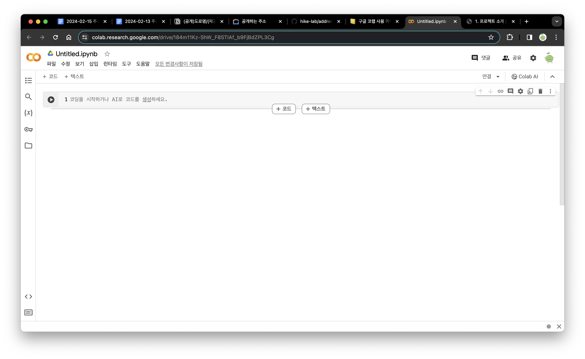
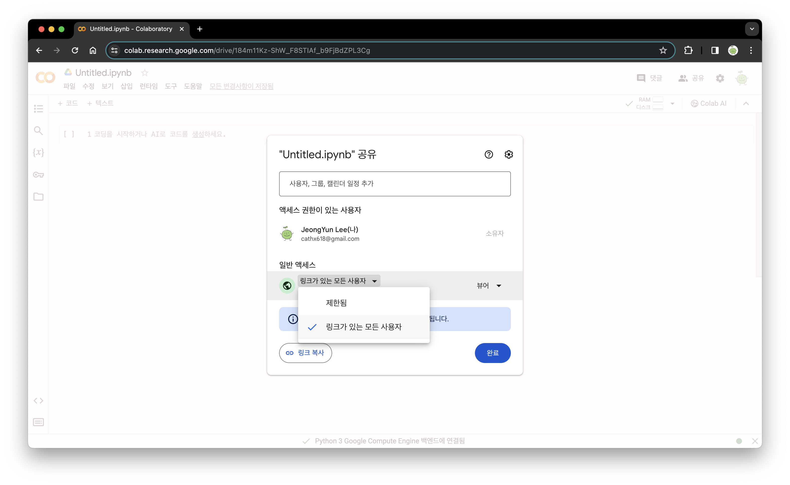

# 3.2 프로젝트 환경 구축하기

코랩은 구글에서 제공하는 머신러닝 교육과 연구를 목적으로 만든 서비스입니다. 파이썬을 따로 설치할 필요 없이 웹 브라우저에서 사용할 수 있으며, 구글의 다른 서비스와 연동성이 높고 여러 사람과의 협업이 용이합니다. 주피터 노트북과 동일한 기능을 가지고 있지만 라이브러리, 프레임워크 등의 설치 방법과 사용에 있어서 약간의 차이가 있습니다.

## Colab(코랩) 시작하기

코랩은 구글 계정이 있어야 사용할 수 있습니다. 구글 로그인을 한 뒤, [colab.research.google.com](https://colab.research.google.com/)에 접속하면 노트에 접근할 수 있습니다. 코랩에 접속하면 새 노트를 생성해야 하거나 기존 노트를 열어야 합니다.
새 노트를 만들려면 좌측 상단의 [파일 > 새노트]를 선택하거나, 새 노트를 만들 수 있는 [+ 새 노트] 버튼을 클릭합니다.
기존 노트를 사용하려면 좌측 상단의 [파일 > 노트 열기]를 선택하여 열고자 하는 노트를 선택하거나 [파일 > 노트 업로드]를 통해 ipynb파일을 업로드하여 사용할 수 있습니다.

교안에서 공유하는 코랩 파일은 수정이 불가능하도록 설정되어 있습니다. 수정을 위해 [파일 > 드라이브에 사본 저장]을 선택하여 복사본을 만들어 사용하시기 바랍니다.

## 코드와 텍스트 작성하기

<figure class="flex flex-col items-center justify-center">
    
    <figcaption style="text-align: center;"></figcaption>
</figure>

새 노트를 생성하면 위와 같은 화면을 볼 수 있습니다. 노트에는 '코드'와 '텍스트'를 작성할 수 있습니다.

(1) 셀 추가하기  
좌측 상단의 [+ 코드] 버튼과 [+ 텍스트] 버튼을 클릭하거나 셀의 중앙 하단부에 커서를 올리면 생성되는 버튼을 클릭하여 셀을 추가할 수 있습니다.

- [+ 코드]: 파이썬 코드를 작성할 수 있는 셀이 생성됩니다.
- [+ 텍스트]: 마크다운 문법을 따르는 텍스트를 작성할 수 있는 셀이 생성됩니다. 코드를 작성하면서 들었던 생각이나 부연설명 등을 적을 수 있습니다.

(2) 셀 실행하기  
작성한 코드를 실행하는 방법은 셀의 왼쪽에 있는 실행 버튼을 클릭하거나, `Shift + Enter`를 누르면 됩니다.

(3) 셀 삭제하기  
셀의 오른쪽에는 코드를 편집할 때 필요한 기능들이 있습니다. 셀을 삭제하려면 셀의 오른쪽 상단에 있는 휴지통 버튼을 클릭하면 됩니다.

(4) 셀 이동하기  
셀을 이동하려면 셀의 왼쪽에 있는 화살표 버튼을 클릭하여 이동할 위치를 선택하면 됩니다. 이동할 셀이 많다면 셀 밖의 배경에서부터 이동할 셀 전체를 드래그를 통해 선택할 뒤 복사해서 붙여넣거나 커서를 이용해 옮기면 됩니다.

## 데이터 불러오기

코랩에 데이터를 불러오는 방법은 다양합니다. 가장 대표적인 방법은 파일을 직접 업로드하거나 구글 드라이브를 연동하는 방법입니다.

(1) 로컬 파일 업로드하기  
로컬 파일을 업로드하려면 코랩의 왼쪽 상단에 위치한 폴더 아이콘을 클릭한 뒤, 첫 번째에 위치한 '파일 업로드' 아이콘을 클릭하면 파일 업로드 창이 생성됩니다. 업로드할 파일을 선택한 뒤 업로드 버튼을 클릭하면 파일이 업로드됩니다.

업로드 방법은 간단하지만 런타임 연결이 끊기면 작업 중이던 데이터가 사라지고, 업로드한 파일도 삭제됩니다. 이 방법은 잠깐 데이터를 확인할 때 사용하시길 추천 드립니다.

(2) 구글 드라이브 연동하기  
구글 드라이브에 저장되어 있는 파일을 사용할 때 구글 드라이브를 연동하여 사용할 수 있습니다. 우선, 화면 왼쪽의 폴더 아이콘을 클릭한 뒤, 세 번째에 위치한 '드라이브 마운트' 아이콘을 클릭하면 엑세스 허용 알림창이 생성됩니다. 이때 'Google Drive에 연결'을 선택한 뒤 잠시 기다리면 폴더 리스트에 'drive'라는 이름의 폴더가 생성됩니다. [drive > MyDrive] 경로에서 원하는 파일을 찾으면 파일 명 오른쪽의 [점 세 개 아이콘 > 경로 복사] 버튼을 클릭하여 파일 경로를 복사한 뒤, 코드 셀에서 사용하면 됩니다.

교안에서 사용하는 데이터는 모두 공유 구글 드라이브 링크를 통해 공유됩니다. 해당 파일을 다운받은 뒤, 로컬 파일 업로드하거나 개인 구글 드라이브에 업로드·연동해서 사용하세요. 

## 공유하기

코랩 파일은 구글 문서와 같이 링크를 통한 공유가 가능합니다. 우측 상단의 [공유] 버튼을 클릭하면 공유 설정 창이 생성됩니다. 공유할 사용자의 이메일 주소를 입력한 뒤, 권한을 설정하거나 일반 엑세스를 '링크가 있는 모든 사용자'로 바꾼뒤 링크를 공유하면 됩니다. 이때 접근자의 권한을 수정, 댓글이 불가능한 '뷰어', 댓글만 작성할 수 있는 '댓글 작성자', 모든 편집이 가능한 '편집자' 중에서 선택할 수 있습니다.

<figure class="flex flex-col items-center justify-center">
    
    <figcaption style="text-align: center;"></figcaption>
</figure>
