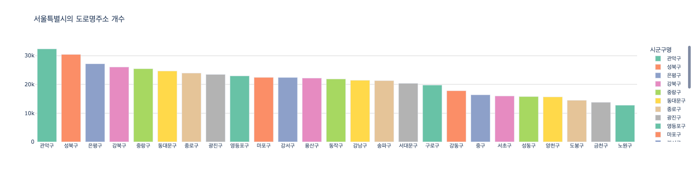

# 2. 도로명주소 데이터 살펴보기(1)

<br>

#### 작성자: 이정윤

첫 번째로 살펴볼 데이터는 공개하는 주소 중 '도로명주소 한글' 데이터입니다. 현재 공개되어 있는 도로명주소의 개수를 행정구역별로 나누어 살펴보고, 간단한 시각화를 진행합니다. 실습은 코랩 환경에서 진행되며, 본 교안에서는 코드에 대한 설명을 진행합니다. 전체 코드와 실행결과는 [코랩 코드](https://colab.research.google.com/drive/184m11Kz-ShW_F8STIAf_b9FjBdZPL3Cg?usp=sharing)에서 확인하세요.

## 데이터 불러오기

실습 데이터는 [주소기반산업지원서비스](https://business.juso.go.kr/addrlink/attrbDBDwld/attrbDBDwldList.do?cPath=99MD&menu=%EB%8F%84%EB%A1%9C%EB%AA%85%EC%A3%BC%EC%86%8C%20%ED%95%9C%EA%B8%80)에서 제공하는 공개하는 주소 중 도로명주소 한글 데이터의 2024년 1월 기준 전체자료 입니다. 데이터는 시도별로 구분되어 txt 파일로 되어 있으며, 각 파일은 "|"로 구분되어 있습니다. 데이터를 처리하기 용이하도록 하나의 파일로 합치고 csv 파일로 저장하는 함수는 다음과 같습니다.

```python
def merged_df(columns, name):
    files = glob.glob("202401_도로명주소 한글_전체분/*.txt")

    total_df = pd.DataFrame()

    for file_name in tqdm(files):
        df = pd.read_csv(file_name, sep = "\|", engine='python', encoding = "cp949", names=columns, dtype = str, keep_default_na=False)
        total_df = pd.concat((total_df, df))

    ## 전체 데이터 저장
    total_df.to_csv(f"total-{name}.csv", index=False, encoding="utf-8")

    return total_df
```

도로명주소 한글 데이터에 대한 활용가이드를 참고하여 데이터의 컬럼을 확인하고 df에 dataframe을 선언합니다.

```python
columns = ["도로명관리번호","법정동코드","시도명","시군구명","읍면동명","리명","산여부","번지","호", \
           "도로명코드","도로명","지하여부","건물본번","건물부번","행정동코드","행정동명","기초구역번호(우편번호)", \
           "이전도로명주소","효력발생일","공동주택구분","이동사유코드","건축물대장건물명","시군구용건물명","비고"]
df = merged_df(columns, "road-name-address_2401")
```

## 데이터 확인하기

```python
df = pd.read_csv('total-road-name-address_2401.csv', encoding='utf-8')
df.head()
```

저장한 데이터를 불러온 뒤, 데이터의 기본 정보를 확인합니다.

```python
print('총 열 수: ', len(df.columns))
print('총 행 수: ', len(df))
print('중복 제거 후 총 행 수', len(df.drop_duplicates()))
```

```python
## null이 있는 컬럼 확인
df.isnull().sum()
```

```python
## 각 컬럼별 유니크 개수 확인
for i in df.columns:
    print(i, len(df[i].unique()))
```

## 행정구역별 도로명주소의 수량

도로명주소는 기본적으로 `시/도 + 시/군/구 + 읍/면 + 도로명 + 건물번호 + 상세주소(동/층/호) + (참고항목)`의 조합으로 생성됩니다. 현재 공개하고 있는 도로명주소의 개수를 시도, 시군구, 시도별 시군구, 읍면동별 순으로 구분하여 하나씩 확인해보고 간단한 시각화를 진행해보겠습니다. 시각화는 파이썬 동적 시각화 툴인 Plotly를 사용합니다.

### (1) 시도별

```python
sido = pd.DataFrame(df.groupby('시도명')["도로명관리번호"].count())
sido = sido.sort_values('도로명관리번호', ascending=False)

# 시각화
graph_viz(sido, "시도별 도로명주소 개수")
```

'시도명' 컬럼을 기준으로 그룹화하여 '도로명관리번호'의 개수를 확인한 뒤, 간단한 시각화를 진행합니다.

<figure class="flex flex-col items-center justify-center">
    
    <figcaption style="text-align: center;"></figcaption>
</figure>
대한민국의 시도는 총 17개입니다. '경기도', '경상북도', '경상남도' 등의 순으로 도로명주소의 개수가 많으며 세종특별자치시의 도로명주소 개수가 가장 적은 것을 확인할 수 있습니다.

### (2) 시군구별

```python
sigungu = pd.DataFrame(df.groupby(['시도명','시군구명'])["도로명관리번호"].count()).reset_index()

sigungu["전체 시군구명"] = sigungu["시도명"] + " " + sigungu["시군구명"]
sigungu.index = sigungu["전체 시군구명"]
sigungu = sigungu.drop(['시도명',"시군구명", "전체 시군구명"], axis=1)

# 상위 20개 시군구만 추출
sigungu_top20 = sigungu.sort_values("도로명관리번호", ascending=False).iloc[:20,:]

# 시각화
graph_viz(sigungu_top20, "시군구별 도로명주소 개수")
```

'시도명' 컬럼과 '시군구명' 컬럼을 합쳐서 '전체 시군구명'이라는 새로운 컬럼을 만든 뒤 해당 컬럼을 기준으로 그룹화하여 간단한 시각화를 진행합니다. 전국의 시군구는 251개 이므로 상위 20개 지역의 개수만 확인하면 다음과 같습니다.

<figure class="flex flex-col items-center justify-center">
    
    <figcaption style="text-align: center;"></figcaption>
</figure>

시군구별 도로명주소는 제주특별자치도 '제주시', '경기도 화성시', '경상북도 경주시' 등의 순으로 많은 것을 확인할 수 있습니다.

### (3) 시도별 시군구별

```python
sido_list = list(df['시도명'].unique())

def sido_sigungu_df(total_df, sido_name):
    df = total_df[total_df["시도명"] == f"{sido_name}"]
    df = pd.DataFrame(df.groupby("시군구명")["도로명관리번호"].count()).sort_values("도로명관리번호", ascending=False)
    return df

# 시각화
for sido in sido_list[1:]:
    each = sido_sigungu_df(df, sido)
    graph_viz(each, f"{sido}의 도로명주소 개수")
```

17개 시도 각각의 시군구별로 도로명주소의 개수를 확인하기 위한 방법입니다. 시도별로 임시 데이터프레임을 만든 뒤, 시군구명으로 다시 그룹화하여 간단한 시각화를 진행합니다.

<figure class="flex flex-col items-center justify-center">
    
    <figcaption style="text-align: center;"></figcaption>
</figure>

세종특별자치도는 시군구에 해당하는 값이 없으므로 제외합니다. 시도 중 서울특별시만 예시로 살펴보면, '관악구', '성북구', '은평구' 등의 순으로 도로명주소의 개수가 많으며 '노원구'의 개수가 가장 적습니다.

### (4) 읍면동별

```python
emd = pd.DataFrame(df.groupby(['시도명','시군구명','읍면동명'])["도로명관리번호"].count()).reset_index()
emd["전체 읍면동명"] = emd["시도명"] + " " + emd["시군구명"] + " " + emd["읍면동명"]

emd.index = emd["전체 읍면동명"]
emd = emd.drop(['시도명',"시군구명", "읍면동명", "전체 읍면동명"], axis=1)

# 상위 20개 읍면동만 추출
emd_top20 = emd.sort_values("도로명관리번호", ascending=False).iloc[:20,:]

# 시각화
graph_viz(emd, "읍면동별 도로명주소 개수")
```

<figure class="flex flex-col items-center justify-center">
    
    <figcaption style="text-align: center;"></figcaption>
</figure>

###
