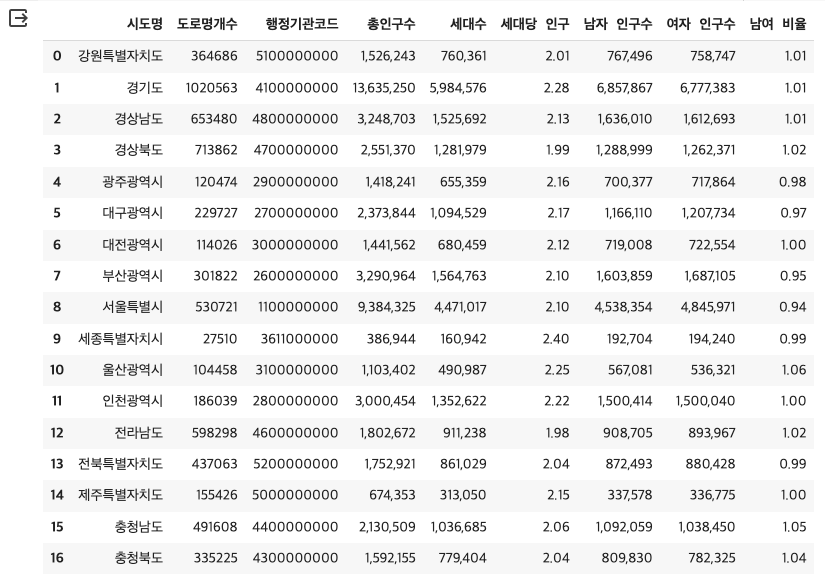
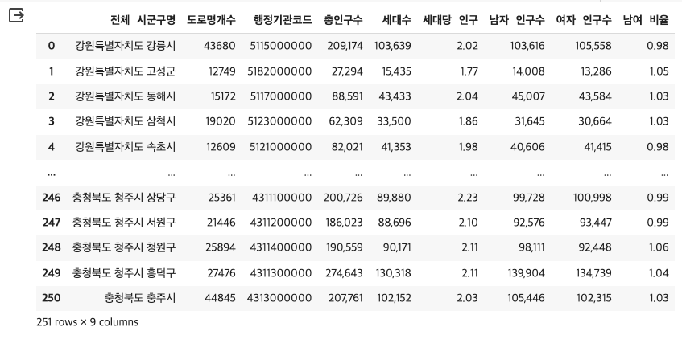

# 3. 도로명주소 데이터 살펴보기(2)

<br>

#### 작성자: 이정윤

<i>[3-2 도로명주소 데이터 살펴보기(1)]()과 연속되는 내용입니다.</i>

이번에는 인구데이터와 면적데이터를 추가로 활용하여 도로명주소 데이터를 살펴보고 지도시각화를 진행합니다. 전체 코드와 실행결과는 [코랩 코드](https://colab.research.google.com/drive/1ESR6gu4l9QlUx8uW8ngBUWd5MO9BUV5u?usp=sharing)에서 확인하세요.

## 인구데이터

우선 인구데이터는 행정안전부에서 제공하는 [행정동별 주민등록 인구 및 세대현황](https://jumin.mois.go.kr/)의 전체시군구현황 데이터를 사용합니다. 데이터는 csv 혹은 xlsx 형식입니다. 데이터를 불러온 뒤 데이터의 형태, 수정이 필요한 부분 확인 등 간단한 전처리를 진행합니다.

```python
df_pop = pd.read_excel('202401_202401_주민등록인구및세대현황_월간.xlsx', header=2)

## 중복 데이터 확인하기
df_pop[df_pop['행정기관'].duplicated(keep=False)]
```

2024년 1월 기준으로 다운받은 데이터에 '세종특별자치시'는 행정기관코드가 다른 동일한 행이 중복으로 기재되어 있습니다. [행정표준코드관리시스템](https://www.code.go.kr/stdcode/regCodeL.do)에서 확인해보면 세종특별자치시의 행정동코드는 '3611000000'이므로 올바르지 않은 행은 삭제합니다.

```python
df_pop = df_pop[df_pop['행정기관코드']!=3600000000]
df_pop.reset_index(inplace=True, drop=True)
```

또한 도로명주소 데이터와 합칠 때 시준이 되는 '행정기관' 컬럼에서 문자열의 앞뒤로 공백이 없도록 strip()을 진행합니다

```python
df_pop['행정기관'] = df_pop['행정기관'].apply(lambda x:x.strip())
```

## 면적데이터

## 인구당, 면적당 도로명주소 개수

### (1) 시도별

인구 당 도로명주소의 개수를 시도별로 확인하기 위해서 시도별 도로명주소 개수를 구한 데이터프레임과 시도별 인구수 데이터프레임을 합쳐줍니다.

```python
## 시도별 도로명주소 개수 데이터프레임
sido = pd.DataFrame(df.groupby('시도명')["도로명관리번호"].count())
sido.reset_index(inplace=True)

## 시도별 인구수 데이터프레임
sido_pop = df_pop[df_pop['행정기관'].isin(list(sido['시도명']))]

## 데이터프레임 합치기
sido_address_pop = pd.merge(sido, sido_pop, left_on='시도명', right_on='행정기관')
sido_address_pop.drop('행정기관', axis=1,  inplace=True)
sido_address_pop.rename(columns={'도로명관리번호':'도로명개수'}, inplace=True)
sido_address_pop
```

이후 시도별 인구당 도로명주소 개수를 계산한 '시도별 인구당 개수' 컬럼을 생성합니다.

```python

```

최종 데이터프레임은 아래와 같습니다.

<figure class="flex flex-col items-center justify-center">
    
    <figcaption style="text-align: center;"></figcaption>
</figure>

### (2) 시군구별

시도별로 진행한 데이터프레임을 합친 작업을 그대로 시군구별로도 진행합니다

```python
## 시군구별 도로명주소 개수 데이터프레임
sigungu = pd.DataFrame(df.groupby(['시도명','시군구명'])["도로명관리번호"].count()).reset_index()
sigungu["전체 시군구명"] = sigungu["시도명"] + " " + sigungu["시군구명"]
sigungu = sigungu.drop(['시도명',"시군구명"], axis=1)

## 시군구별 인구수 데이터프레임
sigungu_pop = df_pop[df_pop['행정기관'].isin(list(sigungu['전체 시군구명']))]

## 데이터프레임 합치기
sigungu_address_pop = pd.merge(sigungu, sigungu_pop, left_on='전체 시군구명', right_on='행정기관')
sigungu_address_pop.drop('행정기관', axis=1,  inplace=True)
sigungu_address_pop.rename(columns={'도로명관리번호':'도로명개수'}, inplace=True)
sigungu_address_pop
```

이후 시군구별 인구당 도로명주소 개수를 계산한 '시군구별 인구당 개수' 컬럼을 생성합니다.

```python

```

최종 데이터프레임은 아래와 같습니다.

<figure class="flex flex-col items-center justify-center">
    
    <figcaption style="text-align: center;"></figcaption>
</figure>

## 시각화
