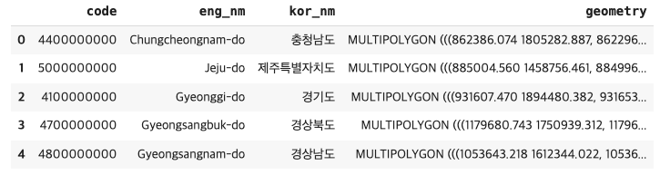

# 3. 도로명주소 데이터 살펴보기(2)

<br>

#### 작성자: 이정윤

<i>[3-2 도로명주소 데이터 살펴보기(1)](../chapter-3/chapter-3-2.md)과 연속되는 내용입니다.</i>

이번에는 인구데이터와 면적데이터를 추가로 활용하여 도로명주소 데이터를 살펴보고 지도시각화를 진행합니다. 전체 코드와 실행결과는 [코랩 코드](https://colab.research.google.com/drive/1ESR6gu4l9QlUx8uW8ngBUWd5MO9BUV5u?usp=sharing)에서 확인하세요.

<figure class="flex flex-col items-center justify-center">
    
    <figcaption style="text-align: center;"></figcaption>
</figure>

시작하기 앞서, 이번장에서 진행하는 지도시각화 툴인 mapbox를 사용하기 위해선 token이 있어야 합니다. [mapbox.com](https://www.mapbox.com/)으로 들어가서 회원가입을 한 뒤, Account로 들어가면 위와 같은 화면을 볼 수 있습니다. mapbox는 일정 사용량까지는 무료이고, 한도를 넘으면 과금이 되므로 각자 billing을 확인하면서 사용하면 됩니다. python에서 mapbox를 사용할 때 입력해줘야 하는 token은 화면 하단의 'Default public token'에 나와 있습니다. 복사해서 아래 지도 시각화를 진행하는 부분에서 사용하면 됩니다.

## 인구데이터

인구데이터는 행정안전부에서 제공하는 [행정동별 주민등록 인구 및 세대현황](https://jumin.mois.go.kr/)의 전체시군구현황 데이터를 사용합니다. 데이터는 csv 혹은 xlsx 형식입니다. 데이터를 불러온 뒤 데이터의 형태, 수정이 필요한 부분 확인 등 간단한 전처리를 진행합니다.

```python
df_pop = pd.read_excel('202401_202401_주민등록인구및세대현황_월간.xlsx', header=2)

## 중복 데이터 확인하기
df_pop[df_pop['행정기관'].duplicated(keep=False)]
```

2024년 1월 기준으로 다운받은 데이터에 '세종특별자치시'는 행정기관코드가 다른 동일한 행이 중복으로 기재되어 있습니다. [행정표준코드관리시스템](https://www.code.go.kr/stdcode/regCodeL.do)에서 확인해보면 세종특별자치시의 행정동코드는 '3611000000'이므로 올바르지 않은 행은 삭제합니다.

```python
df_pop = df_pop[df_pop['행정기관코드']!=3600000000]
df_pop.reset_index(inplace=True, drop=True)
```

정리한 최종 인구데이터는 다음과 같습니다.

<figure class="flex flex-col items-center justify-center">
    
    <figcaption style="text-align: center;"></figcaption>
</figure>

## 면적데이터

면적데이터는 주소기반산업지원서비스에서 제공하는 제공하는 주소 중 [구역의 도형](https://business.juso.go.kr/addrlink/elctrnMapProvd/geoDBDwldList.do?menu=%EA%B5%AC%EC%97%AD%EC%9D%98%20%EB%8F%84%ED%98%95) 2024년 1월 전체자료입니다. 제공하는 주소는 신청서를 작성한 뒤 데이터를 제공받을 수 있습니다. 사이트에서 신청하여 받거나, 구글 드라이브에 저장된 'geojson' 폴더를 다운받아 사용하세요.

```python
sido_file_list = glob.glob('geojson/*/*_CTPRVN.shp')

sido_geojson = pd.DataFrame()

for file in tqdm(sido_file_list):
    df_tmp = gpd.read_file(file, encoding="cp949")
    sido_geojson = pd.concat([sido_geojson, df_tmp])

sido_geojson.columns = ["code", "eng_nm", "kor_nm", "geometry"]
sido_geojson["code"] = sido_geojson["code"].apply(lambda x: str(x) + "00000000")
sido_geojson.reset_index(inplace=True, drop=True)

print(sido_geojson.shape)
sido_geojson.head()
```

제공되는 데이터는 shp 형식입니다. shp 파일을 geopandas를 통해 읽어오고, 데이터프레임으로 정의합니다. 이후 컬럼명을 부여하고 코드는 행정동코드와 같은 형식이 되도록 수정해줍니다. 데이터프레임으로 정리한 시도 면적데이터 예시는 다음과 같습니다.

<figure class="flex flex-col items-center justify-center">
    
    <figcaption style="text-align: center;"></figcaption>
</figure>

시군구 데이터도 동일한 방법으로 진행합니다. 세종특별자치시의 경우 시군구가 없으므로 '세종특별자치시'하나의 행을 포함하고 있습니다.

## 인구당, 면적당 도로명주소 개수

인구 당 도로명주소의 개수를 시도별로 확인하기 위해서 시도별 도로명주소 개수, 인구수, 면적데이터를 하나의 데이터프레임으로 합쳐야 합니다. 세 데이터는 각각의 데이터프레임에 저장되어 있으므로 다음과 같은 순서로 진행하겠습니다. 시군구별 데이터와 이와 동일한 과정으로 진행합니다.

1.  도로명주소 개수와 인구수를 '행정구역명' 기준으로 합치기
2.  1에서 합친 df와 면적데이터를 '행정동코드' 기준으로 합치기
3.  경계 데이터를 활용해 '면적'을 계산하고 '인구당 도로명주소 개수', '면적당 도로명주소 개수' 계산하기

### (1) 데이터 프레임 합치기

```python
## 시도별 도로명주소 개수
sido = pd.DataFrame(df.groupby('시도명')["도로명관리번호"].count())
sido.reset_index(inplace=True)

## 시도별 인구수
df_pop['행정기관'] = df_pop['행정기관'].apply(lambda x:x.strip())
sido_pop = df_pop[df_pop['행정기관'].isin(list(sido['시도명']))].copy()

## 시도별 면적 (위에서 정의함)
# sido_geojson
```

합치기 위한 도로명주소 개수와 인구수 데이터프레임을 각각의 변수로 정의합니다.

```python
## 시도명, 행정기관 컬럼 -> 좌우 공백 없애기
sido['시도명'] = sido['시도명'].apply(lambda x:x.strip())
sido_pop['행정기관'] = sido_pop['행정기관'].apply(lambda x:x.strip())

## 행정기관코드, code -> string으로 바꾸기
sido_pop['행정기관코드'] = sido_pop['행정기관코드'].astype('str')
sido_geojson['code'] = sido_geojson['code'].astype('str')

## '도로명관리번호', '총인구수' -> int로 타입 바꾸기
sido['도로명관리번호'] = sido['도로명관리번호'].astype(int)
sido_pop['총인구수'] = sido_pop['총인구수'].str.replace(',', '').astype(int)
```

데이터프레임을 합칠 때 기준이 되는 컬럼들은 동일한 값을 인식할 수 있도록 좌우 공백을 없애고, 데이터 타입을 동일하게 수정합니다. 계산을 해줘야 하는 '도로명관리번호' (도로명주소 개수) 컬럼과 '총인구수' 컬럼은 int로 바꿔줍니다.

```python
## 시도별 도로명주소개수, 인구수, 면적데이터 합치기
sido_address_pop = pd.merge(sido, sido_pop, left_on='시도명', right_on='행정기관')
sido_total = sido_address_pop.merge(sido_geojson, left_on='행정기관코드', right_on='code', how='outer')

## 컬럼 정리하기
sido_total.drop(['행정기관', 'code', 'kor_nm'], axis=1,  inplace=True)
sido_total.rename(columns={'도로명관리번호':'도로명개수', 'eng_nm':'영문시도명', 'geometry':'면적'}, inplace=True)
sido_total = sido_total[['시도명', '영문시도명', '행정기관코드', '도로명개수', '총인구수', '세대수', '세대당 인구', '남자 인구수', '여자 인구수', '남여 비율', '면적']]
```

최종적으로 세 개의 데이터프레임을 합치고, 컬럼을 정리합니다.

### (2) 면적 데이터 구하고 인구당, 면적당 계산하기

```python
gdf_sido = gpd.GeoDataFrame(sido_total)

## 면적 계산
gdf_sido = gdf_sido.set_crs(epsg=5179, allow_override=True)
gdf_sido["면적"] = gdf_sido["geometry"].area
```

최종 데이터프레임을 geoDataFrame으로 변환합니다.

```python
## 인구대비, 면적대비 도로명주소 개수 계산
gdf_sido["인구 대비 도로명주소 개수"] = gdf_sido.apply(lambda row: row["도로명개수"] / row["총인구수"], axis=1)
gdf_sido["면적 대비 도로명주소 개수"] = gdf_sido.apply(lambda row: row["도로명개수"] / row["면적"], axis=1)

# 좌표계 변환
gdf_sido = gdf_sido.to_crs(epsg=4326)
```

## 지도 시각화