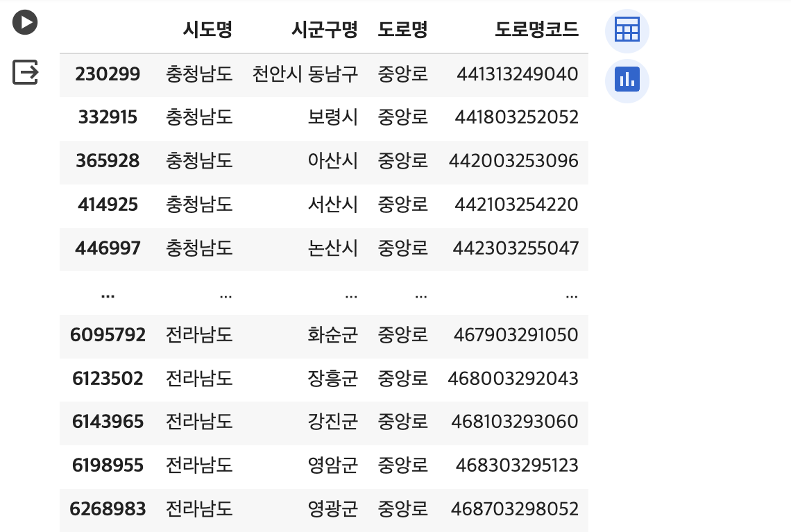

# 3.3 도로명주소 데이터 EDA


첫 번째 실습은 '도로명주소 한글' 데이터를 통해 도로명주소의 개수를 행정구역별로 나누어 살펴보고, 간단한 시각화를 진행하는 것 입니다. 실습은 코랩 환경에서 진행되며, 본 교안에서는 주요 코드에 대한 설명을 진행합니다. 이 장에서 사용되는 데이터는 [구글 드라이브](https://drive.google.com/file/d/1pARe-TAxp0VFniVmovi1mtG0SKel8PDc/view?usp=sharing)에서 다운로드 받을 수 있고, 코드 원본은 [깃헙](https://colab.research.google.com/drive/184m11Kz-ShW_F8STIAf_b9FjBdZPL3Cg?usp=sharing)에서 확인할 수 있습니다.

## 데이터 불러오기

실습 데이터는 [주소기반산업지원서비스](https://business.juso.go.kr/addrlink/attrbDBDwld/attrbDBDwldList.do?cPath=99MD&menu=%EB%8F%84%EB%A1%9C%EB%AA%85%EC%A3%BC%EC%86%8C%20%ED%95%9C%EA%B8%80)에서 제공하는 공개하는 주소 중 '도로명주소 한글' 데이터의 2024년 1월 기준 전체자료 입니다. 데이터는 시도별로 구분되어 txt 파일로 되어 있으며, 각 데이터는 "|"로 구분되어 있습니다. 데이터를 처리하기 용이하도록 하나의 파일로 합치고 csv 파일로 저장하는 함수는 다음과 같습니다.

```python
def merged_df(columns, name):
    files = glob.glob("202401_도로명주소 한글_전체분/*.txt")

    total_df = pd.DataFrame()

    for file_name in tqdm(files):
        df = pd.read_csv(file_name, sep = "\|", engine='python', encoding = "cp949", names=columns, dtype = str, keep_default_na=False)
        total_df = pd.concat((total_df, df))

    # 전체 데이터 저장
    total_df.to_csv(f"total-{name}.csv", index=False, encoding="utf-8")

    return total_df
```

도로명주소 한글 데이터에 대한 활용가이드를 참고하여 데이터의 컬럼을 확인하고 df에 dataframe을 선언합니다.

```python
columns = ["도로명주소관리번호","법정동코드","시도명","시군구명","법정법정읍면동명","법정리명","산여부","지번본번(번지)","지번부번(호)", \
           "도로명코드","도로명","지하여부","건물본번","건물부번","행정동코드","행정동명","기초구역번호(우편번호)", \
           "이전도로명주소","효력발생일","공동주택구분","이동사유코드","건축물대장건물명","시군구용건물명","비고"]

df = merged_df(columns, "road-name-address_2401")
```

::: details 저장한 결과 보기

<figure class="flex flex-col items-center justify-center">
    
    <figcaption style="text-align: center;"></figcaption>
</figure>
:::

```python
print('총 열 수: ', len(df.columns))
print('총 행 수: ', len(df))
print('중복 제거 후 총 행 수', len(df.drop_duplicates()))
```

저장한 데이터의 데이터의 기본 정보를 확인합니다. 총 24개의 열과 6384988개의 행이 있으며, 중복행은 존재하지 않습니다.

```python
# null이 있는 컬럼 확인
df.isnull().sum()
```

```python
# 각 컬럼별 유니크 개수 확인
for i in df.columns:
    print(i, len(df[i].unique()))
```

비어 있는 행을 확인하고, 각 컬럼별로 고유한 값의 개수를 살펴봅니다. '도로명주소관리번호'의 경우, 고유값은 전체 행 수와 동일한 6,384,988개입니다. 다시 말해, 도로명주소 데이터는 도로명주소관리번호를 기준으로 분석할 수 있음을 나타냅니다.

## 분석1. 행정구역 기준 도로명주소 개수

도로명주소는 기본적으로 `시/도 + 시/군/구 + 읍/면 + 도로명 + 건물번호 + 상세주소(동/층/호) + (참고항목)`의 조합으로 생성됩니다. 현재 공개하고 있는 도로명주소의 개수를 시도, 시군구, 시도별 시군구, 읍면동별 순으로 구분하여 하나씩 확인해보고 간단한 시각화를 진행해보겠습니다. 시각화는 파이썬 동적 시각화 툴인 [Plotly](https://plotly.com/python/)를 사용합니다.

### 시도별

```python
sido = pd.DataFrame(df.groupby('시도명')["도로명관리번호"].count())
sido = sido.sort_values('도로명관리번호', ascending=False)

# 시각화
graph_viz(sido, "시도별 도로명주소 개수")
```

'시도명' 컬럼을 기준으로 그룹화하여 '도로명관리번호'의 개수를 확인한 뒤, 간단한 시각화를 진행합니다.

<embed src="/docs/3-3-sido-count.html" width="100%" height="450px"></embed>

대한민국의 시도는 총 17개입니다. '경기도', '경상북도', '경상남도' 등의 순으로 도로명주소의 개수가 많으며 세종특별자치시의 도로명주소 개수가 가장 적은 것을 확인할 수 있습니다.

### 시군구별

```python
sigungu = pd.DataFrame(df.groupby(['시도명','시군구명'])["도로명관리번호"].count()).reset_index()

sigungu["전체 시군구명"] = sigungu["시도명"] + " " + sigungu["시군구명"]
sigungu.index = sigungu["전체 시군구명"]
sigungu = sigungu.drop(['시도명',"시군구명", "전체 시군구명"], axis=1)

# 상위 10개 시군구만 추출
sigungu_top10 = sigungu.sort_values("도로명관리번호", ascending=False).iloc[:10,:]

# 시각화
graph_viz(sigungu_top10, "시군구별 도로명주소 개수")
```

'시도명' 컬럼과 '시군구명' 컬럼을 합쳐서 '전체 시군구명'이라는 새로운 컬럼을 만든 뒤 해당 컬럼을 기준으로 그룹화하여 간단한 시각화를 진행합니다. 전국의 시군구는 251개 이며 상위 10개 지역의 개수만 확인하면 다음과 같습니다.

<embed src="/docs/3-3-sigungu-count.html" width="100%" height="450px"></embed>

시군구별 도로명주소는 '제주특별자치도 제주시', '경기도 화성시', '경상북도 경주시' 등의 순으로 많은 것을 확인할 수 있습니다.

### 시도별 시군구별

```python
sido_list = list(df['시도명'].unique())

def sido_sigungu_df(total_df, sido_name):
    df = total_df[total_df["시도명"] == f"{sido_name}"]
    df = pd.DataFrame(df.groupby("시군구명")["도로명관리번호"].count()).sort_values("도로명관리번호", ascending=False)
    return df

# 세종시는 시군구가 없으므로 제외함
sido_list.remove('세종특별자치시')

for sido in sido_list:
    each = sido_sigungu_df(df, sido)
    print(len(each))
    graph_viz(each, f"{sido}의 도로명주소 개수")
```

17개 시도 각각의 시군구별로 도로명주소의 개수를 확인하는 법입니다. 시도별로 임시 데이터프레임을 만든 뒤, 시군구명으로 다시 그룹화하여 간단한 시각화를 진행합니다. 세종특별자치도는 시군구에 해당하는 값이 없으므로 제외합니다.

<embed src="/docs/3-3-seoul-sido-sigungu-count.html" width="100%" height="450px"></embed>

시도 중 서울특별시만 예시로 살펴보면, 총 개의 25개의 시군구가 있으며 '관악구', '성북구', '은평구' 등의 순으로 도로명주소의 개수가 많고 '노원구'의 개수가 가장 적습니다.

### 읍면동별

```python
emd = pd.DataFrame(df.groupby(['시도명','시군구명','읍면동명'])["도로명관리번호"].count()).reset_index()
emd["전체 읍면동명"] = emd["시도명"] + " " + emd["시군구명"] + " " + emd["읍면동명"]

emd.index = emd["전체 읍면동명"]
emd = emd.drop(['시도명',"시군구명", "읍면동명", "전체 읍면동명"], axis=1)

# 상위 10개 읍면동만 추출
emd_top10 = emd.sort_values("도로명관리번호", ascending=False).iloc[:10,:]

# 시각화
graph_viz(emd_top10, "읍면동별 도로명주소 개수")
```
읍면동이 존재하는 행정구역 중 도로명주소가 가장 많은 읍면동을 확인합니다. 시도명, 시군구명, 읍면동명을 합친 '전체 읍면동명'이라는 새로운 컬럼을 생성하고 상위 10개 읍면동의 도로명주소 개수를 확인합니다. 

<embed src="/docs/3-3-emb-count.html" width="100%" height="450px"></embed>

총 5017개의 읍면동이 있으며, 읍면동별 도로명주소의 개수는 '서울특별시 관악구 신림동', '대구광역시 남구 대명동', '제주특별자치도 제주시 애월읍' 등의 순으로 많은 것을 확인할 수 있습니다.

## 분석2. 도로명 기준 도로명주소 개수

'세종대로'라는 도로명에는 세종대로 159, 세종대로 161, 세종대로 163 등 건물번호에 따른 여러개의 도로명주소가 부여되어 있습니다. 이러한 도로명주소의 개수를 고유번호인 '도로명주소관리번호'를 기준으로 하나의 도로명 당 몇 개의 도로명주소가 부여되어 있는지 확인해보겠습니다.

이때 서로 다른 도로이지만 동일한 '도로명'이 부여되었을 가능성이 있기 때문에 '도로명' 텍스트가 모두 고유한 값인지를 먼저 확인해야 합니다. 

```python
pd.DataFrame(df[['시도명', '시군구명', '도로명','도로명코드']].drop_duplicates(keep='first').groupby('도로명')['도로명코드'].count()).sort_values(by='도로명코드', ascending=False)
```

위 코드는 해당 분석에서 필요한 컬럼인 '시도명', '시군구명', '도로명', '도로명코드'만 남긴 뒤, 중복으로 인한 행을 제거합니다. 이후 '도로명'을 기준으로 그룹화하여 '도로명코드'의 개수를 확인합니다. 이를 내림차순으로 정렬하면, '중앙로'에는 93개의 상이한 도로명코드가 부여되어 있고 '신촌길'에는 50개의 상이한 도로명코드가 부여되어 있는 것을 확인할 수 있습니다.

<figure class="flex flex-col items-center justify-center">
    
    <figcaption style="text-align: center;"></figcaption>
</figure>

도로명코드가 가장 많이 부여된 '중앙로'가 전국에 어느 곳에 있는 지 살펴보면, 충남 천안, 보령에도 있고 전남 화순, 장흥에도 있습니다. 따라서 '도로명'만으로는 도로를 구분할 수 없으며, 고유한 값인 '도로명코드'로 구분해야 한다는 것을 알 수 있습니다.

도로명코드는 시군구코드(5자리) + 도로명번호(7자리)로 구성된 코드로, 하나의 도로에는 하나의 도로명코드가 부여됩니다. 예를들어, 중앙로가 서울에도 있고 부산에도 있을 때, 이 둘을 구분할 수 있는 코드가 바로 도로명코드인 것입니다. 도로명코드가 도로명의 고유한 코드 역할을 제대로 하고 있는 지는 다음 장에서 자세히 살펴보도록 하겠습니다.

```python
most_count_roadName = pd.DataFrame(df.groupby(['시도명', '시군구명', '도로명','도로명코드'])['도로명주소관리번호'].count()).reset_index().sort_values(by='도로명주소관리번호', ascending=False)
most_count_roadName
```

이제 본 목적이었던 하나의 도로명 당 부여되어 있는 도로명주소의 개수를 세어보겠습니다. 도로명의 기준은 '도로명코드'이며 도로명주소의 기준은 '도로명주소관리번호'입니다. 이를 기준으로 그룹화하여 개수를 확인한 뒤, 내림차순으로 정렬한 결과의 상위 10개만 시각화하면 다음과 같습니다.

<embed src="/docs/3-3-road-per-address-count.html" width="100%" height="450px"></embed>

부여된 도로명주소가 가장 많은 도로명은 '강원특별자치도 원주시 치악로'이고 '경기도 포천시 호국로', '제주특별자치도 서귀초시 중산간동로' 순으로 많은 도로명주소가 부여되었습니다.
