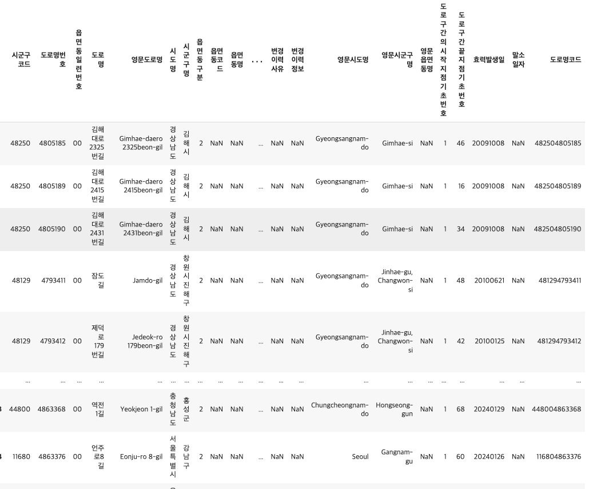
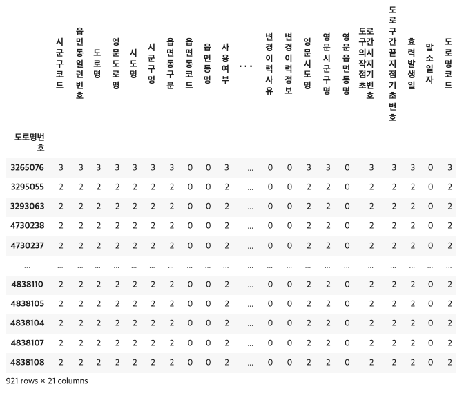
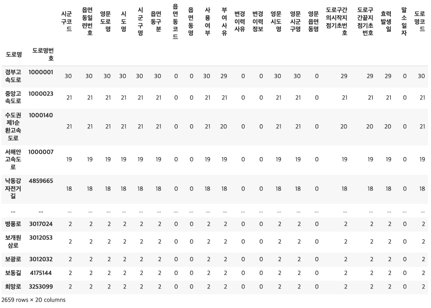
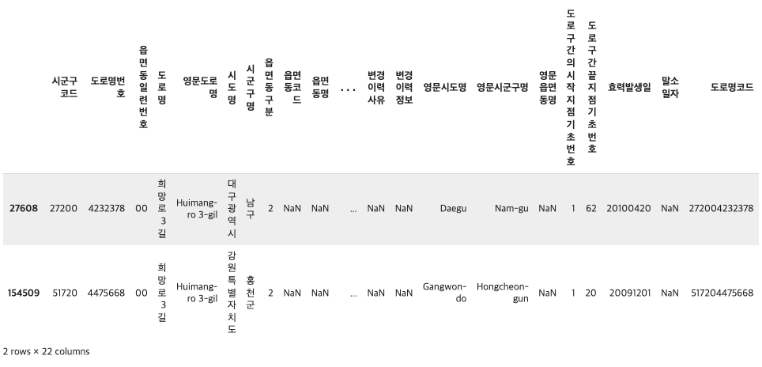

# 3.4 도로명 데이터 EDA


두 번째로 다룰 내용은 '도로명' 데이터를 통해 현재 공개되어 있는 도로명의 개수를 도로유형별, 행정구역별로 나누어 살펴보고, 간단한 시각화를 진행합니다. 실습은 [코랩](https://drive.google.com/file/d/1M9pli0hbwgpAGWNjP316MWUoktvKaY-0/view?usp=sharing) 환경에서 진행되며, 이 장에서 사용되는 데이터와 코드 원본은 [깃헙](https://github.com/hike-lab/address-data-guide/tree/main/chapter-3/chapter3-4)에서 확인할 수 있습니다. 

## 데이터 불러오기

실습 데이터는 [주소기반산업지원서비스](https://business.juso.go.kr/addrlink/attrbDBDwld/attrbDBDwldList.do?cPath=99MD&menu=%EB%8F%84%EB%A1%9C%EB%AA%85)에서 제공하는 공개하는 주소 중 '도로명' 데이터의 2024년 1월 기준 전체자료 입니다. 데이터는 txt 파일로 되어 있으며, 각 데이터는 "\\|"로 구분되어 있습니다. 데이터를 처리하기 용이하도록 활용가이드에서 확인한 컬럼명을 붙이고, csv 파일로 저장합니다.

```python
path = r"TN_SPRD_RDNM.txt"

## 활용가이드에서 확인한 컬럼명 붙여주기
col = ['시군구코드', '도로명번호', '읍면동일련번호', '도로명', '영문도로명', '시도명', '시군구명',
          '읍면동구분', '읍면동코드', '읍면동명', '사용여부', '부여사유',
          '변경이력사유', '변경이력정보', '영문시도명', '영문시군구명', '영문읍면동명',
          '도로구간의시작지점기초번호', '도로구간끝지점기초번호', '효력발생일', '말소일자']

df = pd.read_csv(path, sep='\|', names = col, engine='python', encoding='cp949', dtype=
str, keep_default_na=False, header = None)

## csv로 저장하기
df.to_csv('/content/drive/MyDrive/HIKE(연구실, 대학원)/2024/주소/address-data-guide/total-road-name_2401.csv', index=False, encoding="utf-8")
```

```python
print('총 열 수: ', len(df.columns))
print('총 행 수: ', len(df))
print('중복 제거 후 총 행 수', len(df.drop_duplicates()))
```

저장한 데이터를 불러온 뒤, 앞서 도로명주소 데이터와 동일하게 기본 정보를 확인합니다. 총 21개의 열과 366,345개의 행으로 구성되어 있습니다.

```python
## null이 있는 컬럼 확인
df.isnull().sum()
```

```python
## 각 컬럼별 유니크 개수 확인
for i in df.columns:
    print(i, len(df[i].unique()))
```

현재 데이터를 살펴보면, 개별 도로명을 구분할 수 있는 '도로명코드'컬럼이 없습니다. 도로명코드를 '시군구코드+도로명번호'를 통해서 생성한뒤, 고유한 도로명의 개수와 현재 데이터의 전체 행수를 비교해보겠습니다.

```python
## 개별 도로명을 구분할 수 있는 고유값 생성하기
df['도로명코드'] = df.apply(lambda x: f"{x['시군구코드']}{x['도로명번호']}", axis=1)
print(len(df['도로명코드'].unique()))
print(len(df))
```

고유한 도로명코드의 개수는 171,728개이고, 전체 행수는 366,364개입니다. 이 이유는 도로명코드(시군구코드+도로명번호)가 동일한데, **여러 개의 읍면동을 지나는 경우 다른 행으로 분리해서 기입되어 있기 때문입니다.**

```python
pd.DataFrame(df.groupby(['도로명', '도로명코드'])['읍면동코드'].count()).sort_values(by='읍면동코드', ascending=False)
```

도로명 당 몇 개의 읍면동이 지나는 지 확인하기 위해 groupby를 실시하면 퇴계로, 3·15대로, 국채보상로, 제물량로 등 순으로 읍면동을 가장 많이 지납니다. 퇴계로의 서울특별시 중구에 위치하며 남창동, 홍인동, 황학동, 충무로1가 등 28개의 읍면동을 지납니다.

## 데이터 정제하기

여러 개의 읍면동을 지나는 경우 '읍면동일련번호'컬럼에서 '00', '01', '02' 등으로 표시하고 있습니다. 읍면동일련번호가 '00'인 경우가 주도로이므로 이 도로만 남기고 정리해줍니다.

```python
df = df.loc[df['읍면동일련번호']=='00']
df.reset_index(inplace=True, drop=True)
print(len(df['도로명코드'].unique()))
print(len(df))
```

최종 행 수와 도로명코드의 고유값의 개수가 171,728로 동일하게 정제되었습니다.

::: details 정제한 결과 보기

<figure class="flex flex-col items-center justify-center">
    
    <figcaption style="text-align: center;"></figcaption>
</figure>
:::

## 분석1. 중복 도로명 개수

동일한 도로명이 전국의 여러 도로에 부여되고 있다는 것을 앞서 3.3의 분석2에서 확인하였습니다. 이 이유는 도로명이 각 지자체에서 개별적으로 부여하기 때문입니다. 중복으로 부여된 도로명의 현황을 다시 한 번 확인하고 시각화를 진행해보겠습니다.  코드는 도로명 당 부여된 도로명코드의 개수를 groupby를 통해 확인하고, 2개 이상 사용된 도로명만 남기는 순으로 작성합니다. 

```python
dup_roadName = pd.DataFrame(df.groupby('도로명')['도로명코드'].count()).sort_values(by='도로명코드', ascending=False)
dup_roadName.loc[dup_roadName['도로명코드']>1]
dup_roadName.head(20)
```

<embed src="/docs/3-4-dup-road-name.html" width="100%" height="420px"></embed>

전체 도로명 141,435개 중 약 9.23%인 13063개가 중복되어 사용되고 있고, 가장 많이 중복 부여된 도로명은 '중앙로'입니다. 그런데, 중복 도로명 중에 '경부고속도로'가 보입니다. 경부고속도로가 2개일 수는 없는데, 왜 복수의 도로명코드가 부여되었는지 확인해보겠습니다.
|도로명코드|도로명|시도명|시군구명|...중략...|
|:---:|:---:|:---:|:---:|:---:|
|414631000001|경부고속도로|경기도|용인시 기흥구|...|
|411311000001|경부고속도로|경기도|성남시 수정구|...|
|116501000001|경부고속도로|서울특별시|서초구|...|
|301101000001|경부고속도로|대전광역시|동구|...|
|317101000001|경부고속도로|울산광역시|울주군|...|
|483301000001|경부고속도로|경상남도|양산시|...|
|264101000001|경부고속도로|부산광역시|금정구|...|

위 표는 도로명이 '경부고속도로인' 행의 일부 예시입니다. 동일한 도로명이라도 시도명이 모두 다르며, 도로명코드가 상이합니다. 정리하면, 고속도로의 경우 동일한 도로라도 시도, 시군구에 걸쳐서 존재하기 때문에 도로명코드가 상이하게 부여된다는 것입니다. (도로명코드의 앞부분 5자리는 시군구코드이므로) 따라서 향후 고속도로의 개수를 확인하거나, 도로명의 고유한 개수만 파악하고 싶을 때 '고속도로'의 예외를 유의해야 합니다. 

## 분석2. 도로유형별 도로명의 개수

[도로명주소법 시행렬 제3조 1항](https://www.law.go.kr/%EB%B2%95%EB%A0%B9/%EB%8F%84%EB%A1%9C%EB%AA%85%EC%A3%BC%EC%86%8C%EB%B2%95%EC%8B%9C%ED%96%89%EB%A0%B9)에 따르면 도로는 유형벌로 '고속도로', '대로', '로', '길'로 구분합니다. 이에 따라 도로명을 도로유형별로 분리하여 개수를 확인하고, 유형별 개수 비교를 하는 시각화를 진행하겠습니다.

### 고속도로

```python
df_gsdr = df[df["도로명"].str.endswith("고속도로")]
print(len(pd.DataFrame(df_gsdr.groupby(['도로명'])['도로명코드'].count()).sort_values(by='도로명코드', ascending=False)))
```

'고속도로'라는 단어로 끝다는 도로명은 총 373개입니다. 이 중에는 앞서 언급한 여러 시도시군구에 걸쳐 있어서 다른 행으로 기입된 케이스가 있으므로 고유한 고속도로의 개수만 확인하면 50개 입니다. 

### 대로

```python
df_dr = df[df["도로명"].str.endswith("대로")]
df_dr
```

'대로'라는 단어로 끝나는 도로명은 총 748개가 있습니다.

### 로

```python
gsdril = list(df_gsdr.index) #고속도로에 해당하는 데이터의 인덱스를 리스트로
dril = list(df_dr.index) #대로에 해당하는 데이터의 인덱스를 리스트로
il = gsdril + dril #고속도로와 대로에 해당하는 데이터의 인덱스가 담긴 리스트

df_ro = df[df["도로명"].str.endswith("로")]
df_ro = df_ro.drop(il) #'로'로 끝나는 데이터 중 고속도로와 대로에 해당하는 데이터를 제외
df_ro
```

'로'는 '고가대로', '대로'에 모두 포함되므로, 두 유형에 포함되지 않는 행 중에서 '로'가 포함되는 행을 추출합니다. '로' 로 끝나는 도로명은 총 18,746개가 있습니다.

### 길

```python
df_gil = df[df["도로명"].str.endswith("길")]
df_gil
```

'길'로 끝나는 도로명은 총 152,169개가 있습니다.

### 기타

```python
filtered_rows = df[~df.isin(df_dr.to_dict(orient='list')).all(axis=1) &
                   ~df.isin(df_gsdr.to_dict(orient='list')).all(axis=1) &
                   ~df.isin(df_ro.to_dict(orient='list')).all(axis=1) &
                   ~df.isin(df_gil.to_dict(orient='list')).all(axis=1)]

filtered_rows
```

'고속도로', '대로', '로', '길'에 해당하지 않는 유형의 도로명은 15개가 있습니다. 기타 유형에는 '젊음의 거리', '먹자거리', '소양강자전거길좌안'. '공지천자전거길우안' 등이 있습니다.

```python
# 중복 고속도로 제외
df_gsdr = df_gsdr.drop_duplicates(subset=['도로명번호', '도로명'], keep='first').copy()
len(df_gsdr)

df_type_total = pd.DataFrame({ '유형' : ['고속도로', '대로', '길', '로', '기타'],
                               '개수' : [len(df_gsdr), len(df_dr), len(df_gil), len(df_ro), len(etc)]})

df_type_total.index = df_type_total['유형']
df_type_total.drop(columns="유형", inplace=True)
df_type_total
```

고속도로의 경우 중복으로 기재되어 있는 값들을 제거하고 최종적으로 모든 유형의 도로명 개수는 시각화하면 다음과 같습니다.

<embed src="/docs/3-4-road-name-type.html" width="100%" height="450px"></embed>

'길'이 88.8%로 가장 많고 그 다음으로 '로'가 10.7%, '대로'가 0.436%, '고속도로'가 0.0292%로 나타납니다.

그러나, 이 분석은 한계가 있습니다. 도로명 데이터에는 도로의 유형을 구분하는 코드가 없으므로 '고속도로', '대로', '로', '길'과 같은 텍스트를 추출하여 도로명 개수를 확인했는데 예를 들어, '남대로'라는 도로명이 있다면 '남대+로'인지, '남+대로'인지를 명확히 구분할 수 없기 때문입니다. 도로명 유형을 더 정확하게 확인하려면 공개하는 도로 중 '도로명이 부여된 도로 도형' 데이터에서 제공하는 '도로의 유형 코드'를 활용해야 합니다. 

## 분석3. 도로명 식별의 한계점

도로명과 관련된 값은 '도로명', '도로명번호', '도로명코드' 세 가지 종류가 있습니다. 이번에는 도로명을 식별하기 위해서 사용해야 하는 값이 무엇인지, 세 종류의 도로명과 관련된 값이 어떤 관계로 구성되어 있으며, 도로명 식별의 한계점이 무엇인 지에 대하여 알아보겠습니다.

### 도로명은 고유한가?

첫 번째로 확인할 점은 '도로명'이 고유값인지 입니다. 앞서 '중앙로'와 같은 중복 도로가 전국에 여러 개 있음을 확인했듯이, 도로명은 고유하지 않습니다. 따라서 도로명 데이터를 분석할 때, '도로명'값을 사용할 순 없습니다.

### 도로명번호는 고유한가?

두 번째는 '도로명번호'가 고유히며 식별자로 사용할 수 있는 지 확인해보겠습니다. 

```python
# 도로명번호가 2개 이상인 행만 남기기
tmp = df[df.duplicated(subset=['도로명번호'], keep=False)].sort_values(by='도로명번호')
# 도로명번호와 도로명이 동일한 행은 하나만 남긴 후(동일한 도로명, 도로명번호를 갖는 경우 제외하기), 도로명번호로 groupby
df_road_name_unique = pd.DataFrame(tmp.drop_duplicates(subset=['도로명번호', '도로명'], keep='first').groupby('도로명번호').count()).sort_values(by='도로명', ascending=False)
df_road_name_unique.loc[df_road_name_unique['도로명코드']>1]
```

::: details 출력 결과

<figure class="flex flex-col items-center justify-center">
    
    <figcaption style="text-align: center;"></figcaption>
</figure>
:::

도로명과 도로명코드가 다르지만 동일한 도로명번호를 갖는 케이스는 총 921건이 있습니다. 예를들어, 도로명번호 '3265076'는 '충청북도 제천시 제2바이오밸리로', '충청남도 당진시 옥수로', '충청남도 서산시 정자동1로' 세 개개의 도로명이 공유하여 사용하고 있습니다. 도로명번호는 각 지자체에서 부여하기 때문에 상이한 지자체에서 부여한 경우 도로명번호는 중복될 수 있는 것 입니다.이를 통해 도로명번호는 고유하지 않으며, 식별자로 사용할 수 없음을 알 수 있습니다.

### 도로명코드는 고유한가?

도로명코드는 시군구코드(5자리)와 도로명번호(7자리)를 합한 값입니다. 즉, 동일한 도로명번호를 갖고 있어도 서로 다른 시군구에 위치한다면 도로명코드로 구분할 수 있음을 의미합니다. 이때, 같은 시군구에 위치하고 동일한 도로명번호는 갖는 케이스가 있는지 아래 코드를 통해 확인해보면, 현재 이러한 경우는 존재하지 않습니다. 즉, 도로명코드는 도로명 데이터의 PK(Primary Key)로써 고유하며, 중복된 값이 부여될 순 없다는 것을 알 수 있습니다.

```python
df[df.duplicated(subset=['도로명번호', '도로명코드'], keep=False)].sort_values(by=['도로명번호', '도로명코드'], ascending=False)
```

그러나, 도로명코드도 한계점이 있는데, 직선상의 연결된 도로를 식별할 수 없다는 것 입니다. 이러한 문제에 대해 다음 두 가지 케이스를 통해 자세히 알아보겠습니다.

**- 케이스 1: 도로명, 도로명번호가 같은데 도로명코드가 다른 경우 (시군구코드가 다름)**

이 케이스는 여러 시도시군구를 지나는 고속도로나, 서로 다른 지자체에서 동일한 도로명과 도로명번호를 부여함으로써 발생합니다.
고속도로의 경우 도로명코드가 달라도 도로명으로 하나의 도로임을 구별할 수 있지만, 동일한 도로명과 도로명번호를 갖는 일반 도로명의 경우 인접한 시도시군구에 위치한 연결된 도로인지, 전혀 관계없는 상이한 도로인지 데이터상으로는 구분할 수 없습니다.

```python
# 도로명, 도로명번호는 같지만 도로명코드가 다른 경우
df[df.duplicated(subset=['도로명', '도로명번호'], keep=False)].groupby(['도로명', '도로명번호']).count().sort_values(by='도로명코드', ascending=False)
```

::: details 출력 결과

<figure class="flex flex-col items-center justify-center">
    
    <figcaption style="text-align: center;"></figcaption>
</figure>
:::

위 코드를 통해 이런 케이스 중 '희망로'의 예시를 확인해보면, '충청남도 아산시 희망로'와 '충청남도 천안시 서북구 희망로'는 '3253099' 이라는 하나의 도로명과 도로명번호를 공유하지만, 시군구코드가 상이하므로 각각 '442003253099', '441333253099'라는 다른 도로명코드를 갖습니다. 천안시와 아산시는 인접한 지역으로, '희망로'는 연결된 도로일 가능성도 있으나 지도로 직접 확인하지 않는 한, 정확하게 판단할 수 없습니다.

**- 케이스 2: 도로명은 같고 도로명번호, 도로명코드가 다른 경우**

이 케이스는 시군구코드의 차이 유무에 따라 다시 두 가지 경우로 구분됩니다. 우선 시군구코드가 다른 경우는 각 지자체에서 동일한 도로명을 부여했지만 상이한 도로명번호를 부여했기 때문에 발생합니다. 이 경우 역시 실제로 하나로 연결된 도로일수도, 따로 떨어져있는 도로일 수도 있으며 이를 구분할 수 있는 방법은 없습니다.

```python
# 도로명은 같지만 도로명번호, 도로명코드가 다른 경우 + 시군구코드가 다른 경우
df_case2_1 = df.loc[df.duplicated(subset='도로명', keep=False)].groupby(['도로명', '시군구코드', '도로명번호']).count().sort_values(by='도로명코드', ascending=False)
df_case2_1
```

위 코드를 통해 찾은 하나의 도로명이 여러 시군구에 위치하며 여러 도로명번호가 부여된 케이스 중 '희망로3길'의 예시를 살펴보겠습니다.
::: details 출력 결과
`df.loc[df['도로명']=='희망로3길'].sort_values(by='시군구코드')`

<figure class="flex flex-col items-center justify-center">
    
    <figcaption style="text-align: center;"></figcaption>
</figure>
:::

'희망로3길'의 예시를 살펴보면, '대구광역시 남구 희망로3길'과 '강원특별자치도 홍천구 희망로3길'는 각각 '4232378', '4475668 '의 상이한 도로명번호와 '272004232378', '517204475668'의 상이한 도로명코드를 갖습니다.

시군구코드가 동일한 경우는 동일한 시도시군구에 위치하고 동일한 도로명을 갖지만 도로명번호가 다른 경우입니다.

```python
# 도로명은 같지만 도로명번호, 도로명코드가 다른 경우 + 시군구코드가 같은 경우
df_case2_2 = df.loc[df.duplicated(subset='도로명', keep=False)].groupby(['시군구코드', '도로명']).count().sort_values(by='도로명번호', ascending=False).head(20)
df_case2_2.loc[df_case2_2['도로명번호']>1]
```

현재 데이터에서 위 코드로 확인하면 14개의 케이스가 존재하는데, 이 중 '한천로58길'을 확인해보면, 동일한 '서울특별시 동대문구 한천로 58길'이 각각 '4814704'와 '4220195'의 다른 도로명코드를 갖습니다. 이 경우 읍면동 단위의 데이터가 누락된 것은 아닌지, 둘 중 하나의 데이터는 삭제될 필요가 있는지 등의 데이터 상 오류의 가능성을 추가적으로 확인할 필요가 있습니다.

결론적으로, **도로명 데이터로는 직선상 하나로 연결되어 있는 도로를 구분할 수 없다는 것이 도로명 체계의 한계점**입니다. 이를 구분하기 위해서는 직접 지도를 통해 확인하거나 공간 정보를 추가적으로 활용해야 합니다.
