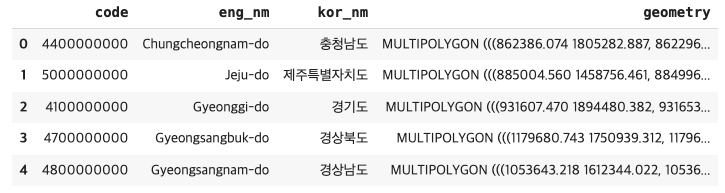

# 4. 도로명주소 데이터 살펴보기(2)

<br>

#### 작성자: 이정윤

<i>[3-3 도로명주소 데이터 살펴보기(1)](../chapter-3/chapter-3-2.md)과 연속되는 내용입니다.</i>

이번에는 인구데이터와 면적데이터를 추가로 활용하여 도로명주소 데이터를 살펴보고 지도시각화를 진행합니다. 전체 코드와 실행결과는 [코랩 코드](https://colab.research.google.com/drive/1ESR6gu4l9QlUx8uW8ngBUWd5MO9BUV5u?usp=sharing)에서 확인하세요.

<figure class="flex flex-col items-center justify-center">
    
    <figcaption style="text-align: center;"></figcaption>
</figure>

시작하기 앞서, 이번장에서 진행하는 지도시각화 툴인 mapbox를 사용하기 위해선 token이 있어야 합니다. [mapbox.com](https://www.mapbox.com/)으로 들어가서 회원가입을 한 뒤, Account로 들어가면 위와 같은 화면을 볼 수 있습니다. mapbox는 일정 사용량까지는 무료이고, 한도를 넘으면 과금이 되므로 각자 billing을 확인하면서 사용하면 됩니다. python에서 mapbox를 사용할 때 입력해줘야 하는 token은 화면 하단의 'Default public token'에 나와 있습니다. 복사해서 아래 지도 시각화를 진행하는 부분에서 사용하면 됩니다.

## 인구데이터

인구데이터는 행정안전부에서 제공하는 [행정동별 주민등록 인구 및 세대현황](https://jumin.mois.go.kr/)의 전체시군구현황 데이터를 사용합니다. 데이터는 csv 혹은 xlsx 형식입니다. 데이터를 불러온 뒤 데이터의 형태, 수정이 필요한 부분 확인 등 간단한 전처리를 진행합니다.

```python
df_pop = pd.read_excel('202401_202401_주민등록인구및세대현황_월간.xlsx', header=2)

## 중복 데이터 확인하기
df_pop[df_pop['행정기관'].duplicated(keep=False)]
```

2024년 1월 기준으로 다운받은 데이터에 '세종특별자치시'는 행정기관코드가 다른 동일한 행이 중복으로 기재되어 있습니다. [행정표준코드관리시스템](https://www.code.go.kr/stdcode/regCodeL.do)에서 확인해보면 세종특별자치시의 행정동코드는 '3611000000'이므로 올바르지 않은 행은 삭제합니다.

```python
df_pop = df_pop[df_pop['행정기관코드']!=3600000000]
df_pop.reset_index(inplace=True, drop=True)
```

정리한 최종 인구데이터는 다음과 같습니다. '서울특별시'와 같은 시도 단위와 '서울특별시 종로구'와 같은 시군구 단위의 데이터가 한 데이터 프레임 안에 있으므로, 추후 도로명주소 데이터와 함께 사용할 때 이 부분을 유의해야 합니다.

<figure class="flex flex-col items-center justify-center">
    
    <figcaption style="text-align: center;"></figcaption>
</figure>

## 면적데이터

면적데이터는 주소기반산업지원서비스에서 제공하는 제공하는 주소 중 [구역의 도형](https://business.juso.go.kr/addrlink/elctrnMapProvd/geoDBDwldList.do?menu=%EA%B5%AC%EC%97%AD%EC%9D%98%20%EB%8F%84%ED%98%95) 2024년 1월 전체자료입니다. 제공하는 주소는 신청서를 작성한 뒤 데이터를 제공받을 수 있습니다. 사이트에서 신청하여 받거나, 구글 드라이브에 저장된 'geojson' 폴더를 다운받아 사용하세요.

면적데이터는 시도 경계를 표현하는 파일과 시군구 경계를 표현하는 파일 두 개로 구분하여 제공합니다. 두 데이터는 동일한 방법으로 처리를 진행하므로 본 글에서는 시도 데이터 처리하는 방법만 소개합니다. (시군구 처리 방법은 코드를 참고하세요.)

```python
# 해대비 경로에서 'CTPRVN.shp'로 끝나는 모든 파일 불러오기
sido_file_list = glob.glob('geojson/*/*_CTPRVN.shp')

sido_geojson = pd.DataFrame()

# 모든 파일 geopandas로 불러오고 하나의 df로 합쳐주기
for file in tqdm(sido_file_list):
    df_tmp = gpd.read_file(file, encoding="cp949")
    sido_geojson = pd.concat([sido_geojson, df_tmp])

sido_geojson.columns = ["code", "eng_nm", "kor_nm", "geometry"]
sido_geojson["code"] = sido_geojson["code"].apply(lambda x: str(x) + "00000000")
sido_geojson.reset_index(inplace=True, drop=True)

print(sido_geojson.shape)
sido_geojson.head()
```

데이터는 시도별로 구분하여 shp(Shapefile)포맷으로 제공합니다. shp형식은 지리 정보 시스템 소프트웨어를 위한 지리 공간 벡터 데이터 형식을 의미하며, 편리한 데이터 조작을 위해
shp 파일을 geopandas를 통해 읽어오고, 데이터프레임으로 정의합니다. 이후 컬럼명을 부여하고 코드는 행정동코드와 같은 형식이 되도록 수정해줍니다. 데이터프레임으로 정리한 시도 면적데이터 예시는 다음과 같습니다.

<figure class="flex flex-col items-center justify-center">
    
    <figcaption style="text-align: center;"></figcaption>
</figure>

POLYGON은 다수의 선분들이 연결되어 닫혀 있는 상태인 다각형을 의미하고 MULTIPOLYGON은 다수 개의 POLYGON의 집합을 의미합니다. 이 정보로 행정구역별 면적을 계산할 수 있습니다.

## 인구 대비, 면적 대비 도로명주소 개수

시도별 인구, 면적 대비 도로명주소의 개수를 확인하기 위하여 시도별 도로명주소 개수, 인구수, 면적데이터를 하나의 데이터프레임으로 합쳐야 합니다. 세 데이터는 각각의 데이터프레임에 저장되어 있으므로 우선 도로명주소 개수 데이터와 인구 데이터를 합치고, 이를 다시 면적데이터와 합쳐주는 과정으로 진행하겠습니다. 두 데이터 프레임을 합칠 때 기준이 되는 컬럼이 다르므로 이 부분을 주의해야 합니다. 하나의 데이터 프레임으로 만든 뒤 지도시각화를 위해 행정구역의 경계에 따른 면적을 계산하고 '인구 대비 도로명주소 개수', '면적 대비 도로명주소 개수'를 계산합니다. 시군구별 데이터와 이와 동일한 과정으로 진행하므로 설명은 생략하며, 코드를 참고하세요.

- '도로명주소 개수'와 '인구수' 데이터는 '행정구역명' 기준으로 합칩니다.
- 1에서 합친 데이터 프레임과 '면적' 데이터는 '행정동코드' 기준으로 합칩니다.

### (1) 데이터 불러오고 처리하기

```python
## 시도별 도로명주소 개수
sido = pd.DataFrame(df.groupby('시도명')["도로명관리번호"].count())
sido.reset_index(inplace=True)

## 시도별 인구수
df_pop['행정기관'] = df_pop['행정기관'].apply(lambda x:x.strip())
sido_pop = df_pop[df_pop['행정기관'].isin(list(sido['시도명']))].copy()

## 시도별 면적 (위에서 정의함)
# sido_geojson
```

합치기 위한 도로명주소 개수와 인구수 데이터프레임을 각각의 변수로 정의합니다.

```python
## 시도명, 행정기관 컬럼 -> 좌우 공백 없애기
sido['시도명'] = sido['시도명'].apply(lambda x:x.strip())
sido_pop['행정기관'] = sido_pop['행정기관'].apply(lambda x:x.strip())

## 행정기관코드, code -> string으로 바꾸기
sido_pop['행정기관코드'] = sido_pop['행정기관코드'].astype('str')
sido_geojson['code'] = sido_geojson['code'].astype('str')

## '도로명관리번호', '총인구수' -> int로 타입 바꾸기
sido['도로명관리번호'] = sido['도로명관리번호'].astype(int)
sido_pop['총인구수'] = sido_pop['총인구수'].str.replace(',', '').astype(int)
```

데이터프레임을 합칠 때 기준이 되는 컬럼들은 동일한 값을 인식할 수 있도록 좌우 공백을 없애고, 데이터 타입을 동일하게 수정합니다. 계산을 해줘야 하는 '도로명관리번호' (도로명주소 개수) 컬럼과 '총인구수' 컬럼은 int로 바꿔줍니다.

```python
## 시도별 도로명주소개수, 인구수, 면적데이터 합치기
sido_address_pop = pd.merge(sido, sido_pop, left_on='시도명', right_on='행정기관')
sido_address_pop.drop('행정기관', axis=1,  inplace=True)
sido_address_pop.rename(columns={'도로명관리번호':'도로명개수'}, inplace=True)

sido_total = sido_address_pop.merge(sido_geojson, left_on='행정기관코드', right_on='code', how='outer')
sido_total
```

최종적으로 세 개의 데이터프레임을 합쳐줍니다.

### (2) 면적 구하고 인구 대비, 면적 대비 도로명주소 개수 계산하기

```python
gdf_sido = gpd.GeoDataFrame(sido_total)

## 면적 계산
gdf_sido = gdf_sido.set_crs(epsg=5179, allow_override=True)
gdf_sido["면적"] = gdf_sido["geometry"].area
```

최종 데이터프레임을 geoDataFrame으로 변환하고 면적을 계산해줍니다. 이때 설정하는 CRS(Coordinate Reference System)는 좌표계로,
곡면인 지구의 표면을 평면으로 나타내는 데 사용되는 좌표 체계와 해당 체계의 측정 단위를 포함하여 의미합니다. 좌표계가 다른 데이터의 경우, 좌표간의 거리나 위치 등이 다르게 표현되므로 반드시 통일하여야 합니다. 좌표계의 유형으로는 epsg:4326, epsg:5179, epsg:4004 등이 있습니다. (이때 epsgs는 European Petroleum Survey Group의 약자로 좌표계와 관련된 표준 데이터 베이스입니다) 

```python
## 인구 대비, 면적 대비 도로명주소 개수 계산
gdf_sido["인구 대비 도로명주소 개수"] = gdf_sido.apply(lambda row: row["도로명개수"] / row["총인구수"], axis=1)
gdf_sido["면적 대비 도로명주소 개수"] = gdf_sido.apply(lambda row: row["도로명개수"] / row["면적"], axis=1)

# 좌표계 변환
gdf_sido = gdf_sido.to_crs(epsg=4326)
```

## 지도 시각화

지금까지 처리한 데이터로 진행할 수 있는 지도 시각화는 크게 4종류 입니다.

1. 시도별 인구 대비 도로명주소 개수
2. 시도별 면적 대비 도로명주소 개수
3. 시군구별 인구 대비 도로명주소 개수
4. 시군구별 면적 대비 도로명주소 개수

다양한 결과를 볼 수 있도록 '시도별 인구 대비 도로명주소 개수'와 '시군구별 인구 대비 ㅓㅡㅜㅡㅜㅜ도로명주소 개수'를 각각 진행해보겠습니다. 1~4의 전체 결과는 코드를 참고하세요.

```python
token = "본인의 token"

gdf_sido = pd.read_csv('/content/drive/MyDrive/HIKE(연구실, 대학원)/2024/주소/address-data-guide/sido-viz.csv', encoding='utf-8')
gdf_sigungu = pd.read_csv('/content/drive/MyDrive/HIKE(연구실, 대학원)/2024/주소/address-data-guide/sigungu-viz.csv', encoding='utf-8')
geo_data_sido = '/content/drive/MyDrive/HIKE(연구실, 대학원)/2024/주소/address-data-guide/sido-geoj.geojson'
geo_data_sigungu = '/content/drive/MyDrive/HIKE(연구실, 대학원)/2024/주소/address-data-guide/sigungu-geoj.geojson'

with open(geo_data_sido, 'rt', encoding='utf-8') as f_sido:
    gj_sido = geojson.load(f_sido)

with open(geo_data_sigungu, 'rt', encoding='utf-8') as f_sigungu:
    gj_sigungu = geojson.load(f_sigungu)
```

처음에 받아 둔 mapbox의 token은 이 부분에서 사용합니다. 위에서 저장한 csv와 geojson 파일을 불러오는 작업을 진행합니다.

```python
viz = ChoroplethViz(data=gj_sido,
                    color_property='인구 대비 도로명주소 개수',
                    access_token=token,
                    color_stops=create_color_stops([0, 0.05, 0.1, 0.15, 0.2, 0.4], colors='BuPu'),
                    color_function_type='interpolate',
                    line_stroke='--',
                    line_color='rgb(128,0,38)',
                    line_width=1,
                    line_opacity=0.9,
                    opacity=0.8,
                    center = (128, 36),
                    zoom=6,
                    below_layer='waterway-label',
                    legend_layout='horizontal',
                    legend_key_shape='bar',
                    legend_key_borders_on=False)
viz.show()
```

저희는 지도 시각화 중 Choropleth 라는 면적에 지정한 값에 따라 다양한 색상과 스타일로 시각화하여 지도 위에 나타내며, 데이터의 패턴이나 특징을 빠르게 이해할 수 있도록 하는 시각화를 진행할 예정입니다. 위 코드에서 중요 파라미터를 하나씩 살펴보겠습니다.
위 코드는 Python 언어를 사용하여 지리적 데이터를 시각화하는 데에 사용되는 ChoroplethViz라는 객체를 생성하고, 이를 통해 지도 위에 색상으로 표현된 지리적 정보를 나타내는 코드입니다. 코드는 Mapbox의 ChoroplethViz를 사용하며, 아래는 코드의 각 부분에 대한 설명입니다.

- `data`: 시각화하고자 하는 지리적 데이터가 저장된 변수를 지정합니다.
- `color_property`: 시각화에서 사용할 색상의 기준이 되는 데이터 속성을 설정합니다.
- `access_token=token`: Mapbox에서 제공하는 API 토큰을 지정하여 지도를 불러올 때 인증에 사용합니다.
- `color_stops`: 시각화에 사용할 색상의 범위를 정의합니다. 'BuPu'는 파란색에서 보라색으로 그라데이션된 색상을 나타냅니다.
- `line_stroke='--', line_color='rgb(128,0,38)', line_width=1, line_opacity=0.9`: 지도의 경계를 나타내는 선의 스타일과 속성을 설정합니다.
- `opacity`: 전체 시각화의 투명도를 설정합니다.
- `center = (128, 36), zoom=5.5`: 지도의 초기 중심 위치와 확대 수준을 설정합니다. 대한민국의 중심 좌표를 지정해줬습니다.
- `below_layer='waterway-label'`: 시각화가 지도의 어떤 레이어 아래에 표시될지를 설정합니다. 여기서는 'waterway-label' 레이어 아래에 표시됩니다.
- `legend_layout='horizontal', legend_key_shape='bar', legend_key_borders_on=False`:
- 범례의 레이아웃 및 모양을 설정합니다.

<embed src="/docs/3-4-person-per-address.html" width="100%" height="450px"></embed>

시도별 인구 대비 도로명주소의 개수를 살펴보면 서울, 경기, 부산, 대구, 세종, 광주 등 특별시, 광역시, 특별자치시와 같이 비교적 인구가 많은 지역은 연한색으로 나타나서 인구 대비 도로명주소의 개수가 적은 것을 알 수 있습니다. 앞서 3-2에서 시도별 도로명주소 개수를 확인했을 때, 세종특별자치시, 울산, 대전은 도로명주소의 개수가 가장 적은 하위 3개 시도인 것을 감안헀을 때, 이들은 인구수는 많지만 도로명주소의 개수는 적어 인구 대비 도로명주소의 개수가 적다는 것을 확인할 수 있습니다.

```python
# 맵을 -15도 만큼 좌우 회전하고, 45도 만큼 상하 회전합니다.
viz.bearing = -15
viz.pitch = 45

# 각 데이터에 '인구 대비 도로명주소 개수'를 기준으로 height 값을 줍니다.
viz.height_property = '인구 대비 도로명주소 개수'

## 높이의 값
numeric_stops = create_numeric_stops([0, 0.05, 0.1, 0.15, 0.2, 0.4], 0, 10000)

viz.height_stops = numeric_stops
viz.height_function_type = 'interpolate'

html = open('person_per_address_3d.html', "w", encoding="UTF-8")
html.write(viz.create_html())
html.close()

viz.show()
```

<embed src="/docs/3-4-person-per-address-3d.html" width="100%" height="450px"></embed>
동일한 시각화에서 위와 같은 파라미터를 추가하면, 각 면적의 height를 지정하여 입체적인 지도 시각화를 진행할 수 있습니다.

<embed src="/docs/3-4-sigungu-area-per-address.html" width="100%" height="450px"></embed>
시군구별 데이터를 통해 면적 대비 도로명주소의 개수를 확인해보았습니다. 파란색으로 표시된 지역일수록 면적 대비 도로명주소의 개수가 많으며, 특히 서울, 부산, 대전, 광주 등 광역시 지역에서 면적 대비 도로명주소 개수의 비율이 높은 것으로 나타났습니다.

### 참고문헌

- https://sparkdia.tistory.com/24
- https://rightstone032.tistory.com/8
- https://zziii.tistory.com/73
- https://datascienceschool.net/03%20machine%20learning/03.04.01%20%EC%A7%80%EB%A6%AC%20%EC%A0%95%EB%B3%B4%20%EB%8D%B0%EC%9D%B4%ED%84%B0%20%EC%B2%98%EB%A6%AC.html
