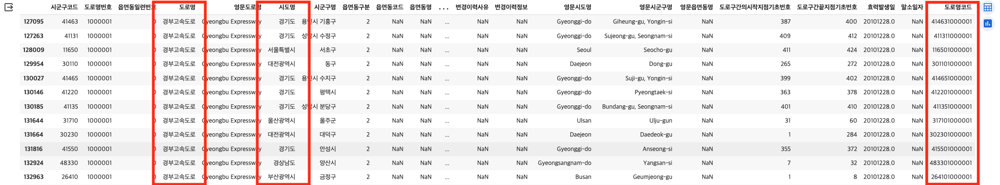
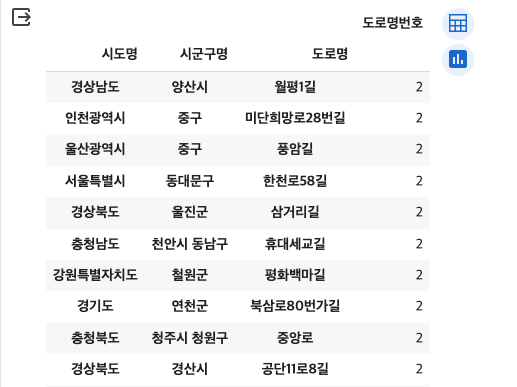

# 4. 도로명 데이터 살펴보기

<br>

#### 작성자: 송채은, 이정윤

두 번째로 살펴볼 데이터는 공개하는 주소 중 '도로명' 데이터입니다. 현재 공개되어 있는 도로명의 개수를 도로유형별, 행정구역별로 나누어 살펴보고, 간단한 시각화를 진행합니다. 이 장에서 사용되는 데이터는 [구글 드라이브]()에서 다운로드 받을 수 있고, 코드 원본은 [깃헙]()에서 확인할 수 있습니다.

## 데이터 불러오기

실습 데이터는 [주소기반산업지원서비스](https://business.juso.go.kr/addrlink/attrbDBDwld/attrbDBDwldList.do?cPath=99MD&menu=%EB%8F%84%EB%A1%9C%EB%AA%85%EC%A3%BC%EC%86%8C%20%ED%95%9C%EA%B8%80)에서 제공하는 공개하는 주소 중 도로명 데이터의 2024년 1월 기준 전체자료 입니다. 데이터는 txt 파일로 되어 있으며, 각 파일은 "\\|"로 구분되어 있습니다. 데이터를 처리하기 용이하도록 활용가이드에서 확인한 컬럼명을 붙이고, csv 파일로 저장합니다.

```python
path = r"TN_SPRD_RDNM.txt"

## 활용가이드에서 확인한 컬럼명 붙여주기
col = ['시군구코드', '도로명번호', '읍면동일련번호', '도로명', '영문도로명', '시도명', '시군구명',
          '읍면동구분', '읍면동코드', '읍면동명', '사용여부', '부여사유',
          '변경이력사유', '변경이력정보', '영문시도명', '영문시군구명', '영문읍면동명',
          '도로구간의시작지점기초번호', '도로구간끝지점기초번호', '효력발생일', '말소일자']

df = pd.read_csv(path, sep='\|', names = col, engine='python', encoding='cp949', dtype=
str, keep_default_na=False, header = None)

## csv로 저장하기
df.to_csv('/content/drive/MyDrive/HIKE(연구실, 대학원)/2024/주소/address-data-guide/total-road-name_2401.csv', index=False, encoding="utf-8")
```

## 데이터 확인하기

```python
df = pd.read_csv('total-road-name_2401.csv', encoding='utf-8')
df.head()
```

저장한 데이터를 불러온 뒤, 데이터의 기본 정보를 확인합니다. (여기까지는 3-2. 도로명주소 데이터 살펴보기(1)에서 진행한 방식과 동일합니다)

```python
print('총 열 수: ', len(df.columns))
print('총 행 수: ', len(df))
print('중복 제거 후 총 행 수', len(df.drop_duplicates()))
```

```python
## null이 있는 컬럼 확인
df.isnull().sum()
```

```python
## 각 컬럼별 유니크 개수 확인
for i in df.columns:
    print(i, len(df[i].unique()))
```

### 복수의 읍면동을 지나는 도로

현재 데이터를 살펴보면, 개별 도로명을 구분할 수 있는 '도로명코드'컬럼이 없습니다. 도로명코드를 '시군구코드+도로명번호'를 통해서 생성한뒤, 고유한 도로명의 개수와 현재 데이터의 전체 행수를 비교해보겠습니다.

```python
## 개별 도로명을 구분할 수 있는 고유값 생성하기
df['도로명코드'] = df.apply(lambda x: f"{x['시군구코드']}{x['도로명번호']}", axis=1)
print(len(df['도로명코드'].unique()))
print(len(df))
```

고유한 도로명코드의 개수는 171728개이고, 전체 행수는 366364개입니다. 이 이유는 도로명코드(시군구코드+도로명번호)가 동일한데, 여러개의 읍면동을 지나는 경우 다른 행으로 분리해서 기입되어 있기 때문입니다.

```python
pd.DataFrame(df.groupby(['도로명', '도로명코드'])['읍면동코드'].count()).sort_values(by='읍면동코드', ascending=False)
```

도로명 당 몇 개의 읍면동이 지나는 지 확인하기 위해 groupby를 실시하면 퇴계로, 3·15대로, 국채보상로, 제물량로 등 순으로 읍면동을 가장 많이 지납니다. 퇴계로의 서울특별시 중구에 위치하며 남창동, 홍인동, 황학동, 충무로1가 등 28개의 읍면동을 지납니다.

따라서 위의 경우 원래 하나의 도로이기 때문에 도로명코드 당 하나의 행만 남기고 삭제해주겠습니다.

```python
df.drop_duplicates(subset=['시군구코드', '도로명번호', '도로명', '영문도로명', '시도명', '시군구명', '사용여부', '부여사유', '변경이력사유', '변경이력정보', '영문시도명', '영문시군구명','효력발생일', '말소일자'],keep='first', inplace=True)
df.reset_index(inplace=True, drop=True)
```

## 중복 도로명 개수 (예외 고속도로)

도로명은 동일한 이름이 전국의 여러 도로에 부여될 수 있습니다. 중복으로 부여된 도로명의 현황을 알아보기 위해 도로명 당 부여된 도로명코드의 개수를 groupby를 통해 확인하고, 2개 이상 사용된 도로명만 남깁니다.

```python
dup_roadName = pd.DataFrame(df.groupby('도로명')['도로명코드'].count()).sort_values(by='도로명코드', ascending=False)
dup_roadName.loc[dup_roadName['도로명코드']>1]
dup_roadName.head(20)
```

<embed src="/docs/3-5-dup-road-name.html" width="100%" height="420px"></embed>

중복 부여가 가장 많이 된 도로명은 '중앙로'입니다. 전체 도로명 141435개 중 약 9.23%인 13063개가 중복되어 사용되고 있습니다.
그런데, 중복 도로명 중에 '경부고속도로'가 보입니다. 경부고속도로가 2개일 수는 없는데, 왜 복수의 도로명코드가 부여되었는지 확인해보겠습니다.

<figure class="flex flex-col items-center justify-center">
    
    <figcaption style="text-align: center;"></figcaption>
</figure>
위 표는 도로명이 '경부고속도로인' 행의 일부 예시입니다. 동일한 도로명이라도 시도명이 모두 다르며, 도로명코드가 상이합니다. 정리하면, 고속도로의 경우 동일한 도로라도 시도, 시군구에 걸쳐서 존재하기 때문에 도로명코드가 상이하게 부여된다는 것입니다. (도로명코드의 앞부분 5자리는 시군구코드이기 때문에) 따라서 고속도로의 예외사항은 제외해줍니다.

```python
dup_roadName = dup_roadName.loc[~dup_roadName.index.str.endswith("고속도로")]
```

## 도로유형별 도로명의 개수

[도로명주소법 시행렬 제3조 1항](https://www.law.go.kr/%EB%B2%95%EB%A0%B9/%EB%8F%84%EB%A1%9C%EB%AA%85%EC%A3%BC%EC%86%8C%EB%B2%95%EC%8B%9C%ED%96%89%EB%A0%B9)에 따르면 도로는 유형벌로 '고속도로', '대로', '로', '길'로 구분합니다. 이에 따라 도로명을 도로유형별로 분리하여 개수를 확인하고, 유형별 개수 비교를 하는 시각화를 진행하겠습니다.

주어진 데이터에는 도로의 유형을 나타내는 코드가 없기 때문에 '고속도로', '대로', '로', '길'과 같은 텍스트를 추출하여 도로명을 확인합니다. 하지만, 이 추출 방법에는 한계가 있습니다. 예를 들어, '남대로'라는 도로명이 있다면 '남대+로'인지, '남+대로'인지를 명확히 구분할 수 없습니다. 도로명 유형을 더 정확하게 확인하려면 '도로명이 부여된 도로 도형' 데이터에서 제공하는 도로의 유형 코드를 활용할 수 있습니다.

### 고속도로

```python
df_gsdr = df[df["도로명"].str.endswith("고속도로")]
df_gsdr
```

### 대로

```python
df_dr = df[df["도로명"].str.endswith("대로")]
df_dr
```

### 로

```python
gsdril = list(df_gsdr.index) #고속도로에 해당하는 데이터의 인덱스를 리스트로
dril = list(df_dr.index) #대로에 해당하는 데이터의 인덱스를 리스트로
il = gsdril + dril #고속도로와 대로에 해당하는 데이터의 인덱스가 담긴 리스트

df_ro = df[df["도로명"].str.endswith("로")]
df_ro = df_ro.drop(il) #'로'로 끝나는 데이터 중 고속도로와 대로에 해당하는 데이터를 제외
df_ro
```

'로'는 '고가대로', '대로'에 모두 포함되므로, 두 유형에 포함되지 않는 행 중에서 '로'가 포함되는 행을 추출합니다.

### 길

```python
df_gil = df[df["도로명"].str.endswith("길")]
df_gil
```

### 기타

```python
filtered_rows = df[~df.isin(df_dr.to_dict(orient='list')).all(axis=1) &
                   ~df.isin(df_gsdr.to_dict(orient='list')).all(axis=1) &
                   ~df.isin(df_ro.to_dict(orient='list')).all(axis=1) &
                   ~df.isin(df_gil.to_dict(orient='list')).all(axis=1)]

filtered_rows
```

고가대로, 대로, 로, 길에 해당하지 않는 유형은 32개입니다. 기타 유형에는 '젊음의 거리', '먹자거리', '소양강자전거길좌안'. '공지천자전거길우안' 등이 있습니다.

<embed src="/docs/3-5-road-name-type.html" width="100%" height="450px"></embed>

최종적으로 모든 유형의 도로명 개수를 시각화하면, '길'이 85.6%로 가장 많고 그 다음으로 '로'가 13.4%, '대로'가 0.833%, '고속도로'가 0.193%로 나타납니다. 앞서 언급했듯, 이는 정확한 수치가 아닐 수 있습니다.

## 도로명, 도로명번호, 도로명코드 정리

마지막으로 도로명 데이터를 분석할 때 기준이 되는 값을 정리해보겠습니다. 도로명과 관련된 값은 '도로명', '도로명번호', '도로명코드' 세 가지가 있고, 도로명과 도로명번호는 지자체에서 부여하며 도로명코드는 시군구코드(5자리)와 도로명번호(7자리)를 합한 값입니다. 지자체에서 부여하는 값은 각 지자체별로 관리하는 기관 단위가 (도청, 시청, 구청) 상이하고 부여 방식도 다르기 때문에 중복값이 존재할 수 있습니다. 따라서 시군구코드를 붙인 12자리 코드로 도로명을 구분할 수 있는데, 이때의 가정은 '같은 시군구 내에서 동일한 도로명번호를 가진 도로명은 없다'입니다. 이러한 가정이 실제로 성립하는 지, 도로명이 같은데 도로명번호가 다른 경우가 있는지 등 다양한 케이스를 하나씩 살펴보겠습니다.

\* 도로명 A와 도로명B가 있다고 가정

| 케이스 번호 | 도로명 | 도로명번호 | 도로명코드 | 가능 여부 |
| :---------: | :----: | :--------: | :--------: | :-------: |
|      1      |  A=B   |    A=B     |    A=B     |   가능    |
|      2      |  A=B   |    A=B     |    A≠B     |   가능    |
|      3      |  A=B   |    A≠B     |    A=B     |  불가능   |
|      4      |  A≠B   |    A=B     |    A=B     |  불가능   |
|      5      |  A=B   |    A≠B     |    A≠B     |   가능    |
|      6      |  A≠B   |    A=B     |    A≠B     |   가능    |
|      7      |  A≠B   |    A≠B     |    A=B     |  불가능   |
|      8      |  A≠B   |    A≠B     |    A≠B     |   가능    |

- 1번: A=B, A=B, A=B

세 값이 모두 같으면 동일한 도로라고 볼 수 있습니다.

- 2번: A=B, A=B, A≠B

도로명코드만 다른 케이스로, 시군구코드만 다르다는 것을 의미합니다. 따라서 다른 시도시군구에 위치한 도로라는 의미인데, 이때 한 도로가 여러 시군구에 걸쳐 있는 경우로 생각할 수도 있고, 다른 도로이지만 각 지자체에서 동일한 도로명번호를 부여한 경우일 수도 있습니다. 즉, 동일한 도로명과 도로명번호를 갖지만 도로명코드만 다른 경우, 두개 이상의 도로가 원래 하나의 도로인지, 상이한 도로인지 판단할 수 있는 기준이 없다는 것을 의미합니다. 이러한 케이스의 예시로는 '송내대로'가 있습니다. 경기도 부천시 원미구에 위치하는 '송내대로'의 경우 도로명번호는 '2000015'이고 도로명코드는 '411922000015'이지만, 경기도 부천시 소사구에 위치하는 '송내대로'의 경우 도로명번호는 동일하게 '2000015'이지만 도로명코드는 '211942000015'로 상이합니다. 지도상에서 확인하면 두 도로가 인접해있어 하나의 도로라고 추측할 수 있지만, 데이터 상으로는 구분하기 어렵습니다. 이런 맥락에서 다른 도로이지만 각 지자체에서 동일한 도로명번호를 부여한 경우를 데이터 상에서 찾을 수 없게 됩니다.
2번 케이스의 예시를 확인할 수 있는 코드는 다음과 같습니다.

```python
df[df.duplicated(subset=['도로명', '도로명번호'], keep=False)].sort_values(by=['도로명', '도로명번호'], ascending=False)
```

- 3번: A=B, A≠B, A=B / 7번: A≠B, A≠B, A=B

3번 케이스는 존재할 수 없습니다. 도로명코드의 뒷 7자리는 도로명번호이므로 도로명번호가 다른데 도로명코드가 같을 순 없기 때문입니다. 동일한 이유로 7번 케이스도 불가능합니다.

- 4번: A≠B, A=B, A=B

4번 케이스의 경우는 같은 시도시군구에 위치하는 다른 도로명을 가지지만, 같은 도로명번호를 가지는 상황으로, 도로명번호를 부여하는 지자체의 오류 케이스를 제외하면 존재할 수 없습니다. 아래 코드로 확인했을 때, 현재 이러한 케이스는 존재하지 않습니다.

```python
df[df.duplicated(subset=['도로명번호', '도로명코드'], keep=False)].sort_values(by=['도로명번호', '도로명코드'], ascending=False)
```

- 5번: A=B, A≠B, A≠B

5번 케이스는 도로명이 같은데 도로명번호와 도로명코드가 다른 경우로, 위에서 진행한 중복 도로명 개수를 확인하는 작업과 동일합니다. 이때 한 가지 생각해야 할 부분은, 예를 들어 '중앙로'가 중복으로 부여된 횟수가 93번이라고 해서 전국에 93개의 '중앙로'가 있다고 해석할 순 없다는 것입니다. 그 이유로는 도로명코드를 기준으로 개수를 확인했을 때 하나의 중앙로가 여러개의 시군구에 걸쳐 있으면 다른 도로명코드가 부여되므로 1개씩 카운트 되기 때문입니다. 즉, 현재의 데이터로는 하나의 중복되는 도로명이 원래 하나의 도로였는지, 분리되어 있는 다른 도로인지 구분할 수 없다는 것입니다. 위에서 언급했 듯, '고속도로'는 하나의 도로이지만 여러 시군구에 위치하므로 예외 케이스가 됩니다.

또 하나의 케이스는 같은 시군구에 위치한 도로인데 도로명이 같고 도로명번호가 다른 경우입니다. 현재 데이터에서 아래 코드로 확인하면 10개의 케이스가 존재하는데, 이 중 '월평1길'을 확인해보면, '경상남도 양산시 월평1길 (도로명번호)4814704, (도로명코드)483304814704'와 '경상남도 양산시 월평1길 (도로명번호)4220195(도로명코드)483304220195' 이 두 도로명주소는 동일한 시군구코드를 가지며 동일한 도로명을 갖지만 도로명번호만 다른 것을 볼 수 있습니다. 이 경우 읍면동 단위의 데이터가 누락된 것은 아닌지, 둘 중 하나의 데이터는 삭제될 필요가 있는지 추가적인 확인이 필요합니다.

```python
pd.DataFrame(df.groupby(['시도명', '시군구명', '도로명'])['도로명번호'].count()).sort_values(by='도로명번호', ascending=False).head(20)
```

<figure class="flex flex-col items-center justify-center">
    
    <figcaption style="text-align: center;"></figcaption>
</figure>

- 6번: A≠B, A=B, A≠B

6번 케이스는 도로명과 도로명코드는 다르지만 도로명번호만 같은 경우로, 각 지자체에서 도로명번호를 부여하는 개별적으로 과정에서 중복이 발생할 수 있어 가능한 케이스입니다. 즉, 서로 다른 도로명(텍스트)를 가지만 다른 시군구에 위치하지만, 동일한 도로명번호를 갖는다는 것입니다. 아래 코드를 통해 해당 케이스를 확인해보면, 총 921개의 도로명번호가 중복으로 사용되고 있습니다. 예를 들어, 도로명번호 '3265076'는 '충청북도 제천시 제2바이오밸리로', '충청남도 당진시 옥수로', '충청남도 서산시 정자동1로' 세 곳에서 중복으로 사용하고 있습니다.

```python
# 도로명이 2개 이상인 행만 남기기
df_case6 = df[df.duplicated(subset=['도로명번호'], keep=False)].sort_values(by='도로명번호')
# 도로명번호와 도로명이 동일한 행은 하나만 남긴 후(동일한 도로명, 도로명번호를 갖는 경우 제외하기), 도로명번호로 groupby
tmp = pd.DataFrame(tmp.drop_duplicates(subset=['도로명번호', '도로명'], keep='first').groupby('도로명번호').count()).sort_values(by='도로명', ascending=False)
tmp.loc[tmp['도로명코드']>1]
```

- 8번: A≠B, A≠B, A≠B

8번 케이스는 대부분의 도로명이 해당하는 경우로, 세 값이 모두 다른 경우 다른 경우라고 볼 수 있습니다.
