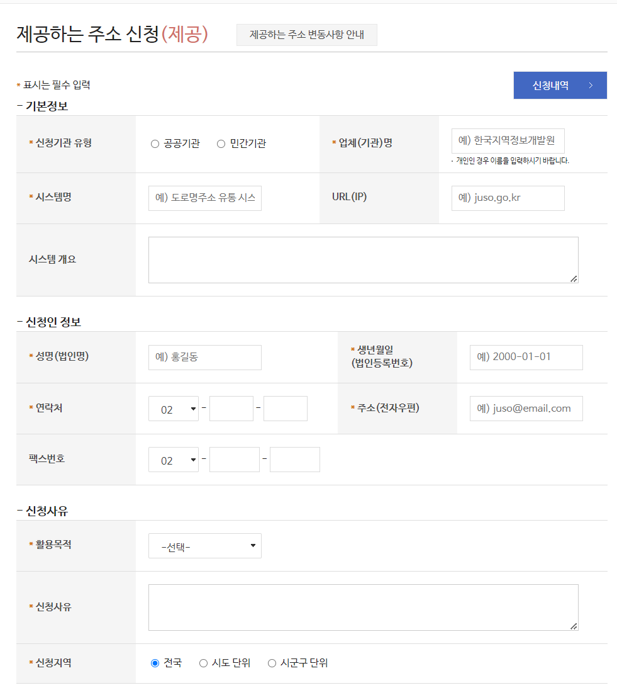
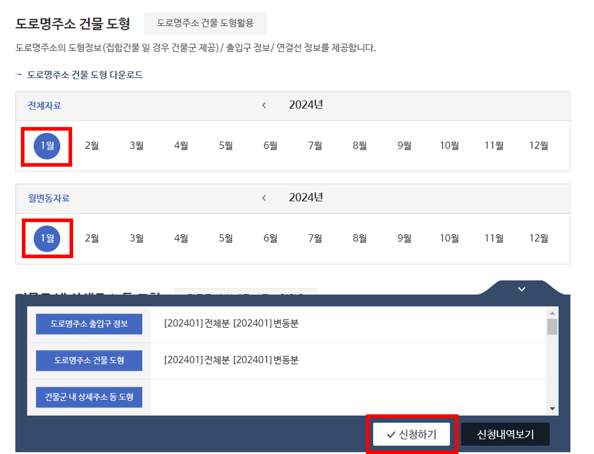
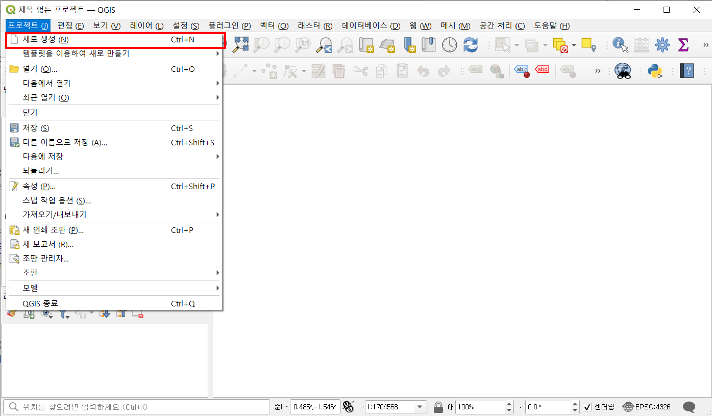
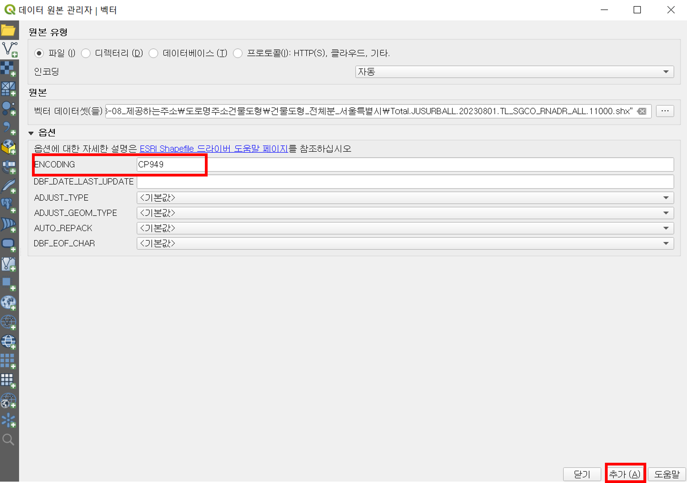

# 3.5 제공하는 주소

제공하는 주소는 공개하는 주소와 달리 별도의 신청이 필요하고, 도형데이터를 제공하고 있다.  
이번 장은 제공하는 주소의 신청방법을 소개하고, 예시 도형데이터를 QGIS 프로그램을 이용해 시각화하는 방법을 설명한다.

## 제공하는 주소 신청방법

1. 제공하는 주소의 첫화면에 신청을 위한 양식이 있다. 기본정보, 신청인 정보, 신청사유, 추가신청 정보를 입력한다. 개인이 신청할 경우, 시스템명은 없음으로 입력할 수 있다.

<figure class="flex flex-col items-center justify-center">
    
    <figcaption style="text-align: center;"></figcaption>
</figure>

2. 입력이 완료되면 '개인정보 수집 및 이용 동의'버튼을 클릭한 뒤, 원하는 데이터를 선택한다.  
아래 예시는 도로명주소 출입구와 도로명주소 건물 도형의 전체분과 변동분을 선택한 결과다.
<figure class="flex flex-col items-center justify-center">
    
    <figcaption style="text-align: center;"></figcaption>
</figure>

3. 화면의 하단에 있는 '신청하기'버튼을 클릭하면, 본인인증을 위한 화면이 나타난다.

<figure class="flex flex-col items-center justify-center">
    
    <figcaption style="text-align: center;"></figcaption>
</figure>

4. 본인인증을 완료하면, 신청이 완료되었다는 메시지가 나타난다. 신청한 데이터는 '신청내역'에서 확인할 수 있다.

<figure class="flex flex-col items-center justify-center">
    
    <figcaption style="text-align: center;"></figcaption>
</figure>

이 때, 신청한 기관명(개인일 경우 이름)과 신청한 데이터의 목록이 나타난다. 빨간색 박스로 표시된 구역을 클릭하면, 신청한 데이터의 처리현황을 확인할 수 있다.

<figure class="flex flex-col items-center justify-center">
    
    <figcaption style="text-align: center;"></figcaption>
</figure>

5. 신청처리가 완료된 데이터는 상세내역에서 개별로 다운로드할 수 있다. 다운로드한 데이터는 압축파일로 제공되며, 지역별로 제공하는 경우 모든 데이터를 개별적으로 다운로드해야 한다.

## QGIS를 이용한 주소데이터 시각화

주소데이터의 도형정보는 SHP파일로 제공되며, 시각화를 위해 QGIS 프로그램을 사용한다.
QGIS는 무료로 사용가능한 오픈소스 기반의 지리정보시스템(GIS)으로, 지리정보를 시각화하고 분석하는데 사용된다. QGIS 프로그램은 [QGIS 공식홈페이지](https://qgis.org/ko/site/)에서 다운로드할 수 있다.

<figure class="flex flex-col items-center justify-center">
    
    <figcaption style="text-align: center;"></figcaption>
</figure>

이번 장은 QGIS를 이용해 도형데이터를 불러오고 시각화하는 방법을 설명한다. 최소한의 기능만을 사용하여 데이터를 시각화하는 방법을 소개하며, QGIS의 모든 기능을 사용하는 방법은 [QGIS 사용자 지침서](https://docs.qgis.org/3.28/ko/docs/user_manual/index.html)에서 확인할 수 있다.

---

1. QGIS 프로그램을 실행한 뒤, 좌측 상단의 '프로젝트 > 새로 생성'버튼을 클릭하여 새로운 프로젝트를 생성한다.

<figure class="flex flex-col items-center justify-center">
    
    <figcaption style="text-align: center;"></figcaption>
</figure>

---

2. 좌측 상단의 '레이어 > 레이어 추가 > 벡터 레이어 추가'을 클릭하여 불러올 파일을 선택한다.
<figure class="flex flex-col items-center justify-center">
    
    <figcaption style="text-align: center;"></figcaption>
</figure>
 
데이터 원본 관리자 화면에서 `'''`버튼을 클릭하여 파일을 선택한다.
도형데이터는 DBF(도형의 속성정보), SHP(도형 벡터파일), SHX(도형의 위치, 방향정도) 파일을 모두 선택해 불러옵니다. 예시는 '도로명주소 건물 도형' 전체분의 서울특별시 데이터다.
 
<figure class="flex flex-col items-center justify-center">
    
    <figcaption style="text-align: center;"></figcaption>
</figure>
 
속성정보 중 한글이 포함된 경우 한글이 깨지는 현상이 발생할 수 있다. 이를 방지하기 위해 옵션의 'ENCODING'에 'CP949'를 입력한다. 모든 설정을 완료한 뒤, '추가'버튼을 클릭한다.

 
<figure class="flex flex-col items-center justify-center">
    
    <figcaption style="text-align: center;"></figcaption>
</figure>

---

3. 데이터를 불러오면, 맵 화면에 도형데이터가 나타난다.

<figure class="flex flex-col items-center justify-center">
    
    <figcaption style="text-align: center;"></figcaption>
</figure>

왼쪽 하단의 레이어 패널에서 원하는 기능을 선택하여 데이터를 시각화할 수 있다. 예를 들어, 첫번째 아이콘은 개체의 색깔을 변경할 수 있는 레이어 스타일링 패널이다. 기존의 주황색에서 초록색으로 변경한 결과다.

<figure class="flex flex-col items-center justify-center">
    
    <figcaption style="text-align: center;"></figcaption>
</figure>

'레이어 속성' 창은 데이터에 대한 정보를 파악할 수 있다. '필드 관리'탭을 클릭하면, 현재 데이터의 스키마를 확인할 수 있다. 속성정보는 제공하는 주소의 레이아웃과 동일하게 제공되므로, 영문으로 표시된 필드명을 확인하고 수정할 수 있다.

<figure class="flex flex-col items-center justify-center">
    
    <figcaption style="text-align: center;"></figcaption>
</figure>

---

4. 시각화된 데이터 중 특정 개체를 식별하려면, 오른쪽 상단의 '객체 식별'버튼을 클릭한 뒤, 맵 화면에서 원하는 개체를 클릭한다. 클릭한 개체의 정보가 나타난다.

<figure class="flex flex-col items-center justify-center">
    
    <figcaption style="text-align: center;"></figcaption>
</figure>

전체 객체의 속성 정보를 파악하거나, 필터링하여 원하는 데이터만을 시각화할 수 있다. 오른쪽 상단의 '속성 테이블'버튼을 클릭하여 속성정보를 확인할 수 있다.

:::info 속성 테이블의 범위 설정
상세 버튼을 클릭하면 속성 테이블의 범위를 설정할 수 있다. 기본값은 모든 속성을 불러오기 때문에 파일 크기에 따라 과부하가 발생할 수 있다. 필요에 따라 속성 테이블과 피처표시를 필터링하여 사용해야 한다.
:::

<figure class="flex flex-col items-center justify-center">
    
    <figcaption style="text-align: center;"></figcaption>
</figure>

| ADR_MNG_NO                 | SIG_CD | RN_CD   | BULD_SE_CD | BULD_MNNM | BULD_SLNO | BUL_MAN_NO | EQB_MAN_SN | EFFECT_DE |
| -------------------------- | ------ | ------- | ---------- | --------- | --------- | ---------- | ---------- | --------- |
| 28110128200800100022000000 | 28110  | 2008001 | 0          | 220       | 0         | 0          | 186        | 20110729  |
| 28110128200800100029600000 | 28110  | 2008001 | 0          | 296       | 0         | 0          | 163        | 20110729  |
| 28110128200800100042200000 | 28110  | 2008001 | 0          | 422       | 0         | 0          | 174        | 20111223  |

---

5. 속성 정보에 대한 통계를 확인하려면, 오른쪽 상단의 '통계'버튼을 클릭한다. 통계창에서는 선택한 필드의 통계정보를 확인할 수 있다.

왼쪽 하단의 패널에서 원하는 레이어와 속성 필드를 선택한다. 아래 예시는 'SIG_CD' 필드를 선택한 결과다. 'SIG_CD' 필드는 시군구코드를 의미하므로, 시군구별 데이터 현황을 파악할 수 있다.

<figure class="flex flex-col items-center justify-center">
    
    <figcaption style="text-align: center;"></figcaption>
</figure>

통계를 간략히 해석하면, 아래와 같다.

- 개수: 서울특별시는 총 530,979개의 건물 도형이 존재함
- 개수 (고윳값): 서울특별시는 25개의 시군구로 구성되어 있음
- 최소값과 최대값: 시군구코드를 단순 비교한 것으로 해석이 불필요함
- 가장 빈도가 낮은 값(Minority): 11350(노원구)의 건물 도형이 가장 적게 존재함
- 다수 기준(Majority): 11620(관악구)의 건물 도형이 가장 많이 존재함

---

6. 데이터를 시각화하고 분석한 프로젝트는 '프로젝트 > 저장'버튼을 클릭하여 저장한다. 프로젝트를 저장하면, 다음에 프로그램을 실행할 때 이전에 작업한 내용을 불러올 수 있다.

<figure class="flex flex-col items-center justify-center">
    
    <figcaption style="text-align: center;"></figcaption>
</figure>

---

해당 내용은 제공하는 주소와 QGIS 프로그램을 이용해 도형데이터를 시각화하는 방법을 설명하고 있다. 도형데이터를 분석하는 방법은 QGIS 외에도 ArcGIS 프로그램, 파이썬 등 다양하게 존재한다. 상세한 분석과 시각화는 목적에 맞게 적절한 프로그램을 선택하여 활용할 수 있다.
