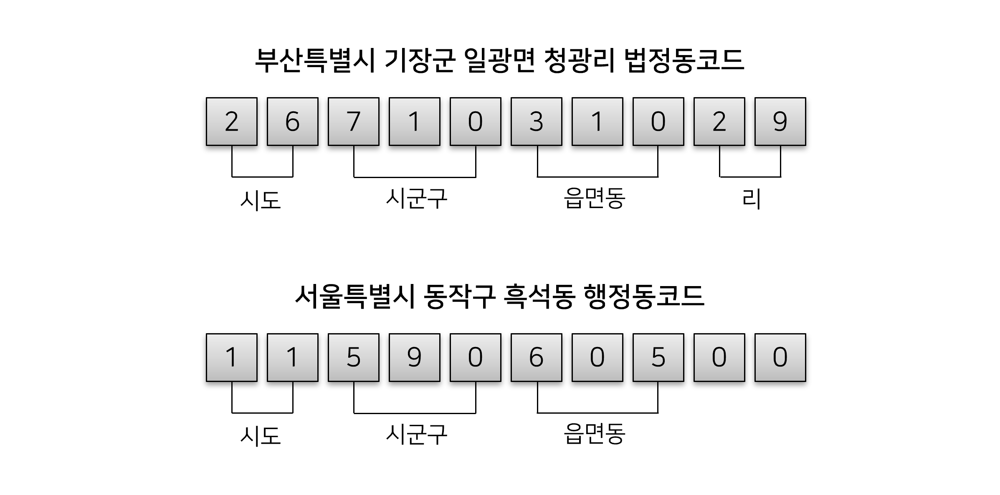
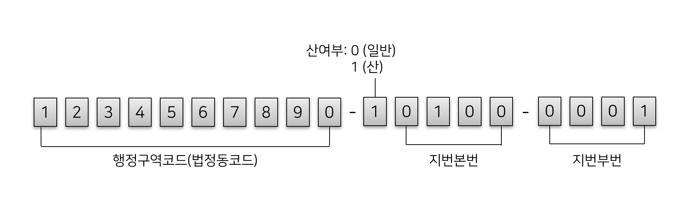
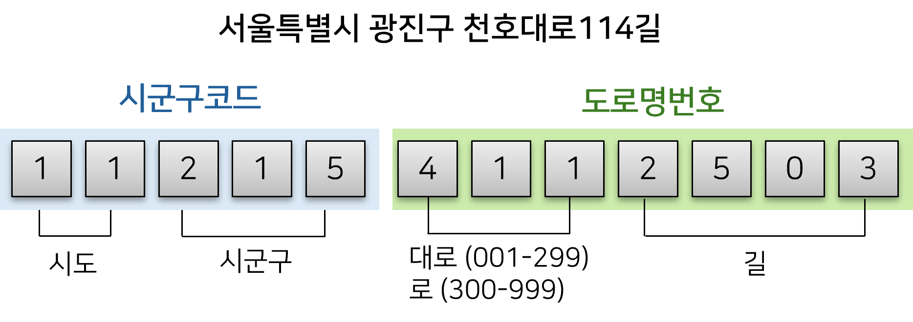
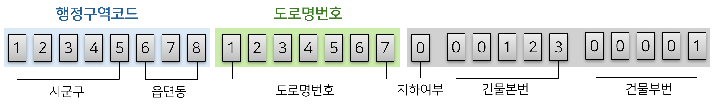
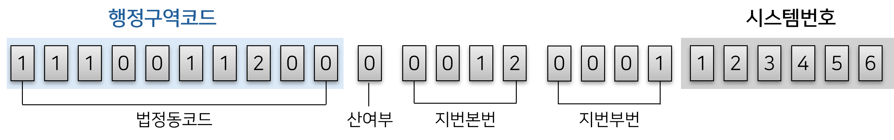

# 3.6 주소 관련 코드체계

주소 데이터에 사용되는 코드체계를 정리한다.

## 법정동코드와 행정동코드

행정안전부는 행정기관(행정동)과 관할구역(법정동)을 관리하기 위해 행정동코드와 법정동코드를 사용한다. 행정동과 법정동의 용어 정의는 다음과 같다.

- 행정동: 법정동을 행정상으로 관할하는 행정기관(읍면동)명칭과 동일함  
  ※ 「행정동코드」와「주민등록 행정기관코드(이하, 행정기관코드)」는 동일한 용어임
- 법정동: 공부상의 법정주소로서 문서에 표기되거나 주소에 사용함

공개하는 주소와 제공하는 주소는 법정동코드, 행정동코드, 행정구역코드를 사용한다.

| 컬럼명       | 데이터명                                                                                  |
| ------------ | ----------------------------------------------------------------------------------------- |
| 행정동코드   | 도로명주소 한글                                                                           |
| 법정동코드   | 도로명주소 한글, 도로명주소 영문, 상세주소 표시, 상세주소 동 표시, 도로명주소 출입구 정보 |
| 행정구역코드 | 사물 주소, 육교 출입구                                                                    |

행정동코드와 법정동 코드는 별개의 코드체계와 의미를 가진다. 반면, 행정구역코드는 법정동코드와 같은 것으로 주소 데이터를 해석할 때 유의하여야 한다. 참고: [주소정보누리집 - 행정구역코드 문의글](https://business.juso.go.kr/addrlink/qna/qnaDetail.do?currentPage=1&keyword=%ED%96%89%EC%A0%95%EA%B5%AC%EC%97%AD%EC%BD%94%EB%93%9C&searchType=subjectCn&noticeType=QNA&noticeTypeTmp=QNA&noticeMgtSn=59852&bulletinRefSn=59852&page=)

법정동코드와 행정동코드는 10자리로 구성되고, 각 자리의 의미는 다음과 같다.

<figure class="flex flex-col items-center justify-center">
    
    <figcaption style="text-align: center;">법정동코드와 행정동코드의 비교 (출처: <a href="https://blog.harampark.com/blog/korea-admin-codes" target="_blank">blog</a>)</figcaption>
</figure>

법정동코드는 시도((2자리), 시군구(3자리), 읍면동(3자리), 리(2자리)를 기준으로 코드를 구성한다. 행정동코드는 법정동코드와 연계하거나, 추가적인 주소정보를 제공하기 위해 사용된다.

주소 데이터에서 가장 많이 쓰이는 컬럼 중 하나는 '시군구코드'다. 시군구코드는 법정동코드의 5번째 자리까지를 의미한다. 예를 들어, 부산특별시 기장군의 법정동코드는 '26710'다. 데이터의 구성에 따라 읍면동코드, 리코드, 행정구역코드 등 다양하게 변형될 수 있으므로 자릿수를 확인하여 사용해야 한다.

법정동코드와 행정동코드는 행정안전부 공식 홈페이지의 [주민등록,인감 게시판](https://www.mois.go.kr/frt/bbs/type001/commonSelectBoardList.do?bbsId=BBSMSTR_000000000052)에서 변경사항을 확인할 수 있다.

## 필지코드(PNU)

지번을 표현하는 코드로, 토지의 위치를 식별하기 위해 사용된다. [공간정보의 구축 및 관리 등에 관한 법률 시행규칙](<https://www.law.go.kr/법령/공간정보의구축및관리등에관한법률시행규칙/(20240206,01305,20240206)/제68조>) 제 68조에 따르면, '토지의 고유번호'를 관리하고 있으며, 이를 필지코드(PNU)라고 한다. 필지코드는 19자리로 구성되어 있으며, 각 자리의 의미는 다음과 같다.

<figure class="flex flex-col items-center justify-center">
    
    <figcaption style="text-align: center;">필지코드(PNU)</figcaption>
</figure>

- 행정구역코드 10자리 + 산여부 1자리 + 지번본번 4자리 + 지번부번 4자리

행정구역코드는 법정동코드 10자리와 동일하고, 산여부는 주소데이터 상 지번에 산이 포함되어 있을 때 사용된다. 주소가 부여된 건물의 지번에 산이 없으면 0, 산이 있으면 1로 구분한다. 지번본번과 지번부번은 자릿수에 따라 앞자리에 0이 들어갈 수 있다. 예를 들어, 0100-0001은 주소에서 100-1로 표기된다.

주소 데이터의 컬럼에서 명시적으로 등장하지 않지만, 외부 데이터(예: 건축물대장)와 연계 시 사용된다. 또한, 지번과 도로명주소를 연계하여 사용할 때 활용할 수 있다.

## 도로명코드

도로명이 부여된 도로를 관리하기 위한 코드다. 도로명주소가 도입되면서 도로명을 체계적으로 관리하기 위해 도로명마다 고유번호를 부여하고 있다. 도로명코드는 12자리로 구성되어 있으며, 각 자리의 의미는 다음과 같다.

<figure class="flex flex-col items-center justify-center">
    
    <figcaption style="text-align: center;"></figcaption>
</figure>

- 시군구코드 5자리 + 도로명번호 7자리

도로명은 도로가 지나는 관할구역(지자체)에서 관리하므로, 지자체 기준으로 도로명번호가 부여된다. 즉, 지자체별로 도로명번호가 중복될 수 있다. 특정 도로구간을 고유하게 식별하려면 시군구코드와 도로명번호를 함께 사용한 **도로명코드 12자리**를 사용해야한다.

중복되는 도로명번호의 예시로, '3265076'은 충청남도 당진시, 서산시와 충청북도 제천시에 모두 존재하는 도로명번호다. 하지만, 도로명은 각기 다르므로 시군구코드와 함께 사용해야 고유하게 식별할 수 있다.

- 도로명 데이터의 일부 예시

| 시군구코드 | 도로명번호 | 도로명          | 영문도로명        | 시도명   | 시군구명 |
| ---------- | ---------- | --------------- | ----------------- | -------- | -------- |
| 44270      | 3265076    | 옥수로          | Oksu-ro           | 충청남도 | 당진시   |
| 44210      | 3265076    | 정자동1로       | Jeongjadong 1-ro  | 충청남도 | 서산시   |
| 43150      | 3265076    | 제2바이오밸리로 | Je2 bio valley-ro | 충청북도 | 제천시   |

## 도로명주소 관리번호

도로명주소 관리번호는 주소정보 누리집에서 관리하는 도로명주소의 고유키다. 주소 데이터를 연계하기 위해 사용된다.

:::info 도로명주소 관리번호가 포함된 데이터

- 공개하는 주소: 도로명주소 한글, 도로명주소 영문, 상세주소 표시, 상세주소 동 표시
- 제공하는 주소: 도로명주소 출입구 정보, 도로명주소 건물 도형
  :::

도로명주소관리번호는 26자리로 구성되어 있으며, 각 자리의 의미는 다음과 같다.

<figure class="flex flex-col items-center justify-center">
    
    <figcaption style="text-align: center;">도로명주소관리번호</figcaption>
</figure>

- 시군구코드 5자리 + 읍면동코드 3자리 + 도로명번호 7자리 + 지하여부 1자리 + 건물본번 5자리 + 건물부번 5자리

한편, 주소정보 누리집의 도로명주소 관리번호는 건물군 또는 건물단위로 부여되므로, 건물번호보다 더 세분화된 **'상세주소' 수준까지 식별할 수 있는 코드체계는 제공하지 않는다.**

## 건물관리번호

건물관리번호는 공개하는 주소의 **상세주소 표시**와 **상세주소 동 표시** 데이터 사이의 연계를 위해 사용되는 코드다. 건물군에 포함된 개별 건물을 식별하기 위해 사용된다.

건물관리번호는 26자리로 구성되어 있으며, 각 자리의 의미는 다음과 같다.

<figure class="flex flex-col items-center justify-center">
    
    <figcaption style="text-align: center;">건물관리번호</figcaption>
</figure>

- 법정동코드 10자리 + 산여부 1자리 + 지번본번 4자리 + 지번부번 4자리 + 시스템번호 6자리

:::tip 건물관리번호의 연계 불가능
건물관리번호는 주소정보시스템 내부의 시스템번호를 사용한다. 시스템번호는 내부 데이터베이스에 존재하는 것으로, 외부에서 코드를 조합할 수 없기 때문에 외부데이터와 연계하여 사용할 수 없다.
:::

## 참고자료

- haram park, [행정동코드, 법정동코드, 행정구역코드 뽀개기](https://blog.harampark.com/blog/korea-admin-codes/)
- [공간정보의 구축 및 관리 등에 관한 법률 시행규칙 (국토교통부령 제1305호, 2024. 2. 6., 일부개정)](<https://www.law.go.kr/법령/공간정보의구축및관리등에관한법률시행규칙/(20240206,01305,20240206)/제68조>)
- 대한민국 정책브리핑, [도로에 12자리 고유번호 붙인다](https://www.korea.kr/news/policyNewsView.do?newsId=148644220)
- 한국세정신문, [법제처 “모든 도로에 도로명 부여해야 하는 것 아니다”](http://www.taxtimes.co.kr/news/article.html?no=188127)
- 주소기반산업지원서비스, [[제공하는주소]건물관리번호 문의](https://business.juso.go.kr/addrlink/qna/qnaDetail.do?currentPage=2&keyword=%EA%B1%B4%EB%AC%BC%EA%B4%80%EB%A6%AC%EB%B2%88%ED%98%B8&searchType=subjectCn&noticeType=QNA&noticeTypeTmp=QNA&noticeMgtSn=110490&bulletinRefSn=110490&page=)
- 주소기반산업지원서비스, [[주소검색솔루션]도로명관리번호와 건물관리번호 차이](https://business.juso.go.kr/addrlink/qna/qnaDetail.do?currentPage=3&keyword=%EA%B1%B4%EB%AC%BC%EA%B4%80%EB%A6%AC%EB%B2%88%ED%98%B8&searchType=subjectCn&noticeType=QNA&noticeTypeTmp=QNA&noticeMgtSn=105400&bulletinRefSn=105400&page=)
