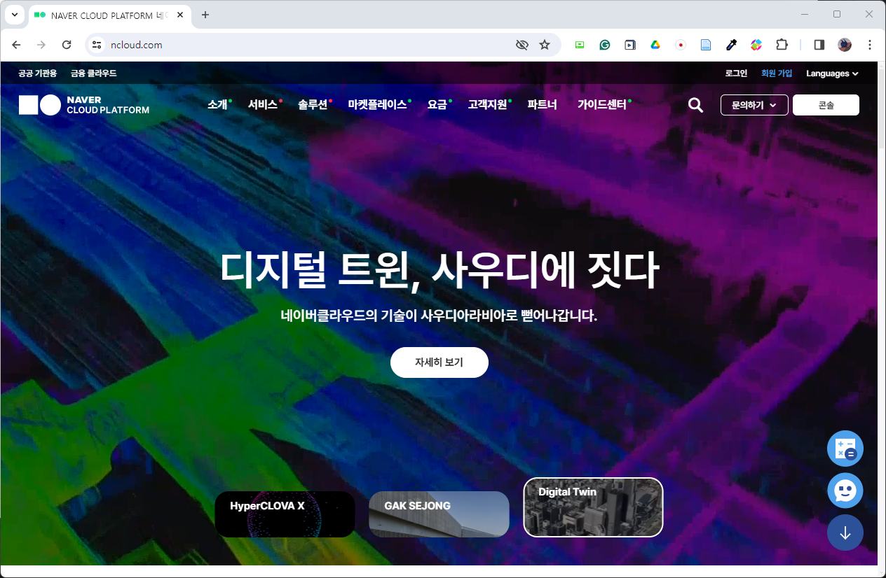
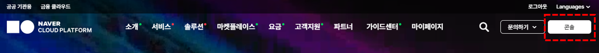
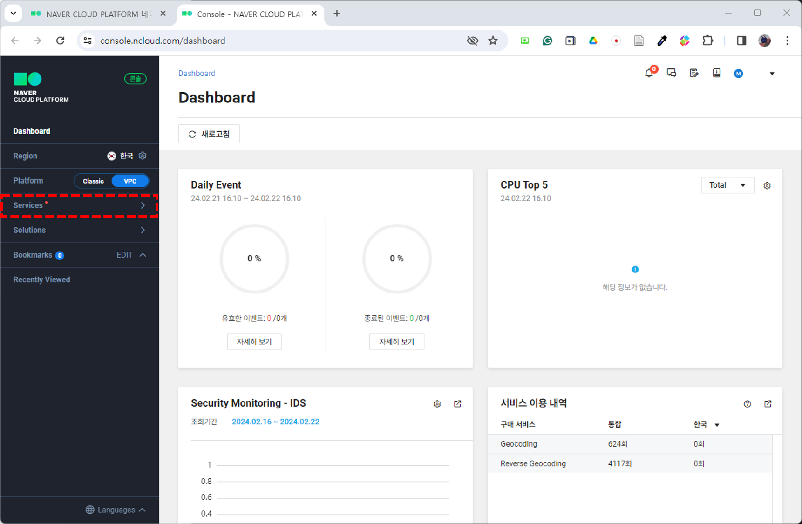
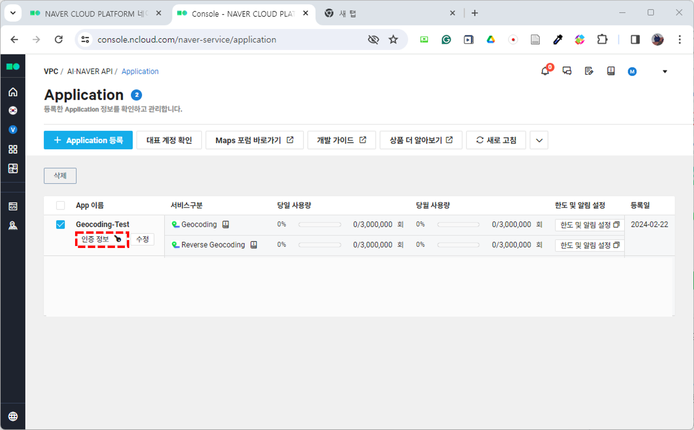
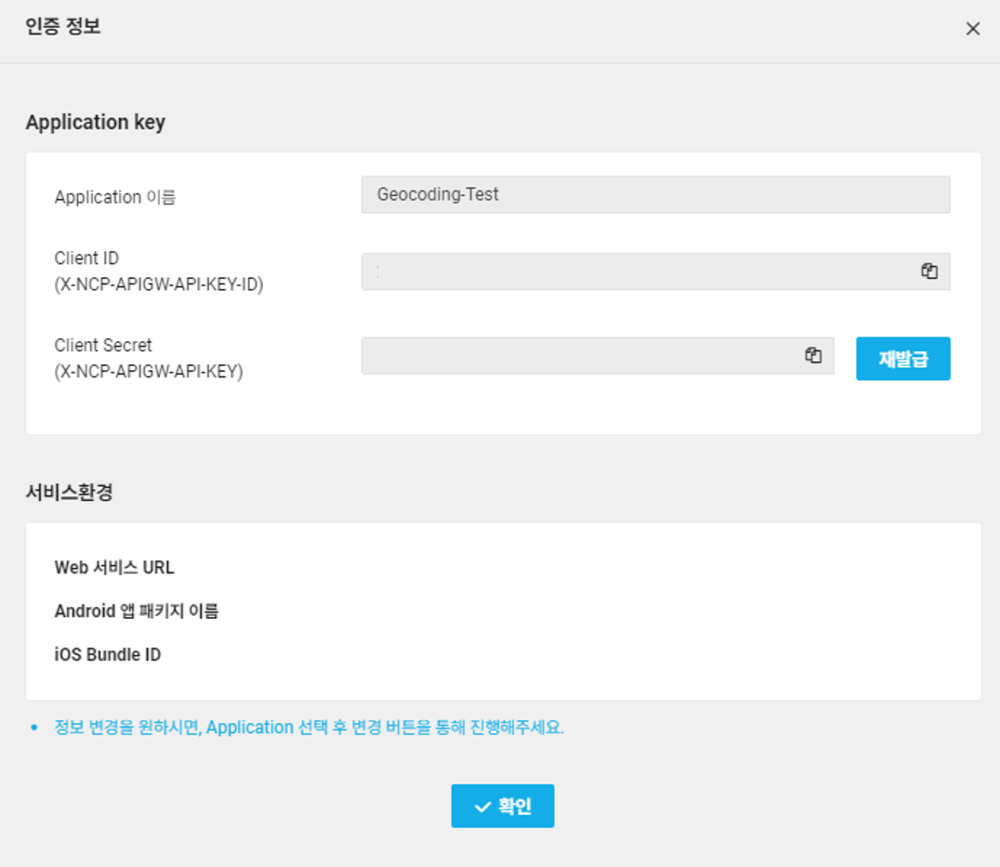
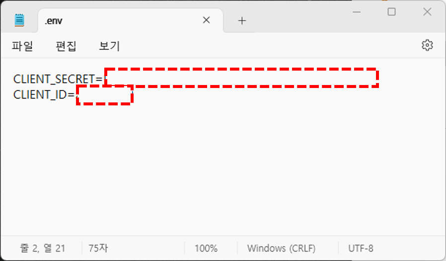

# 1. 프로젝트 소개

 

#### 작성자: 안지은

4장의 프로젝트는 주소데이터를 포함하는 데이터세트 전반에 대한 품질을 분석하고, 주소 구성 요소에 맞춰 주소를 정제하는 방법에 대해 학습하도록 하겠습니다. 본 프로젝트는 샘플데이터를 통한 실습을 중심으로 진행되니, 코드와 함께 문서를 읽어볼 것을 권장합니다. 코드는 [깃허브]() 에 있으며, [Colab 환경]()에서 직접 실행해보실 수 있습니다.

## 학습 내용

4장의 내용 구성은 다음과 같습니다.

- 1. 데이터 품질이란? 
    **데이터 품질**의 정의를 알아보고, 데이터 품질 요소에 따라 직접 샘플 데이터의 품질을 평가합니다.

- 2. 주소 데이터의 구성 요소
    도로명주소의 구성 요소를 알아보고, 구성요소에 따른 주소 오류를 검사하는 방법과 Naver Geocode API를 활용해 실제 존재하는 주소인지 검사하는 방법을 안내합니다.

- 3. 주소 데이터 정제하기
    앞서 파악한 오류 주소들을 정제해 봅니다. 맵핑 테이블(Mapping Table)을 통해 간단히 수정하는 방법과 위경도 데이터를 활용하여 Naver Geocode API로 새 주소를 받아오는 방법을 안내합니다.

이 과정들에 대한 코드를 직접 실행하기 위해선, 자신만의 Naver Geocode API를 발급받아야 합니다. 구글, 카카오에서도 Geocode API를 서비스하고 있으나, 네이버가 이들 중 가장 무료 요청 가능 건수가 많으므로 네이버를 선택하였습니다. 다른 API를 사용하셔도 되나, 이 경우 결과 값의 형식에 맞게 코드를 수정하시길 바랍니다.

## 학습 목표

컨텐츠 만들면서 내용이 확정되면 마지막으로 여기 작성하기 (구체적인 세부장별 학습 목표)

## 네이버 Geocode API 활용 방법

Geocode, 또는 Geocoding이란 주소나 특정 지점에 대한 고유 명칭으로 해당 지점의 좌표값을 얻는 것을 의미합니다. 반대로, 좌표값을 통해 주소를 얻는 과정은 reverse-geocoding이라고 합니다. 보통 하나의 Geocode API가 geocoding과 reverse-geocoding을 동시에 서비스합니다.

### STEP 1. 네이버 클라우드 접속

API를 활용하기 위해서, 보통 API Key를 먼저 발급받아야 합니다. 네이버 지오코딩 API Key는 [네이버 클라우드](https://www.ncloud.com/)에서 발급받습니다. 

<figure class="flex flex-col items-center justify-center">
    
</figure>

로그인 후, 화면 상단의 콘솔 버튼을 클릭해 주세요.

<figure class="flex flex-col items-center justify-center">
    
</figure>

버튼을 클릭하시면 다음과 같은 화면이 나타납니다. 좌측 내비게이션에서 `Services` 항목을 클릭해주세요.

<figure class="flex flex-col items-center justify-center">
    
</figure>

엄청나게 많은 카테고리가 나타나는데요, `AI·NAVER API` 항목만 클릭하시면 됩니다.

<figure class="flex flex-col items-center justify-center">
    
</figure>

### STEP 2. APP 등록

해당 항목의 페이지로 이동하면 API 사용량에 대한 대시보드가 나타납니다. 여기에서 `Application 등록` 버튼을 클릭해주세요
<figure class="flex flex-col items-center justify-center">
    
</figure>

등록 화면에서 Application 이름 작성하고 service를 선택하면 등록 버튼이 활성화됩니다. Application 이름은 설정해 주세요. API 키들을 구분할 용도로 앱 이름을 설정하는 것이니 자유롭게 작성하시면 됩니다. 이용할 Service로는 Maps의 Geocoding과 Revese Geocoding을 선택해주세요.

<figure class="flex flex-col items-center justify-center">
    
</figure>

등록이 완료되면 첫 화면으로 돌아옵니다. 대시보드에 방금 전 등록한 앱이 있는 것을 확인하실 수 있습니다.

이제 API도 발급받았으니, 활용에 필요한 Key 정보를 확인해야 합니다. Key 정보를 보기 위해 앱 이름 하단에 있는 `인증 정보` 버튼을 클릭합니다.

<figure class="flex flex-col items-center justify-center">
    
</figure>

인증 정보 버튼을 누르면 앱의 key에 대한 정보를 담은 팝업창이 나타납니다. 팝업창에는 앱 이름과 함께 Client ID, Client Secret 값이 나타납니다. 여기서 `Client Secret`은 외부에 노출되면 안되는 값입니다. 혹여나 값이 노출되었다면 재발급 버튼을 눌러서 키를 재발급 받으셔야 합니다.

<figure class="flex flex-col items-center justify-center">
    
</figure>

key 값은 메모장에 복사해두고 사용하시면 됩니다. 권장하는 방법은 .env 파일에 저장하여 사용하는 것입니다. 깃허브를 통해 코드를 외부적으로 공유할 경우, API 키 값들을 모두 env 파일에 저장하고 코드 파일에서는 API 명칭으로만 불러와서 사용할 수 있기 때문에  key값이 노출되지 않고 가독성이 좋아진다는 장점이 있습니다. 

앞으로의 실습들 모두 .env 파일로 key를 불러와 사용하도록 하는 방식이므로, 어떻게 .env 파일을 만들고 사용하는지, 그리고 `.gitignore` 파일을 작성하여 `.env` 파일은 push 되지 않도록 하는 방법을 간단하게 알려드리겠습니다.

### STEP 3. .env, .gitignore 파일을 활용해 안전하게 key 이용하기

> colab 환경을 기준으로 설명하겠습니다. 

시작에 앞서, 코드와 데이터, 로컬 환경에서 .env, .gitignore를 한 곳에 담을 폴더를 하나 만들어주세요. 그 다음 `새로 만들기` - `서식 있는 텍스트`를 클릭해주세요.

새 파일이 하나 생성었는데요, 확장자(.rtf)명까지 모두 지운 후, 파일 명을 `.env`로 변경합니다. 그 다음, .env 파일을 메모장으로 열어주세요. 메모장을 열었을 때 `{\rtf1}`가 이미 입력되어 있을텐데요, 모두 지우고 몇 아래 사진과 같이 작성해주시면 됩니다. 
`CLIENT_SECRET`에는 아까 발급 받은 Secret key를, `CLIENT_ID`에는 Client ID를 복사해서 그대로 붙여 넣어 주세요. 작성이 완료되면 저장하고 창을 닫습니다.

<figure class="flex flex-col items-center justify-center">
    
</figure>

.gitignore 파일도 동일한 방식으로 생성한 후, 메모장을 이용해 열어줍니다. .gitignore 파일에는 `*.env`를 기입하고 저장해주세요.

이제 colab에 접속해 새 노트를 생성해 봅시다. 노트를 생성한 후, 좌측 내비게이션에서 폴더 아이콘을 클릭해주세요.

