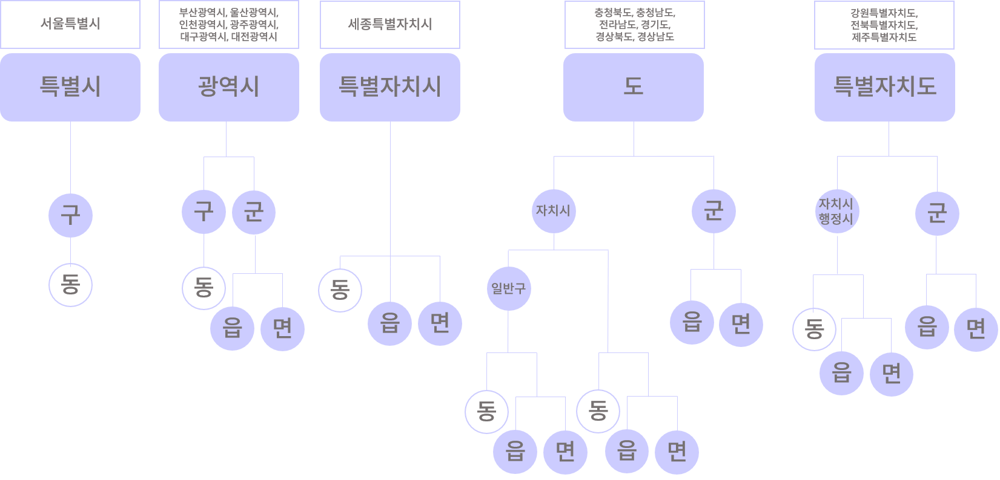

# 3. 도로명주소의 오류 유형

 

#### 작성자: 안지은

이번 장에서는 공공데이터에서 흔히 나타나는 주소데이터의 표기 오류 유형을 알아봅니다.

## 행정구역명 오기입

한국의 지역별 행정구역 체계는 아래 그림과 같습니다. 

<figure class="flex flex-col items-center justify-center">
    
</figure>

한국의 행정구역은 광역지방자치단체 산하에 기초지방자치단체가 존재하는 중층제와 기초지방자치단체가 존재하지 않는 단층제(제주특별자치도)가 혼재되어 있습니다. 또한, 자치시에 일반구가 존재하는 경우(용인시)와 일반구 없이 읍/면/동만 존재하는 경우(원주시)가 혼재되어 있습니다. 일반/자치구의 경우 읍/면 단위까지 지역(용인시 처인구)도 있습니다. 이처럼, 행정구역체계가 같은 광역지방자치단체의 지역별로도 상이하다 보니,   행정구역에 대한 오기입 사례가 많습니다. 

다음은 대표적으로 빈번히 나타나는 행정구역 표기 오류 유형입니다.

### 1. 행정구역 누락

|잘못된 표기|옳은 표기|
|----------|--------|
|제주시 공항로 2| **제주특별자치도** 제주시 공항로 2|

특별자치도 내부 행정시, 도에 속하는 자치시의 경우 광역지방자치단체를 누락하거나 기초지방자치단체를 누락하는 경우가 있습니다. 또한 촌락의 경우 읍/면 단위를 누락할 수 있습니다. 광역지방자치단체와 기초지방자치단체는 반드시 기입하여야 하며, 비자치구역의 경우 동을 제외한 모든 비자치구역 단위를 기입하여야 합니다.

### 2. 자치단체명의 생략

|잘못된 표기|옳은 표기|
|----------|--------|
|강원도 철원군 갈말읍 삼부연로 51| **강원특별자치도** 철원군 갈말읍 삼부연로 51|

자치단체명이 생략되어선 안됩니다. 강원도의 경우 최근 '강원특별자치도'로 자치단체명이 변경되었으므로, '강원도'가 아닌 '강원특별자치도'로 기입해야 합니다. 마찬가지로, '서울특별시'의 경우에도 '서울시'가 아닌 '서울특별시'로 기재해야 합니다.

### 3. 동 단위의 기입

|잘못된 표기|옳은 표기|
|----------|--------|
|세종특별자치시 보람동 한누리대로 2130|세종특별자치시 한누리대로 2130|

'동' 단위가 기입되어선 안됩니다. 세종특별자치시의 경우 기초지방단체가 존재하지 않는데요. 그런 경우라 하더라도 '동' 단위를 기입하는 것은 잘못된 기입 방식입니다.  기초지방자치단체가 '구'나 광역지방자치단체가 '시' 인 경우, 지번주소상 동 명칭을 표기하려면 도로명 주소 끝에 소괄호를 쓰고, 그 안에 동 명칭과 건물명을 기재하는 것이 원칙입니다. 위와 같은 경우에서는 **세종특별자치시 한누리대로 2130 (어진동)** 으로 기입하는 것이 옳습니다.

도로명주소에서 법정동은 참고사항인 항목입니다. 온전한 주소는 법정동까지 기입한 주소이지만, 법정동을 기입하지 않더라도 오류 주소는 아닙니다.

## 도로명, 건물번호의 오기입

도로명주소에서는 오직 도로명과 건물번호만을 정식 구성요소로 인정하며, 건물명의 경우는 참고사항으로 두고 선택적으로 기입합니다. 하지만, 여전히 지번주소와 같이, 도로명과 건물번호 다음에 건물명을 기입하는 경우가 빈번합니다.

도로명의 경우에도 도로명에 일련번호나 식별번호가 포함되는 경우, 건물번호 역시 도로명의 일부분으로 보고 나란히 붙여쓰는 사례가 많으며, 반대로 도로명의 식별/일련번호와 도로의 명칭을 띄어쓰는 경우도 많이 포착됩니다.

다음은 도로명과 건물번호의 표기에서 주로 나타나는 오류 사례에 대한 설명입니다.

### 1. 건물명 병기

|잘못된 표기|옳은 표기|
|----------|--------|
|서울특별시 동작구 현충로2길 4 마크 힐스 |서울특별시 동작구 현충로2길 4 **(흑석동, 마크 힐스)**|

지번주소와는 달리, 도로명주소에서는 주소 자체가 건물을 기준으로 부여되므로 주소 구성요소에 건물명이 포함되지 않습니다. 따라서, 아파트와 같은 집합건축물의 명칭을 명시해야 하는 경우에는 지번주소에서 '동'이었던 지역의 경우 도로명주소 끝에 소괄호를 띄어쓰고, 괄호 안에 동명칭과 건물명을 순서대로 기입합니다. 동 단위 지역이 아닌 읍/면의 경우, 괄호 안에 건물명만 작성합니다. 

건물 동, 호수를 입력하는 경우에도 마찬가지로 주소의 맨 마지막에 소괄호로 이어서 표기합니다. 예를 들어 위의 주소에서 동, 호수까지 표기하는 경우 **서울특별시 동작구 현충로2길 4, 101동 1201호 (흑석동, 마크 힐스)** 으로 표기합니다.

### 2. 일련번호, 기초번호 띄어쓰기

|잘못된 표기|옳은 표기|
|----------|--------|
|서울특별시 마포구 연남로  1길 19|서울특별시 마포구 **연남로1길** 19|

도로명주소에 일련번호나 지점번호가 부여되어 있는 경우, 모두 붙여 써야 합니다.

### 3. 건물번호 붙여쓰기

|잘못된 표기|옳은 표기|
|----------|--------|
|서울특별시 마포구 연남로1길19|서울특별시 마포구 **연남로1길 19** |

**로/대로/길** 끝나는 명칭은 모두 도로명을 의미합니다. 뒤이어 등장하는 번호는 건물번호입니다. 도로명과 건물번호는 띄어쓰기로 작성하여야 합니다.

### 4. 폐지된 주소

도로명주소의 경우, 건물이 철거되거나 아무도 관리하지 않는 폐가와 같이 소유자, 점거자가 존재하지 않을 경우 해당 건물의 주소가 폐지됩니다. 해당 위치에 새로운 건물이 세워졌을 때 새 도로명주소를 부여받습니다.