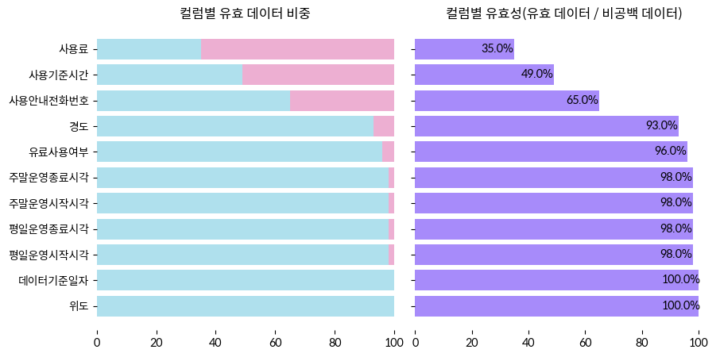

# 3. 샘플 데이터 품질 평가하기

<br>

#### 작성자: 안지은

- [샘플 데이터]()
- **코드 원본** : 코드 원본과 함께 읽어보시는 것을 추천합니다. ▶️ [깃허브](), [colab]()

## 공공데이터 샘플 품질 평가

이제 예시 데이터의 품질을 직접 평가해보도록 하겠습니다. 샘플 데이터를 열면 아래 사진과 같은 파일이 열릴 것입니다.

<figure class="flex flex-col items-center justify-center">
    
</figure>

겉보기에도 비어있는 셀들이 많이 보입니다. 전체 데이터에서 채워져 있는 셀의 비중인 **완전성** 부터 알아봅시다. 


## 완전성 평가 방식

우선, 필요한 라이브러리와 파일을 열겠습니다.

```python
import pandas as pd
import numpy as np
import re

# 시각화 관련 라이브러리
import seaborn as sns
import matplotlib.pyplot as plt
import matplotlib.font_manager as fm
import matplotlib.ticker as ticker
# 폰트 설정 (colab 기준)


# 데이터 로드하기
df = pd.read_csv("sample.csv")

# 데이터 형태 파악하기
print(df.shape)
df.head(5)
```

컬럼별 완전성을 알아봅시다. 채워져 있는 데이터는 파란색으로, 비어있는 데이터는 회색으로 나타나도록 하겠습니다.

```python
# Seaborn을 사용하여 그래프 그리기
plt.figure(figsize=(10, 6))

# 두 개의 데이터 열에 대해 스택바 차트 그리기
sns.barplot(y=df_fill_rate.index, x='fill_rate(%)', data=df_fill_rate, color='#a78bfa', label='채워진 데이터 비율(%)')
sns.barplot(y=df_fill_rate.index, x='null_rate(%)', data=df_fill_rate, color='#DCE6DC', left=df_fill_rate['fill_rate(%)'], label='공백 데이터 비율(%)')

# 레이블, 범례 등 설정
plt.xlabel('데이터 비율(%)')
plt.title('컬럼별 완전성(%)')
plt.legend()
plt.box(False)

# 채워진 데이터 비율 표시
for i in range(len(df_fill_rate)):
    plt.text(df_fill_rate['fill_rate(%)'][i]-6.5, i, f"{df_fill_rate['fill_rate(%)'][i]:.1f}%", fontsize=10, ha='left', va='center')
```

<figure class="flex flex-col items-center justify-center">
    
</figure>

이번에는 결측값이 발생한 컬럼의 행들을 살펴보도록 하겠습니다. 히트맵을 통해 결측이 발생한 부분을 효과적으로 확인할 수 있습니다. 

```python
# 결측 행을 0, 채워진 행은 1로 변환하는 apply 적용 함수
def tf_numeric(x):
    if x is False:
        return 0
    else:
        return 1

# 결측데이터, 채워진 데이터를 각각 0,1로 변환
null_col = df_fill_rate[df_fill_rate['null_rate(%)'] > 0].index.tolist() # 결측 컬럼 추출
df_null = df.notnull().applymap(tf_numeric) # 값 변환하기

df_null_exist = df_null[null_col] # 결측값이 존재하는 컬럼만 분리
df_null_exist = np.transpose(df_null_exist) # 시각화 위해 축 전환


#  히트맵 시각화
plt.figure(figsize=(20, 8))
sns.heatmap(df_null_exist, cbar=False, cmap='Greys', linewidth=.5, linecolor='grey')

# 10의 단위로 행 번호 표기
ax = plt.gca()
ax.xaxis.set_major_locator(ticker.MultipleLocator(10)) # 10 단위로 표기
ax.xaxis.set_major_formatter(ticker.FormatStrFormatter('%d행')) # 표기 형식

# x축, y축 글자 회전
plt.xticks(rotation=0, fontsize=12)
plt.yticks(rotation=0, fontsize=12)
```
<figure class="flex flex-col items-center justify-center">
    
</figure>


 히트맵 시각화를 통해 어떤 부분에서 집중적으로 결측이 발생했는지 한 눈에 파악할 수 있습니다. 대부분의 결측이 사용기준시간이나 사용료와 같은 선택적으로 기입하는 항목에서 발생했다는 것을 확인할 수 있습니다. 

선택적으로 기입하는 항목이라고 해도, 공백 값을 그대로 두지 않고 '해당없음'과 같이 명확한 값을 부여해주는 것이 좋습니다. 선택 항목으로서 값이 존재하지 않는 것을 명시하는 값과 어떠한 정보도 포함하지 않는 공백 값은 엄연히 다르기 때문입니다.

사용안내전화번호나 주소 컬럼 등 활용에 있어 필요한 컬럼들에서도 결측이 발생한 것을 파악할 수 있었는데요. 사용안내전화번호나 수용가능인원수의 경우 직접 기관에 문의하거나 다른 데이터를 찾아보지 않는 한, 결측을 채우기 어렵습니다. 따라서 데이터를 처음 작성할 때에는, 최대한 완전한 정보를 기입하는 것이 중요합니다.

마지막으로 데이터 전반의 완전성을 계산해 봅시다.  

```python
# 전체 데이터 개수 (행 x 열)
total_cells = df.shape[0] * df.shape[1] 

# 공백 데이터 개수
null_cells = df.isnull().sum().sum()

# 채워진 데이터 비율
complete = (total_cells-null_cells) / total_cells * 100

# 소수점 둘째자리까지 반올림
complete = round(complete, 2)

print("완전성(%) : ", complete)
```

코드를 실행하면 89.19 라는 수치를 얻을 수 있습니다. 유/무료 여부에 따라 선택적으로 기입하는 사용기준시간과 사용료 컬럼이 존재한다는 것을 고려하면, 대체로 완전한 데이터셋임을 파악할 수 있습니다.


## 정확성 평가 방식

이번에는 정확성을 살펴보도록 합시다. 정확성을 검증할 컬럼들과 평가 항목에 대해서는 아래의 표에 정리하였습니다

| 컬럼명 | 유효성 | 사실성 | 일관성 |
|-------|--------|-------|-------|
|휴관일 | O |x|O|
|운영시간(시작/종료, 평일/주말)| O | X | O |
|유료사용여부 | O | X | O |
|사용기준시간 | O | X | O|
|사용료| O | X | O |
|사용안내전화번호| O | X | X|
|소재지도로명/지번주소| O* | O | O |
|위도/경도| O | O | O |
|데이터기준일자| O |X|X|
|**총합**| 9|2|7|

> *주소데이터에 대한 구문적 규칙 준수 여부에 대해서는 4-3과 4-4 장에서 자세히 다룰 예정이므로, 본 장에서는 논외로 하겠습니다.

평가에 앞서, 각 평가항목별로 준수 여부를 1,0으로 표기할 수 있는 테이블을 생성해주도록 합시다.
```python
# 유효성 평가 테이블
valid = pd.DataFrame(np.zeros((100, 14)), # 0값으로만 채운 데이터셋을 만듭니다
                     columns=['휴관일', '평일운영시작시각','평일운영종료시각',
                                '주말운영시작시각','주말운영종료시각','유료사용여부',
                                '사용기준시간','사용료','사용안내전화번호',
                                '소재지도로명주소','소재지지번주소','위도',
                                '경도','데이터기준일자'])
# 사실성 평가 테이블
factual = pd.DataFrame(np.zeros((100, 4)),
                       columns = ['소재지도로명주소','소재지지번주소',
                                    '위도','경도'])
# 일관성 평가 테이블
consis = pd.DataFrame(np.zeros((100, 12)),
                      columns = ['휴관일','평일운영시작시각','평일운영종료시각',
                                '주말운영시작시각','주말운영종료시각', '유료사용여부',
                                '사용기준시간','사용료','소재지도로명주소',
                                '소재지지번주소','위도','경도'])
```

### 1. 유효성 평가

유효성 평가는 주로 정규표현식을 활용해 검증합니다. 컬럼 유형별로 나눠서 어떻게 정규 표현식을 작성하고 이를 적용하는지 코드를 하나씩 보며 알아보도록 합시다.

- **시각 컬럼**
    > 해당 컬럼 : 평일운영시작시각, 평일운영종료시각, 주말운영시작시각, 주말운영종료시각

    시각 컬럼은 시-분 단위의 경우 `HH:MM`, 시-분-초 단위의 경우는 `HH:MM:SS`로 표기되어야 합니다.
    ```python
    # 시간 형식을 체크하는 함수
    # 시간 형식을 체크하는 함수
    def check_time_format(input_str):
    pattern_1= r'^([01]\d|2[0-3]):([0-5]\d)$'
    pattern_2 = r'^([01]\d|2[0-3]):([0-5]\d):([0-5]\d)$'
    if re.match(pattern_1, input_str) or re.match(pattern_2, input_str):
        return 1
    else:
        if input_str != None:
            return 0
        return None

    time_col = ["평일운영시작시각","평일운영종료시각","주말운영시작시각","주말운영종료시각"]

    # 판정이 끝난 컬럼값을 저장할 리스트
    time_correct_list = []

    # 컬럼별 판정
    for col in time_col:
        correct = pd.DataFrame(df[col].apply(check_time_format), columns =[col])
        time_correct_list.append(correct)
        
    # valid 데이터프레임 업데이트를 위한 데이터프레임 생성
    time_correct_df = pd.concat(time_correct_list, axis=1)

    # valid 데이터프레임 업데이트
    valid.update(time_correct_df[time_col])

    ```
- **일자 컬럼**
    > 해당 컬럼 : 데이터기준일자

    일자 컬럼은 `YYYY-MM-DD` 형식으로 표기되어야 하며, 일의 자리 숫자의 경우 `01` 과 같은 형식으로 표기해야 합니다. 또한, 일자 컬럼의 경우 형식 뿐만 아니라 일자의 유효성도 확인해야 합니다.
    예를들어 윤년인 해에 2월 30일이 존재한다면, 이 역시도 유효하지 않은 값으로 체크되어야 합니다.

    ```python
    # 일자 형식을 체크하는 함수
    def check_date_format(input_str):
        
        pat=r"^\d{4}-\d{2}-\d{2}$"

        if re.match(pat, input_str):
            # YYYY-MM-DD 형식이면, 해당 일자가 유효한지를 체크합니다.
            year = input_str.split("-")[0]
            month = input_str.split("-")[1]
            date = input_str.split("-")[2]
            # 윤년을 검증하는 부분입니다.
            # 윤년인데 2월 29일 이후의 일자가 있는 경우를 체크합니다.
            if ((int(year)%4 == 0 and int(year)%100 !=0) or (int(year)%4 == 0 and int(year)%100 ==0 and int(year)%400 == 0)) and int(month)==2 and int(date) >29:
                return 0
            else:
                #월별 일자 한도를 체크합니다.
                if int(month) in [1,3,5,7,8,10,12]:
                    if int(date) > 31:
                        return 0
                    else:
                        return 1
                else:
                    if int(date) > 30:
                        return 0
                    else:
                        return 1
        else:
            if input_str != None:
                return 0
            return None

    date_correct_df = pd.DataFrame(df["데이터기준일자"].apply(check_date_format), columns =["데이터기준일자"])
        
    # valid 데이터프레임 업데이트
    valid.update(date_correct_df["데이터기준일자"])

    ```

- **여부 컬럼**
    > 해당 컬럼 : 유료사용여부

    여부 컬럼은 `Y/N` 의 값만으로 표기해야 합니다.
    ```python
    #시간 형식을 체크하는 함수
    def check_yn_format(input_str):
    if input_str == "Y" or input_str == "N":
        return 1
    else:
        if input_str != None:
            return 0
        return None

    yn_correct_df = pd.DataFrame(df["유료사용여부"].apply(check_yn_format), 
                    columns =["유료사용여부"])
    
    # valid 데이터프레임 업데이트
    valid.update(yn_correct_df["유료사용여부"])

    ```

    오표기된 데이터들로는 어떤 것들이 있는지 확인해봅시다.
    ```python
    df[(df['유료사용여부'] != "Y")&(df['유료사용여부'] != "N")]['유료사용여부']
    ```

    보다 정확한 일관성 검증을 위해서, 미리 오표기 데이터를 최대한 수정해줍니다.
    ```python
    df['유료사용여부'] = df['유료사용여부'].replace('n', "N").replace('유료', "Y").replace("없음", "N").replace("X", "N")
    df["유료사용여부"].unique() # 확인
    ```

- **전화번호 컬럼**
    > 해당 컬럼 : 사용안내전화번호

    전화번호의 표준 표기 형식은 다음과 같습니다.
    - 지역번호를 포함한 전화번호
        - `NN-NNN-NNNN`, `NN-NNNN-NNNN`
        - `NNN-NNN-NNNN`, `NNN-NNNN-NNNN`
    - 휴대전화
        - `NNN-NNN-NNNN`, `NNN-NNNN-NNNN`
    - 대표번호
        - `NNNN`-`NNNN`

    ```python
    # 전화번호 형식을 체크하는 함수
    def check_phone_format(input_str):
    pat1  = r"^(0[1-9]{1,2}|[1-9]{1})-(?:[0-9]{3}|[0-9]{4})-([0-9]{4})$" # 지역번호 포함 전화번호 패턴
    pat2 =  r"^01[0-9]{1}-[0-9]{3,4}-[0-9]{4}$" # 휴대폰번호 패턴
    pat3 = r"^[0-9]{4}-[0-9]{4}$" # 대표번호 패턴
    if re.match(pat1, input_str) or re.match(pat2, input_str) or re.match(pat3, input_str):
        return 1
    else:
        if input_str != None:
            return 0
        return None

    phone_correct_df = pd.DataFrame(df["사용안내전화번호"].apply(check_yn_format), columns =["사용안내전화번호"])
    
    # valid 데이터프레임 업데이트
    valid.update(phone_correct_df["사용안내전화번호"])

    ```

- **수치, 수량 정보**
    > 해당 컬럼 : 사용료, 사용기준시간

    요금, 기준시간 등 수치나 수량을 표현하는 정보는 통일된 단위로 기재하되, 데이터 값에는 단위를 표현하지 않습니다.

    단위 통일 여부의 경우, 다른 데이터를 통해 기재 단위를 파악할 수 있는 경우가 아닌 한 수치의 분포를 바탕으로 도출된 이상치를 파악하는 과정까지만 가능합니다. 
    
    따라서 본 문서에서는 `10,000`이나 `2만원` 과 같이 수치와 단위를 혼재하여 표기한 경우를 유효성에 어긋나는 데이터로 판단하고, 단위 통일 여부 검증은 의심 데이터를 파악하는 수준까지만 진행하도록 하겠습니다.

    ```python
    # 전화번호 형식을 체크하는 함수
    def check_numeric_format(input_str):
        if type(input_str) == int or type(input_str) == float:
            return 1
        else:
            if input_str.isnumeric():
                return 1
            else:
                if input_str != None:
                    return 0
                else:
                    return None
    numeric_col = ["사용료","사용기준시간"]
    numeric_correct_list = []
    for col in numeric_col:
        correct = pd.DataFrame(df[col].apply(check_numeric_format), columns =[col])
        numeric_correct_list.append(correct)
    
    # valid 데이터프레임 업데이트를 위한 데이터프레임 생성
    numeric_correct_df = pd.concat(numeric_correct_list, axis=1)

    # valid 데이터프레임 업데이트
    valid.update(numeric_correct_df[numeric_col])

    ```

    이번에는 단위 통일이 되지 않은 의심사례를 찾아보도록 하겠습니다. 다음은 박스플롯을 그리는 함수 코드입니다. 컬럼명을 입력하면 해당 컬럼의 박스플롯과 이상치를 나타냅니다.

    ```python
    def get_whisker_values(col):
    numeric_fee_values = df[col].apply(pd.to_numeric, errors='coerce')
    
    # 사분위수 계산
    q1 = numeric_fee_values.quantile(0.25)
    q3 = numeric_fee_values.quantile(0.75)
  
    # IQR 계산
    iqr = q3 - q1
  
    # whisker 값 계산
    whisker_min = q1 - 1.5 * iqr
    whisker_max = q3 + 1.5 * iqr
  
    # 아웃라이어  = whisker의 범위에 들지 않는 값
    outliers_df = numeric_fee_values[~numeric_fee_values.between(whisker_min, whisker_max)].to_frame(name=col)
    
    # 박스플롯 시각화
    plt.figure(figsize=(7,7))
    sns.boxplot(data=numeric_fee_values,color='#a78bfa')
    plt.title(f"{col} boxplot")
    plt.xlabel(col)
    plt.box(False)
    # 아웃라이어 행, 값 표시 
    if not outliers_df.empty:
        outliers = outliers_df.drop_duplicates().sort_values(by=col) # 중복값을 카운트
        for i, row in outliers.iterrows(): # 수치 표기
            count = numeric_fee_values[numeric_fee_values == row[col]].shape[0]
            text = f"{i+1}행 : {row[col]} ({count}개):"
            plt.text(0, row[col], text, fontsize=10, ha='center', va='bottom', color='red')

    ```
    결과 값은 다음과 같습니다. 이상치가 존재하긴 하나, 사용료 컬럼의 73행을 제외하면 크게 의심될만한 수치는 아닌 것으로 보입니다. 의심 수치는 어디까지나 추정이지, 정확한 사실여부를 확인할 수 없다면 명확하게 유효성 여부를 판단할 수 없습니다.

    <figure class="flex flex-col items-center justify-center">
        
    </figure>


- **좌표계 컬럼**
    > 해당 컬럼 : 위도, 경도

    위도/경도 값을 활용할 수 있는지 평가합니다. 위/경도 값 중 어느 하나의 값이 누락되었는지를 검사한 후, 좌표계의 최소 자릿수(소수점 이하 여섯 자리)를 만족하는지를 확인합니다.
    ```python
    # 좌표계 자릿수 체크하는 함수
    def check_coord_format(input_str):
        pat =r"^-?\d+\.\d{6,}$"
        if re.match(pat, str(input_str)):
            return 1
        else:
            if input_str != None:
                return 0
            return None
        
    # 위도, 경도 중 하나의 값이 빠지는 데이터 검사하는 함수
    def get_invalid_coord_rows(df):
        notnull = df[['위도', '경도']].notnull().index
        invalid_coord_rows = []
        for i in notnull:
            if (df.loc[i, "위도"] is None and df.loc[i, "경도"] is not None) or \
                (df.loc[i, "경도"] is None and df.loc[i, "위도"] is not None):
                    invalid_coord_rows.append(i)
        return invalid_coord_rows

    # 자릿수 체크
    lat_correct_df = pd.DataFrame(df["위도"].apply(check_coord_format), columns =["위도"])
    lon_correct_df = pd.DataFrame(df["경도"].apply(check_coord_format), columns =["경도"])

    # 하나의 데이터가 없는 행 체크
    invalids = get_invalid_coord_rows(df)
    lat_correct_df.iloc[invalids] = 0
    lon_correct_df.iloc[invalids] = 0

    # 결과 업데이트
    valid.update(lon_correct_df["경도"])
    valid.update(lat_correct_df["위도"])
    ```
<br>

**결과 종합**

지금까지 유효성에 대한 개별 데이터값 별 평가는 모두 `valid` 데이터셋에 저장했는데요. 이제 `valid` 데이터셋으로 컬럼별 유효성을 계산해보도록 합시다. 유효성은 `유효데이터 / 비공백데이터`로 구해줍니다. 이러한 방식으로 사실성과 일관성도 시각화 해볼 예정이므로, 코드의 재사용을 위해 함수로 만들어 사용하도록 합시다.

> [파이썬 코드 파일]()에는 plotly를 사용해 동적으로 바 차트를 구현한 코드도 있습니다.

```python
# 결과 종합 시각화 함수
def vis_portion(table, name):
    val_counts = pd.DataFrame()
    for col in table.columns:
        valcol = table[col].value_counts()
        val_counts = pd.concat([val_counts, valcol], axis=1)

    val_counts = val_counts.fillna(0)
    val_counts = np.transpose(val_counts)
    val_counts["none"] = (100-val_counts[1]-val_counts[0])
    val_counts[name] = val_counts[1] / (val_counts[1]+val_counts[0]) * 100
    val_counts = val_counts.sort_values(by=0, ascending=True)
    
    fig, axes = plt.subplots(1, 2,sharey=True)
    fig.set_size_inches(10, 5)
    axes[0].barh(val_counts.index.tolist(), val_counts[1], color='#afe0ed')
    axes[0].barh(val_counts.index.tolist(), val_counts[0], left=val_counts[1], color='#edafd2')
    axes[0].barh(val_counts.index.tolist(), val_counts["none"], left=val_counts[1]+val_counts[0], color='#ebeded')
    axes[0].set_title("컬럼별 %s 데이터 비중"%name)


    axes[1].barh(val_counts.index.tolist(), val_counts[name], color='#a78bfa')
    axes[1].set_title("컬럼별 %s성( %s 데이터 / 비공백 데이터 )"%(name,name))
    # 서브플롯 간의 간격 조정
    plt.subplots_adjust(wspace=0.07)
    for i in range(len(val_counts)):
        axes[1].text(val_counts[name][i]-6, i, f"{round(val_counts[name][i],2)}%", ha="center", va="center")
    axes[0].set_frame_on(False)
    axes[1].set_frame_on(False)
    return val_counts

  # 함수실행
  vis_portion(valid, "유효") 
```
<figure class="flex flex-col items-center justify-center">
    
</figure>

전체 데이터셋의 유효성은 `컬럼별 유효성 총합 / 유효성 평가 대상 컬럼 수`로 구합니다. 샘플 데이터의 유효성은 84.54%임을 확인할 수 있습니다.

### 2. 사실성 평가

해당 주소나 좌표가 실제로 존재하는지 알아보도록 합시다. 1장의 API 코드를 활용하여 해당 주소나 좌표값을 검색하고, 실존하는 주소인지 확인합니다. 

API는 주소에 상응하는 좌표계도 결과로 제공합니다. 일관성 평가 파트에서 주소 컬럼과 좌표계의 일치 여부를 확인하기 위해 또 다시 API를 요청하는 것은 비효율적이므로, 이번 파트에서는 도로명주소-지번주소, 주소-좌표계의 일관성도 함께 체크하겠습니다.

본격적으로 주소데이터를 평가하기 전에, API를 쉽게 호출 할 수 있도록 함수를 만들어줍시다.

```python
# 주소 검색 함수
def search_addr(addr):
    # 요청 헤더에는 API 키와 아이디 값을 입력합니다.
    headers = {"X-NCP-APIGW-API-KEY-ID":API_ID, "X-NCP-APIGW-API-KEY":API_SECRET} 

    # 파라미터에는 검색할 주소를 입력합니다. 
    params = {"query" : addr, "output":"json"}

    # 정보를 요청할 url입니다
    url ="https://naveropenapi.apigw.ntruss.com/map-geocode/v2/geocode" 

    data = requests.get(url, headers=headers, params=params)
    
    return json.loads(data.text)
```

- **STEP 1. 도로명주소, 지번주소 존재 여부 확인**
    
    1. 도로명주소, 지번주소가 모두 존재하는 경우
        
        도로명주소를 API 쿼리에 입력합니다. 검색 결과가 리턴되는 경우 `facutal` 테이블에 1을 기입합니다.

        이때, 함께 리턴된 지번주소를 데이터셋의 지번주소와 비교합니다. 지번주소가 일치하지 않으면 `consist` 테이블의 도로명, 지번주소 컬럼에 0을 기입합니다.

        `consist` 테이블에서 0이었던 행들의 지번을 다시 검색합니다. 마찬가지로 결과의 리턴 여부에 따라 `factual` 테이블을 입력합니다.

    2. 도로명주소나 지번주소 중 하나만 존재하는 경우

        각각을 API 쿼리에 입력합니다. `consist` 테이블에는 둘 다 `None`을 기입합니다.

- **STEP 2. 주소 컬럼과 좌표계 컬럼의 일치 여부 확인**


    1. 좌표계 데이터 존재 여부 확인
        
        `valid` 테이블에서 유효한 좌표계 행만 리스트로 추출합니다. 추출된 행에 존재하는 좌표계 데이터들을 reverse-geocoding API에 검색합니다.

        `factual` 테이블에 결과가 존재하는 경우만 1을, 결과가 존재하지 않는 경우는 0, 나머지는 None으로 채워줍니다.
    
    2. 주소 데이터와 일치 여부 확인 
    
        리턴된 값을 지번의 경우 번지수까지, 도로명의 경우 건물번호 단위까지 조합합니다. 도로명-지번주소의 일치 여부에 따라 다른 과정을 적용해줍시다.

        
        >  **도로명-지번주소가 일치했던 경우**
        >
        > 도로명주소와 리턴된 주소를 비교합니다. 만일 이 둘이 일치하면 `consist` 테이블에 도로명-좌표계, 지번-좌표계에 1을 기입합니다.

        > **도로명-지번주소가 일치하지 않았던 경우**
        >
        >  `factual` 테이블 값이 1인 데이터에 한해 도로명, 지번주소 각각을 비교합니다. 

        > **둘 중 한 주소가 없거나 `factual` 테이블 값이 0인 경우**
        >
        >  존재하는 주소만 비교하고 존재하지 않는 주소와 좌표계에 대해선 `None`을 기입합니다.

<br>

위의 과정에 따라 코드를 입력하면 다음과 같습니다. 먼저 STEP1.에 해당하는 과정을 따르는 코드입니다.

```python
for i in tqdm(addr_idx):
    if (i in addr_idx1) and (i in addr_idx2):
        re_val = search_addr(df.loc[i, "소재지도로명주소"])
        
        # 검색한 주소가 존재하는지 확인
        if (re_val["status"] != "OK") or (re_val["meta"]["totalCount"] == 0):
            factual['소재지도로명주소'][i] = 0
        else:
            if re_val["status"] == "OK":
                factual['소재지도로명주소'][i] = 1
                
                # 소재지지번주소가 존재하는 경우
                if df['소재지지번주소'][i] != None:
                    
                    # 도로명주소와 지번주소가 일치하는 경우
                    if re_val["addresses"][0]["jibunAddress"] == df["소재지지번주소"][i]: 
                        factual['소재지지번주소'][i] = 1
                        consist["소재지도로명주소-소재지지번주소"][i] = 1
                    
                    # 도로명주소와 지번주소가 일치하지 않는 경우
                    else:
                        consist["소재지도로명주소-소재지지번주소"][i] = 0
                        jibun = search_addr(df.loc[i, "소재지지번주소"])
                        if jibun["status"] == "OK":
                            #소재지지번주소가 일치하진 않으나 존재하는 경우
                            factual['소재지지번주소'][i] = 1
                        else:
                            # 소재지지번주소가 아예 잘못된 주소인 경우
                            factual['소재지지번주소'][i] = 0
                
                # 소재지지번주소가 존재하지 않는 경우
                else:
                    factual['소재지지번주소'][i] = None
                    consist["소재지도로명주소-소재지지번주소"][i] = None
```

다음은 STEP2.에 해당하는 코드입니다. STEP1. 을 거치며 업데이트된 `factual`, `consist` 테이블을 활용해야 하므로, 앞선 코드를 반드시 먼저 실행해주세요.

본격적으로 API를 호출하는 코드를 작성하기에 앞서, 주소 구성요소들로 분절된 결과값을 합성해주는 함수를 작성해줍시다. 코드에 대한 자세한 설명은 뒷장에서 상세히 다루도록 하겠습니다.

```python

# 도로명주소를 합성하는 함수
def road_addr_maker(road_obj):
    road = road_obj["region"]["area1"]["name"] + " " + road_obj["region"]["area2"]["name"]
    if road_obj["region"]["area3"]["name"][-1] == "읍" or road_obj["region"]["area3"]["name"][-1] == "면":
        road += " " + road_obj["region"]["area3"]["name"]
    if road_obj["land"]["name"] != "":
        road += " " + road_obj["land"]["name"]
    if road_obj["land"]["number1"] != "":
        road += " " + road_obj["land"]["number1"]
    if  road_obj["land"]["number2"] != "":
        road += "-" + road_obj["land"]["number2"]
    return road

# 지번주소를 합성하는 함수
def addr_maker(addr_obj):
    addr = addr_obj["region"]["area1"]["name"] + " " + addr_obj["region"]["area2"]["name"] + " " + addr_obj["region"]["area3"]["name"]
    if addr_obj["region"]["area4"]["name"] != "":
        addr += " " + addr_obj["region"]["area4"]["name"]
    if addr_obj["land"]["type"] == "1":
        addr += " " + addr_obj["land"]["number1"]
    if addr_obj["land"]["type"] == "2":
        addr += " " + addr_obj["land"]["number1"]+"-"+addr_obj["land"]["number2"]
    return addr
```

그리고 좌표계를 검색하는 함수도 작성해줍시다.

```python
# 좌표 검색 함수
# 경도, 위도 순으로 입력
def search_coords(x,y):
    coord = f"{x},{y}"
    # 요청 헤더에는 API 키와 아이디 값을 입력합니다.
    headers = {"X-NCP-APIGW-API-KEY-ID":API_ID, "X-NCP-APIGW-API-KEY":API_SECRET} 

    # 파라미터에는 변환할 좌표계를 입력합니다. "경도,위도" 순으로 입력해주세요.
    params = {"coords" : coord, "output":"json", "orders":"roadaddr,addr"}

    # 정보를 요청할 url입니다
    url ="https://naveropenapi.apigw.ntruss.com/map-reversegeocode/v2/gc"

    data = requests.get(url, headers=headers, params=params)
    
    return json.loads(data.text)
```

이제 좌표계의 실존 여부와, 좌표계와 주소의 일치여부를 확인해봅시다. 좌표계의 실존여부와 함께 도로명, 지번주소와의 일치 여부를 동시에 체크하므로 코드가 다소 복잡합니다. 

```python
for i in tqdm(val_coords):
        # 좌표계 검색
        re_val = search_coords(df.loc[i, "경도"],df.loc[i, "위도"])
      
        # 검색한 좌표계가 존재하는지 확인
        if (re_val["status"]["name"] != "ok") or (len(re_val["results"]) == 0):
            factual['위도'][i] = 0
            factual['경도'][i] = 0
            consist["소재지지번주소-좌표계"][i] = None
            consist["소재지도로명주소-좌표계"][i] = None
        
        # 검색한 좌표계가 존재하는 경우   
        else:
            factual['위도'][i] = 1
            factual['경도'][i] = 1
            # 지번, 도로명주소가 모두 존재하는 지점인 경우
            if len(re_val["results"]) == 2:
                road_obj = re_val["results"][0]
                addr_obj = re_val["results"][1]
                
                # 주소 합성
                road = road_addr_maker(road_obj)
                addr= addr_maker(addr_obj)

                # 각각의 주소가 존재하는 경우에 따라 비교
                # 지번주소만 존재하는 경우
                if df['소재지도로명주소'][i] != None:
                    if df['소재지도로명주소'][i] == road:
                        consist["소재지도로명주소-좌표계"][i] = 1
                    else:
                        consist["소재지도로명주소-좌표계"][i] = 0
                else:
                    consist["소재지도로명주소-좌표계"][i] = None
                
                # 도로명주소만 존재하는 경우
                if df['소재지지번주소'][i] != None:
                    if df['소재지지번주소'][i] == addr:
                        consist["소재지지번주소-좌표계"][i] = 1
                    else:
                        consist["소재지지번주소-좌표계"][i] = 0
                else:
                    consist["소재지지번주소-좌표계"][i] = None
            
            # 지번, 도로명 중 하나의 주소만 존재하는 경우
            # (일반적으로 지번만 존재하는 경우가 다수임)
            elif len(re_val["results"]) == 1:
                if re_val["results"][0]["name"] == "roadaddr":
                    road_obj = re_val["results"][0]
                    road = road_addr_maker(road_obj)
                    if df['소재지도로명주소'][i] != None:
                        if df['소재지도로명주소'][i] == road:
                            consist["소재지도로명주소-좌표계"][i] = 1
                        else:
                            consist["소재지도로명주소-좌표계"][i] = 0
                    else:
                        consist["소재지도로명주소-좌표계"][i] = None 
                else:
                    addr_obj = re_val["results"][0]
                    addr= addr_maker(addr_obj)
                    if df['소재지지번주소'][i] != None:
                        if df['소재지지번주소'][i] == addr:
                            consist["소재지지번주소-좌표계"][i] = 1
                        else:
                            consist["소재지지번주소-좌표계"][i] = 0
                    else:
                        consist["소재지지번주소-좌표계"][i] = None
```

약간의 시간에 걸쳐서 체크가 완료되었을텐데요, 테이블이 모두 채워진 사실성부터 점검해보도록 합시다. 앞서 만들었던 시각화 함수 `vis_portion`을 사용해 결과를 시각화합니다.

```python
vis_portion(factual, "사실")
```
<figure class="flex flex-col items-center justify-center">
    
</figure>

전체 데이터셋의 사실성은 유효성 평가와 마찬가지로 `컬럼별 사실성 총합 / 사실성 평가 대상 컬럼 수`로 구합니다. 샘플 데이터의 사실성은 92.82%임을 확인할 수 있습니다.

### 3. 일관성 평가

주소와 주소, 주소와 좌표계의 일관성을 평가하는 부분을 제외하고는, 맵핑 테이블을 활용해 어긋나는 경우만을 필터링 하는 방식으로 일관성에 어긋나는 데이터를 간단히 평가할 수 있습니다.

- 휴관일 & 주말운영시작시각, 주말운영종료시각

    휴관일의 경우, 기입 형식이 매우 다양한 것을 확인할 수 있습니다. 정확한 비교를 위해 요일에 대한 표기에서 모두 '-요일'을 제거합니다. 편리한 비교를 위해 "공휴일"에서 "-일"도 제거합니다.

    ```python
    def day_cleaner(x):
        if "요일" in x:
            x = x.replace("요일", "")
        if "공휴일" in x:
            x = x.replace("공휴일", "공휴")
        return x

    df['휴관일'] = df['휴관일'].apply(lambda x: day_cleaner(x))
    df['휴관일'].unique()       
    ```

    `00:00`의 경우, 정황상 운영하지 않는다는 것을 나타내었다는 것으로 추측 할 수 있겠으나 상시운영으로 해석될 여지가 있으므로, 이 경우도 모두 일관성이 어긋나는 데이터로 판정합니다. 맵핑 테이블은 다음 표와 같습니다.

    | 휴관일 | 주말운영시각 | 오류판정 |
    |-------|-------------|----------|
    | '토+일' 포함 | None이 아닌 모든 값 | O|
    | '토+일' 포함 | None | X |
    | "토+일"을 포함하지 않는 모든 경우 | 모든 값 | X|

    맵핑 테이블을 코드로 구현하여 적용한 것은 다음과 같습니다.

    ```python
    # 맵핑 테이블
    def  map_table(x,y):
        if x != None:
            if "토+일" in x: # 토요일/일요일이 휴관일
                if y == None:
                    return 1
                else: # 주말이 휴관일인데 주말운영시각이 존재하는 경우
                    return 0
            else:
                return 1
        else:
            return 1
        
    # apply를 활용한 맵핑 테이블 적용   
    consist["휴관일-주말운영시작시각"] = df.apply(lambda x: map_table(x['휴관일'], x['주말운영시작시각']), axis=1)
    consist["휴관일-주말운영종료시각"] = df.apply(lambda x: map_table(x['휴관일'], x['주말운영종료시각']), axis=1)
    ```

- 유료사용여부 & 사용료

    앞서 유효성 검사에서 `Y/N`의 형식으로 작성되지 않았던 데이터들을 모두 수정 한 후 비교해줍시다. "0"은 모두 "무료"로 바꿔줍니다.
    
    맵핑 테이블은 아래와 같습니다.
    
    | 유료사용여부 | 사용료 | 오류판정 |
    |-------------|-------|----------|
    |N| 무료 | X|
    |N| None | None (평가불가)|
    |N| 무료, None이 아닌 모든 값 | O|
    |Y| None | None (평가불가) |
    |Y| 무료 | O|
    |Y| None, 무료가 아닌 모든 값 | X|

    테이블에 따라 작성한 코드입니다. 

    ```python
    # 0원을 모두 '무료'로 변환
    df['사용료'] = df['사용료'].replace("0","무료") 

    # 맵핑테이블
    def  yn_map_table(x,y):
        if x == "Y":
            if y == None:
                return None
            elif y == "무료":
                return 0
            else:
                return 1
        else:
            if x == "N":
                if y == "무료":
                    return 1
                elif y == None:
                    return None
                else:
                    return 0
            else:
                return None
    
    # 맵핑 테이블 적용
    consist["유료사용여부-사용료"] = df.apply(lambda x: yn_map_table(x['유료사용여부'], x['사용료']), axis=1)
    ```

컬럼별 일관성은 다음과 같습니다.

```python
vis_portion(consist, "일관")
```

<figure class="flex flex-col items-center justify-center">
    
</figure>

전체 데이터의 일관성은 63.39% 입니다. 대부분 도로명주소와 지번주소, 주소-좌표계에서 불일치하는 데이터가 많이 발생했다는 것을 확인할 수 있습니다. 도로명주소와 지번주소, 주소컬럼들과 좌표계 컬럼에서 왜 이렇게 많은 불일치 데이터가 나타났던 것인지 뒤의 장에서 자세히 알아보도록 하겠습니다.


### 4. 정확성 평가

앞선 과정에서 전체 데이터셋의 유효성, 사실성, 일관성을 평가했습니다. 결과를 간단히 정리하면 다음과 같습니다.

|유효성|사실성|일관성|
|-----|------|-----|
|84.54|92.82|63.69|

정확성은 이 세 수치의 평균으로 구할 수 있습니다. 정확성은 80.35%입니다. 이 수치들을 방사형 그래프(rader chart)로 나타내어 봅시다. 

matplotlib을 사용하는 방법은 너무 복잡하므로 여기서는 plotly 라이브러리로 간단하게 시각화 하겠습니다.

```python
import plotly.express as px

accu_element = pd.DataFrame(columns=["element", "rate"])
accu_element["element"] = ["유효성", "사실성", "일관성"]
accu_element['rate'] = [84.54,92.82,63.69]

fig = px.line_polar(r=accu_element["rate"], theta=accu_element["element"],line_close=True)

fig.update_traces(fill='toself')
fig.show()
```
<embed src="/docs/4-3-result7.html" width="100%" height="450px"></embed>

이처럼 레이더 차트를 활용해 해당 데이터셋의 정확성 요소들의 수치들을 한 눈에 비교하고, 보완이 필요한 부분을 구체적으로 파악할 수 있습니다.


## 전체 데이터 품질

전체 데이터 품질은 완전성과 정확성의 평균으로 구해집니다. 앞서 구한 완전성 수치는 89.19, 정확성 수치는 80.35 이므로, 전체 데이터의 품질은 84.76입니다. 이 수치를 통해 해당 데이터가 약간의 정제 과정만 거치면 대부분의 데이터를 활용 가능 하다는 점을 파악할 수 있습니다.
