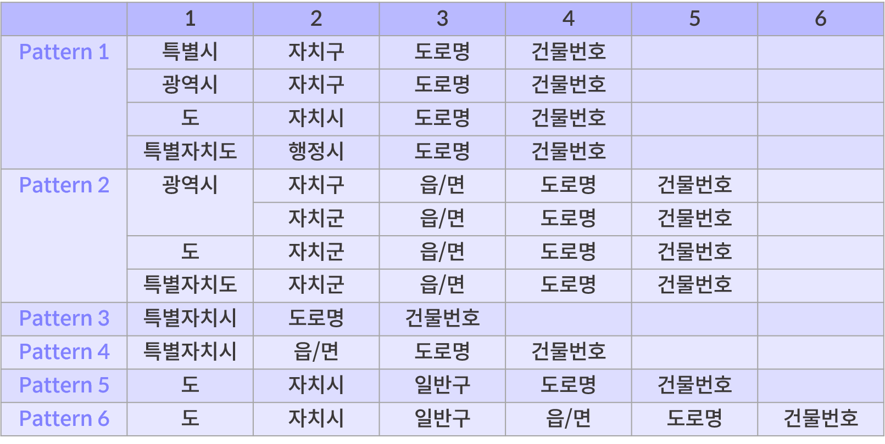

# 4. 도로명주소 유효성 평가 & 정제

<br>

**작성자: 안지은**

앞선 챕터에서는 도로명주소 데이터에서 흔히 나타나는 오류에 대해 알아봤습니다. 이번 장에서는 공공데이터에 존재하는 도로명주소 데이터의 유효성을 평가하고, 오류 데이터를 정제하는 방법들을 알아봅시다. 

## 평가 테이블 만들기

본격적인 평가에 앞서, 셀 별 값의 오류를 체크할 테이블을 만들어줍시다. 테이블의 명칭은 ``addr_error``로 하겠습니다.

구문오류 체크와 광역자치단체명 축약 여부, 그리고 API 검색 가능 여부를 확인하기 위한 컬럼과 함께,  추후 정제 과정을 위해 검색된 주소를 저장해놓는 컬럼을 생성해줍시다.

```python
datalength = len(df) # 전체 행의 길이
addr_error = pd.DataFrame(np.zeros((datalength, 4)),
    columns=["pattern","unvalid_city","exist","API_addr"])
addr_error["data"] = df['소재지도로명주소'] # 확인을 위한 원본 데이터
```


## 오류유형 패턴을 통한 유효성 평가

정규표현식을 활용하여 오류유형 패턴에 해당하는 주소들을 탐색하고, 정제해봅시다. 행정구역별로 오류 유형을 탐색하는 패턴 규칙을 나타내는 표 입니다.

<figure class="flex flex-col items-center justify-center">
    
</figure>

아래는 표에 제시된 패턴 규칙을 구현한 정규표현식 코드입니다. 

```python
# 특별/광역시/특별자치도/도 + 구/자치시/행정시 + 도로명 + 건물번호
pattern1 = r"(?P<province>[가-힣]+)(?:특별시|광역시|특별자치도|도)\s+(?P<city>[가-힣]+)(시|구)\s+(?P<road>[가-힣\d]+)(?:로|길)\s+(?P<number>[\d])" 

# 광역시/도/특별자치도 + 자치구/군 + 읍/면 + 도로명 + 건물번호
pattern2 = r"(?P<province>[가-힣]+)(?:도|광역시|특별자치도)\s+(?P<city>[가-힣]+)(시|군|구)\s+(?P<local>[가-힣]+)(읍|면)\s+(?P<road>[가-힣\d]+)(?:로|길)\s+(?P<number>[\d])" 

# 특별자치시 + 읍/면 + 도로명 + 건물번호
pattern3 = r"(?P<province>[가-힣]+)(?:특별자치시)\s+(?P<type>[가-힣]+)(?:읍|면)\s+(?P<road>[가-힣\d]+)(?:로|길)\s+(?P<number>[\d])"

# 특별자치시 + 도로명 + 건물번호
pattern4 = r"(?P<province>[가-힣]+)(?:특별자치시)\s+(?P<road>[가-힣\d]+)(?:로|길)\s+(?P<number>[\d])"

# 특별자치도/도 + 자치/행정시 + 일반구 + 도로명 + 건물번호
pattern5 = r"(?P<province>[가-힣]+)(?:도|특별자치도)\s+(?P<city>[가-힣]+)(?:시)\s+(?P<type>[가-힣]+)(?:구)\s+(?P<road>[가-힣\d]+)(?:로|길)\s+(?P<number>[\d])" 

# 특별자치도/도 + 자치/행정시 + 일반구 + 읍/면 + 도로명 + 건물번호
pattern6 = r"(?P<province>[가-힣]+)(?:도|특별자치도)\s+(?P<city>[가-힣]+)(?:시)\s+(?P<type>[가-힣]+)(?:구)\s+(?P<local>[가-힣]+)(?:읍|면)\s+(?P<road>[가-힣\d]+)(?:로|길)\s+(?P<number>[\d])" 
```

위의 패턴들을 적용해 구문오류를 탐색한 후에는, 특별시/광역시/특별자치도/특별자치시와 같은 광역자치단체명의 누락을 찾아냅니다. 이 과정들을 모두 반영하여 주소의 구문 오류를 탐색하는 함수를 작성하면 아래의 코드와 같습니다.

```python
def element_check(i):
    item = df['소재지도로명주소'][i]
    if item != None:
        # 패턴을 통한 구문 오류 체크
        if re.match(pattern1, item) or re.match(pattern2, item) or re.match(pattern3, item) or re.match(pattern4, item) or re.match(pattern5, item) or re.match(pattern6, item):
            addr_error["pattern"][i] = 0
            
        else:
            addr_error["pattern"][i] = 1
            
        # 축약된 광역자치단체명 체크    
        sido = df['소재지도로명주소'][i].split(" ")[0]
        print(sido)
        if sido in sido_map.keys():
            addr_error["unvalid_city"][i] = 1
        else:
            addr_error["unvalid_city"][i] = 0
    # 공백값
    else:
        addr_error["pattern"][i] = None
        addr_error["unvalid_city"][i] = None
            
df.index.map(lambda i: element_check(i))
```
이제 오류 행만 뽑아서 정제해봅시다. 


## API를 통한 유효성 평가 & 정제


### 1. 실존하지 않는 주소 탐색하기

멸실 건축물이거나 존재하지 않는 주소를 탐색합니다.

### 2. 첨부사항 추가하기

인구데이터는 읍/면/행정동 단위도 구성되어 있습니다. 행정동이 첨부사항으로 기재되어 있지 않은 데이터들을 보완해줍시다.


## 데이터 합치기

이제, 도로명주소 컬럼의 데이터를 활용해 인구 데이터와 합치기 위한 키 컬럼을 만들어줍시다.