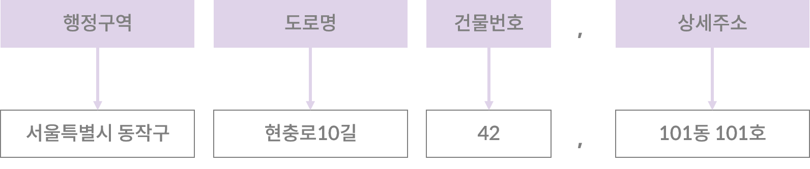
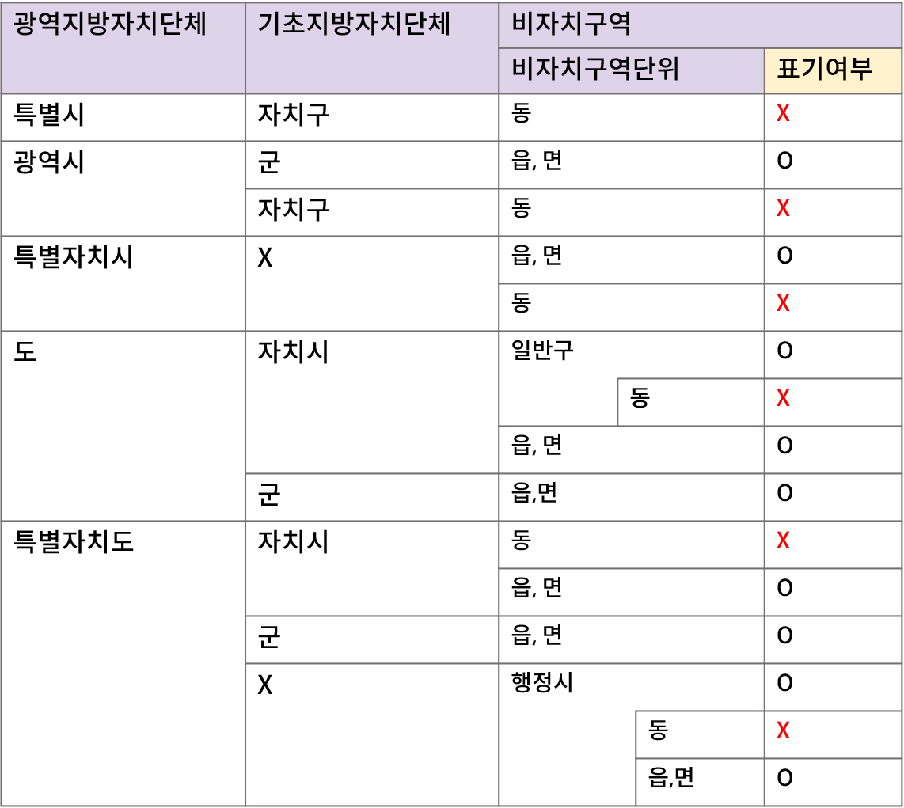

# (이동). 도로명주소 구성요소 알아보기 

 

#### 작성자: 안지은

한국의 주소 체계는 두 가지입니다. 하나는 구획된 땅에 부여된 일련번호(지번)로 주소가 정해지는 방식인 **지번주소**이고, 다른 하나는 도로를 기준으로 건물 위치에 따라 번호를 부여하는 **도로명주소** 방식입니다. 따라서 지번주소에서는 번지(番地)를, 도로명주소에서는 로(路)를 사용하는 것입니다.

## 지번주소와 도로명주소의 비교

지번주소에서 사용하는 읍/면/동은 크게 땅을 나눈 뒤 붙여진 지명이고, 그 읍/면/동, 또 통/리로 다시 땅을 잘게 나눠 토지 번호를 부여합니다. 1번지, 2번지가 바로 토지번호입니다. 동일 토지번호 구획 안에서 다시 구획을 나누는 것도 가능합니다. 이경우 "1-2"와 같은 형식으로 지번이 부여됩니다.

'동'은 법정동과 행정동이 존재하는데요, 이는 한 동 안에 거주민이 너무 많은 경우, 행정 업무의 효율화를 위해 행정동을 다시 분할한 것입니다. 행정동은 대체로 행정업무에서만 사용되고, 길을 찾거나, 주소를 알려주는 등의 실생활에서는 거의 법정동을 사용합니다.  

지번의 경우, 단순히 땅을 구획화하여 번호를 붙이는 방식이다 보니, 도로나 건물이 없는 곳에도 일괄적으로 주소를 부여할 수 있습니다. 다만, 만일 해당 토지를 임야대장과 임야도에 등록하는 경우, 지번 앞에 "산"을 붙입니다. 

이처럼 지번주소는 토지 중심의 관점으로 구성된 체계이므로, 현행법에서는 부동산등기 기입 주소로 지번주소만을 인정하고 있습니다.

도로명주소는 '건물' 관점의 주소입니다. 건물이 있는 곳에 길이 있다는 전제 하에 주소가 부여된다는 건데요. 도로명주소는 건물의 출입구가 어느 도로를 향하는지, 그리고 도로의 어느 지점에 건물이 위치하는지에 따라 도로명과 건물번호가 부여됩니다. 

따라서, 도로명주소에서는 땅을 구획하기 위해 존재했던 '동'을 표기하지 않습니다. 대신 '읍/면'은 그대로 유지됐습니다. (이유추가필요)

## 도로명주소의 구성요소

도로명주소는 **행정구역 + 도로명 + 건물번호 + 상세주소**로 구성됩니다. 경우에 따라 참고항목이 포함되기도 합니다. 

<figure class="flex flex-col items-center justify-center">
    
</figure>

## 1. 행정구역

도로명주소에서 기입하는 행정구역은 대체로 지번주소의 행정구역을 따릅니다. 하지만, 도로명주소에서는 '동'과 '통','리'와 같은 행정구역은 기입하지 않습니다. 

하지만, '읍, 면'의 경우는 기입 대상에 포함됩니다. 도로명주소에 기입할 수 있는 행정구역 단위를 정리하면 아래 표와 같습니다.

<figure class="flex flex-col items-center justify-center">
    
</figure>

단순히 '동'을 제외한 '읍/면' 단위까지만 기입한다고 생각하면 됩니다. 제주특별자치도의 경우, 기초지방단체가 존재하지 않으며, 따라서 행정시와 그 하위 구역인 읍, 면, 동으로 구성됩니다. 이 경우에도 마찬가지로 읍, 면 단위만 기재하고 동 단위는 기재하지 않습니다. 세종특별자치시의 경우, 읍/면 단위만 기재하고 동 단위는 기재하지 않습니다. 

## 2. 도로명

도로의 종류는 순서대로 길(2차로 미만)➡️로(2-7차로)➡️대로(8차로 이상) 순으로 넓어집니다. 도로명은 각각 '대로', '로'만으로도 구성될 수도 있고, 골목길과 같이 큰 길에서 분기되는 좁은 길에 대해서는'대로/로'에 '길'을 붙여 도로명을 부여합니다. 

골목길, 즉 '길'의 부여방식으로는 일련번호 부여방식, 기초번호 부여방식 등이 있습니다.

우선, 대로와 로에는 기초번호라는 것이 부여됩니다. 대로/로의 기점에서 왼쪽에는 홀수번호가, 우측에는 짝수번호가 부여됩니다. 

기초번호는 해당 길에서 분기되는 길의 명칭 부여에도 사용될 수 있습니다. 하지만 기초 번호와 관계 없는, 해당 길만의 일련번호를 부여하는 것도 가능합니다.

그렇게 된다면, 만약 '대학로'에서 분기된 '길' 에 대해 일련번호 방식으로 주소를 부여하게 되면, '대학로1길' 처럼 부여됩니다.

기초번호로 부여하게 된다면, 만약 '논골로'에서 분기된 '길' 에 대해 기초번호 방식으로 주소를 부여하면 기초번호 10번 지점에서 분기된 길의 주소는 '논골로10번길'이 됩니다.

물론 대로나 로의 명칭을 사용하지 않고 지역 특성에 맞춘 명사와 일련번호를 부여하는 방식도 있습니다. 예를 들어 '사직1길'의 경우 '중앙로'에서 분기된 길이지만, '중앙로1길' 대신 지역명칭인 '사직'을 사용헤 도로명을 부여하였습니다.

골목길이 일직선은 아닐텐데요, 이렇게 길에서 또 추가적으로 분기되는 길에 대해서는 '가, 나, 다'를 붙여줍니다. 예를들어 '청파로71길'에서 어떤 분기되는 길에 대해선 '청파로71가길'이라는 도로명을 부여합니다.

## 3. 건물번호

건물 번호는 본번과 부번으로 구성됩니다. 본번은 출입구가 향하는 도로의 기초번호를 부여하고, 부번은 기초번호 구역에 다수의 건물이 밀집한 경우, 개별 건물마다 부속 번호를 부여하는 것입니다.

본번만 존재하는 경우는 '흑석로 84'와 같이 도로명에서 본번만 띄어 씁니다. 부번의 경우 'XX로 1-2'와 같이, 본번에 '-' 쓰고 부번을 이어서 기입합니다. 

건물주가 원한다면 건물번호를 변경하는 것도 가능합니다. 물론 이 경우 주소 부여기관에서 충분히 타당성을 검토합니다. 또한 건물번호는 건물의 소유자나 점유인이 없어 더이상 해당 주소를 사용할 수 없는 경우, 혹은 해당 건물이 헐린 경우 폐지 될 수 있습니다.

부여원칙에는 두 가지 예외가 있습니다.

> **예외 1:  한 건물에 여러 개의 건물번호가 부여될 수 있습니다.**

대표적인 예시로 코엑스를 들 수 있습니다. 코엑스는 건물이 하나지만, 다수의 출입구를 갖고 있으며, 각 층마다도 출입구가 존재합니다.  (내용추가필요)

> **예외 2: 다수의 건물에 하나의 건물번호가 부여될 수 있습니다.**

아파트 단지의 규모로 본다면 코엑스와 비슷할 수도 있겠습니다. 아파트 단지의 경우 보통 단지 안에 들어가서 동 번호로 건물을 찾습니다. 각각의 동 건물의 출입구가 향하는 도로도 다를 것입니다. 만약, 동 건물마다의 출입구를 기준으로 동마다 주소를 부여한다면, 안그래도 도로명 주소의 경우 '아파트'의 명칭을 사용할 수 없는데, 하나의 단지에 대해서 조각조각 다른 주소를 갖게 될 것입니다. 특히 배달기사들의 혼란이 가중 될 것입니다.

그러므로 아파트와 같은, 담장 등으로 둘러싸여서 실제로 하나의 집단으로 구획되어 있으며 하나의 건축물대장이나 하나의 집합건축물대장의 총괄표제부에 같이 등록되어 있는 경우는 하나의 주소, 즉 하나의 도로명과 건물번호를 부여받게 됩니다.

## 4. 상세주소

상세주소란, 도로명주소의 건물번호 뒤에 표시되는 동층호 정보입니다. 상세주소의 부여 대상 건물은 원룸이나 다가구 주택, 단독주택 중 2가구 이상 거주하는 주택, 일반 상가, 업무용 빌딩 등, 세대가 각각의 출입구를 가지며 분리되어 있으며 둘 이상의 세대주를 가질 수 있는 임대 건물입니다. 

## 5. 참고항목

참고항목은 법정동과 공동주택 명칭에 대한 정보입니다. 참고항목까지 기입한 주소를 완전한 주소로 보나, 기입하지 않은 경우를 오류 주소로 평가하지는 않습니다. 참고항목은 주소의 맨 마지막 요소 뒤에 띄어쓰기 없이 소괄호를 이용하여 기입합니다. 기입순서는 법정동, 공동주택 명칭 순서이고 해당사항이 없는 경우 둘 중 한 항목만 기입하거나 아예 기입하지 않아도 됩니다.