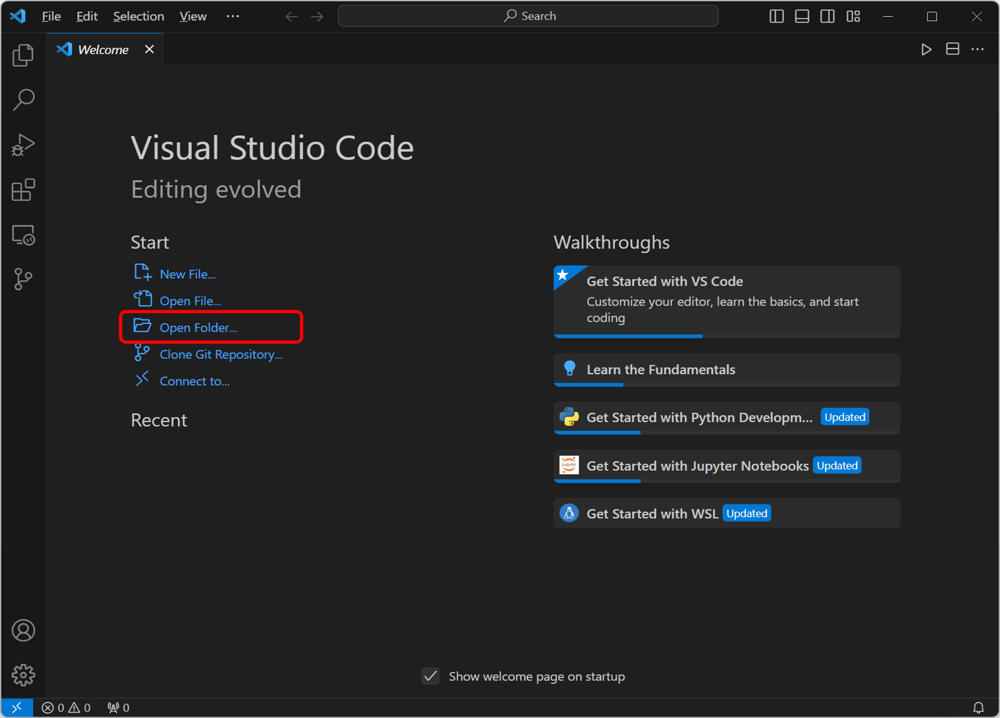

# 1. 프로젝트 소개

 

#### 작성자: 최은혜

5장에서는 Python과 flask를 이용하여 API 데이터를 호출해오는 간단한 웹 서버를 구축하는 과정을 다룹니다. 이 장을 학습하고 나면 API를 활용하여 외부 서버의 데이터를 요청하고, 우리만의 웹 서버를 만들고, 우리의 서버에서 외부 API 데이터를 활용할 수 있습니다. 실습은 Visual Studio code를 사용하여 진행합니다.

## 학습 내용

## Visual Studio Code(VS Code) 사용법

Visual Studio code는 마이크로소프트사에서 개발한 무료 코드 편집 프로그램 입니다. Visual Studio code는 가볍고, 대부분의 사양과 모든 운영체제에서 사용이 가능합니다. 다양한 프로그래밍 언어를 지원하며 생산성을 향상시키는 편리한 확장 기능도 많아서 대중적으로 사용되고 있습니다.

### 1. Python 설치하기
Visual Studio Code를 설치하기에 앞서 Python 프로그램을 설치하도록 하겠습니다. 
Visual Studio Code는 코드 "편집기"이기 때문에 Python 프로그래밍을 하기 위해서는 Python 프로그램을 따로 설치해야합니다. 이미 Python이 설치되어있다면 이 과정은 생략해도 괜찮습니다.

Python 프로그램을 공식사이트에서 직접 다운로드해도 괜찮지만, 저희는 Anaconda(아나콘다)라는 프로그램 설치를 통해 Python을 설치해보겠습니다. 아나콘다는 Python 프로그래밍을 위한 여러 도구를 모아둔 패키지와 같은 프로그램으로 이해할 수 있습니다.

설치를 위해 아나콘다 공식 사이트의 다운로드 페이지에 접속합니다.

[https://www.anaconda.com/download](https://www.anaconda.com/download)

<figure class="flex flex-col items-center justify-center">
    
    <figcaption style="text-align: center;"></figcaption>
</figure>

하단의 Free Download 버튼을 클릭하여 프로그램을 다운로드 받습니다. 자신의 운영체제에 맞는 프로그램을 버튼 하단의 운영체제 아이콘을 통해 선택하여 다운로드할 수 있습니다.

다운로드가 완료되면 파일을 실행하여 설치를 진행합니다. 

Next > I Agree > Just Me 

### 2. Visual Studio Code 설치하기
이제 Visual Studio Code를 설치하도록 하겠습니다. Visual Studio Code 공식 사이트에 접속합니다.

[https://code.visualstudio.com](https://code.visualstudio.com/)

<figure class="flex flex-col items-center justify-center">
    
    <figcaption style="text-align: center;"></figcaption>
</figure>

좌측에 있는 Download for Windows 버튼을 클릭하여 프로그램을 다운로드 받습니다. MacOS, Linux등 다른 운영체제를 사용 중이라면 버튼 오른쪽의 아래 방향 화살표를 눌러서 운영체제에 맞는 프로그램을 선택하여 다운로드 받으면 됩니다. 다운로드가 완료되면 파일을 실행하여 설치를 진행하빈다.

### 3. Visual Studio code 사용하기

설치한 Visual Studio code를 실행합니다.

<figure class="flex flex-col items-center justify-center">
    
    <figcaption style="text-align: center;"></figcaption>
</figure>

Open Folder를 클릭하여 이후 작업을 진행할 폴더를 선택해줍니다.

 

<figure class="flex flex-col items-center justify-center">
    
    <figcaption style="text-align: center;"></figcaption>
</figure>

위와 같이 선택한 폴더(VS CODE TEST)이 열린 것을 확인할 수 있습니다. 이제 이곳에서 자유롭게 파일을 생성하여 작업을 진행할 수 있습니다. 우리는 Python 실습을 먼저 진행할 것이기 때문에 .ipynb(Python Notebook) 파일을 생성해보도록 하겠습니다. 폴더명(VS CODE TEST) 부분에 커서를 올려봅시다.

 

<figure class="flex flex-col items-center justify-center">
    
    <figcaption style="text-align: center;"></figcaption>
</figure>

커서를 올리면 새 파일을 생성하는 버튼이 표시됩니다. New File 버튼을 클릭해서 새 파일을 생성합니다. 생성버튼을 누르면 새 파일명을 바로 지정할 수 있는데, "api test.ipynb"와 같이 확장자를 ipynb로 지정하여 파일명을 작성하면 ipynb 파일을 생성할 수 있습니다.

 

<figure class="flex flex-col items-center justify-center">
    
    <figcaption style="text-align: center;"></figcaption>
</figure>

ipynb 파일이 생성된 것을 확인할 수 있습니다. 이제 여기서 코드 작업을 진행하면 됩니다.

### 4. Visual Studio code 확장 기능 이용하기

