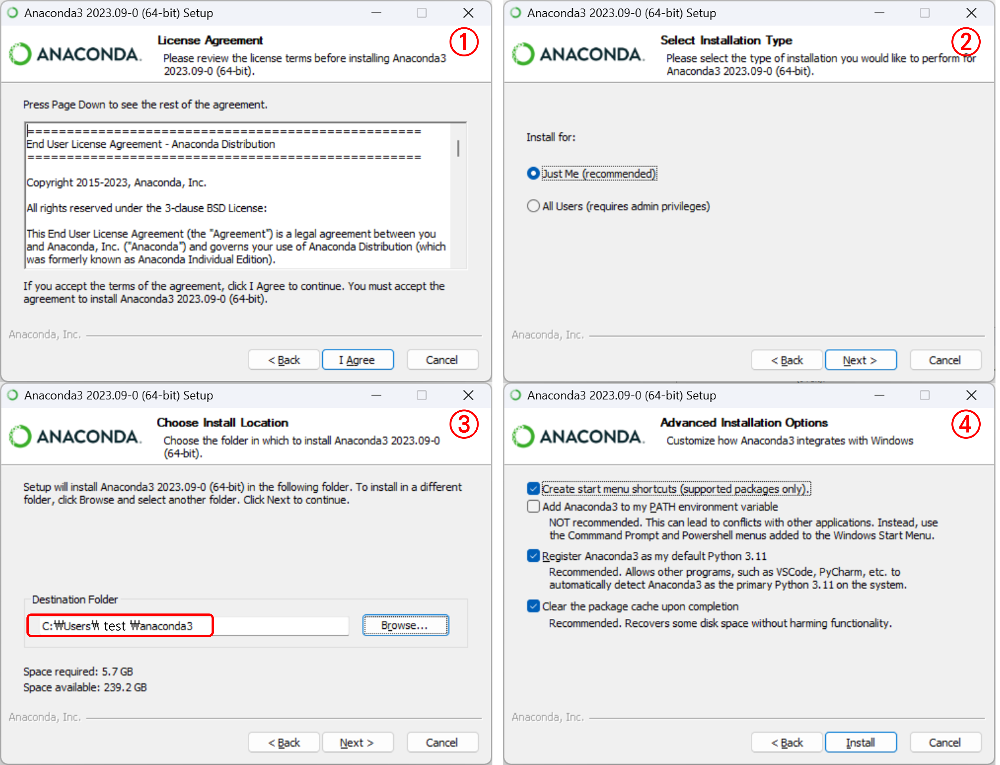

# 1. 프로젝트 소개

 

#### 작성자: 최은혜

5장에서는 주소 데이터를 활용하여 API를 호출하거나, 직접 API를 만들어보는 과정을 다룹니다. API를 활용하여 외부 서버의 주소 데이터를 요청하고, 그 데이터를 활용하는 우리만의 주소 검색 API를 만들어봅니다. 실습은 Visual Studio code를 사용하여 진행합니다.

## 학습 내용

5장에서 학습할 내용은 다음과 같습니다.

1. API로 데이터 가져오기 
> 주소기반산업지원서비스의 주소 검색 API를 활용하여 주소를 검색하는 방법을 안내합니다. 주소 검색 API를 신청하고, API를 이용하여 특정 주소에 대한 검색 결과를 받아오는 실습을 진행합니다.

 2. Flask로 주소 검색 API 만들기 
>웹 애플리케이션 프레임워크인 Flask를 활용하여 API를 만드는 방법을 안내합니다. 주소기반산업지원 서비스의 주소 검색 API에 내고장알리미 데이터를 연계하여, 주소를 검색하면 그 주소에 대한 행정구역 데이터를 제공하는 우리만의 주소 검색 API를 만드는 실습을 진행합니다.

## Visual Studio Code(VS Code) 사용법

`Visual Studio Code`는 마이크로소프트사에서 개발한 무료 코드 편집 프로그램입니다. `Visual Studio Code`는 가볍고, 대부분의 사양과 모든 운영체제에서 사용이 가능합니다. 다양한 프로그래밍 언어를 지원하며 생산성을 향상시키는 편리한 확장 기능도 많아서 대중적으로 사용되고 있습니다.

### 1. Python 설치하기
`Visual Studio Code`를 설치하기에 앞서 Python 프로그램을 설치하도록 하겠습니다. `Visual Studio Code`는 코드 "편집기"이기 때문에 Python 프로그래밍을 하기 위해서는 Python을 따로 설치해야합니다. Python 프로그램을 공식사이트에서 직접 다운로드해도 괜찮지만, 저희는 Anaconda라는 프로그램 설치를 통해 Python을 설치해보겠습니다. Anaconda는 Python 프로그래밍을 위한 여러 도구를 모아둔 패키지와 같은 프로그램으로 이해할 수 있습니다.
이미 Python이 설치되어있다면 Anaconda 설치 과정을 생략하거나, 설치되어있는 Python을 지우고 진행해야합니다. 기존의 Python과 충돌할 수 있습니다.

설치를 위해 Anaconda 공식 사이트의 다운로드 페이지에 접속합니다.

[https://www.anaconda.com/download](https://www.anaconda.com/download)

<figure class="flex flex-col items-center justify-center">
    
    <figcaption style="text-align: center;"></figcaption>
</figure>

하단의 Free Download 버튼을 클릭하여 프로그램을 다운로드 받습니다. 자신의 운영체제에 맞는 프로그램을 버튼 하단의 운영체제 아이콘을 통해 선택하여 다운로드할 수 있습니다.

다운로드가 완료되면 파일을 실행하여 설치를 진행합니다. 다음과 같은 순서로 option을 선택하여 install하면 됩니다.  

<figure class="flex flex-col items-center justify-center">
    
    <figcaption style="text-align: center;"></figcaption>
</figure>

3번에서 설치 경로를 지정할 때 경로에 한글이 들어가지 않도록 주의합니다.

### 2. Visual Studio Code 설치하기
이제 `Visual Studio Code`를 설치하도록 하겠습니다. `Visual Studio Code` 공식 사이트에 접속합니다.

[https://code.visualstudio.com](https://code.visualstudio.com/)

<figure class="flex flex-col items-center justify-center">
    
    <figcaption style="text-align: center;"></figcaption>
</figure>

좌측에 있는 Download for Windows 버튼을 클릭하여 프로그램을 다운로드 받습니다. MacOS, Linux등 다른 운영체제를 사용 중이라면 버튼 오른쪽의 아래 방향 화살표를 눌러서 운영체제에 맞는 프로그램을 선택하여 다운로드 받으면 됩니다. 다운로드가 완료되면 파일을 실행하여 설치를 진행합니다.

### 3. Visual Studio code 사용하기

설치한 `Visual Studio code`를 실행합니다.

<figure class="flex flex-col items-center justify-center">
    
    <figcaption style="text-align: center;"></figcaption>
</figure>

Open Folder를 클릭하여 이후 작업을 진행할 폴더를 선택해줍니다.

 

<figure class="flex flex-col items-center justify-center">
    
    <figcaption style="text-align: center;"></figcaption>
</figure>

위와 같이 선택한 폴더(VS CODE TEST)이 열린 것을 확인할 수 있습니다. 이제 이곳에서 자유롭게 파일을 생성하여 작업을 진행할 수 있습니다. 우리는 Python 실습을 먼저 진행할 것이기 때문에 .ipynb(Python Notebook) 파일을 생성해보도록 하겠습니다. 폴더명(VS CODE TEST) 부분에 커서를 올려봅시다.

 

<figure class="flex flex-col items-center justify-center">
    
    <figcaption style="text-align: center;"></figcaption>
</figure>

커서를 올리면 새 파일을 생성하는 버튼이 표시됩니다. New File 버튼을 클릭해서 새 파일을 생성합니다. 생성버튼을 누르면 새 파일명을 바로 지정할 수 있는데, "api test.ipynb"와 같이 확장자를 ipynb로 지정하여 파일명을 작성하면 ipynb 파일을 생성할 수 있습니다.

 

<figure class="flex flex-col items-center justify-center">
    
    <figcaption style="text-align: center;"></figcaption>
</figure>

ipynb 파일이 생성된 것을 확인할 수 있습니다. 이제 여기서 코드 작업을 진행하면 됩니다. 

예시로 hello world를 print 해보겠습니다. 코드를 작성하고 실행`Ctrl+Enter`합니다.

<figure class="flex flex-col items-center justify-center">
    
    <figcaption style="text-align: center;"></figcaption>
</figure>

Python 환경을 선택하는 창이 위에 표시됩니다. Python 환경을 클릭해줍니다.

 

<figure class="flex flex-col items-center justify-center">
    
    <figcaption style="text-align: center;"></figcaption>
</figure>

우리가 설치했던 anaconda3가 표시됩니다. anaconda3를 선택해줍니다.

 

<figure class="flex flex-col items-center justify-center">
    
    <figcaption style="text-align: center;"></figcaption>
</figure>

코드가 실행되어 hello world가 print된 것을 확인할 수 있습니다.

### 4. Visual Studio Code 확장 기능 이용하기

`Visual Studio Code`에서는 편리한 확장 기능이 다양하게 제공되고 있습니다. 적절한 확장 기능을 설치하여 사용하면 편리하게 코드 작성을 할 수 있습니다. 
좌측 사이드바의 extension 아이콘을 클릭하면 제공되는 확장 기능을 검색하여 설치할 수 있습니다.

<figure class="flex flex-col items-center justify-center">
    
    <figcaption style="text-align: center;"></figcaption>
</figure>

실습을 더 수월하기 진행하기 위해 몇 가지 편리한 확장 기능을 소개하겠습니다.

1. Korean Language Pack for Visual Studio Code

<figure class="flex flex-col items-center justify-center">
    
    <figcaption style="text-align: center;"></figcaption>
</figure>

Visual Studio Code의 한국어 UI를 지원하는 확장 기능입니다. 적용하면 Visual Studio Code의 UI가 모두 한국어로 표시되는 것을 확인할 수 있습니다.

2. Python

<figure class="flex flex-col items-center justify-center">
    
    <figcaption style="text-align: center;"></figcaption>
</figure>

Python 프로그램 작성을 지원해주는 확장 기능입니다. Python 문법 오류 체크, 자동 완성 제안 등 편리한 기능을 제공합니다.

