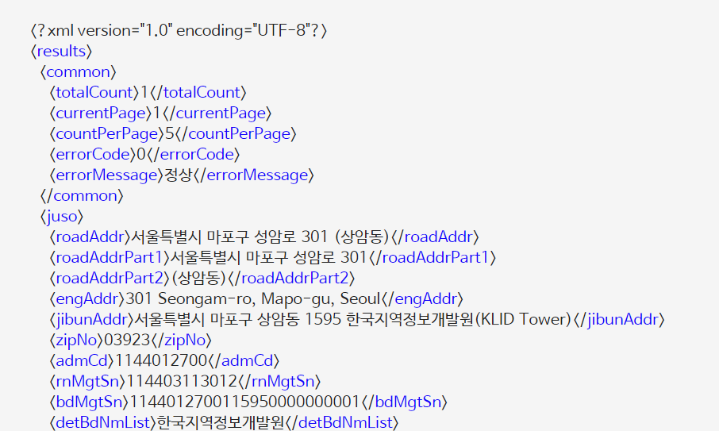
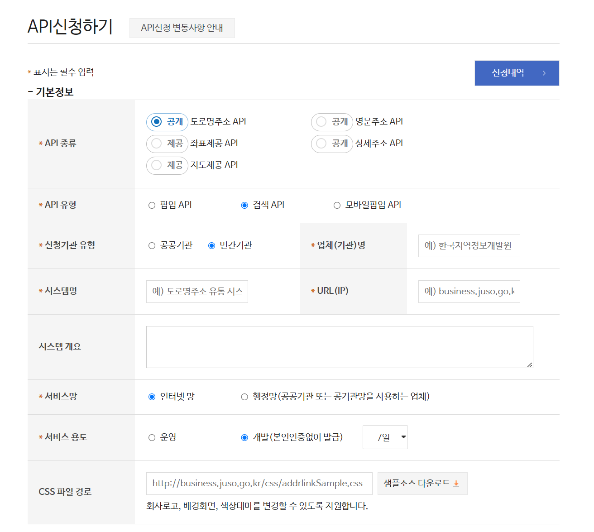
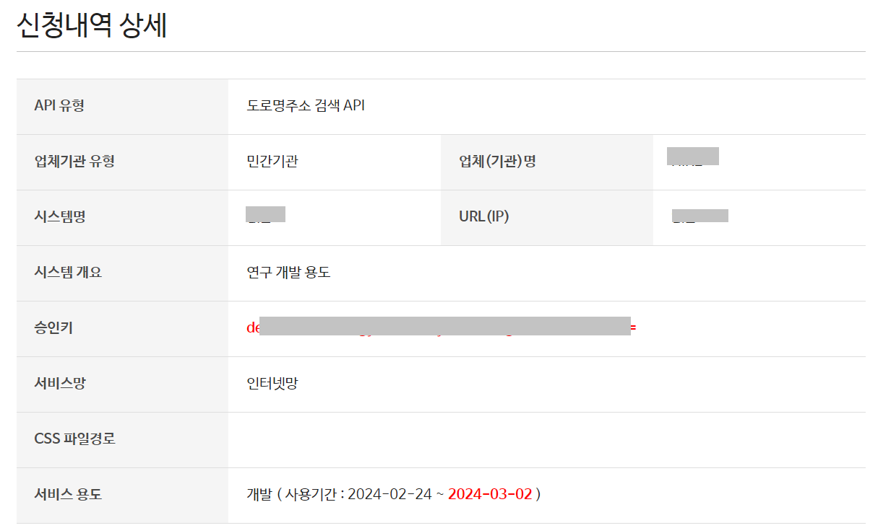

# 2. API 신청하기

 

#### 작성자: 박예준

## API 신청하기
이번에는 주소기반산업지원서비스의 검색 API를 이용하여 주소 검색 API를 신청하고 만들어 봅니다.
### 주소기반산업지원서비스의 검색 API란
주소기반산업지원서비스에서 제공하는 도로명주소 검색 API는 검색어를 파라미터로 입력하면 관련 주소와 그 주소의 우편번호, 시군구코드 등 관련 정보를 xml 또는 json으로 제공하는 API서비스 입니다.

도로명주소 검색 API는 URL형태로 제공되고, 요청 URL과 파라미터를 호출하여 사용합니다. 
이 때 API 승인KEY가 발급되어있어야 합니다. API승인 KEY 발급 방법에 대해서는 이후에 설명합니다.

 

<figure class="flex flex-col items-center justify-center">
    
</figure>

API 출력결과 예시

### API 신청 방법
앞서 말했듯이 API호출에는 API승인 KEY가 필요합니다. KEY발급 절차는 다음과 같습니다.

[주소기반산업지원서비스 API신청](https://business.juso.go.kr/addrlink/openApi/apiReqst.do) 페이지에 접속하여 API신청 화면으로 넘어가면 아래 이미지와 같이 신청 양식이 있습니다.

<figure class="flex flex-col items-center justify-center">
    
</figure>
우리가 필요한 API 종류는 도로명주소 API이고, API유형은 검색 API입니다. 그 아래로는 사용자 환경에 맞게 체크, 작성합니다. 

서비스 용도가 운영인 경우 본인인증이 필요하고, 개발인 경우 최소 7일 ~ 최대 90일까지 본인인증 없이 테스트용으로 제공됩니다. 

개발 용도로 신청하면 아래와 같이 승인 KEY가 즉시 발급됩니다.

<figure class="flex flex-col items-center justify-center">
    
</figure>

### 파이썬으로 API 불러오기

이제 파이썬 코드를 이용해 검색 API를 호출해봅니다.

필수 파라미터를 입력해주고, 검색결과 형식을 json으로 표현합니다.
