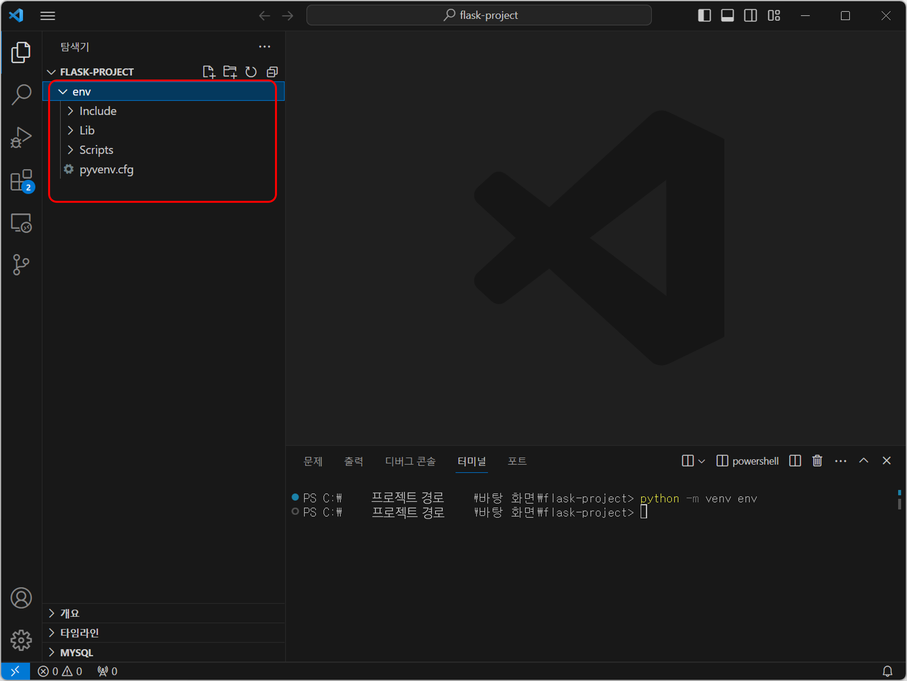

# 3. Flask로 주소 검색 API 만들기

<br>

#### 작성자: 최은혜

이번 장에서는 파이썬 웹 프레임워크인 Flask를 활용하여 API를 만드는 방법을 안내합니다. 주소기반산업지원서비스의 주소 검색 API에 내고장알리미 데이터를 연계하여, 주소를 검색하면 그 주소에 대한 행정구역 데이터를 제공하는 우리만의 주소 검색 API를 만드는 실습을 진행합니다.

## Flask 개발 환경 세팅하기

Flask는 파이썬 웹 프레임워크입니다. 웹 프레임워크라고 하는 것은 웹사이트, 웹 애플리케이션을 더 쉽게 개발할 수 있도록 미리 만들어 놓은 일종의 틀(Frame)이라고 설명할 수 있습니다. Flask는 그 중에서도 가볍고 코드가 단순하기 때문에 간단한 웹사이트 등을 개발하는 데 특화된 프레임워크입니다.

### 1. 가상환경 사용하기

Flask로 서버를 개발하는 과정에서 보통 서버 구현에 필요한 다양한 패키지들을 추가로 설치하게 됩니다. 다양한 라이브러리나 패키지 등을 설치하다보면 원래 사용하던 노트북 환경의 상태가 변화하여 다른 작업을 할 때 문제가 발생할 수 있기 때문에 가상환경을 생성하여 그곳에서 작업을 진행하는 것이 일반적입니다. 

#### 가상환경 생성하기
먼저 프로젝트를 진행할 폴더를 만들어서 Visual Studio Coded에서 폴더를 열어줍니다.

<figure class="flex flex-col items-center justify-center">
    
</figure>

<br>

`Ctrl + ~`를 눌러서 Visual Studio Code의 터미널을 열어줍니다.

<figure class="flex flex-col items-center justify-center">
    
</figure>

<br>
터미널에 다음과 같이 입력하고 `enter`를 누릅니다. 가상환경을 생성하는 코드입니다.

```
python -m venv env
```
이 명령어에서 `python -m venv`는 파이썬의 venv라는 가상환경 모듈을 사용하겠다는 의미입니다. env는 우리가 생성할 가상환경의 이름을 입력한 것으로, 꼭 env로 이름을 지을 필요는 없습니다. 

<br>
잠시 후 우리의 프로젝트 폴더에 다음과 같이 env라는 폴더가 생긴 것을 확인할 수 있습니다.
<figure class="flex flex-col items-center justify-center">
    
</figure>

가상환경은 서버 환경 개발 작업을 최초로 진행할 때 한 번만 생성하면 됩니다. 이후에 이어서 작업할 때는 이미 만들어 놓은 가상환경에 진입만 하면됩니다.

<br>

#### 가상환경 진입하기

터미널에 다시 다음과 같이 명령어를 입력하고 `enter`를 누릅니다. 가상환경을 활성화하는 코드입니다.
```
env\Scripts\activate
```
<br>

터미널의 프로젝트 경로 앞에 `(env)`가 생긴 것을 확인할 수 있습니다. 가상환경에 진입했다는 표시입니다. Flask 서버 개발 작업을 할 때는 이렇게 가상환경에 진입하여 작업을 진행하면 됩니다. 
<figure class="flex flex-col items-center justify-center">
    
</figure>

가상환경에서 나오려면 터미널에 `deactivate`를 입력해주면됩니다.


### 2. Flask 설치하기

이제 Flask를 설치해보도록 하겠습니다. 가상환경에 진입했는지 확인하고 터미널에 다음 명령어를 실행하여 Flask를 설치해줍니다. 

```
pip install flask
```

## Flask로 API 서버 개발하기

### 1. Flask 애플리케이션 생성하기

먼저 프로젝트 폴더에 서버를 실행하는 파일을 만들어줍니다. 파일 이름은 main.py로 하겠습니다.

flask를 import 하고 객체 인스턴스를 생성해줍니다.

```
#main.py

from flask import Flask

#객체 인스턴스 생성
app = Flask(__name__)

```

기본 접속 url을 설정하고 로컬 환경에서 서버를 실행하는 코드를 작성합니다.
```
#기본 접속 url
@app.route('/')
def index():
    return "Flask server is running" #url 접속시 문구 출력

if __name__ == "__main__":
    app.run(host="0.0.0.0", port=5001, debug=True)
```

이렇게 만든 실행파일 main.py는 가상환경에 진입하고 터미널에 다음과 같이 입력하여 실행합니다.
```
python main.py
```

터미널에 접속 주소가 표시됩니다.<br>
<이미지>

해당 url에 접속하면 지정한 문구가 출력되는 것을 볼 수 있습니다.
<br>
<이미지>

이렇게 Flask는 `@app.route()`를 추가하는 방식으로 웹 페이지를 추가하고 연결합니다. (Python 데코레이터)

## 내고장알리미 데이터 연계하기

### 1. 내고장알리미 데이터란?
[내고장알리미 https://www.laiis.go.kr/myMain.do](https://www.laiis.go.kr/myMain.do) (지방행정종합정보시스템)는 지방자치단체의 행정구역 현황, 단체장, 새소식, 문화관광, 상품권 등의 정보를 종합적으로 제공하는 웹 사이트입니다.
우리가 연계하려는 내고장알리미 데이터는 이 웹사이트에서 제공하는 시군구에 대한 정보를 크롤링해서 csv로 만든 데이터입니다. 

[내고장알리미 데이터 파일 다운로드](./mygojang-crawling-data-2024-02-26.csv)

### 2. 검색 API와 내고장알리미 데이터 연계하기

5-2장에서 작성한 코드로 불러온 주소기반산업지원서비스 API와 내고장알리미 데이터를 시군구코드 기준으로 연계해보겠습니다.

API데이터에서 시군구코드를 보여주는 컬럼은 admCd입니다. 그런데 이 컬럼은 행정동까지 식별하는 행정동코드를 의미하기 때문에 시군구까지만 나타내는 앞 5자리에 00000을 붙여서 시군구코드 10자리를 만들어줍니다. 

```
#주소기반산업지원서비스 API

url = "https://business.juso.go.kr/addrlink/addrLinkApi.do"
params = {
    "confmKey":"발급받은 API 승인 KEY",
    "currentPage":"1",
    "countPerPage":"10",
    "keyword": keyword, 
    "resultType":"json"
}

# Keyword로 검색된 결과
result = requests.get(url, params=params)
admCd = result.json()['results']['juso'][0]['admCd'] #행정동코드
search_code = int(admCd[:5]+'00000') #시군구코드 
```

내고장알리미 데이터에서 `search_code`에 저장된 시군구코드 값을 DIST_CODE(시군구코드)로 가지는 행을 json형태로 출력하게 합니다.

```
# 내고장알리미 데이터에서 시군구코드 일치하는 데이터 반환
mygojang = pd.read_csv('mygojang-crawling-data-2024-02-26.csv') # 내고장알리미 데이터
result = mygojang.loc[mygojang['DIST_CODE']==search_code].T.iloc[:,0]
result.to_json(force_ascii=False)
```


### 3. 주소 검색 API 만들기
<br> 


이제 위 코드를 출력하는 라우터를 추가하여 API를 만듭니다. 이 때, url의 `<keyword>`는 검색어가 들어갈 변수입니다. 
<br>예를 들어, `127.0.0.1:5001/address/정부세종청사/`를 url로 입력하면 검색어는 '정부세종청사'가 되는 것입니다.

```
@app.route('/address/<keyword>/')
def address(keyword):
    # 주소기반산업지원서비스 주소 검색 API 호출
    keyword = '정부세종청사' #검색 키워드
    url = "https://business.juso.go.kr/addrlink/addrLinkApi.do"
    params = {
        "confmKey":"발급받은 API 승인 KEY",
        "currentPage":"1",
        "countPerPage":"10",
        "keyword": keyword,
        "resultType":"json"
    }

    # Keyword로 검색된 결과
    result = requests.get(url, params=params)
    admCd = result.json()['results']['juso'][0]['admCd']
    search_code = int(admCd[:5]+'00000')

    # 내고장알리미 데이터에서 시군구코드 일치하는 데이터 반환
    mygojang = pd.read_csv('mygojang-crawling-data-2024-02-26.csv') # 내고장알리미 데이터
    result = mygojang.loc[mygojang['DIST_CODE']==search_code].T.iloc[:,0]
    return result.to_json(force_ascii=False)
```