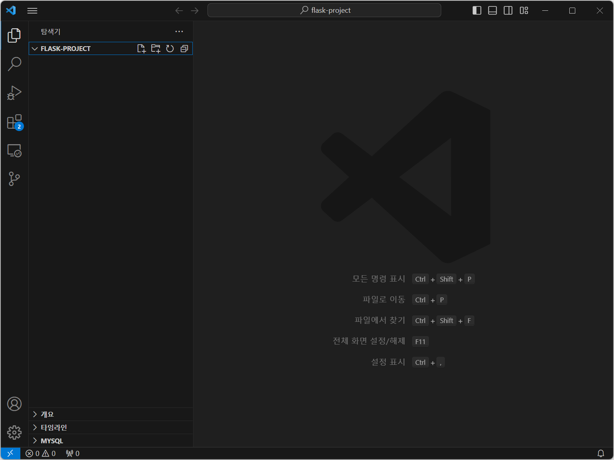
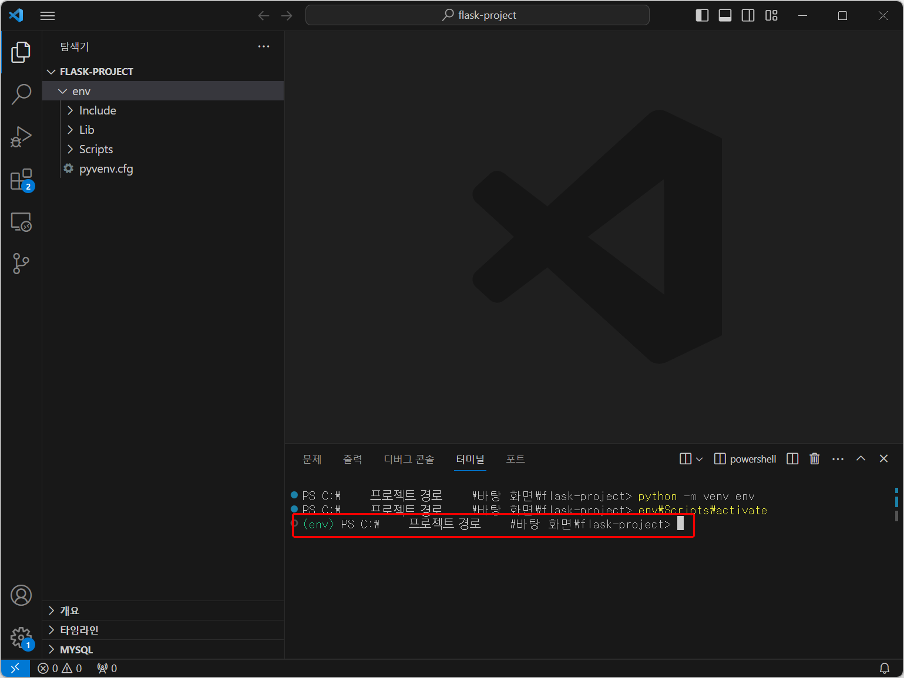

# 3. Flask로 주소 검색 API 만들기

<br>

#### 작성자: 최은혜

이번 장에서는 파이썬 웹 프레임워크인 Flask를 활용하여 API를 만드는 방법을 안내합니다. 주소기반산업지원서비스의 주소 검색 API에 내고장알리미 데이터를 연계하여, 주소를 검색하면 그 주소에 대한 행정구역 데이터를 제공하는 우리만의 주소 검색 API를 만드는 실습을 진행합니다.

## Flask 개발 환경 세팅하기

Flask는 파이썬 웹 프레임워크입니다. 웹 프레임워크라고 하는 것은 웹사이트, 웹 애플리케이션을 더 쉽게 개발할 수 있도록 미리 만들어 놓은 일종의 틀(Frame)이라고 설명할 수 있습니다. Flask는 그 중에서도 가볍고 코드가 단순하기 때문에 간단한 웹사이트 등을 개발하는 데 특화된 프레임워크입니다.

### 1. 가상환경 사용하기

Flask로 서버를 개발하는 과정에서 보통 서버 구현에 필요한 다양한 패키지들을 추가로 설치하게 됩니다. 다양한 라이브러리나 패키지 등을 설치하다보면 원래 사용하던 노트북 환경의 상태가 변화하여 다른 작업을 할 때 문제가 발생할 수 있기 때문에 가상환경을 생성하여 그곳에서 작업을 진행하는 것이 일반적입니다. 

#### 가상환경 생성하기
먼저 프로젝트를 진행할 폴더를 만들어서 Visual Studio Coded에서 폴더를 열어줍니다.

<figure class="flex flex-col items-center justify-center">
    
</figure>

<br>

`Ctrl + ~`를 눌러서 Visual Studio Code의 터미널을 열어줍니다.

<figure class="flex flex-col items-center justify-center">
    
</figure>

<br>
터미널에 다음과 같이 입력하고 `enter`를 누릅니다. 가상환경을 생성하는 코드입니다.

```
python -m venv env
```
이 명령어에서 `python -m venv`는 파이썬의 venv라는 가상환경 모듈을 사용하겠다는 의미입니다. env는 우리가 생성할 가상환경의 이름을 입력한 것으로, 꼭 env로 이름을 지을 필요는 없습니다. 

<br>
잠시 후 우리의 프로젝트 폴더에 다음과 같이 env라는 폴더가 생긴 것을 확인할 수 있습니다.
<figure class="flex flex-col items-center justify-center">
    
</figure>

가상환경은 서버 환경 개발 작업을 최초로 진행할 때 한 번만 생성하면 됩니다. 이후에 이어서 작업할 때는 이미 만들어 놓은 가상환경에 진입만 하면됩니다.

<br>

#### 가상환경 진입하기

터미널에 다시 다음과 같이 명령어를 입력하고 `enter`를 누릅니다. 가상환경을 활성화하는 코드입니다.
```
env\Scripts\activate
```
<br>

터미널의 프로젝트 경로 앞에 `(env)`가 생긴 것을 확인할 수 있습니다. 가상환경에 진입했다는 표시입니다. Flask 서버 개발 작업을 할 때는 이렇게 가상환경에 진입하여 작업을 진행하면 됩니다. 
<figure class="flex flex-col items-center justify-center">
    
</figure>

가상환경에서 나오려면 터미널에 `deactivate`를 입력해주면됩니다.


### 2. Flask 설치하기

이제 Flask를 설치해보도록 하겠습니다. 가상환경에 진입했는지 확인하고 터미널에 다음의 명령어를 입력합니다.

```
pip install Flask
```

## Flask로 API 서버 개발하기

### 1. Flask 애플리케이션 생성하기

app.py

### 2. 라우터 추가하기


