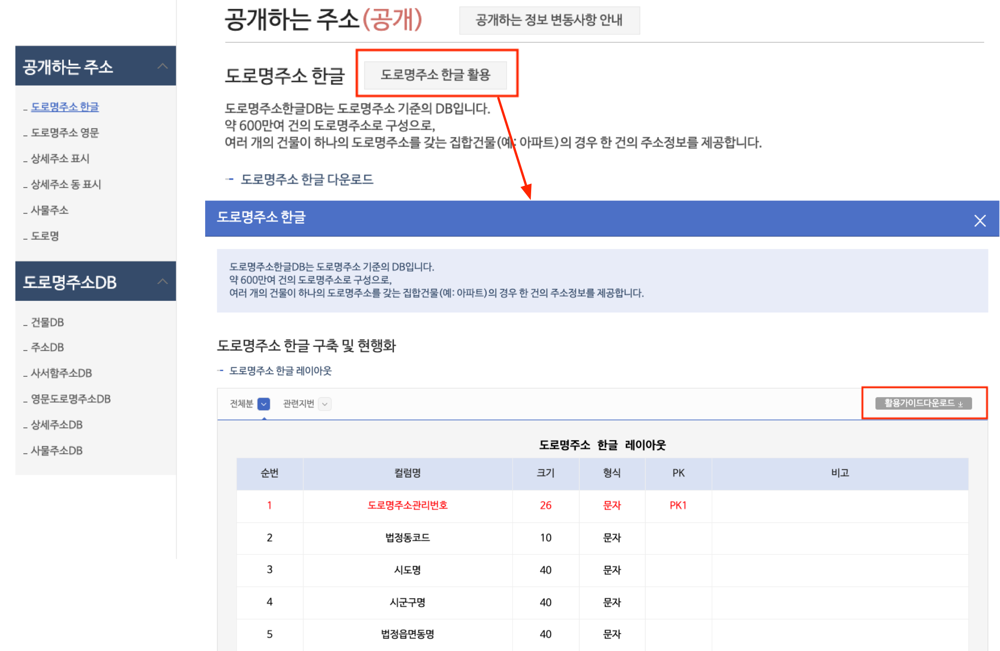

# 5.4 테이블 생성하기

이번 장은 도로명주소 한글 데이터에 맞는 테이블 스키마를 설게하고, 테이블을 생성한다. 테이블 스키마가 간단히 무엇인지 알아보고, `rnaddrkor`과 `jibun_rnaddrkor` 테이블의 스키마를 작성하고 테이블을 생성한다.

이 장에서 사용하는 데이터와 코드 원본은 아래 링크에서 확인할 수 있다.

- 데이터: [GitHub](https://github.com/hike-lab/address-data-guide/tree/main/chapter-5/data)
- 코드: [GitHub](https://github.com/hike-lab/address-data-guide/blob/main/chapter-5/5_%ED%8C%8C%EC%9D%B4%EC%8D%AC%EA%B3%BC_MySQL%EB%A1%9C_%EA%B5%AC%EC%B6%95%ED%95%98%EB%8A%94_%EC%A3%BC%EC%86%8C_%EB%8D%B0%EC%9D%B4%ED%84%B0%EB%B2%A0%EC%9D%B4%EC%8A%A4.ipynb)

## 테이블 스키마란?

테이블 스키마는 테이블의 구조를 정의하는 규칙이다. 테이블에 어떤 데이터가 어떤 방식으로 저장될지를 명시한다. 예를 들어, 어떤 컬럼명이 들어갈 것인지, 컬럼명에 들어갈 값의 형식은 무엇인지 등이 설정된다.

<figure class="flex flex-col items-center justify-center">
    
</figure>

위의 그림과 같이 주소기반산업지원서비스는 개별 데이터에 대한 스키마 정보를 제공하고 있다. '도로명주소 한글 활용'이란 버튼을 클릭하면 팝업창에서 전체분(`rnaddrkor`)과 관련지번(`jibun_rnaddrkor`)의 테이블 정보를 확인할 수 있다. 테이블 스키마는 팝업창에 나타난 정보를 그대로 활용한다. 참고로 `활용가이드다운로드`를 클릭하면 도로명주소 한글과 관련된 상세한 정보와 Oracle로 작성된 SQL 코드를 확인할 수 있다.

도로명주소 한글의 레이아웃은 크게 4가지 정보를 제공한다. 컬럼명과 개별 컬럼명의 값의 크기와 형식, PK가 제공된다. 값의 크기는 해당 컬럼명의 자릿수를 의미하고, 형식은 문자 또는 숫자와 같은 값의 유형을 표현한다. PK는 Primary Key의 약자로, 테이블의 각 행을 고유하게 식별하는 컬럼이다. 이 PK에 해당하는 컬럼은 `NULL` 값을 허용하지 않고, 중복된 값을 가질 수 없다. 개별 테이블마다 지정된 PK는 다음과 같다.

- 전체분(rnaddrkor): 도로명주소관리번호(PK1), 도로명코드(PK2), 지하여부(PK3), 건물본번(PK4), 건물부번(PK5)
- 관련지번(jibun_rnaddrkor): 도로명주소관리번호(PK1), 법정동코드(PK2), 산여부(PK3), 지번본번(번지)(PK4), 지번부번(호)(PK5)

## 도로명주소 한글의 테이블 스키마 {#table-schema}

주소기반산업지원서비스에 나와있는 그대로 테이블 스키마를 간단하게 작성해보면 다음과 같다. `CREATE TABLE`은 테이블을 생성하는 명령어이고, 괄호 안에 컬럼명과 형식, 크기를 설정한다. 값의 형식이 문자인 것은 `VARCHAR`로, 숫자인 것은 `INT`로 표현했다. 테이블에서 PK가 여러 개이므로 가장 마지막에 `PRIMARY KEY`를 설정해준다. PK로 설정한 컬럼의 값은 자동적으로 `NOT NULL`이 설정된다.

### 전체분 테이블

```sql
CREATE TABLE rnaddrkor (
    `도로명주소관리번호` VARCHAR(26),
    `법정동코드` VARCHAR(10),
    `시도명` VARCHAR(40),
    `시군구명` VARCHAR(40),
    `읍면동명` VARCHAR(40),
    `리명` VARCHAR(40),
    `산여부` VARCHAR(1),
    `번지` VARCHAR(4),
    `호` VARCHAR(4),
    `도로명코드` VARCHAR(12),
    `도로명` VARCHAR(80),
    `지하여부` VARCHAR(1),
    `건물본번` INT(5),
    `건물부번` INT(5),
    `행정동코드` VARCHAR(60),
    `행정동명` VARCHAR(60),
    `기초구역번호(우편번호)` VARCHAR(5),
    `이전도로명주소` VARCHAR(400),
    `효력발생일` VARCHAR(8),
    `공동주택구분` VARCHAR(1),
    `이동사유코드` VARCHAR(2),
    `건축물대장건물명` VARCHAR(400),
    `시군구용건물명` VARCHAR(400),
    `비고` VARCHAR(200),
    PRIMARY KEY (`도로명주소관리번호`, `도로명코드`, `지하여부`, `건물본번`, `건물부번`)
);
```

### 관련지번 테이블

```sql
CREATE TABLE rnaddrkor_jibun (
    `도로명주소관리번호` VARCHAR(26),
    `법정동코드` VARCHAR(10),
    `시도명` VARCHAR(40),
    `시군구명` VARCHAR(40),
    `법정읍면동명` VARCHAR(40),
    `법정리명` VARCHAR(40),
    `산여부` VARCHAR(1),
    `지번본번(번지)` INT(4),
    `지번부번(호)` INT(4),
    `도로명코드` VARCHAR(12),
    `지하여부` VARCHAR(1),
    `건물본번` INT(5),
    `건물부번` INT(5),
    `이동사유코드` VARCHAR(2),
    PRIMARY KEY (`도로명주소관리번호`, `법정동코드`, `산여부`, `지번본번(번지)`, `지번부번(호)`)
);
```

## 테이블 생성하기

앞서 작성한 테이블 스키마를 활용해 테이블을 생성해보자. 그 전에 더 효율적으로 MySQL 접속과 SQL 쿼리를 수행하는 다음의 3가지 함수를 정의한다.

- `init_db_connection()` 함수는 [5.2장의 파이썬 노트북으로 MySQL 연결하기](/contents/chapter-5/chapter-5-2.html#파이썬-노트북으로-mysql-연결하기)에서 사용한 `init_connection()` 함수에 디폴트로 접속할 데이터베이스를 `address`로 설정한 것이다.
- `query_get()` 함수는 MySQL에 접속한 다음 `sql`에 담긴 쿼리를 실행하고 그 결과를 가져온다. 쿼리에 담긴 질의가 `SELECT`와 같이 결과를 가져올 때 사용한다.
- `query_update()` 함수는 MySQL에 접속한 다음 `sql`에 담긴 쿼리를 실행하고 잘 실행되었다면 `True`를 반환한다. 쿼리에 담긴 질의가 `CREATE`와 같이 데이터를 업로드하거나 조작할 때 사용한다.

```py
def init_db_connection():
    connection = pymysql.connect(
        host="localhost",
        port=3306,
        user="root",
        password="root",
        database="address",
        cursorclass=pymysql.cursors.DictCursor,
        charset="utf8",
    )
    return connection

def query_get(sql):
    connection = init_db_connection()
    with connection:
        with connection.cursor() as cursor:
            cursor.execute(sql)
            return cursor.fetchall()

def query_update(sql):
    connection = init_db_connection()
    with connection:
        with connection.cursor() as cursor:
            cursor.execute(sql)
            connection.commit()
            return True
```

`query_update()` 함수를 사용해 전체분(`rnaddrkor`)과 관련지번(`jibun_rnaddrkor`) 테이블을 생성해보자. [도로명주소 한글의 테이블 스키마](#table-schema)에서 생성한 구문은 `sql` 변수에 넣고, `query_update(sql)`를 실행한다. 다음의 코드는 전체분과 관련지번에 맞춰 2번 수행해야 한다. `True`가 리턴된다면 테이블이 무사히 생성된 것이다.

```py
sql = '''
    CREATE TABLE `rnaddrkor` (
        `도로명주소관리번호` varchar(26) NOT NULL,
        ...
        PRIMARY KEY (`도로명주소관리번호`, `도로명코드`, `지하여부`, `건물본번`, `건물부번`)
    );
'''

query_update(sql)
# True
```

## 생성한 테이블 확인하기

테이블이 잘 만들어졌는지 확인해보자. 다음의 코드는 `query_get()` 함수를 사용해 해당 데이터베이스에 있는 모든 테이블을 출력한다. 주석으로 처리된 결과와 같이 `rnaddrkor`과 `jibun_rnaddrkor` 테이블이 잘 생성된다.

```py
query_get("SHOW TABLES;")
# [{'Tables_in_address': 'jibun_rnaddrkor'}, {'Tables_in_address': 'rnaddrkor'}]
```

개별 테이블의 스키마도 확인할 수 있다. `DESC rnaddrkor;`은 해당 테이블의 스키마를 보여주는 질의문이다. 주석으로 처리된 결과는 테이블 스키마의 일부인데, 테이블의 스키마로 작성한 정보를 제공한다.

```py
query_get("DESC rnaddrkor;")
# [{'Field': '도로명주소관리번호',
#   'Type': 'varchar(26)',
#   'Null': 'NO',
#   'Key': 'PRI',
#   'Default': None,
#   'Extra': ''},
```
