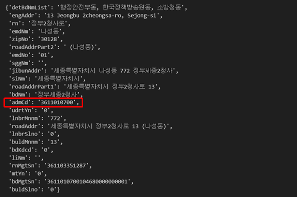

# ４. Flask로 주소 검색 API 만들기

<br>

#### 작성자: 최은혜, 박예준

이번 장에서는 파이썬 웹 프레임워크인 Flask를 활용하여 API를 만드는 방법을 안내합니다. 주소기반산업지원서비스의 주소 검색 API에 내고장알리미 데이터를 연계하여, 주소를 검색하면 그 주소에 대한 행정구역 데이터를 제공하는 우리만의 주소 검색 API를 만드는 실습을 진행합니다.


## Flask로 API 서버 개발하기

### 1. Flask 애플리케이션 생성하기

먼저 프로젝트 폴더에 서버를 실행하는 파일을 만들어줍니다. 파일 이름은 `main.py`로 하겠습니다.

Flask를 import 하고 Flask 객체 인스턴스를 생성해줍니다.

```py
#main.py

from flask import Flask

#Flask모듈의 객체 인스턴스 생성
app = Flask(__name__)

```
<br>

`@app.route('/')`코드를 추가하여 Flask 서버의 기본 접속 url을 설정하고 로컬 환경에서 서버를 실행하는 코드를 작성합니다.
```py
#기본 접속 url
@app.route('/')
def index():
    return "Flask server is running" #url 접속시 출력할 내용

#서버를 실행시키는 코드
if __name__ == "__main__":
    #로컬호스트에서 실행
    app.run(host="0.0.0.0", port=5001, debug=True)
```
<br>

이렇게 만든 실행파일 `main.py`는 터미널에 다음과 같이 입력하여 실행합니다.
```py
python main.py
```

<br>

 서버가 실행되면 터미널에 접속 주소`127.0.0.1:5001`가 표시됩니다.<br>

<figure class="flex flex-col items-center justify-center">
    
</figure>

<br>

 `127.0.0.1:5001`에 접속하면 우리가 지정한 문구가 출력되는 것을 볼 수 있습니다.

<figure class="flex flex-col items-center justify-center">
    
</figure>


이렇게 Flask는 `@app.route()`를 추가하는 방식으로 웹 페이지를 추가하고 연결합니다. (Python 데코레이터)

## 내고장알리미 데이터 연계하기

### 1. 내고장알리미 데이터란?
[내고장알리미 https://www.laiis.go.kr/myMain.do](https://www.laiis.go.kr/myMain.do) (지방행정종합정보시스템)는 지방자치단체의 행정구역 현황, 단체장, 새소식, 문화관광, 상품권 등의 정보를 종합적으로 제공하는 웹 사이트입니다.
우리가 연계하려는 내고장알리미 데이터는 이 웹사이트에서 제공하는 시군구에 대한 정보를 크롤링해서 csv로 만든 데이터입니다.

[내고장알리미 데이터 파일 다운로드](./mygojang-crawling-data-2024-02-26.csv)

### 2. 검색 API와 내고장알리미 데이터 연계하기

5-3장(API로 데이터 가져오기)에서 작성한 코드에서 나아가 주소기반산업지원서비스 API와 내고장알리미 데이터를 시군구코드 기준으로 연계해보겠습니다.

우리의 현재 프로젝트 폴더에 `test.ipynb`로 ipynb파일을 하나 만들어서 5-2장(API로 데이터 가져오기)의 실습 코드를 이어서 작성할 수 있도록 합니다. 또한 다운로드한 내고장알리미 데이터 csv 파일을 프로젝트 폴더에 같이 위치시킵니다.

<figure class="flex flex-col items-center justify-center">
    
</figure>

<br> 

API 호출을 위한 라이브러리인 `requests`와 csv 데이터를 다루기 위해 필요한 라이브러리인 `pandas`를 import해서 사용하기 위해서 터미널에 다음의 코드를 입력합니다. 우리는 지금 가상환경이라는 독립된 환경에서 작업하고 있기 때문에 기존에 다른 작업에서 이미 사용하던 라이브러리라도 새로 install 해주는 과정이 필요합니다. 가상환경에 진입한 상태가 맞는지 다시 한 번 확인하고서 install을 진행해줍니다.

```py
pip3 install requests pandas
```

<br>

이제 `test.ipynb`에서 API 데이터와 내고장알리미 데이터를 시군구코드 기준으로 연계하는 코드를 작성해보겠습니다.

5-3에서 작성한 코드를 실행하면 여러개의 검색결과가 나오는 것을 확인했습니다. 그 중 첫번째 검색결과만 사용하여 주소를 연계하려고 합니다. <br>
데이터를 시군구코드 기준으로 연계하기 위해 API데이터와 파일데이터에서 시군구코드 컬럼을 찾아야합니다. <br>
파일데이터는 "DIST_CODE"라는 시군구코드를 의미하는 컬럼이 존재합니다. 그러나 API 데이터에는 시군구코드를 직접적으로 의미하는 컬럼이 없습니다. 그래서 시군구코드를 얻기 위해 "admCd"(행정동코드) 컬럼을 변형하여 사용하겠습니다.<br>
```py
#주소기반산업지원서비스 API
import requests
url = "https://business.juso.go.kr/addrlink/addrLinkApi.do"
keyword = "정부세종청사"
params = {
    "confmKey":"발급받은 API 승인 KEY",
    "currentPage":"1",
    "countPerPage":"10",
    "keyword": keyword, 
    "resultType":"json"
}

# Keyword로 검색된 결과
api_result = requests.get(url, params=params)
# 여러개의 검색결과 중 첫번째 검색결과를 선택
result_first = api_result.json()['results']['juso'][0]
```
출력 결과




행정동코드는 총 10자리로 이루어져있는데 그 중 앞 5자리`36110`은 그 행정동이 속한 시군구를 식별하고, 뒤 5자리`10700`은 시군구 내에서 행정동을 식별하는 기능을 합니다. 그리고 시군구를 식별하는 앞 5자리에 뒤 5자리를 00000을 붙이면 해당 시군구의 시군구코드가 됩니다. `3611000000`

따라서 시군구까지만 나타내는 앞의 5자리까지 자르고, 00000을 붙여서 시군구코드 10자리를 만들어주고 `search_code`변수에 담아줍니다. 

```py
# 첫번째 결과의 행정동코드 admCd
admCd = result_first['admCd']

# 행정동코드의 앞 5자리에 00000을 붙여서 시군구코드를 만들어줌 
search_code = int(admCd[:5]+'00000') #시군구코드 
```
<br>

내고장알리미 데이터에서 DIST_CODE(시군구코드)가 `search_code`와 일치하는 행을 추출합니다. pandas 라이브러리를 이용해 데이터를 불러온 뒤, 시군구코드 기준으로 내고장알리미 데이터를 검색 추출하는 것입니다.

```py
import pandas as pd
# 내고장알리미 데이터를 Dataframe형식으로 불러오기
mygojang = pd.read_csv('mygojang-crawling-data-2024-02-26.csv')

# 내고장알리미 데이터에서 시군구코드 일치하는 데이터 반환
result = mygojang.loc[mygojang['DIST_CODE']==search_code].T.iloc[:,0]
```
`result`에 담긴 검색결과는 다음과 같습니다. 정부세종청사가 위치한 세종특별자치시의 행정 정보 등이 담긴 데이터입니다.

<figure class="flex flex-col items-center justify-center">
    
</figure>


<br> 

### 3. 주소 검색 API 만들기


이제 우리가 앞서 만들어둔 Flask 서버에 내고장 알리미 데이터 검색 결과를 출력하는 라우터를 추가하여 우리만의 API를 만들어 보겠습니다. `main.py`에 이어서 코드를 작성해보겠습니다.

```py
@app.route('/address/<keyword>/')
def address(keyword):
    # 주소기반산업지원서비스 주소 검색 API 호출
    url = "https://business.juso.go.kr/addrlink/addrLinkApi.do"
    params = {
        "confmKey":"발급받은 API 승인 KEY",
        "currentPage":"1",
        "countPerPage":"10",
        "keyword": keyword,
        "resultType":"json"
    }

    # Keyword로 검색된 결과
    result = requests.get(url, params=params)
    admCd = result.json()['results']['juso'][0]['admCd']
    search_code = int(admCd[:5]+'00000')

    # 내고장알리미 데이터에서 시군구코드 일치하는 데이터 반환
    mygojang = pd.read_csv('mygojang-crawling-data-2024-02-26.csv') # 내고장알리미 데이터
    result = mygojang.loc[mygojang['DIST_CODE']==search_code].T.iloc[:,0]
    # /address/<keyword>에 최종적으로 출력할 내용
    return result.to_json(force_ascii=False) 
```

이 때, `@app.route('/address/<keyword>/')`의 `<keyword>`는 주소 검색어가 들어갈 변수입니다. 
<br>예를 들어, `127.0.0.1:5001/address/정부세종청사/`를 url로 입력하면 주소 검색어는 '정부세종청사'가 되는 것입니다.

이렇게 API를 만들어서 해당 API url에 접속해보면 서버 화면에 주소 검색 결과 데이터가 출력됩니다.

<figure class="flex flex-col items-center justify-center">
    
</figure>


