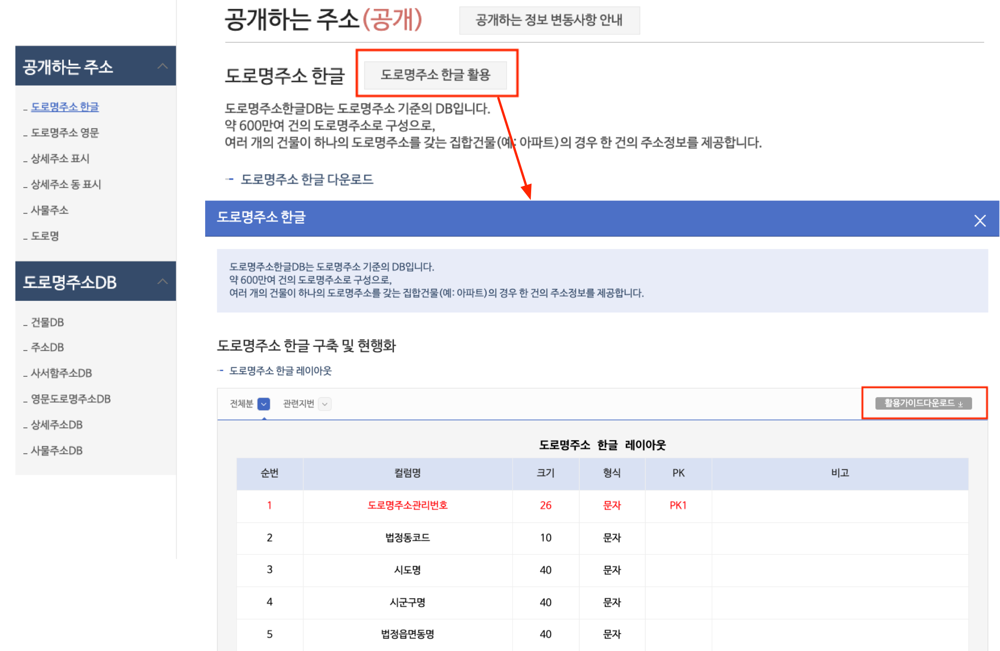

# 1. 프로젝트 소개

 

#### 작성자: 박하람

5장의 프로젝트는 파이썬과 `MySQL`로 주소 데이터베이스를 구축하는 과정을 다룹니다. 이 장은 아주 튼실한 데이터베이스를 설계하고 관리하는 방법에 대한 것을 배우는 것이 아닙니다. 이 장의 목표는 파일 데이터를 넘어 대규모의 텍스트 데이터를 쉽게 저장하고 분석할 수 있는 `MySQL` 도구를 활용하는 데 있습니다. 앞 장에서 충분히 파이썬으로 주소 데이터를 분석했다면, 이번 장도 충분히 따라하실 수 있습니다.

## 학습 내용

이번 장은 파이썬 외에 `MySQL`이란 오픈소스 관계형 데이터베이스(relational database)를 사용합니다.
데이터베이스를 구축하는 과정은 크게 4가지 단계로 구분합니다.

- 1단계: 데이터베이스와 테이블 생성하기
- 2단계: 테이블 스키마 생성하기
- 3단계: 데이터 삽입∙삭제∙수정하기
- 4단계: SQL로 데이터 분석하기

기본적으로 `MySQL`은 데이터베이스와 그 안의 테이블로 구성됩니다. 활용 목적에 따라 여러 개의 데이터베이스를 생성할 수도 있고, 일반적으로 하나의 데이터베이스에 여러 개의 테이블이 존재합니다. 테이블이 생성되면, 그 테이블에 데이터를 집어넣기 위해서 테이블의 스키마(schema)를 짜야 합니다. 테이블은 행과 열로 구성되고, 개별 열마다 어떤 컬럼명과 값이 들어갈 것인지를 선언해주는 것이죠. 테이블의 스키마가 만들어진다면 데이터를 테이블에 삽입할 수 있습니다. 데이터의 삽입 뿐만 아니라 삭제, 수정 등의 작업도 수행할 수 있습니다. 데이터가 무사히 데이터베이스에 들어갔다면 `SQL`이란 별도의 질의언어로 데이터를 탐색하거나 분석하는 것이 가능합니다.

`SQL(Structured Query Language)`은 관계형 데이터베이스에 존재하는 데이터를 저장하거나 관리하기 위한 질의 언어입니다. 어떤 데이터베이스를 사용하냐에 따라 `SQL` 문법이 조금씩 달라질 수 있지만, 전반적으로 문법은 비슷합니다. 이 장은 `MySQL`에서 `SQL`로 질의하는 방법에 대해 배우지만, 익숙해지면 다른 데이터베이스의 문법을 사용하는 데에 어려움이 없을 겁니다.

## 학습 목표

컨텐츠 만들면서 내용이 확정되면 마지막으로 여기 작성하기 (구체적인 세부장별 학습 목표)

## 주소기반산업지원서비스의 가이드 활용하기

주소기반산업지원서비스는 [공개하는 주소와 제공하는 주소](https://business.juso.go.kr/addrlink/adresInfoProvd/guidance/othbcAdresInfo.do)를 제공하고 있습니다. 공개하는 주소에서 가장 기본적인 도로명주소 데이터를 개방합니다. 행정안전부는 주소 데이터를 DB 형태로 관리하고 있기 때문에 개방하는 데이터는 DB 형식을 따릅니다. 즉, 개별 주소 데이터에 맞는 테이블 스키마와 함께 주소 데이터를 다루는 방법을 `SQL` 형태로 제공합니다.

<figure class="flex flex-col items-center justify-center">
    
</figure>

위의 그림은 공개하는 주소기반산업지원서비스에서 [공개하는 주소](https://business.juso.go.kr/addrlink/attrbDBDwld/attrbDBDwldList.do?cPath=99MD&menu=%EB%8F%84%EB%A1%9C%EB%AA%85%EC%A3%BC%EC%86%8C%20%ED%95%9C%EA%B8%80#this)를 선택한 후, 도로명주소 한글의 활용가이드를 다운로드 받는 방법입니다. 도로명주소 한글 오른쪽에 있는 회색 버튼 '도로명주소 한글 활용'을 누르면, 그림의 아래와 같은 팝업창이 나타납니다. 팝업창은 해당 데이터를 다운로드 받았을 때 테이블별 레이아웃(스키마)과 현행화를 위한 `SQL` 예시를 제공합니다. 팝업창에서 회색 버튼 '활용가이드다운로드'를 클릭하면, 더욱 상세한 정보를 제공합니다. 도로명주소와 지번정보로 매칭데이터를 구성하는 `VIEW`를 생성하거나 도로명주소를 검색할 수 있는 `SELECT` 구문을 제공하고 있습니다.
