# 6.2 프로젝트 환경 구축하기

Geocode, 또는 Geocoding이란 주소나 특정 지점에 대한 고유 명칭으로 해당 지점의 좌표값을 얻는 것을 의미합니다. 반대로, 좌표값을 통해 주소를 얻는 과정은 reverse-geocoding이라고 합니다. 보통 하나의 Geocode API가 geocoding과 reverse-geocoding을 동시에 서비스합니다.

## 네이버 클라우드 API 발급/활용 방법
### STEP 1. 네이버 클라우드 접속

API를 활용하기 위해서, 보통 API Key를 먼저 발급받아야 합니다. 네이버 지오코딩 API Key는 [네이버 클라우드 플랫폼](https://www.ncloud.com/)에서 발급받습니다. 

<figure class="flex flex-col items-center justify-center">
    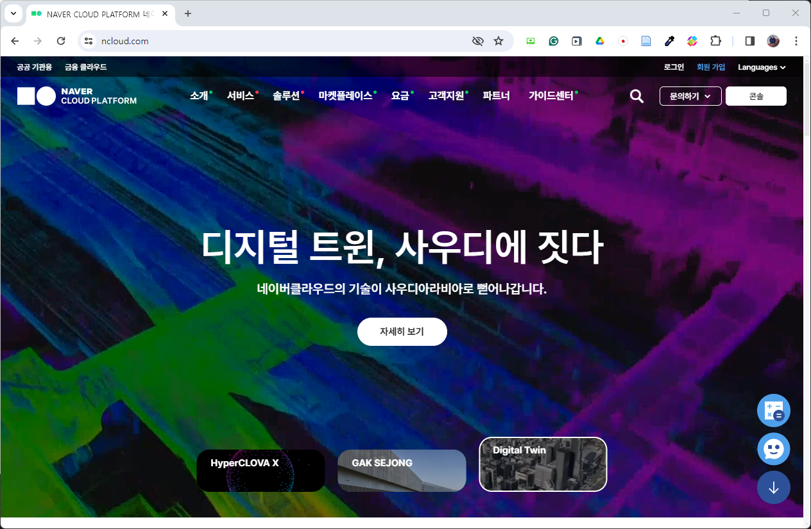
</figure>


로그인 후, 화면 상단의 콘솔 버튼을 클릭해 주세요.

<figure class="flex flex-col items-center justify-center">
    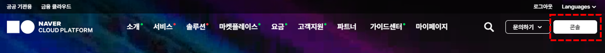
</figure>


버튼을 클릭하시면 다음과 같은 화면이 나타납니다. 좌측 내비게이션에서 `Services` 항목을 클릭해주세요.

<figure class="flex flex-col items-center justify-center">
    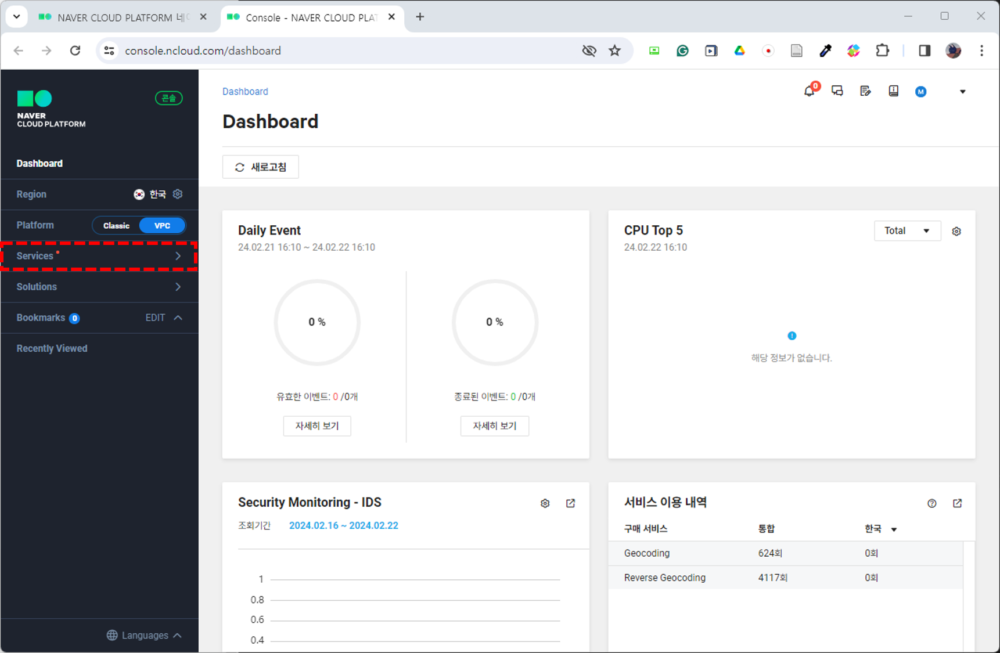
</figure>

엄청나게 많은 카테고리가 나타나는데요, `AI·NAVER API` 항목만 클릭하시면 됩니다.

<figure class="flex flex-col items-center justify-center">
    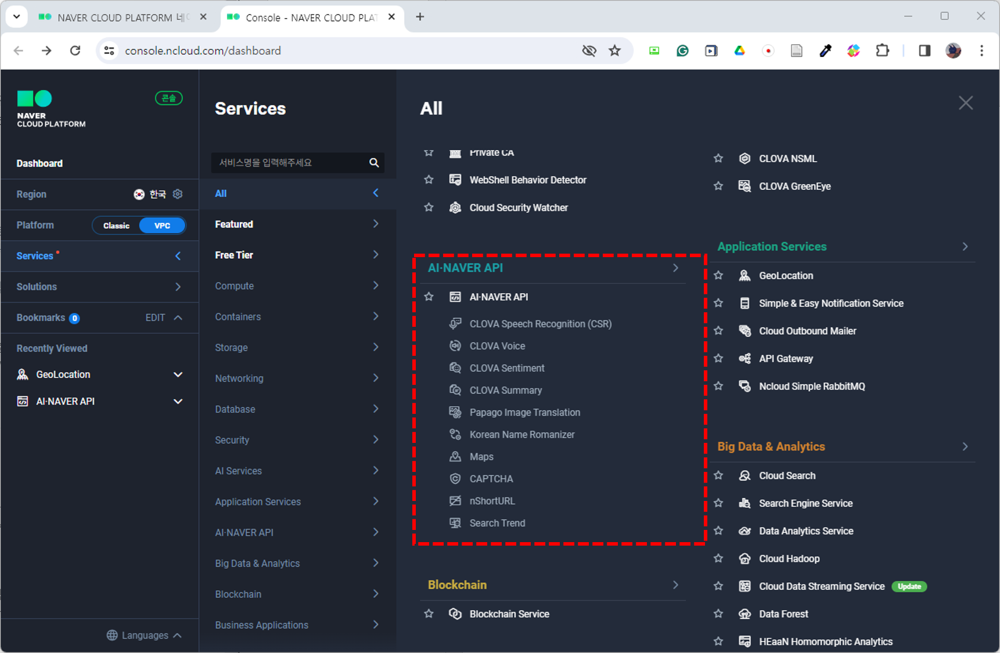
</figure>

### STEP 2. APP 등록

해당 항목의 페이지로 이동하면 API 사용량에 대한 대시보드가 나타납니다. 여기에서 `Application 등록` 버튼을 클릭해주세요
<figure class="flex flex-col items-center justify-center">
    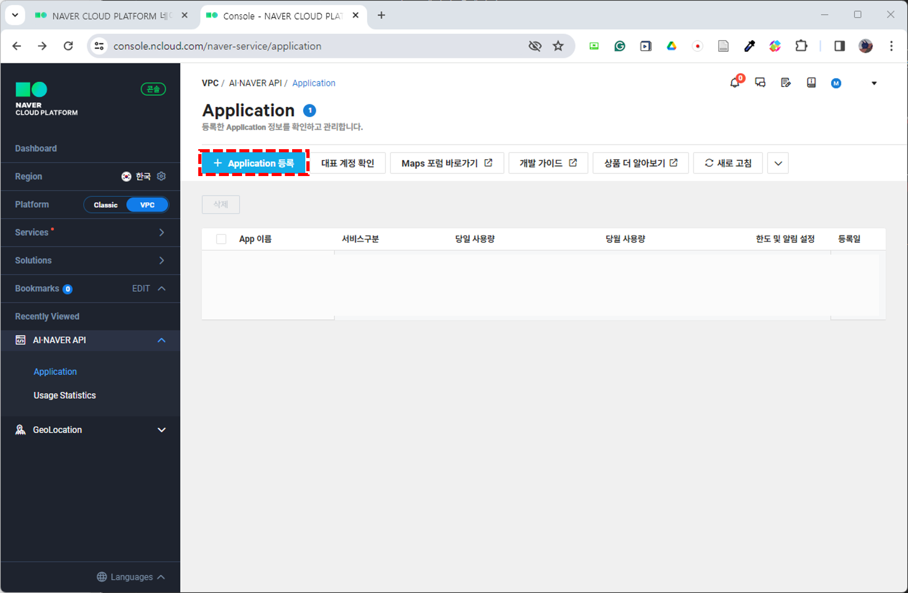
</figure>

등록 화면에서 Application 이름 작성하고 service를 선택하면 등록 버튼이 활성화됩니다. Application 이름은 설정해 주세요. API 키들을 구분할 용도로 앱 이름을 설정하는 것이니 자유롭게 작성하시면 됩니다. 이용할 Service로는 Maps의 Geocoding과 Revese Geocoding을 선택해주세요.

<figure class="flex flex-col items-center justify-center">
    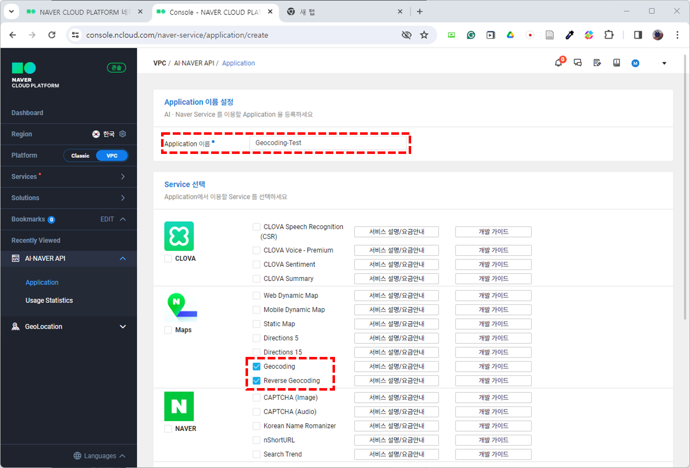
</figure>

등록이 완료되면 첫 화면으로 돌아옵니다. 대시보드에 방금 전 등록한 앱이 있는 것을 확인하실 수 있습니다.

이제 API도 발급받았으니, 활용에 필요한 Key 정보를 확인해야 합니다. Key 정보를 보기 위해 앱 이름 하단에 있는 `인증 정보` 버튼을 클릭합니다.

<figure class="flex flex-col items-center justify-center">
    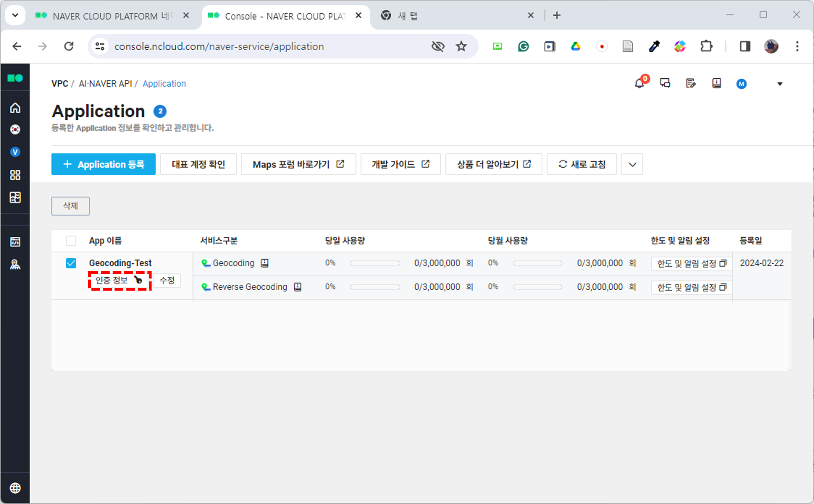
</figure>

인증 정보 버튼을 누르면 앱의 key에 대한 정보를 담은 팝업창이 나타납니다. 팝업창에는 앱 이름과 함께 Client ID, Client Secret 값이 나타납니다. 여기서 `Client Secret`은 외부에 노출되면 안되는 값입니다. 혹여나 값이 노출되었다면 재발급 버튼을 눌러서 키를 재발급 받으셔야 합니다.

<figure class="flex flex-col items-center justify-center">
    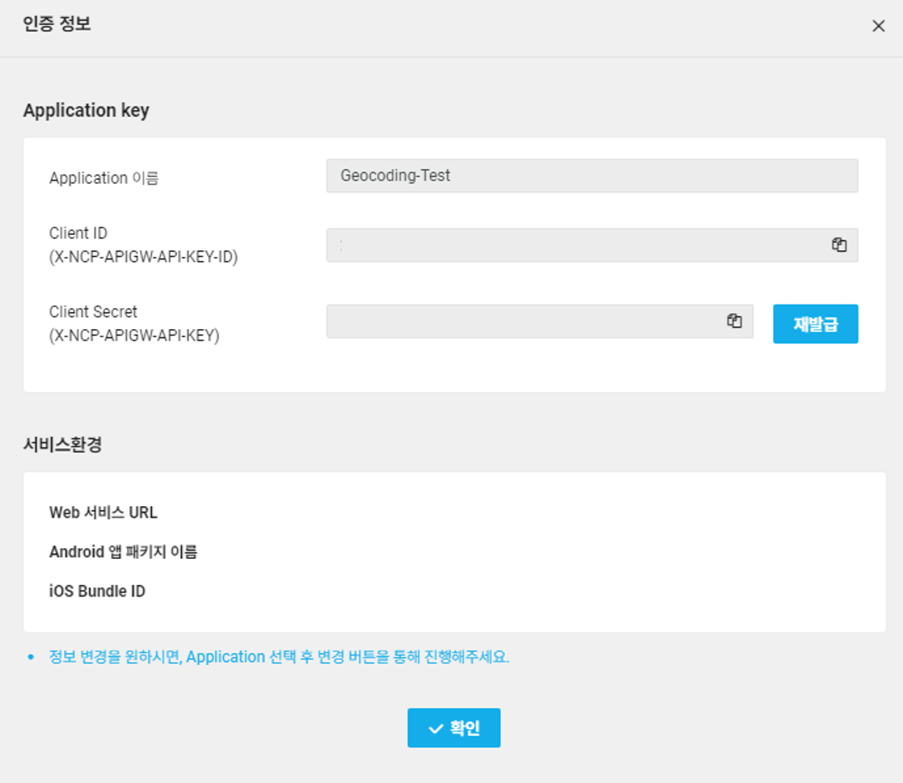
</figure>

key 값은 메모장에 복사해두고 사용하시면 됩니다. 권장하는 방법은 .env 파일에 저장하여 사용하는 것입니다. 깃허브를 통해 코드를 외부적으로 공유할 경우, API 키 값들을 모두 env 파일에 저장하고 코드 파일에서는 API 명칭으로만 불러와서 사용할 수 있기 때문에  key값이 노출되지 않고 가독성이 좋아진다는 장점이 있습니다. 

앞으로의 실습들 모두 .env 파일로 key를 불러와 사용하도록 하는 방식이므로, 어떻게 .env 파일을 만들고 사용하는지, 그리고 `.gitignore` 파일을 작성하여 `.env` 파일은 push 되지 않도록 하는 방법을 간단하게 알려드리겠습니다.

### STEP 3. .env, .gitignore 파일을 활용해 안전하게 key 이용하기

> colab 환경을 기준으로 설명하겠습니다. 

시작에 앞서, 코드와 데이터, 로컬 환경에서 .env, .gitignore를 한 곳에 담을 폴더를 하나 만들어주세요. 그 다음 `새로 만들기` - `서식 있는 텍스트`를 클릭해주세요.

새 파일이 하나 생성었는데요, 확장자(.rtf)명까지 모두 지운 후, 파일 명을 `.env`로 변경합니다. 그 다음, .env 파일을 메모장으로 열어주세요. 메모장을 열었을 때 `{\rtf1}`가 이미 입력되어 있을텐데요, 모두 지우고 몇 아래 사진과 같이 작성해주시면 됩니다. 
`CLIENT_SECRET`에는 아까 발급 받은 Secret key를, `CLIENT_ID`에는 Client ID를 복사해서 그대로 붙여 넣어 주세요. 작성이 완료되면 저장하고 창을 닫습니다.

<figure class="flex flex-col items-center justify-center">
    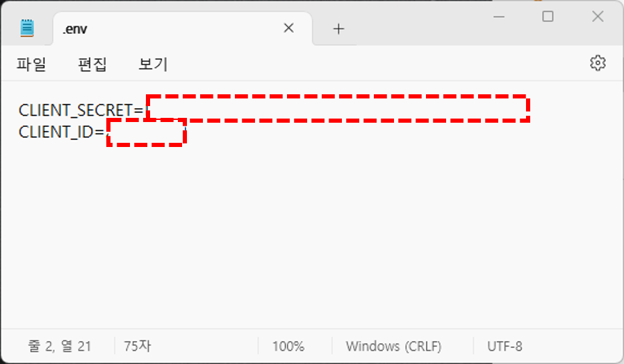
</figure>

.gitignore 파일도 동일한 방식으로 생성한 후, 메모장을 이용해 열어줍니다. .gitignore 파일에는 `*.env`를 기입하고 저장해주세요.

이제 colab에 접속해 새 노트를 생성해 봅시다. 노트를 생성한 후, 좌측 내비게이션에서 폴더 아이콘을 클릭해주세요. 폴더 창에 방금 만든 .env 파일과 .gitignore 파일을 폴더 창에 드롭해주세요.

<figure class="flex flex-col items-center justify-center">
    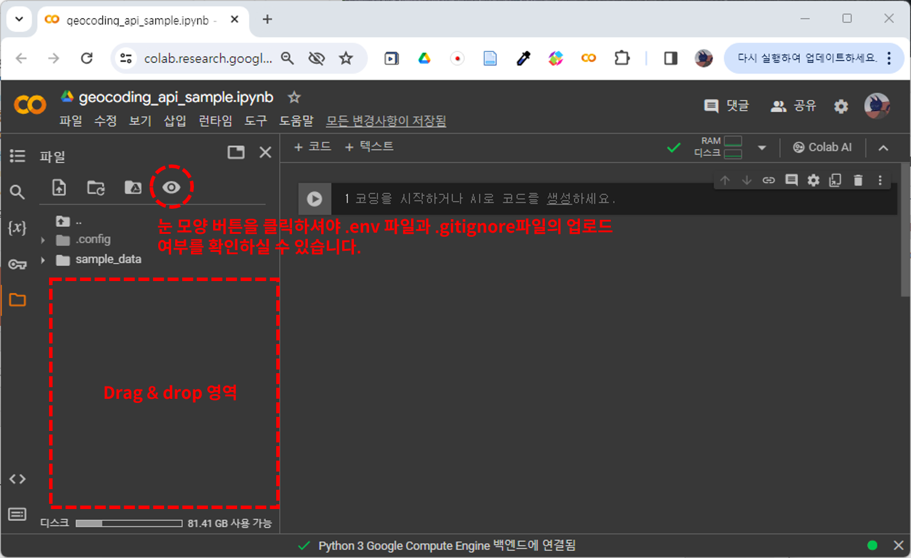
</figure>


그럼 키 값을 불러와보도록 하겠습니다. `dotenv`라이브러리를 설치받아야 합니다.
다운로드 코드는 아래와 같이 작성할 수 있습니다.

```python
!pip install python-dotenv
```

.env 파일에서 저장했던 API Key와 ID를 불러오는 코드는 다음과 같습니다.

```python
from dotenv import load_dotenv
import os

load_dotenv(".env")

API_ID = os.getenv("CLIENT_ID")
API_SECRET = os.getenv("CLIENT_SECRET")
```

### STEP 4. API 사용해보기

그럼 이제 API를 직접 사용해볼까요? API를 이용하기 위해서는 requests 라이브러리가 필요한데요, colab 환경에서는 이미 설치되어 있으니 ``import requests``로 간단하게 라이브러리를 불러오기만 하면 됩니다.

API를 사용할 때에는, API를 제공하는 측에서 정해준 형식대로 요청 URL을 작성해야 하는데요, [네이버 geocode API 가이드](https://api.ncloud-docs.com/docs/ai-naver-mapsgeocoding-geocode)에 요청 URL과 파라미터, 헤더와 응답값에 대해 자세히 설명하고 있으니 참고하시길 바랍니다.

아래의 코드를 따라하시면 간단하게 API를 테스트 해보실 수 있습니다.

```python
import requests as re
import json

# 요청 헤더에는 API 키와 아이디 값을 입력합니다.
headers = {"X-NCP-APIGW-API-KEY-ID":API_ID, "X-NCP-APIGW-API-KEY":API_SECRET} 

# 파라미터에는 검색할 주소를 입력합니다. 
params = {"query" : "서울특별시 동작구 흑석로 84", "output":"json"}

# 정보를 요청할 url입니다
url ="https://naveropenapi.apigw.ntruss.com/map-geocode/v2/geocode" 

data = re.get(url, headers=headers, params=params)

# 리턴 값 확인하기
data.text
```
실행해보면 다음과 같은 결과를 얻을 수 있습니다. 역지오코딩의 경우, 요청 url와 파라미터 형식이 바뀌는데요, 아래 코드와 같이 입력하시면 됩니다.

```python
# 요청 헤더에는 API 키와 아이디 값을 입력합니다.
headers = {"X-NCP-APIGW-API-KEY-ID":API_ID, "X-NCP-APIGW-API-KEY":API_SECRET} 

# 파라미터에는 변환할 좌표계를 입력합니다. "경도,위도" 순으로 입력해주세요.
params = {"coords" : "126.9573779,37.5048875", "output":"json", "orders":"roadaddr,addr"}

# 정보를 요청할 url입니다
url ="https://naveropenapi.apigw.ntruss.com/map-reversegeocode/v2/gc"

data = re.get(url, headers=headers, params=params)

# 리턴 값 확인하기
data.text
```

데이터 타입이 string 인 것을 확인할 수 있는데요, 원하는 값을 쉽게 가져올 수 있도록 딕셔너리(json) 형태로 변환해줍시다. 여기에는 json 라이브러리가 사용됩니다.

```python
import json

json_ob = json.loads(data.text)
```

변환된 결과를 보면 결과값이 아래와 같은 형식으로 구성되어 있다는 것을 파악할 수 있습니다. 도로명주소 뿐만 아니라, 도로명주소에 대응되는 지번주소, 영문주소, 주소구성요소와 좌표계 정보도 제공합니다.

<figure class="flex flex-col items-center justify-center">
    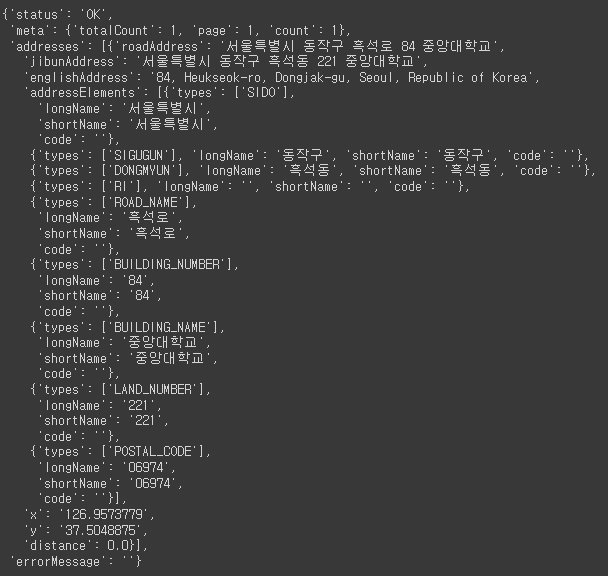
</figure>

여기서 좌표계 정보만 추출해볼까요? 좌표계에 대한 정보는 `addresses`키를 통해 접근할 수 있습니다. `addresses`에 대응하는 값은 리스트인데요, 리스트에 요소가 하나뿐이므로 `json_ob["addresses"][0]`로 주소정보들을 담고 있는 딕셔너리에 접근해봅시다. 

좌표계에 대한 정보는 "x",  "y" 키 값으로 얻을 수 있습니다. x는 경도, y는 위도에 대응됩니다. 따라서 각 값은 `json_ob["addresses"][0]["x"]`와 `json_ob["addresses"][0]["y"]`로 추출할 수 있습니다.

다음은 리턴된 결과로부터 좌표계를 추출하는 과정을 한 번에 나타낸 코드입니다.

```python
import json

json_ob = json.loads(data.text)

lon = json_ob["addresses"][0]["x"] # 경도
lat = json_ob["addresses"][0]["y"] # 위도

```

다음은 역지오코딩 후 도로명주소, 지번주소를 추출하는 과정입니다. 역지오코딩의 경우, 리턴된 주소값을 조합해야 합니다. 우선 리턴 값은 아래 사진과 같은 형식으로 구성되어 있습니다.

<figure class="flex flex-col items-center justify-center">
    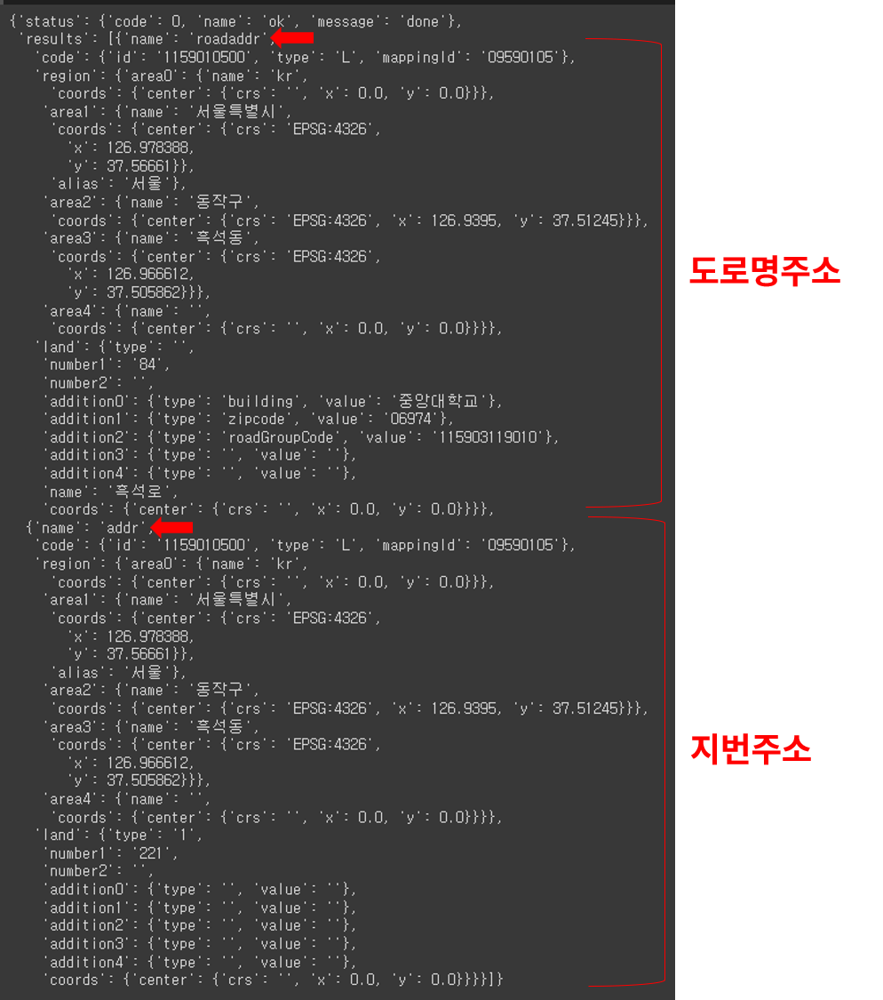
</figure>

지오코딩에서 좌표계 데이터를 추출했던 것과 같은 방식으로 도로명주소, 지번주소 구성요소 딕셔너리에 접근할 수 있습니다.

```python
# 도로명주소 구성요소 딕셔너리
roadaddr = json_ob["results"][0]

# 지번주소 구성요소 딕셔너리
addr = json_ob["results"][1]

```

역지오코딩을 통해 얻은 값을 조합하는 방법은 뒷장에서 자세히 다루도록 하겠습니다. 응답값의 키들이 각각 무엇을 의미하는지 궁금하신 분들은 [API 활용 문서](https://api.ncloud-docs.com/docs/ai-naver-mapsreversegeocoding-gc)를 참고해주세요. 앞서 작성한 코드는 [깃허브]()에 저장되어 있으며, [코랩]()에서 실행시켜보실 수 있습니다.


## 필요 라이브러리 다운받기

colab 환경의 경우 런타임마다 라이브러리를 다운받아야 합니다. 따라서, 코드 문서에서는 모두 코드 실행에 앞서 필요 라이브러리를 다운받을 수 있는 코드를 작성해 두었습니다. 하지만 매 실행마다 라이브러리를 다운받는 것은 비효율적입니다. 로컬 사용자의 경우 라이브러리를 전역적으로 설치해두면 다시 다운 받을 필요가 없습니다. 만약 visual studio code 환경에서 실행중이시라면, 터미널 상에 아래의 코드들을 입력하여 한번에 라이브러리를 다운받는 것을 권장합니다.

```python
pip install plotly, dotenv, matplotlib, json
```
