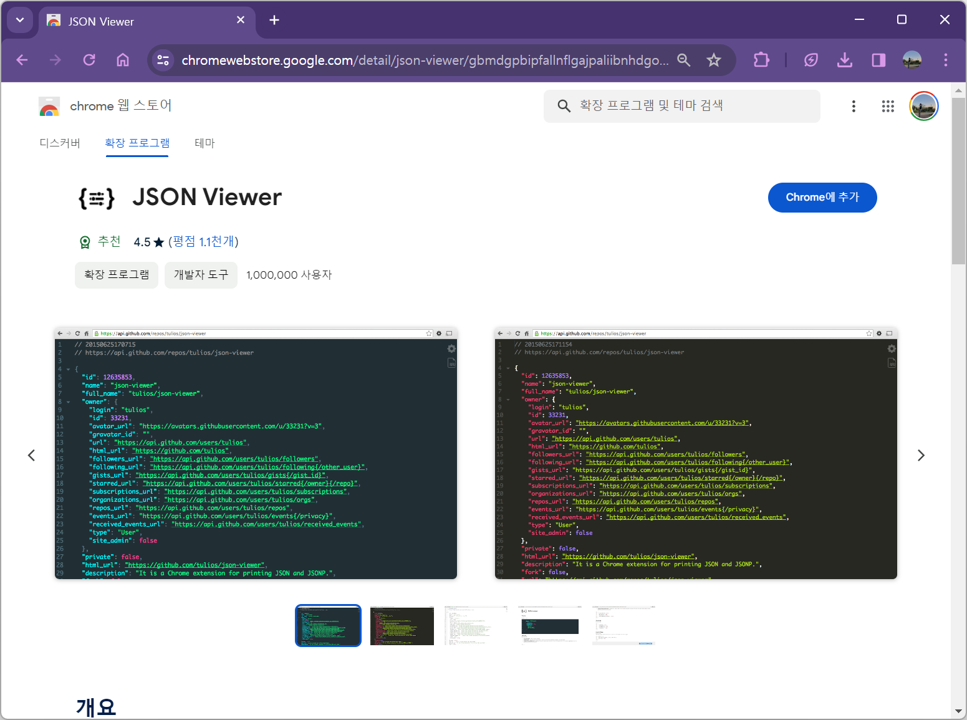

# 6.2 프로젝트 환경 구축하기

이번 장에서는 프로젝트를 진행하기 위한 개발 환경 구축 방법을 소개한다. 우리는 Visual Studio Code를 활용하여 Flask API 서버를 만드는 프로젝트를 진행하므로 Visual Studio Code의 사용법과 Flask 개발환경을 구축하는 방법을 차례대로 설명한다.

## Visual Studio Code(VS Code) 사용법

`Visual Studio Code`는 마이크로소프트사에서 개발한 무료 코드 편집 프로그램이다. `Visual Studio Code`는 가볍고, 대부분의 사양과 모든 운영체제에서 사용이 가능하다. 다양한 프로그래밍 언어를 지원하며 생산성을 향상시키는 편리한 확장 기능도 많아서 대중적으로 사용되고 있다.

### 1. Python 설치하기

`Visual Studio Code`는 코드 "편집기"이기 때문에 Python 프로그래밍을 하기 위해서는 Python을 따로 설치해야 한다. Python 프로그램을 공식사이트에서 직접 다운로드할 수도 있지만, Anaconda라는 프로그램 설치를 통해 Python을 설치하는 방법을 안내한다. Anaconda는 Python 프로그래밍을 위한 여러 도구를 모아둔 패키지와 같은 프로그램으로 이해할 수 있다.
이미 Python이 설치되어있다면 Anaconda 설치 과정을 생략하거나, 기존의 Python과 충돌할 수 있으므로 설치되어있는 Python을 지우고 진행해야 한다.

설치를 위해 Anaconda 공식 사이트의 다운로드 페이지에 접속한다.

[https://www.anaconda.com/download](https://www.anaconda.com/download)

<figure class="flex flex-col items-center justify-center">
    
    <figcaption style="text-align: center;"></figcaption>
</figure>

하단의 Free Download 버튼을 클릭하여 프로그램을 다운로드 받는다. 자신의 운영체제에 맞는 프로그램을 버튼 하단의 운영체제 아이콘을 통해 선택하여 다운로드할 수 있다.

다운로드가 완료되면 파일을 실행하여 설치를 진행한다. 다음과 같은 순서로 option을 선택하여 install한다. <br>

<figure class="flex flex-col items-center justify-center">
    
    <figcaption style="text-align: center;"></figcaption>
</figure>

3번에서 설치 경로를 지정할 때 경로에 한글이 들어가지 않도록 주의한다.

### 2. Visual Studio Code 설치하기

다음 단계로 `Visual Studio Code`를 설치한다. `Visual Studio Code` 공식 사이트에 접속한다.

[https://code.visualstudio.com](https://code.visualstudio.com/)

<figure class="flex flex-col items-center justify-center">
    
    <figcaption style="text-align: center;"></figcaption>
</figure>

좌측에 있는 Download for Windows 버튼을 클릭하여 프로그램을 다운로드 한다. MacOS, Linux등 다른 운영체제를 사용 중이라면 버튼 오른쪽의 아래 방향 화살표를 눌러서 운영체제에 맞는 프로그램을 선택하여 다운로드한다. 다운로드가 완료되면 파일을 실행하여 설치를 진행한다.

### 3. Visual Studio code 사용하기

설치한 `Visual Studio code`를 실행한다.

<figure class="flex flex-col items-center justify-center">
    
    <figcaption style="text-align: center;"></figcaption>
</figure>

Open Folder를 클릭하여 이후 작업을 진행할 폴더를 선택한다.

<br>

<figure class="flex flex-col items-center justify-center">
    
    <figcaption style="text-align: center;"></figcaption>
</figure>

위와 같이 선택한 폴더(VS CODE TEST)이 열린 것을 확인할 수 있다. 이제 이곳에서 자유롭게 파일을 생성하여 작업을 진행할 수 있다. Python 실습을 먼저 진행할 것이기 때문에 .ipynb(Python Notebook) 파일을 생성해야 한다. 폴더명(VS CODE TEST)에 커서를 가져가 선택한다.

<br>

<figure class="flex flex-col items-center justify-center">
    
    <figcaption style="text-align: center;"></figcaption>
</figure>

커서를 올리면 새 파일을 생성하는 버튼이 표시된다. New File 버튼을 클릭해서 새 파일을 생성한다. 생성버튼을 누르면 새 파일명을 바로 지정할 수 있는데, "api test.ipynb"와 같이 확장자를 ipynb로 지정하여 파일명을 작성하면 ipynb 파일을 생성할 수 있다.

<br>

<figure class="flex flex-col items-center justify-center">
    
    <figcaption style="text-align: center;"></figcaption>
</figure>

.ipynb 파일이 생성된 것을 확인할 수 있다.

예시로 hello world를 print 한다. 코드를 작성하고 실행`Ctrl+Enter`한다.

<figure class="flex flex-col items-center justify-center">
    
    <figcaption style="text-align: center;"></figcaption>
</figure>

Python 환경을 선택하는 창이 위에 표시된다. Python 환경을 클릭한다.

<br>

<figure class="flex flex-col items-center justify-center">
    
    <figcaption style="text-align: center;"></figcaption>
</figure>

우리가 설치했던 anaconda3가 표시된다. anaconda3를 선택한다.

<br>

<figure class="flex flex-col items-center justify-center">
    
    <figcaption style="text-align: center;"></figcaption>
</figure>

코드가 실행되어 hello world가 print된 것을 확인할 수 있다.

### 4. Visual Studio Code 확장 기능 이용하기

`Visual Studio Code`에서는 편리한 확장 기능이 다양하게 제공되고 있다. 적절한 확장 기능을 설치하여 사용하면 편리하게 코드 작성을 할 수 있다.
좌측 사이드바의 extension 아이콘을 클릭하면 제공되는 확장 기능을 검색하여 설치할 수 있다.

<figure class="flex flex-col items-center justify-center">
    
    <figcaption style="text-align: center;"></figcaption>
</figure>

실습을 더 수월하기 진행하기 위해 몇 가지 편리한 확장 기능을 소개한다.

<br>

#### 1. Korean Language Pack for Visual Studio Code

---

<figure class="flex flex-col items-center justify-center">
    
    <figcaption style="text-align: center;"></figcaption>
</figure>

Visual Studio Code의 한국어 UI를 지원하는 확장 기능이다. 적용하면 Visual Studio Code의 UI가 모두 한국어로 표시되는 것을 확인할 수 있다.

<br>

#### 2. Python

---

<figure class="flex flex-col items-center justify-center">
    
    <figcaption style="text-align: center;"></figcaption>
</figure>

Python 프로그램 작성을 지원해주는 확장 기능이다. Python 문법 오류 체크, 자동 완성 제안 등 편리한 기능을 제공한다.

## Flask 개발 환경 세팅하기

Flask는 파이썬 웹 프레임워크다. 웹 프레임워크라고 하는 것은 웹사이트, 웹 애플리케이션을 더 쉽게 개발할 수 있도록 미리 만들어 놓은 일종의 틀(Frame)로 설명할 수 있다. Flask는 그 중에서도 가볍고 코드가 단순하기 때문에 간단한 웹사이트 등을 개발하는 데 특화된 프레임워크이다. Flask에 대한 더 자세한 정보는 [Flask 공식 문서](https://flask.palletsprojects.com/en/3.0.x/)에서 확인할 수 있다.

### 1. 가상환경 사용하기

Flask로 서버를 개발하는 과정에서 보통 서버 구현에 필요한 다양한 패키지들을 추가로 설치하게 된다. 다양한 라이브러리나 패키지 등을 설치하다보면 원래 사용하던 노트북 환경의 상태가 변화하여 다른 작업을 할 때 문제가 발생할 수 있기 때문에 가상환경을 생성하여 그곳에서 작업을 진행하는 것이 일반적이다.

#### 가상환경 생성하기

먼저 프로젝트를 진행할 폴더를 만들어서 Visual Studio Code에서 폴더를 열어준다.

<figure class="flex flex-col items-center justify-center">
    
</figure>

<br>

`Ctrl + ~`를 눌러서 Visual Studio Code의 터미널을 열어준다.

<figure class="flex flex-col items-center justify-center">
    
</figure>

<br>

터미널에 다음과 같이 입력하고 `enter`를 눌러 명령어를 실행한다. 가상환경을 생성하는 코드다.

```py
python -m venv env
```

이 명령어에서 `python -m venv`는 파이썬의 venv라는 가상환경 모듈을 사용하겠다는 의미다. env는 우리가 생성할 가상환경의 이름을 입력한 것으로, 다른 이름을 사용할 수 있다.

<br>
잠시 후 우리의 프로젝트 폴더에 다음과 같이 env라는 폴더가 생긴 것을 확인할 수 있다.
<figure class="flex flex-col items-center justify-center">
    
</figure>

가상환경은 서버 환경 개발 작업을 최초로 진행할 때 한 번만 생성하면 된다. 이후에 이어서 작업할 때는 이미 만들어 놓은 가상환경을 사용할 수 있다.

<br>

#### 가상환경 진입하기

가상환경을 활성화하기 위해 터미널에 다시 다음과 같이 명령어를 입력한다.

```py
env/Scripts/activate
```

<br>

터미널의 프로젝트 경로 앞에 가상환경`(env)`을 생긴 것을 확인할 수 있다.

<figure class="flex flex-col items-center justify-center">
    
</figure>

가상환경에서 나오려면 터미널에 `deactivate`를 입력한다.

### 2. Flask 설치하기

이제 Flask를 설치해보도록 한다. 가상환경에 진입했는지 확인하고 터미널에 다음 명령어를 실행하여 Flask를 설치한다.

```py
pip3 install flask
```

## JSON Viwer 크롬 확장 프로그램 사용하기

주소 검색 API의 출력 결과를 브라우저에서 확인할 때 JSON 데이터 형태로 확인한다. 이때, JSON 데이터를 크롬 브라우저에서 더 가독성 좋게 출력해주는 확장 프로그램을 미리 설치한다. 브라우저 확장프로그램 사용을 위해 크롬 브라우저를 사용한다.

### 1. 크롬 웹스토어 접속

확장 프로그램 설치를 위해 크롬 웹스토어에 접속한다.

[https://chromewebstore.google.com/](https://chromewebstore.google.com/)

<figure class="flex flex-col items-center justify-center">
    
</figure>

### 2. JSON Viewer 설치

크롬 웹스토어 우측 상단의 검색창에 JSON Viewer를 검색한다. 저희는 아래의 JSON Viewer를 설치하여 사용하도록 한다. Chrome에 추가 버튼을 클릭하여 설치한다.

<figure class="flex flex-col items-center justify-center">
    
</figure>
<br>

이제 JSON Viewer를 사용할 준비가 되었다. JSON Viewer는 자동 적용되기 때문에 적용을 위해 따로 준비해줄 사항은 없다. JSON Viewer에 의해서 프린트된 JSON 데이터의 모습은 다음과 같다. JSON 데이터의 key값과 value값이 색깔로 구분되어 가독성이 좋아진다.

<figure class="flex flex-col items-center justify-center">
    
</figure>
