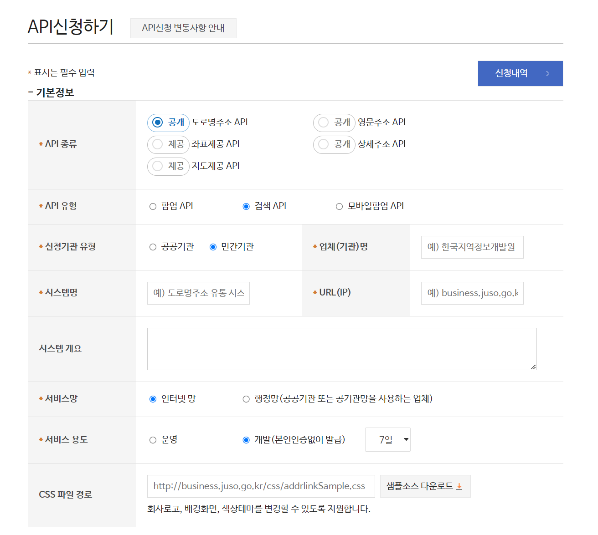
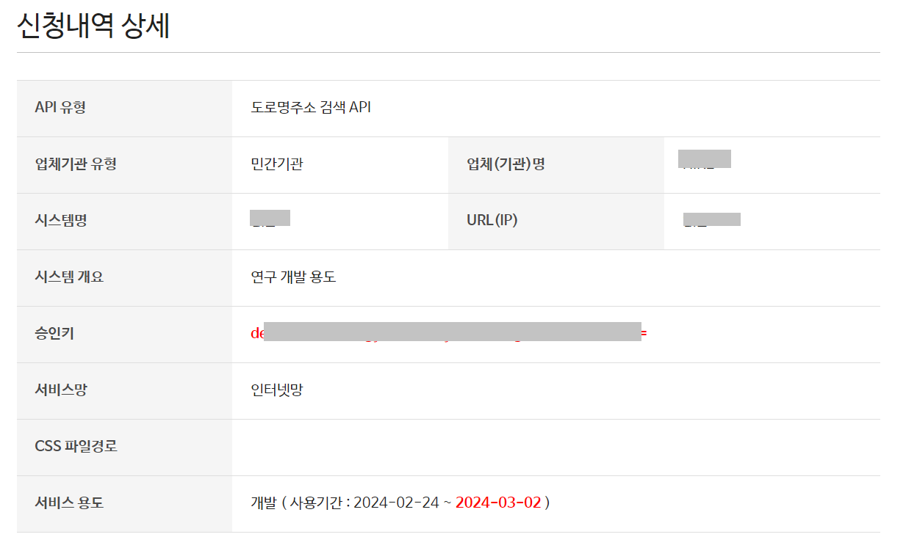

# 6.３ API로 데이터 가져오기

이번 장에서는 주소기반산업지원서비스의 검색 API를 이용하여 주소 검색 API를 신청하고 데이터를 호출한다.

## API 신청하기

### 주소기반산업지원서비스의 검색 API란

주소기반산업지원서비스에서 제공하는 도로명주소 검색 API는 검색어를 파라미터로 입력하면 관련 주소와 그 주소의 우편번호, 시군구코드 등 관련 정보를 xml 또는 json으로 제공하는 API 서비스다

도로명주소 검색 API는 URL형태로 제공되고, 요청 URL과 파라미터(요청변수)를 호출하여 사용한다.

<br>

API 출력결과 예시

```py
{'results': {'common': {'errorMessage': '정상',
   'countPerPage': '10',
   'totalCount': '8',
   'errorCode': '0',
   'currentPage': '1'},
  'juso': [{'detBdNmList': '행정안전부동, 한국정책방송원동, 소방청동',
    'engAddr': '13 Jeongbu 2cheongsa-ro, Sejong-si',
    'rn': '정부2청사로',
    'emdNm': '나성동',
    'zipNo': '30128',
    'roadAddrPart2': ' (나성동)',
    'emdNo': '01',
    'sggNm': '',
    'jibunAddr': '세종특별자치시 나성동 772 정부세종2청사',
    'siNm': '세종특별자치시',
...
    'liNm': '',
    'rnMgtSn': '361103351287',
    'mtYn': '0',
    'bdMgtSn': '3611010700104940000000001',
    'buldSlno': '0'}]}}
```

이 때 API 승인KEY가 발급되어있어야 한다.

### API 신청 방법

API 승인KEYKEY발급 절차는 다음과 같다.

[주소기반산업지원서비스 API신청](https://business.juso.go.kr/addrlink/openApi/apiReqst.do) 페이지에 접속하여 API신청 화면은 아래 이미지와 같다.

<figure class="flex flex-col items-center justify-center">
    
</figure>
우리가 필요한 API 종류는 도로명주소 API고, API유형은 검색 API입니다. 자세한 내용은 사용자 환경에 맞게 작성한다.

서비스 용도가 운영인 경우 본인인증이 필요하고, 개발인 경우 최소 7일 ~ 최대 90일까지 본인인증 없이 테스트용으로 제공된다.

개발 용도로 신청하면 아래와 같이 승인KEY가 즉시 발급된다.

<figure class="flex flex-col items-center justify-center">
    
</figure>

## API 호출하기

### 파이썬으로 API 호출하기

파이썬을 이용해 주소정보 누리집의 검색 API를 사용하는 방법은 다음과 같다.
api 호출에는 파이썬의 requests 라이브러리를 사용한다.

우선 requests 라이브러리를 설치한다.

```py
pip3 install requests
```

설치가 되었으면 요청 url과 파라미터를 다음과 같이 입력하고 실행한다. 키워드는 '정부세종청사', 결과는 json으로 출력한다.

입력 파라미터<br>
confmKey - 발급받은 API 승인 키<br>
currentPage - 표시할 페이지<br>
countPerPage - 한 페이지에 출력할 결과 개수<br>
keyword - 검색할 키워드<br>
resultType - 출력 형식<br>

```py
#모듈 불러오기
import requests

#키워드
keyword = '정부세종청사'

#api url
url = "https://business.juso.go.kr/addrlink/addrLinkApi.do"

#입력 파라미터를 dictionay 형식으로 입력
params = {
    "confmKey":"발급받은 API 승인KEY",
    "currentPage":"1",
    "countPerPage":"10",
    "keyword": keyword,
    "resultType":"json"
}

#requests 모듈을 사용해 api 호출
result = requests.get(url, params=params)

#api 호출 결과를 json 형식으로 출력
result.json()
```

코드 실행 시 다음과 같은 json출력 결과를 얻을 수 있다.
'정부세종청사'를 검색어 키워드로 입력 시 8개의 검색 결과를 얻을 수 있다.

```py
{'results': {'common': {'errorMessage': '정상',
   'countPerPage': '10',
   'totalCount': '8',
   'errorCode': '0',
   'currentPage': '1'},
  'juso': [{'detBdNmList': '행정안전부동, 한국정책방송원동, 소방청동',
    'engAddr': '13 Jeongbu 2cheongsa-ro, Sejong-si',
    'rn': '정부2청사로',
    'emdNm': '나성동',
    'zipNo': '30128',
    'roadAddrPart2': ' (나성동)',
    'emdNo': '01',
    'sggNm': '',
    'jibunAddr': '세종특별자치시 나성동 772 정부세종2청사',
    'siNm': '세종특별자치시',
...
    'liNm': '',
    'rnMgtSn': '361103351287',
    'mtYn': '0',
    'bdMgtSn': '3611010700104940000000001',
    'buldSlno': '0'}]}}
```

요청변수와 출력변수에 대한 자세한 설명은 [주소기반산업지원서비스 검색API](https://business.juso.go.kr/addrlink/openApi/searchApi.do)에서 확인할 수 있다.
