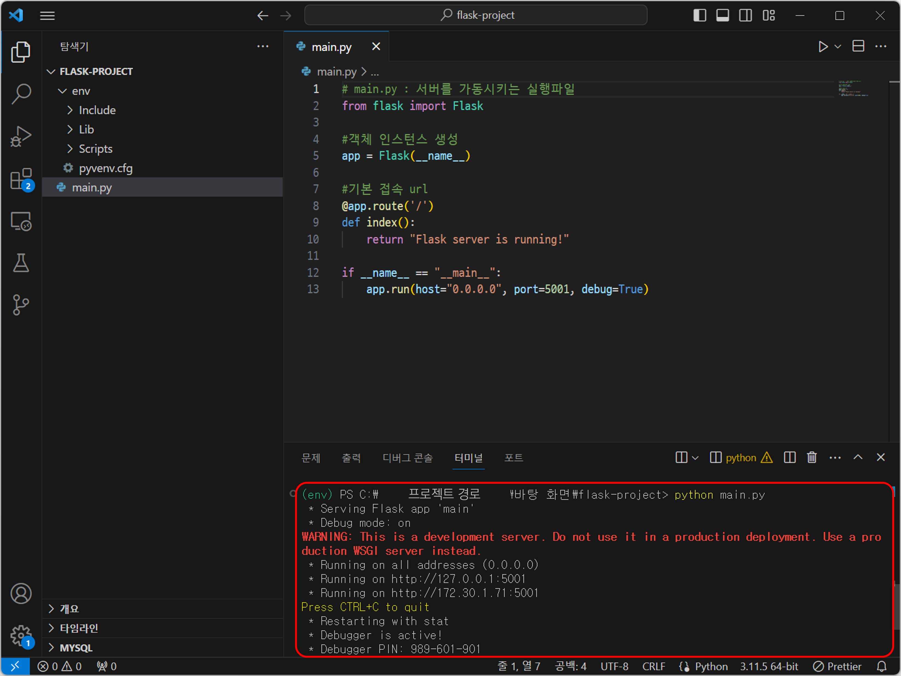
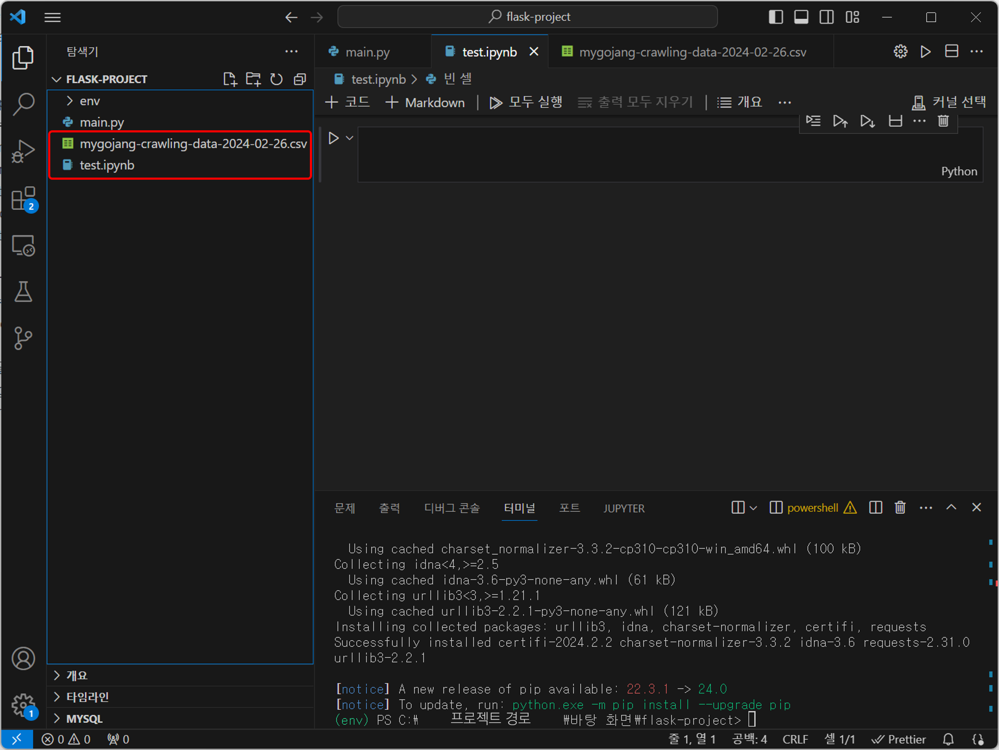
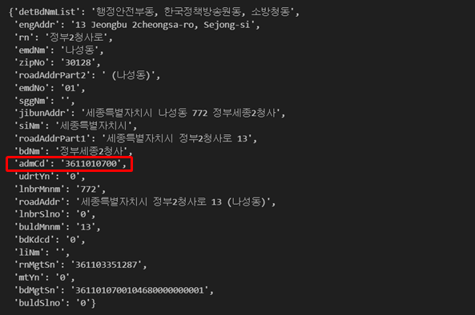
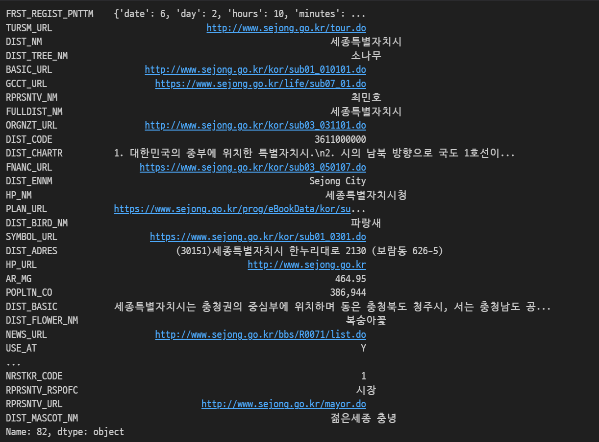
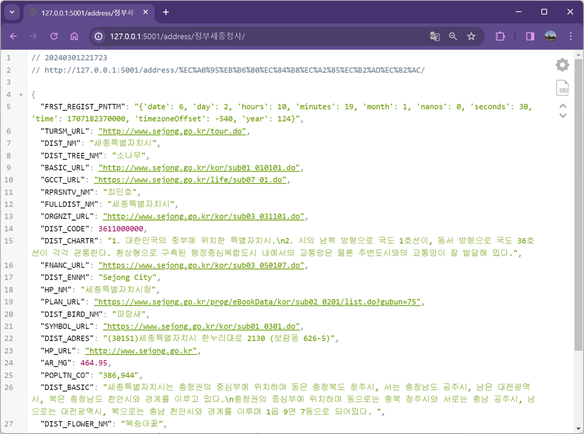

# 6.４ Flask로 주소 검색 API 만들기

이번 장에서는 파이썬 웹 프레임워크인 Flask를 활용하여 API를 만드는 방법을 소개한다. 주소기반산업지원서비스의 주소 검색 API에 내고장알리미 데이터를 연계하여, 주소를 검색하면 해당 주소에 대한 행정구역 데이터를 제공하는 주소 검색 API를 만드는 실습을 진행한다.

- 데이터:
- 코드: 

## Flask로 API 서버 개발하기

### 1. Flask 애플리케이션 생성하기

먼저 프로젝트 폴더에 서버를 실행하는 `main.py` 파일을 만든다.

Flask를 import 하고 Flask 객체 인스턴스를 생성한다.

```py
#main.py

from flask import Flask

#Flask모듈의 객체 인스턴스 생성
app = Flask(__name__)

```

<br>

`@app.route('/')`코드를 추가하여 Flask 서버의 기본 접속 url을 설정하고 로컬 환경에서 서버를 실행하는 코드를 작성한다.

```py
#기본 접속 url
@app.route('/')
def index():
    return "Flask server is running" #url 접속시 출력할 내용

#서버를 실행시키는 코드
if __name__ == "__main__":
    #로컬호스트에서 실행
    app.run(host="0.0.0.0", port=5001, debug=True)
```

<br>

`main.py`는 터미널에 아래 명령어를 입력하여 실행한다.

```bash
python main.py
```

<br>

서버가 실행되면 터미널에 접속 주소`127.0.0.1:5001`가 표시된다.<br>

<figure class="flex flex-col items-center justify-center">
    
</figure>

<br>

`127.0.0.1:5001`에 접속하면 코드에 작성한 문구가 출력되는 것을 볼 수 있다.

<figure class="flex flex-col items-center justify-center">
    
</figure>

Flask는 Python 데코레이터인 `@app.route()`를 추가하는 방식으로 웹 페이지를 추가하고 연결한다.

## 내고장알리미 데이터 연계하기

### 1. 내고장알리미 데이터란?

[내고장알리미 https://www.laiis.go.kr/myMain.do](https://www.laiis.go.kr/myMain.do) (지방행정종합정보시스템)는 지방자치단체의 행정구역 현황, 단체장, 새소식, 문화관광, 상품권 등의 정보를 종합적으로 제공하는 웹 사이트다.
아래 데이터는 주소정보 누리집 API와 연계하기 위해 내고장알리미의 정보를 크롤링하여 CSV로 저장한 데이터다.

- 다운로드: [내고장알리미 데이터](https://drive.google.com/file/d/14YLZP4A8xwPqQJ1gnznCd35-1by-NMop/view?usp=sharing)

### 2. 검색 API와 내고장알리미 데이터 연계하기

6-3장(API로 데이터 가져오기)에서 작성한 코드에 주소기반산업지원서비스 API와 내고장알리미 데이터를 시군구코드 기준으로 연계한다.

현재 프로젝트 폴더에 `test.ipynb`로 ipynb파일을 하나 만들어서 5-2장(API로 데이터 가져오기)의 실습 코드를 이어서 작성할 수 있도록 한다. 또한 다운로드한 내고장알리미 데이터 csv 파일을 프로젝트 폴더에 같이 위치시킨다.

<figure class="flex flex-col items-center justify-center">
    
</figure>

<br>

API 호출을 위한 라이브러리인 `requests`와 csv 데이터를 다루기 위해 필요한 라이브러리인 `pandas`를 사용한다.

가상환경이라는 독립된 환경에서 작업하고 있기 때문에 기존에 다른 작업에서 이미 사용하던 라이브러리라도 새로 설치하는 과정이 필요하다. 가상환경에 진입한 상태가 맞는지 다시 한 번 확인하고서 install을 진행한다.

```bash
pip3 install requests pandas
```

<br>

이제 `test.ipynb`에서 API 데이터와 내고장알리미 데이터를 시군구코드 기준으로 연계하는 코드를 작성한다.

6-3장에서 작성한 코드를 실행하면 여러개의 검색결과가 나오는 것을 확인할 수 있다. 그 중 첫번째 검색결과를 사용하여 주소를 연계한다. 데이터를 시군구코드 기준으로 연계하기 위해 API데이터와 파일데이터에서 시군구코드 컬럼을 찾아야한다. <br>

파일데이터는 "DIST_CODE"라는 시군구코드를 의미하는 컬럼이 존재한다. 그러나 API 데이터에는 시군구코드를 직접적으로 의미하는 컬럼이 없습니다. 그래서 시군구코드를 얻기 위해 "admCd"(행정동코드) 컬럼을 변형하여 사용한다.<br>

```py
#주소기반산업지원서비스 API
import requests
url = "https://business.juso.go.kr/addrlink/addrLinkApi.do"
keyword = "정부세종청사"
params = {
    "confmKey":"발급받은 API 승인 KEY",
    "currentPage":"1",
    "countPerPage":"10",
    "keyword": keyword,
    "resultType":"json"
}

# Keyword로 검색된 결과
api_result = requests.get(url, params=params)
# 여러개의 검색결과 중 첫번째 검색결과를 선택
result_first = api_result.json()['results']['juso'][0]
```

출력 결과

<figure class="flex flex-col items-center justify-center">
    
</figure>

행정동코드는 총 10자리로 구성된다. 앞 5자리 `36110`은 그 행정동이 속한 시군구를 식별하고, 뒤 5자리 `10700`은 시군구 내에서 행정동을 식별하는 기능을 한다. 그리고 시군구를 식별하는 앞 5자리에 뒤 5자리를 00000을 붙이면 해당 시군구의 시군구코드가 된다. 

따라서 시군구까지만 나타내는 앞의 5자리를 추출하고, 00000을 추가해 시군구코드 10자리를 만들어주고 `search_code`변수에 담아준다.

```py
# 첫번째 결과의 행정동코드 admCd
admCd = result_first['admCd']

# 행정동코드의 앞 5자리에 00000을 붙여서 시군구코드를 만듦
search_code = int(admCd[:5]+'00000') #시군구코드
```

<br>

내고장알리미 데이터에서 DIST_CODE(시군구코드)가 `search_code`와 일치하는 행을 추출한다. pandas 라이브러리를 이용해 데이터를 불러온 뒤, 시군구코드 기준으로 내고장알리미 데이터를 검색해 추출하는 코드를 작성한다.

```py
import pandas as pd
# 내고장알리미 데이터를 Dataframe형식으로 불러오기
mygojang = pd.read_csv('mygojang-crawling-data-2024-02-26.csv')

# 내고장알리미 데이터에서 시군구코드 일치하는 데이터 반환
result = mygojang.loc[mygojang['DIST_CODE']==search_code].T.iloc[:,0]
```

`result`에 담긴 검색결과는 다음과 같습니다. 정부세종청사가 위치한 세종특별자치시의 행정 정보 등이 담긴 데이터다.

<figure class="flex flex-col items-center justify-center">
    
</figure>

<br>

### 3. 주소 검색 API 만들기

위 코드를 사용해 Flask 서버에 내고장 알리미 데이터 검색 결과를 출력하는 라우터를 추가하여 새로운 API를 구축한다. `6-4_main.py`에 코드를 작성한다.

```py
# main.py : 서버를 가동시키는 실행파일
from flask import Flask
import requests
import pandas as pd

#객체 인스턴스 생성
app = Flask(__name__)

#기본 접속 url
@app.route('/')
def index():
    return "Flask server is running!"

@app.route('/address/<keyword>/')
def address(keyword):
    # 주소기반산업지원서비스 주소 검색 API 호출
    url = "https://business.juso.go.kr/addrlink/addrLinkApi.do"
    params = {
        "confmKey":"발급받은 API 승인KEY",
        "currentPage":"1",
        "countPerPage":"10",
        "keyword": keyword,
        "resultType":"json"
    }

    # Keyword로 검색된 결과
    result = requests.get(url, params=params)
    admCd = result.json()['results']['juso'][0]['admCd']
    search_code = int(admCd[:5]+'00000')

    # 내고장알리미 데이터에서 시군구코드 일치하는 데이터 반환
    mygojang = pd.read_csv('mygojang-crawling-data-2024-02-26.csv') # 내고장알리미 데이터
    result = mygojang.loc[mygojang['DIST_CODE']==search_code].T.iloc[:,0]
    return result.to_json(force_ascii=False)

if __name__ == "__main__":
    app.run(host="0.0.0.0", port=5001, debug=True)
```

이 때, `@app.route('/address/<keyword>/')`의 `<keyword>`는 주소 검색어가 들어갈 변수다.
<br>예를 들어, `127.0.0.1:5001/address/정부세종청사/`를 URL로 입력하면 주소 검색어는 '정부세종청사'가 된다.

해당 파이썬 파일을 실행시킨다.

```bash
python 6-4_main.py
```

API의 URL에 접속하면 서버 화면에 주소 검색 결과 데이터가 출력된다.

<figure class="flex flex-col items-center justify-center">
    
</figure>
