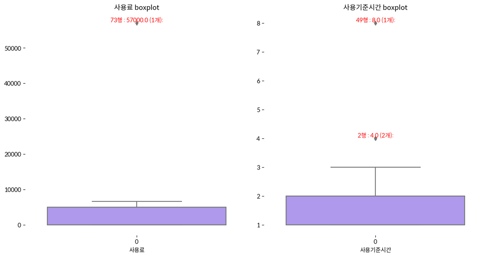
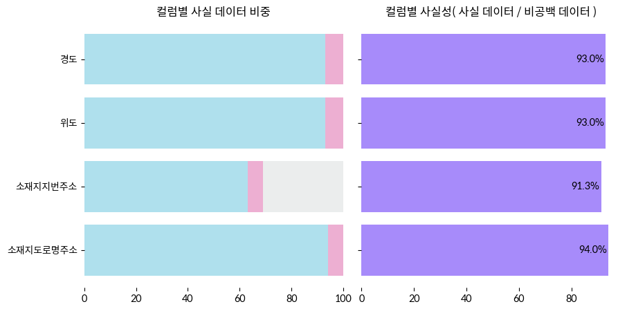
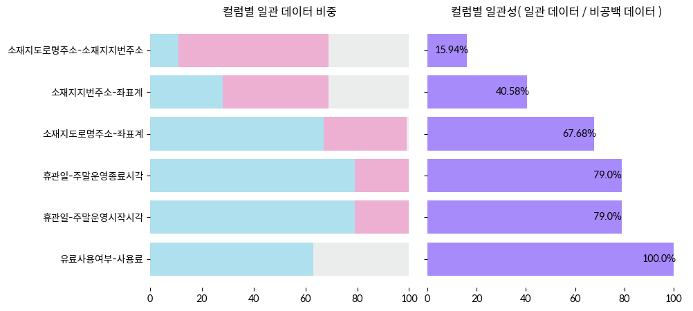

# 7.6. 데이터 품질 평가하기

앞선 챕터에서는 공공데이터의 품질요소로 어떠한 것들이 있는지 알아봤다. 이번에는 실제로 어떻게 품질 요소를 평가하는 방식이 구현되는지 파이썬 코드와 함께 살펴본다. 이 장에서 사용되는 데이터와 코드 원본은 [깃헙](https://github.com/hike-lab/address-data-guide/blob/main/chapter-7/7-6_데이터셋_품질평가.ipynb)에서 확인할 수 있다.

## 공공데이터 샘플 품질 평가
컬럼별 데이터 유형에 구애받지 않고 평가가 가능한 완전성과 이해가능성을 제외한 나머지 평가 요소들의 적용 범위는 다음 표와 같다. 도로명 주소의 경우 7.4. 장에서 이미 유효성, 정확성 평가를 진행했으므로 제외하였다.


| 컬럼명 | 유효성 | 정확성 | 일관성 | 
|-------|--------|-------|-------|
|휴관일 | O |x|O|
|운영시간(시작/종료, 평일/주말)| O | X | O |
|유료사용여부 | O | X | O |
|사용기준시간 | O | X | O|
|사용료| O | X | O |
|사용안내전화번호| O | X | X|
|위도/경도| O | O | O |
|데이터기준일자| O |X|X|
|소재지도로명주소| - | -| O|
|소재지지번주소|X| O | O|
|**총합**| 9|2|7|

활용되는 라이브러리들을 불러오는 코드는 아래와 같다.

```python
import pandas as pd
import numpy as np
import re

# 시각화 관련 라이브러리
import seaborn as sns
import matplotlib.pyplot as plt
import matplotlib.font_manager as fm
import matplotlib.ticker as ticker
import plotly.express as px
# 폰트 설정 (colab 기준)


# 앞서 병합한 데이터 로드하기
df = pd.read_csv("sample.csv")

# 데이터 형태 파악하기
print(df.shape)
df.head(5)
```
평가에 앞서, 각 데이터 값에 대한 평가 요소별 평가 결과를 저장할 테이블을 따로 만든다.

오류, 또는 공백 데이터는 1, 정상적인 데이터는 0, 그리고 공백 데이터는 `None`으로 저장될 예정이다.

```python
# 유효성 평가 테이블
valid = pd.DataFrame(np.zeros((100, 14)), # 0값으로만 채운 데이터셋을 만든다
                     columns=['휴관일', '평일운영시작시각','평일운영종료시각',
                                '주말운영시작시각','주말운영종료시각','유료사용여부',
                                '사용기준시간','사용료','사용안내전화번호',
                                '소재지도로명주소','소재지지번주소','위도',
                                '경도','데이터기준일자'])
# 정확성 평가 테이블
factual = pd.DataFrame(np.zeros((100, 4)),
                       columns = ['소재지도로명주소','소재지지번주소',
                                    '위도','경도'])
# 일관성 평가 테이블
consis = pd.DataFrame(np.zeros((100, 12)),
                      columns = ['휴관일','평일운영시작시각','평일운영종료시각',
                                '주말운영시작시각','주말운영종료시각', '유료사용여부',
                                '사용기준시간','사용료','소재지도로명주소',
                                '소재지지번주소','위도','경도'])
```

마지막으로 평가테이블의 결과를 시각화하는 `vis_portion` 함수를 생성한다. 해당 함수는 이해가능성, 유효성, 정확성, 일관성 평가 파트에서 반복적으로 사용된다.

<details>
    <summary> vis_portion 함수 코드 </summary>

```python
def vis_portion(table, name):
    val_counts = pd.DataFrame()
    for col in table.columns:
        valcol = table[col].value_counts()
        
        val_counts = pd.concat([val_counts, valcol], axis=1)
        

    val_counts = val_counts.fillna(0)
    val_counts = np.transpose(val_counts)
    if 0 not in val_counts.columns:
        val_counts[0] = 0
    if 1 not in val_counts.columns:
        val_counts[1] = 0
    val_counts["none"] = (len(table)-val_counts[1]-val_counts[0])
    val_counts[name] = val_counts[1] / (val_counts[1]+val_counts[0]) * 100
    val_counts = val_counts.sort_values(by=0, ascending=True)
    
    # 시각화
    fig, axes = plt.subplots(1, 2,sharey=True)
    fig.set_size_inches(10, 5)
    axes[0].barh(val_counts.index.tolist(), val_counts[1], color='#afe0ed')
    axes[0].barh(val_counts.index.tolist(), val_counts[0], left=val_counts[1], color='#edafd2')
    axes[0].barh(val_counts.index.tolist(), val_counts["none"], left=val_counts[1]+val_counts[0], color='#ebeded')
    axes[0].set_title("컬럼별 %s 데이터 비중"%name)


    axes[1].barh(val_counts.index.tolist(), val_counts[name], color='#a78bfa')
    axes[1].set_title("컬럼별 %s성( %s 데이터 / 비공백 데이터 )"%(name,name))
    
    # 서브플롯 간의 간격 조정
    plt.subplots_adjust(wspace=0.07)
    for i in range(len(val_counts)):
        axes[1].text(val_counts[name][i]-6, i, f"{round(val_counts[name][i],2)}%", ha="center", va="center")
    axes[0].set_frame_on(False)
    axes[1].set_frame_on(False)
    return val_counts
```
</details>

## 1. 완전성 평가

컬럼별 완전성을 시각화 한다. 해당 그래프에서 채워져 있는 데이터는 파란색으로, 비어있는 데이터는 회색으로 나타내었다.

우선 컬럼별로 비어있는 컬럼의 개수와 비율을 집계한 데이터 프레임을 생성한다.

```python
# 컬럼별 완전성 데이터프레임
df_fill_rate = pd.DataFrame(df.isnull().sum() / len(df) * 100, columns=['null_rate(%)']) # 공백 비율 계산
df_fill_rate = df_fill_rate.sort_values(by='null_rate(%)', ascending=False) # 공백 비율 순으로 정렬
df_fill_rate["fill_rate(%)"] = 100-df_fill_rate['null_rate(%)'] # 공백이 아닌 비율 계산

```
생성된 데이터 프레임을 시각화하는 코드는 아래와 같다.
```python
# Seaborn을 사용하여 그래프 그리기
plt.figure(figsize=(10, 6))

# 두 개의 데이터 열에 대해 스택바 차트 그리기
sns.barplot(y=df_fill_rate.index, x='fill_rate(%)', data=df_fill_rate, color='#a78bfa', label='채워진 데이터 비율(%)')
sns.barplot(y=df_fill_rate.index, x='null_rate(%)', data=df_fill_rate, color='#DCE6DC', left=df_fill_rate['fill_rate(%)'], label='공백 데이터 비율(%)')

# 레이블, 범례 등 설정
plt.xlabel('데이터 비율(%)')
plt.title('컬럼별 완전성(%)')
plt.legend()
plt.box(False)

# 채워진 데이터 비율 표시
for i in range(len(df_fill_rate)):
    plt.text(df_fill_rate['fill_rate(%)'][i]-6.5, i, f"{df_fill_rate['fill_rate(%)'][i]:.1f}%", fontsize=10, ha='left', va='center')
```

<figure class="flex flex-col items-center justify-center">
    
</figure>


선택적으로 기입하는 항목이라고 해도, 공백 값을 그대로 두지 않고 '해당없음'과 같이 명확한 값을 부여해주는 것이 좋다. 선택 항목으로서 값이 존재하지 않는 것을 명시하는 값과 어떠한 정보도 포함하지 않는 공백 값은 엄연히 다르기 때문이다.

사용안내전화번호나 주소 컬럼 등 활용에 있어 필요한 컬럼들에서도 결측이 발생한 것을 파악할 수 있었다. 사용안내전화번호나 수용가능인원수의 경우 직접 기관에 문의하거나 다른 데이터를 찾아보지 않는 한, 결측을 채우기 어렵다. 따라서 데이터를 처음 생성할 때에는, 최대한 완전한 정보를 기입하는 것이 중요하다.

마지막으로 데이터 전반의 완전성을 계산한다.  

```python
# 전체 데이터 개수 (행 x 열)
total_cells = df.shape[0] * df.shape[1] 

# 공백 데이터 개수
null_cells = df.isnull().sum().sum()

# 채워진 데이터 비율
complete = (total_cells-null_cells) / total_cells * 100

# 소수점 둘째자리까지 반올림
complete = round(complete, 2)

print("완전성(%) : ", complete)
```

코드를 실행하면 76.59% 라는 수치를 얻을 수 있다. 인구 관련 컬럼이 비어있는 경우가 많이 발견되는데, 이는 인구데이터에 없던 법정동이 샘플 데이터 존재하여, 두 데이터를 병합하면서 결측값이 발생한 것으로 이해할 수 있다.


## 2. 이해가능성 평가

컬럼의 이해가능성은 정규표현식을 통해, 데이터가 한글, 영어, 수치, 통상적으로 사용하는 기호가 아닌 인코딩 시의 오류, 또는 주, TM과 같이 기계가 판독이 불가능한 ASCII 코드 체계에 속하지 않는 기호가 포함되었는지의 여부를 점검한다. 

정규표현식에 대한 파이썬 코드는 아래와 같다. `check_readable` 함수는 특수기호가 포함된 값에는 1을, 정상적인 문자에는 0을 리턴한다.

```python
def check_readable(x):
    if x != None:
        if type(x) == float or type(x) == int:
            return 1
        else:
            if re.search(r"[^[가-힣]\w\s,._-:;'0-9/+()]", x):
                return 0
            else:
                return 1
    else:
        return "n"

```
함수를 적용시켜 이해가능성을 평가하는 방법은 아래와 같다.

```python
# 컬럼별 판정
readable_list = []
for col in df.columns.tolist():
    correct = pd.DataFrame(df[col].apply(check_readable), columns =[col])
    readable_list.append(correct)
    
# readable 데이터프레임 업데이트를 위한 데이터프레임 생성
readable_df = pd.concat(readable_list, axis=1)

# readable 데이터프레임 업데이트
readable.update(readable_df[df.columns.tolist()])
readable = readable.replace('n', None)
```

평가 결과를 완전성 평가 결과를 시각화했던 방법대로 시각화하면 다음과 같은 결과를 얻을 수 있다. 

```python
vis_portion(readable, "이해가능")
```

<figure class="flex flex-col items-center justify-center">
    
</figure>
샘플 데이터에서는 ASCII 문자가 사용되거나 문자 인코딩이 깨진 데이터는 존재하지 않는다는 것을 확인할 수 있다.


## 3. 유효성 평가

유효성, 정확성, 일관성 평가부분부터는 정규표현식만 조금씩 달라질 뿐, 전반적인 로직은 거의 동일하다.

따라서, 평가요소별로 대표 컬럼 1개를 기준으로 설명하도록 하다. 

유효성 평가는 주로 정규표현식을 활용해 검증한다. 문서에서는 좌표계 컬럼의 평가 방식을 기준으로 정규표현식으로 구문 패턴을 적용해 구문 오류를 점검하는 방법에 대해 설명힌디.

- **좌표계 컬럼**
    > 해당 컬럼 : 위도, 경도

    위도/경도 값을 활용할 수 있는지 평가한다. 위/경도 값 중 어느 하나의 값이 누락되었는지를 검사한 후, 좌표계의 최소 자릿수(소수점 이하 여섯 자리)를 만족하는지를 확인한다.
    
    - `check_coord_format` : 좌표계 값들에 대해 자릿수에 대한 구문을 체크하는 함수
    
    ```python
    def check_coord_format(input_str):
        pat =r"^-?\d+\.\d{6,}$"
        if re.match(pat, str(input_str)):
            return 1
        else:
            if input_str != None:
                return 0
            return None
    ```
    
    - `get_invalid_coord_rows` : 위도, 경도 중 하나의 값이 빠지는 데이터 검사하는 함수
    
    ```python 
    def get_invalid_coord_rows(df):
        notnull = df[['위도', '경도']].notnull().index
        invalid_coord_rows = []
        for i in notnull:
            if (df.loc[i, "위도"] is None and df.loc[i, "경도"] is not None) or \
                (df.loc[i, "경도"] is None and df.loc[i, "위도"] is not None):
                    invalid_coord_rows.append(i)
        return invalid_coord_rows
    ```
    - `apply` 메서드를 활용한 함수 적용 및 `valid` 테이블 업데이트
    ```python
    # 자릿수 체크
    lat_correct_df = pd.DataFrame(df["위도"].apply(check_coord_format), columns =["위도"])
    lon_correct_df = pd.DataFrame(df["경도"].apply(check_coord_format), columns =["경도"])

    # 하나의 데이터가 없는 행 체크
    invalids = get_invalid_coord_rows(df)
    lat_correct_df.iloc[invalids] = 0
    lon_correct_df.iloc[invalids] = 0

    # 결과 업데이트
    valid.update(lon_correct_df["경도"])
    valid.update(lat_correct_df["위도"])
    ```

위와 같은 방식으로 나머지 컬럼들에 대해서도 정규표현식을 작성하여 구문 오류를 점검할 수 있다. 오류 여부는 앞서 생성한 `valid`테이블에 기입한다.


<details> 
<summary>나머지 컬럼에 대한 평가 방법</summary>

- **시각 컬럼**
    > 해당 컬럼 : 평일운영시작시각, 평일운영종료시각, 주말운영시작시각, 주말운영종료시각

    시각 컬럼은 시-분 단위의 경우 `HH:MM`, 시-분-초 단위의 경우는 `HH:MM:SS`로 표기되어야 한다.
    ```python
    # 시간 형식을 체크하는 함수
    # 시간 형식을 체크하는 함수
    def check_time_format(input_str):
    pattern_1= r'^([01]\d|2[0-3]):([0-5]\d)$'
    pattern_2 = r'^([01]\d|2[0-3]):([0-5]\d):([0-5]\d)$'
    if re.match(pattern_1, input_str) or re.match(pattern_2, input_str):
        return 1
    else:
        if input_str != None:
            return 0
        return None

    time_col = ["평일운영시작시각","평일운영종료시각","주말운영시작시각","주말운영종료시각"]

    # 판정이 끝난 컬럼값을 저장할 리스트
    time_correct_list = []

    # 컬럼별 판정
    for col in time_col:
        correct = pd.DataFrame(df[col].apply(check_time_format), columns =[col])
        time_correct_list.append(correct)
        
    # valid 데이터프레임 업데이트를 위한 데이터프레임 생성
    time_correct_df = pd.concat(time_correct_list, axis=1)

    # valid 데이터프레임 업데이트
    valid.update(time_correct_df[time_col])

    ```
- **일자 컬럼**
    > 해당 컬럼 : 데이터기준일자

    일자 컬럼은 `YYYY-MM-DD` 형식으로 표기되어야 하며, 일의 자리 숫자의 경우 `01` 과 같은 형식으로 표기해야 한다. 또한, 일자 컬럼의 경우 형식 뿐만 아니라 일자의 유효성도 확인해야 한다.
    예를들어 윤년인 해에 2월 30일이 존재한다면, 이 역시도 유효하지 않은 값으로 체크되어야 한다.

    ```python
    # 일자 형식을 체크하는 함수
    def check_date_format(input_str):
        
        pat=r"^\d{4}-\d{2}-\d{2}$"

        if re.match(pat, input_str):
            # YYYY-MM-DD 형식이면, 해당 일자가 유효한지 체크.
            year = input_str.split("-")[0]
            month = input_str.split("-")[1]
            date = input_str.split("-")[2]
            # 윤년을 검증하는 부분.
            # 윤년인데 2월 29일 이후의 일자가 있는 경우를 체크.
            if ((int(year)%4 == 0 and int(year)%100 !=0) or (int(year)%4 == 0 and int(year)%100 ==0 and int(year)%400 == 0)) and int(month)==2 and int(date) >29:
                return 0
            else:
                #월별 일자 한도를 체크.
                if int(month) in [1,3,5,7,8,10,12]:
                    if int(date) > 31:
                        return 0
                    else:
                        return 1
                else:
                    if int(date) > 30:
                        return 0
                    else:
                        return 1
        else:
            if input_str != None:
                return 0
            return None

    date_correct_df = pd.DataFrame(df["데이터기준일자"].apply(check_date_format), columns =["데이터기준일자"])
        
    # valid 데이터프레임 업데이트
    valid.update(date_correct_df["데이터기준일자"])

    ```

- **여부 컬럼**
    > 해당 컬럼 : 유료사용여부

    여부 컬럼은 `Y/N` 의 값만으로 표기해야 한다.
    ```python
    #시간 형식을 체크하는 함수
    def check_yn_format(input_str):
    if input_str == "Y" or input_str == "N":
        return 1
    else:
        if input_str != None:
            return 0
        return None

    yn_correct_df = pd.DataFrame(df["유료사용여부"].apply(check_yn_format), 
                    columns =["유료사용여부"])
    
    # valid 데이터프레임 업데이트
    valid.update(yn_correct_df["유료사용여부"])

    ```

    오표기된 데이터들로는 어떤 것들이 있는지 확인한다.
    ```python
    df[(df['유료사용여부'] != "Y")&(df['유료사용여부'] != "N")]['유료사용여부']
    ```

    보다 정확한 일관성 검증을 위해서, 미리 오표기 데이터를 최대한 수정한다.
    ```python
    df['유료사용여부'] = df['유료사용여부'].replace('n', "N").replace('유료', "Y").replace("없음", "N").replace("X", "N")
    df["유료사용여부"].unique() # 확인
    ```

- **전화번호 컬럼**
    > 해당 컬럼 : 사용안내전화번호

    전화번호의 표준 표기 형식은 다음과 같다.
    - 지역번호를 포함한 전화번호
        - `NN-NNN-NNNN`, `NN-NNNN-NNNN`
        - `NNN-NNN-NNNN`, `NNN-NNNN-NNNN`
    - 휴대전화
        - `NNN-NNN-NNNN`, `NNN-NNNN-NNNN`
    - 대표번호
        - `NNNN`-`NNNN`

    ```python
    # 전화번호 형식을 체크하는 함수
    def check_phone_format(input_str):
    pat1  = r"^(0[1-9]{1,2}|[1-9]{1})-(?:[0-9]{3}|[0-9]{4})-([0-9]{4})$" # 지역번호 포함 전화번호 패턴
    pat2 =  r"^01[0-9]{1}-[0-9]{3,4}-[0-9]{4}$" # 휴대폰번호 패턴
    pat3 = r"^[0-9]{4}-[0-9]{4}$" # 대표번호 패턴
    if re.match(pat1, input_str) or re.match(pat2, input_str) or re.match(pat3, input_str):
        return 1
    else:
        if input_str != None:
            return 0
        return None

    phone_correct_df = pd.DataFrame(df["사용안내전화번호"].apply(check_yn_format), columns =["사용안내전화번호"])
    
    # valid 데이터프레임 업데이트
    valid.update(phone_correct_df["사용안내전화번호"])

    ```

- **수치, 수량 정보**
    > 해당 컬럼 : 사용료, 사용기준시간

    요금, 기준시간 등 수치나 수량을 표현하는 정보는 통일된 단위로 기재하되, 데이터 값에는 단위를 표현하지 않는다.

    단위 통일 여부의 경우, 다른 데이터를 통해 기재 단위를 파악할 수 있는 경우가 아닌 한 수치의 분포를 바탕으로 도출된 이상치를 파악하는 과정까지만 가능하다. 
    
    따라서 본 문서에서는 `10,000`이나 `2만원` 과 같이 수치와 단위를 혼재하여 표기한 경우를 유효성에 어긋나는 데이터로 판단하고, 단위 통일 여부 검증은 의심 데이터를 파악하는 수준까지만 진행하겠다.

    ```python
    # 전화번호 형식을 체크하는 함수
    def check_numeric_format(input_str):
        if type(input_str) == int or type(input_str) == float:
            return 1
        else:
            if input_str.isnumeric():
                return 1
            else:
                if input_str != None:
                    return 0
                else:
                    return None
    numeric_col = ["사용료","사용기준시간"]
    numeric_correct_list = []
    for col in numeric_col:
        correct = pd.DataFrame(df[col].apply(check_numeric_format), columns =[col])
        numeric_correct_list.append(correct)
    
    # valid 데이터프레임 업데이트를 위한 데이터프레임 생성
    numeric_correct_df = pd.concat(numeric_correct_list, axis=1)

    # valid 데이터프레임 업데이트
    valid.update(numeric_correct_df[numeric_col])

    ```

    이번에는 단위 통일이 되지 않은 의심사례를 찾아본다. 다음은 박스플롯을 그리는 함수 코드이다. 컬럼명을 입력하면 해당 컬럼의 박스플롯과 이상치를 나타낸다.

    ```python
    def get_whisker_values(col):
    numeric_fee_values = df[col].apply(pd.to_numeric, errors='coerce')
    
    # 사분위수 계산
    q1 = numeric_fee_values.quantile(0.25)
    q3 = numeric_fee_values.quantile(0.75)
  
    # IQR 계산
    iqr = q3 - q1
  
    # whisker 값 계산
    whisker_min = q1 - 1.5 * iqr
    whisker_max = q3 + 1.5 * iqr
  
    # 아웃라이어  = whisker의 범위에 들지 않는 값
    outliers_df = numeric_fee_values[~numeric_fee_values.between(whisker_min, whisker_max)].to_frame(name=col)
    
    # 박스플롯 시각화
    plt.figure(figsize=(7,7))
    sns.boxplot(data=numeric_fee_values,color='#a78bfa')
    plt.title(f"{col} boxplot")
    plt.xlabel(col)
    plt.box(False)
    # 아웃라이어 행, 값 표시 
    if not outliers_df.empty:
        outliers = outliers_df.drop_duplicates().sort_values(by=col) # 중복값을 카운트
        for i, row in outliers.iterrows(): # 수치 표기
            count = numeric_fee_values[numeric_fee_values == row[col]].shape[0]
            text = f"{i+1}행 : {row[col]} ({count}개):"
            plt.text(0, row[col], text, fontsize=10, ha='center', va='bottom', color='red')

    ```
    결과 값은 다음과 같다. 이상치가 존재하긴 하나, 사용료 컬럼의 73행을 제외하면 크게 의심될만한 수치는 아닌 것으로 보인다. 의심 수치는 어디까지나 추정이지, 정확한 사실여부를 확인할 수 없다면 명확하게 유효성 여부를 판단할 수 없다.

    <figure class="flex flex-col items-center justify-center">
        
    </figure>


</details>

**결과 종합**

다른 컬럼들에 대해서도 구문 오류를 체크했다면, 이제 `valid` 데이터셋으로 컬럼별 유효성을 계산해보도록 하겠다.
```python
# 실행 코드
vis_portion(valid, "유효") 
```
<figure class="flex flex-col items-center justify-center">
    
</figure>

전체 데이터셋의 유효성은 `컬럼별 유효성 총합 / 유효성 평가 대상 컬럼 수`로 구한다. 샘플 데이터의 유효성은 84.54%임을 확인할 수 있다.

## 4. 정확성 평가

> 외부 API를 활용해야 하므로 시간이 매우 오래 소요된다. 이미 API를 통해 검사가 완료된 데이터를 첨부했으니( [링크]() ), 빠르게 확인하려면  바로 데이터를 불러와서 활용하면 된다.

앞선 장에서는 도로명주소가 실제로 존재하는지를 알아봤다. 이번에는 지번 주소와 좌표계 데이터가 실제로 존재하는지 알아볼 것인데, 7.4.에서 활용했던 코드들을 조금 수정해 다시 사용하겠다. 

일관성 평가 파트에서 주소 컬럼과 좌표계의 일치 여부를 확인하기 위해 또 다시 API를 요청하는 것은 비효율적이므로, 이번 파트에서는 도로명주소-지번주소, 주소-좌표계의 일관성도 함께 체크하겠다.

주소와 좌표계의 정확성을 평가하기 위해선 호출 한도가 있는 외부 API를 활용하므로, 한 번 호출 할 때 주소와 함께 좌표계까지 점검해야 한다. 보다 효율적인 주소-좌표 컬럼 점검 과정은 아래와 같다.

- **STEP 1. 도로명주소, 지번주소 존재 여부 확인**
    
    1. 도로명주소, 지번주소가 모두 존재하는 경우
        
        도로명주소를 API 쿼리에 입력한다. 검색 결과가 리턴되는 경우 `facutal` 테이블에 1을 기입한다.

        이때, 함께 리턴된 지번주소를 데이터셋의 지번주소와 비교한다. 지번주소가 일치하지 않으면 `consist` 테이블의 도로명, 지번주소 컬럼에 0을 기입한다.

        `consist` 테이블에서 0이었던 행들의 지번을 다시 검색한다. 마찬가지로 결과의 리턴 여부에 따라 `factual` 테이블을 입력한다.

    2. 도로명주소나 지번주소 중 하나만 존재하는 경우

        각각을 API 쿼리에 입력한다. `consist` 테이블에는 둘 다 `None`을 기입한다.

- **STEP 2. 주소 컬럼과 좌표계 컬럼의 일치 여부 확인**


    1. 좌표계 데이터 존재 여부 확인
        
        `valid` 테이블에서 유효한 좌표계 행만 리스트로 추출한다. 추출된 행에 존재하는 좌표계 데이터들을 reverse-geocoding API에 검색한다.

        `factual` 테이블에 결과가 존재하는 경우만 1을, 결과가 존재하지 않는 경우는 0, 나머지는 None으로 채운다.
    
    2. 주소 데이터와 일치 여부 확인 
    
        리턴된 값을 지번의 경우 번지수까지, 도로명의 경우 건물번호 단위까지 조합한다. 도로명-지번주소의 일치 여부에 따라 다른 과정을 적용한다.

        
        >  **도로명-지번주소가 일치했던 경우**
        >
        > 도로명주소와 리턴된 주소를 비교한다. 만일 이 둘이 일치하면 `consist` 테이블에 도로명-좌표계, 지번-좌표계에 1을 기입한다.

        > **도로명-지번주소가 일치하지 않았던 경우**
        >
        >  `factual` 테이블 값이 1인 데이터에 한해 도로명, 지번주소 각각을 비교한다. 

        > **둘 중 한 주소가 없거나 `factual` 테이블 값이 0인 경우**
        >
        >  존재하는 주소만 비교하고 존재하지 않는 주소와 좌표계에 대해선 `None`을 기입한다.

<br>

위의 과정에 따라 코드를 입력하면 다음과 같다. 먼저 STEP1.에 해당하는 과정을 따르는 코드이다. 도로명주소에 대한 점검과 정제는 이미 앞선 챕터에서 완료했으므로, 이번에는 지번주소와 좌표계 데이터의 존재 여부만 점검하도록 한다.

아래에서 설명할 코드들에서는 4.4.장에서 API호출 및 주소 구성 요소를 사용했었던 함수들이 포함된다. 사용되는 함수들의 코드는 다음과 같다.

<details>
    <summary> 사용 함수 코드</summary>

- `search_addr` : 주소 검색 함수

    ```python
    # 주소 검색 함수
    def search_addr(addr):
        # 요청 헤더에는 API 키와 아이디 값을 입력.
        headers = {"X-NCP-APIGW-API-KEY-ID":API_ID, "X-NCP-APIGW-API-KEY":API_SECRET} 

        # 파라미터에는 검색할 주소를 입력. 
        params = {"query" : addr, "output":"json"}

        # 정보를 요청할 url
        url ="https://naveropenapi.apigw.ntruss.com/map-geocode/v2/geocode" 

        data = requests.get(url, headers=headers, params=params)
        
        return json.loads(data.text)
    ```

- `search_coord` : 좌표계 검색 함수

    ```python
    # 좌표 검색 함수
    # 경도, 위도 순으로 입력
    def search_coords(x,y):
        coord = f"{x},{y}"
        # 요청 헤더에는 API 키와 아이디 값을 입력.
        headers = {"X-NCP-APIGW-API-KEY-ID":API_ID, "X-NCP-APIGW-API-KEY":API_SECRET} 

        # 파라미터에는 변환할 좌표계를 입력 -> "경도,위도" 순으로 입력.
        params = {"coords" : coord, "output":"json", "orders":"roadaddr,addr"}

        # 정보를 요청할 url
        url ="https://naveropenapi.apigw.ntruss.com/map-reversegeocode/v2/gc"

        data = requests.get(url, headers=headers, params=params)
        
        return json.loads(data.text)
    ```

- `road_addr_maker` : 리턴된 주소 구성요소로부터 도로명주소를 합성하는 함수

    ```python
    # 도로명주소를 합성하는 함수
    def road_addr_maker(road_obj):
        road = road_obj["region"]["area1"]["name"] + " " + road_obj["region"]["area2"]["name"]
        if road_obj["region"]["area3"]["name"][-1] == "읍" or road_obj["region"]["area3"]["name"][-1] == "면":
            road += " " + road_obj["region"]["area3"]["name"]
        if road_obj["land"]["name"] != "":
            road += " " + road_obj["land"]["name"]
        if road_obj["land"]["number1"] != "":
            road += " " + road_obj["land"]["number1"]
        if  road_obj["land"]["number2"] != "":
            road += "-" + road_obj["land"]["number2"]
        return road
    ```

- `addr_maker` : 리턴된 주소 구성요소로부터 지번주소를 합성하는 함수

    ```python
    # 지번주소를 합성하는 함수
    def addr_maker(addr_obj):
        addr = addr_obj["region"]["area1"]["name"] + " " + addr_obj["region"]["area2"]["name"] + " " + addr_obj["region"]["area3"]["name"]
        if addr_obj["region"]["area4"]["name"] != "":
            addr += " " + addr_obj["region"]["area4"]["name"]
        if addr_obj["land"]["type"] == "1":
            addr += " " + addr_obj["land"]["number1"]
        if addr_obj["land"]["type"] == "2":
            addr += " " + addr_obj["land"]["number1"]+"-"+addr_obj["land"]["number2"]
    return addr
    ```

</details>


다음은 STEP2.에 해당하는 코드이다. STEP1. 을 거치며 업데이트된 `factual`, `consist` 테이블을 활용해야 하므로, 앞선 코드를 반드시 먼저 실행해야 한다. 

<details>
    <summary>코드 전문</summary>

```python
# 도로명주소, 지번주소 모두 존재하는 경우
addr_idx1 = df['소재지도로명주소'].notnull().index.tolist()
addr_idx2 = df['소재지지번주소'].notnull().index.tolist()

addr_idx = addr_idx1+addr_idx2
addr_idx = list(set(addr_idx)) 

for i in tqdm(addr_idx):
    if (i in addr_idx1) and (i in addr_idx2):
        re_val = search_addr(df.loc[i, "소재지도로명주소"])
        
        # 검색한 주소가 존재하는지 확인
        if (re_val["status"] != "OK") or (re_val["meta"]["totalCount"] == 0):
            factual['소재지도로명주소'][i] = 0
        else:
            if re_val["status"] == "OK":
                factual['소재지도로명주소'][i] = 1
                
                # 소재지지번주소가 존재하는 경우
                if df['소재지지번주소'][i] != None:
                    
                    # 도로명주소와 지번주소가 일치하는 경우
                    if re_val["addresses"][0]["jibunAddress"] == df["소재지지번주소"][i]: 
                        factual['소재지지번주소'][i] = 1
                        consist["소재지도로명주소-소재지지번주소"][i] = 1
                    
                    # 도로명주소와 지번주소가 일치하지 않는 경우
                    else:
                        consist["소재지도로명주소-소재지지번주소"][i] = 0
                        jibun = search_addr(df.loc[i, "소재지지번주소"])
                        if jibun["status"] == "OK":
                            #소재지지번주소가 일치하진 않으나 존재하는 경우
                            factual['소재지지번주소'][i] = 1
                        else:
                            # 소재지지번주소가 아예 잘못된 주소인 경우
                            factual['소재지지번주소'][i] = 0
                
                # 소재지지번주소가 존재하지 않는 경우
                else:
                    factual['소재지지번주소'][i] = None
                    consist["소재지도로명주소-소재지지번주소"][i] = None
```
</details>


이제 좌표계의 실존 여부와, 좌표계와 주소의 일치여부를 확인해보겠다. 좌표계의 실존여부와 함께 도로명, 지번주소와의 일치 여부를 동시에 체크하므로 코드가 다소 복잡하다. 

<details>
    <summary> 코드 전문 </summary>


```python
    for i in tqdm(val_coords):
            # 좌표계 검색
            re_val = search_coords(df.loc[i, "경도"],df.loc[i, "위도"])
        
            # 검색한 좌표계가 존재하는지 확인
            if (re_val["status"]["name"] != "ok") or (len(re_val["results"]) == 0):
                factual['위도'][i] = 0
                factual['경도'][i] = 0
                consist["소재지지번주소-좌표계"][i] = None
                consist["소재지도로명주소-좌표계"][i] = None
            
            # 검색한 좌표계가 존재하는 경우   
            else:
                factual['위도'][i] = 1
                factual['경도'][i] = 1
                # 지번, 도로명주소가 모두 존재하는 지점인 경우
                if len(re_val["results"]) == 2:
                    road_obj = re_val["results"][0]
                    addr_obj = re_val["results"][1]
                    
                    # 주소 합성
                    road = road_addr_maker(road_obj)
                    addr= addr_maker(addr_obj)

                    # 각각의 주소가 존재하는 경우에 따라 비교
                    # 지번주소만 존재하는 경우
                    if df['소재지도로명주소'][i] != None:
                        if df['소재지도로명주소'][i] == road:
                            consist["소재지도로명주소-좌표계"][i] = 1
                        else:
                            consist["소재지도로명주소-좌표계"][i] = 0
                    else:
                        consist["소재지도로명주소-좌표계"][i] = None
                    
                    # 도로명주소만 존재하는 경우
                    if df['소재지지번주소'][i] != None:
                        if df['소재지지번주소'][i] == addr:
                            consist["소재지지번주소-좌표계"][i] = 1
                        else:
                            consist["소재지지번주소-좌표계"][i] = 0
                    else:
                        consist["소재지지번주소-좌표계"][i] = None
                
                # 지번, 도로명 중 하나의 주소만 존재하는 경우
                # (일반적으로 지번만 존재하는 경우가 다수임)
                elif len(re_val["results"]) == 1:
                    if re_val["results"][0]["name"] == "roadaddr":
                        road_obj = re_val["results"][0]
                        road = road_addr_maker(road_obj)
                        if df['소재지도로명주소'][i] != None:
                            if df['소재지도로명주소'][i] == road:
                                consist["소재지도로명주소-좌표계"][i] = 1
                            else:
                                consist["소재지도로명주소-좌표계"][i] = 0
                        else:
                            consist["소재지도로명주소-좌표계"][i] = None 
                    else:
                        addr_obj = re_val["results"][0]
                        addr= addr_maker(addr_obj)
                        if df['소재지지번주소'][i] != None:
                            if df['소재지지번주소'][i] == addr:
                                consist["소재지지번주소-좌표계"][i] = 1
                            else:
                                consist["소재지지번주소-좌표계"][i] = 0
                        else:
                            consist["소재지지번주소-좌표계"][i] = None
```
</details>

외부 API에 값을 하나씩 전송하므로 시간이 오래 소요될 것이다. 이 과정이 완료되었다면 테이블이 모두 채워진 사실성부터 점검해보도록 하겠다. 앞서 만들었던 시각화 함수 `vis_portion`을 사용해 결과를 시각화한다.

```python
vis_portion(factual, "정확")
```
<figure class="flex flex-col items-center justify-center">
    
</figure>

전체 데이터셋의 정확성은 유효성 평가와 마찬가지로 `컬럼별 정확성 총합 / 정확성 평가 대상 컬럼 수`로 구한다. 샘플 데이터의 사실성은 92.82%임을 확인할 수 있다.

정확성 평가의 경우, 외부 API를 활용해 데이터 하나씩 검사를 요청하는 만큼, 데이터의 크기가 크면 클스록시간이 오래 소요된다. 또는, 교차 검증할 데이터세트가 따로 없는 경우도 있을 것이다. 이러한 경우, 필요에 따라 해당 과정을 생략할 수도 있다.

## 5. 일관성 평가

주소와 주소, 주소와 좌표계의 일관성을 평가하는 부분을 제외하고는, 맵핑 테이블을 활용해 어긋나는 경우만을 필터링 하는 방식으로 일관성에 어긋나는 데이터를 간단히 평가할 수 있다. 휴관일 컬럼과 주말운영시작/종료시각의 컬럼을 기준으로 평가 방법을 설명한다.

- 휴관일 & 주말운영시작시각, 주말운영종료시각

    휴관일의 경우, 기입 형식이 매우 다양한 것을 확인할 수 있다. 정확한 비교를 위해 요일에 대한 표기에서 모두 '-요일'을 제거한다. 편리한 비교를 위해 "공휴일"에서 "-일"도 제거한다.

    - `day_cleaner` : '-일'을 제외하는 함수
        
        ```python
        def day_cleaner(x):
            if "요일" in x:
                x = x.replace("요일", "")
            if "공휴일" in x:
                x = x.replace("공휴일", "공휴")
            return x

        df['휴관일'] = df['휴관일'].apply(lambda x: day_cleaner(x))
        df['휴관일'].unique()       
        ```

    `00:00`의 경우, 정황상 운영하지 않는다는 것을 나타내었다는 것으로 추측 할 수 있겠으나 상시운영으로 해석될 여지가 있으므로, 이 경우도 모두 일관성이 어긋나는 데이터로 판정한다. 맵핑 테이블은 다음 표와 같다.

    | 휴관일 | 주말운영시각 | 오류판정 |
    |-------|-------------|----------|
    | '토+일' 포함 | None이 아닌 모든 값 | O|
    | '토+일' 포함 | None | X |
    | "토+일"을 포함하지 않는 모든 경우 | 모든 값 | X|

    맵핑 테이블을 코드로 구현하여 적용한 것은 다음과 같다.

    - `map_table` : 맵핑 테이블에 따라 데이터의 구문 오류를 체크하는 함수
        ```python
        # 맵핑 테이블
        def  map_table(x,y):
            if x != None:
                if "토+일" in x: # 토요일/일요일이 휴관일
                    if y == None:
                        return 1
                    else: # 주말이 휴관일인데 주말운영시각이 존재하는 경우
                        return 0
                else:
                    return 1
            else:
                return 1
        ```
    앞선 파트와 마찬가지로 `apply` 메서드로 `map_table`함수를 컬럼별로 적용한다.

    ```python
    # apply를 활용한 맵핑 테이블 적용   
    consist["휴관일-주말운영시작시각"] = df.apply(lambda x: map_table(x['휴관일'], x['주말운영시작시각']), axis=1)
    consist["휴관일-주말운영종료시각"] = df.apply(lambda x: map_table(x['휴관일'], x['주말운영종료시각']), axis=1)
    ```

    다른 평가 대상 컬럼들에 대해서도 `map_table`의 내용만 바꿔 위와 동일한 방법으로 평가가 진행된다.
    <details>
        <summary> 나머지 컬럼에 대한 평가 방법 </summary>

    - 유료사용여부 & 사용료

        앞서 유효성 검사에서 `Y/N`의 형식으로 작성되지 않았던 데이터들을 모두 수정 한 후 비교한다. "0"은 모두 "무료"로 바꾼다.
        
        맵핑 테이블은 아래와 같다.
        
        | 유료사용여부 | 사용료 | 오류판정 |
        |-------------|-------|----------|
        |N| 무료 | X|
        |N| None | None (평가불가)|
        |N| 무료, None이 아닌 모든 값 | O|
        |Y| None | None (평가불가) |
        |Y| 무료 | O|
        |Y| None, 무료가 아닌 모든 값 | X|

        테이블에 따라 작성한 코드이다. 

        ```python
        # 0원을 모두 '무료'로 변환
        df['사용료'] = df['사용료'].replace("0","무료") 

        # 맵핑테이블
        def  yn_map_table(x,y):
            if x == "Y":
                if y == None:
                    return None
                elif y == "무료":
                    return 0
                else:
                    return 1
            else:
                if x == "N":
                    if y == "무료":
                        return 1
                    elif y == None:
                        return None
                    else:
                        return 0
                else:
                    return None
        
        # 맵핑 테이블 적용
        consist["유료사용여부-사용료"] = df.apply(lambda x: yn_map_table(x['유료사용여부'], x['사용료']), axis=1)
        ```

    </details>


전체 컬럼별 일관성은 다음과 같다.

```python
vis_portion(consist, "일관")
```

<figure class="flex flex-col items-center justify-center">
    
</figure>

주소 컬럼, 특히 지번주소와 도로명주소에서의 불일치가 높게 나타나는 것을 확인할 수 있다. 또한, 좌표계 데이터와의 불일치도 높게 나타난다. 따라서, 도로명주소를 통한 주소와 좌표계 데이터를 수정해야 한다.


## 종합 평가

지금까지 전체 데이터셋의 완전성, 유효성, 이해가능성, 정확성, 일관성을 평가했다. 결과를 간단히 정리하면 다음과 같다.

|완전성|이해가능성|유효성|정확성|일관성|
|-----|------|-----|-----|------|
|79.04|100|97.57| 96.00|59.38 |

 이 수치들을 방사형 그래프(rader chart)로 나타낼 수 있다. 

```python
import plotly.express as px
fact_total = fact_count['정확'].mean()
cons_total = cons_count['일관'].mean()
read_total = read_count['이해가능'].mean()
val_total = val_count['유효'].mean()
comp_total = complete

accu_element = pd.DataFrame(columns=["element", "rate"])
accu_element["element"] = ["완전성","이해가능성", "유효성", "정확성", "일관성"]
accu_element['rate'] = [comp_total, read_total, val_total, fact_total, cons_total]

fig = px.line_polar(r=accu_element["rate"], theta=accu_element["element"],line_close=True)

fig.update_traces(fill='toself')
fig.show()
```
<embed src="/docs/guide/addr-after-refine.html" width="100%" height="450px"></embed>

이처럼 레이더 차트를 활용해 해당 데이터셋의 정확성 요소들의 수치들을 한 눈에 비교하고, 보완이 필요한 부분을 구체적으로 파악할 수 있다.

위의 5가지 수치들의 평균으로 전체적인 데이터의 품질이 어떤 수준인지 유추 할 수도 있다. 전체적인 수치 평균은 86.40으로, 품질에 대해 큰 이슈 없이 데이터를 활용할 수 있을 것임을 파악할 수 있을 것이다.

또한, 앞선 과정들에서는 컬럼별 평가도 함께 진행하였고, 주소 관련 컬럼들의 일관성 부분에서 다소 낮은 수치를 보이는 것을 확인하였다. 이를 통해 비교적 정확성이 높은 도로명주소 컬럼의 기준으로 지번주소, 좌표계의 오류를 수정하거나, 또는 지번주소 컬럼은 배제하고 분석을 진행하는 등의 조치를 취해야 한다는 등의 판단을 내릴 수 있다.

지금까지 작성하였던 품질 확인 코드들은 모두 함수화 되어있는데, 이러한 함수를 새로운 데이터를 활용할 때마다 재사용한다면 빠르고 효과적으로 데이터 품질을 확인할 수 있을 것이다.
